# 1 大模型的理论与技术的演进

## 从语言模型到大语言模型

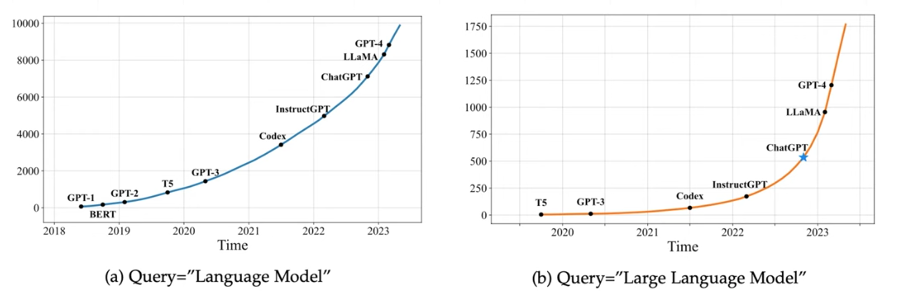

**NLP 语言模型技术发展一览**


### 从 GPT-1到GPT-3:

**预训练语言模型(Pre-trained language models）**


**预训练语言模型的三种网络架构 (2018-2020）**


* **编码器**：**编码器主要用于处理和理解输入信息。**这些模型可以获得双向的上下文，即可以同时考虑一个词的前面和后面的信息。由于编码器可以考虑到未来的信息，它们非常适合用于需要理解整个句子的任务，如
文本分类、命名实体识别等。预训练编码器需要使其能够构建强大的表
示，这通常通讨预测某个被遮蔽的单词、预测下一个句子或者其它的预训练任务来实现。

**<mark>BERT就是一种典型的预训练编码器</mark>**

* **解码器：解码器主要用于生成输出信息**。它们是语言模型的基础，用于预测下一个单词。解码器只能考虑到过去的词，而不能考虑到未来的
词，这使得它们非常适合于生成任务，如文本生成、对话系统等。

**<mark>GPT就是一种典型的预训练解码器。</mark>**

* 编码器-解码器：*编码器-解码器结构结合了编码器和解码器的优点*。

编码器首先处理输入信息，然后解码器生成输出信息。这种结构可以考虑
到全局的上下文信息，因此非常适合于需要理解输入信息并生成相应的
输出的任务，如机器翻译、 文本摘要等。如何预训练编码器-解码器模型
是一个开放的问题，因为需要考虑到如何有效地使用编码器和解码器的
特点

**<mark>T5和BART都是典型的预训练编码器-解码器模型。</mark>**

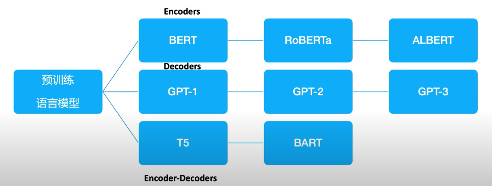

**2018年语言模型进展**

* AI2 released ELMo in spring
* GPT-1 was released in summer, 
* BERT came out October


* ELMo: Deep Contextual Word Embeddings, Al2 & University of Washington 


* GPT-1: Improving Language Understanding by Generative Pre-Training, OpenAl


**Generative Pretrained Transformer (GPT-1) **


**GPT results on various natural language in erence datasets.**


**NLP基准测试介绍**

**MNLl-m(Multi-GenreNaturalLanguageInferenc，matched）**：这是一个自然语言推理任务，其中包括了五个不同类型（类型指的是来源，例如口语、小说等）的文本，并且这些文本在训练和测试集上都是匹配的。任务的目标是根据一个给出的前提判断一个假设是蕴含、矛盾，还是无关。

**MNLl-mm（Multi-GenreNaturalLanguageInference，mismatched）**：这也是一个自然语言推理任务，但与MNLl-m不同的是，训练集和测试集的文本类型是不匹配的。这需要模型具有更好的泛化能力。

**SNLI(Stanford Natural LanguageInference）**：这是一个由斯坦福大学创建的自然语言推理任务，包含了大约55万个人类注释的英文句子对。任务的日标同样是根据一个给出的前提判断一个假设是蕴含、矛盾，还是无关。

**SciTail**：这是一个开放的自然语言推理任务，所有的问题和答案都来自科学领域的教材。任务的日标是根据给出的前提判断一个假设是蕴含还是矛盾。

**QNLI（QuestionNaturalLanguageInference）**：这是一个基于间答的自然语言推理任务，数据来源于SQuAD数据集。任务的目标是根据给出的上下文判断一个假设（问题）是否被蕴含。

**RTE（RecognizingTextualEntailment）**：这是一个文本蕴含识别任务，数据来源于多个版本的PASCALRTE挑战赛。任务的日标是根据一个给出的前提判断一个假设是蕴含还是矛盾。


以上基准测试都是关于自然语言推理的任务，目的是检验模型是否能够理解句子之间的逻辑关系，例如蕴含、矛盾或无关。这些任务在许多自然语言处理任务中都是非常重要的，例如问答、文本摘要、机器翻译等。


**GPT-3 Training Corpus**


**GPT-3, In-context learning, and very large models**

Very large language models seem to perform some kind of learning **without gradient steps** simply from examples you provide within their contexts.

GPT-3 is the canonical example of this. The largest T5 model had 11 billion parameters. **GPT-3 has 175 billion parameters.**

The in-context examples seem to specify the task to be performed, and the conditional distribution mocks performing the task to a certain extent.

**Input (prefix within a single Transformer decoder context)**:

* thanks -> merci
* hello -> bonjour
* mint -> menthe
* otter ->


**Language model meta-learning**. 

During unsupervised pre-training, a language model develops a broad set of skills and pattern recognition abilities. 

It then uses these abilities at inference time to rapidly adapt to or recognize
the desired task. 

We use the term "in-context learning" to describe the inner loop of this process, which occurs within the forward-pass upon each sequence. The sequences in this diagram are not intended to be representative of the data a model would see during pre-training, but are intended to show that there are sometimes repeated sub-tasks embedded within a single sequence.

**GPT-3, In-context learning, and very large models**


Figure 1.2: Larger models make increasingly efficient use of in-context information. 

We show in-context learning performance on a simple task requiring the model to remove random symbols from a word, both with and without a natural language task description. 

The steeper "in-context learning curves" for large models demonstrate improved ability to learn a task from contextual information. We see qualitatively similar behavior across a wide range of tasks.


**The three settings we explore for in-context learning**

* **Zero-shot**

The model predicts the answer given only a natural language description of the task. No gradient updates are performed.

```
Translate English to French:       task description
cheese=>                           prompt
```

**One-shot**

In addition to the task description, the model sees a single example of the task. No gradient updates are performed.

```
Translate English to French:  <- task description
sea otter => loutre de mer    <- example
cheese =>                     <- prompt
```

**Few-shot**

In addition to the task description, the model sees a few examples of the task. No gradient updates are performed.

```
Translate English to French:    <- Translate English to French:
sea otter => loutre de mer      <- examples 
peppermint => menthe poivrée
plush girafe => girafe peluche
cheese =>                       <- prompt
``` 

**Traditional fine-tuning (not used for GPT-3)**

**Fine-tuning**

The model is trained via repeated gradient updates using a large corpus of example tasks.


**Figure 1.3: Aggregate performance for all 42 accuracy-denominated benchmarks** 


While zero-shot performance improves steadily with model size, few-shot performance increases more rapidly, demonstrating that larger models are more proficient at in-context learning. 


**3个关键概念**


**In-Context Learning**：在上下文中学习指的是大型语言模型如GPT-3的一种能力，即在给定的上下文中使用新的输入来改善模型的输出。**这种学习方式并不涉及到梯度更新或微调模型的参数：而是通过提供一些具有特定格式或结构的示例输入使模型能够在生成输出时利用这些信息。**

如，如果你在对话中包含一些英法翻译的例子，然后问模型一个新的翻译问题，模型可能会根据你提供的上下文示例生成正确的翻译

**Few-Shot Learning**：

少样本学习是指用极少量的标注样本来训练机器学习模型的技术。在GPT-
3的案例中，少样本学习的实现方式是向模型提供少量的输入-输出对示例，这些示例作为对话的一部分，描述了模型应该执行的任务。然后，模型会生成一个个输出，该输出是对与示例类似的新输入的响应。

例如，你可以给模型提供几个英法翻译的例子，然后给出一个新的英文单词让模型翻译，模型会尝试产生一个正确的翻译


**Prompt Engineering**：

**提示工程是指设计和优化模型的输入提示以改善模型的输出**。在大型语言模型中，如何提问或构造输入的方式可能对模型的输出有重大影响。因此，选择正确的提示对于获取有用的输出至关重要。

例如，为了让GPT-3生成一个诗歌，你可能需要提供一个详细的、引导性的提示，如“写一首关于春天的十四行诗”，而不仅仅是“写诗”

## ChatGPT 

### Pre-Trained LM + Fine-Tuning 范式

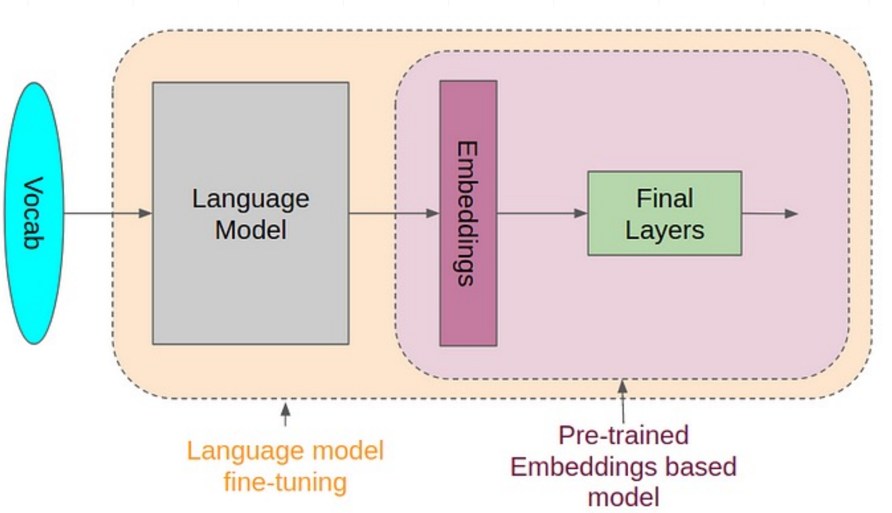

**OpenAl的模型迭代：预训练与微调的共舞**

在GPT 模型的演进过程中，OpenAl 采用了一系列的训练策略，这包括基础的大规模预训练，也包括后续的指令微调等方法。这两种策略在模型的训练过程中起到了不同的作用

* **预训练(Pre-Trained)**：大规模预训练是为了使模型获取丰富的语言知识和理解能力。在**预训练过程，模型通过大量的无标签数据来学习语言的基础知识，这一过程主要是依赖无监督学习的**。
* 指令微调(Instruction-Tuning)：在预训练模型的基础上，通过针对特定任务的标注数据进行微调能够使模型在特定任务上的表现得到提升。同时，**通过对微调数据的精心设计和选择**，还能够引导模型按照人类的预期来执行任务。**这一过程主要依赖有监督学习.**

在这个过程中，预训练和微调是相辅相成的。**<MARK>预训练为模型提供了丰富的语言知识，而微调则利用这些知识来解決特定的任务</MARK>**。然而，微调的数据量通常比预训练的数据量要少得多，因此微调的主要作用并不是为模型注入新的知识，而是激发和引导模型利用己有的知识来完成特定任务

**在GPT模型的演进过程中，OpenAl还探索了多种微调策路，例如GPT-3.5的分化技能树等**。这些微调策略能够帮助模型在不同的任务上表现得更好，同时也使模型的输出更符合人类的预期。

此外，OpenAl还注意到，**模型在进行微调时可能会出现一些问题，例如数据稀疏性、灾难遗忘、资源浪费和通用性差等。为了解决这些问题，OpenAl提出了一种新的训练策略，即提示学习**。通过设计提示信息，可以激发预训练大模型的能力，从而提高模型在具体任务上的表现。

### OpenAl的模型迭代：预训练与微调的共舞

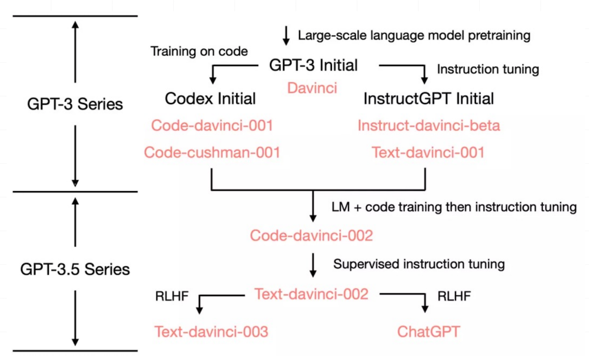

### GPT-3.5 : code-davinci-002

初代GPT-3.5系列（以下简称新模型）相比 GPT-3 系列模型，具有以下优点：

* **人类指令响应 (Responding to Human Instructions)**：新模型能针对特定指令生成更恰当的回应，而非回复训练集中频繁出现的无关句子
* **任务泛化能力 (Task Generalization)**：当新模型按收大量指令调整后，能自动适应并有效回答未见过的新指令这在应对用户不断变化的问题上至关重要。
* **代码理解与生成 (Code Understanding and Generation)**：经过代码训练的新模型能理解并生成代码，强化了编程相关应用的能力。
* **复杂推理的思维链 (Chain of Thought for Complex Reasoning)**：新模型己提高思维链推理能力，使其能处理需要多步推理的问题，这可能是突破模型缩放法则(scaling laws)限制，实现真正的突现性能力的关键。

在基础模型 code-davinci-002 上指令微调后得到了 text-davinci-002。它在以下数据作了微调：

* （一）人工标注的指令和期待的输出；
* (二）由人工标注者选择的模型输出

### ChatGPT 的三段训练法

* **Step 1 有监督微调 （SFT)**

Collect demonstration data, and train a supervised policy.

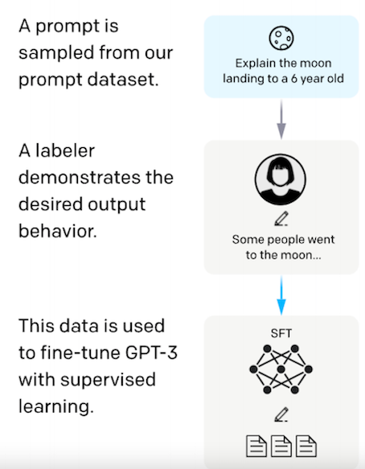

* **Step2 奖励机制 （RM)训练**

Collect comparison data and train a reward model.

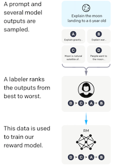

* **Step3 通过 PPO 根据奖励模型进行强化学习**

	* Optimize a policy against
	* the reward model using
	* reinforcement learning.

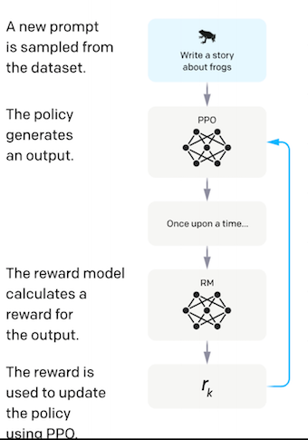

### 总结： ChatGPT 是技术和商业的成功结合

1.**模型训练**：虽然GPT-3和ChatGPT都是基于Transformer的语言模型，但在训练数据和目标函数上有所不同。

**GPT-3主要是用大量的非结构化文本进行训练的，而ChatGPT则在GPT-3的基础上进行了进一步的训练，这包括使用与对话相关的数据集和更适合对话任务的训练目标。**

**2.对话管理**： ChatGFT在对话管理方面进行了优化，以提供更自然、连贯的对话体验。这包括保持对话的上下文、处理多轮对话、以及在一个对话中处理多个话题等


**3.用户输入处理：** ChatGPT也进行了优化以更好地处理用户的输入。这包括理解和响应各种类型的查询，如信息查询、任务请求、小说式的输入等。

**4. 输出生成**：ChatGPT进行了一些优化以生成更贴近人类的输出。这包括使用更复杂的生成策、生成更长的响应、以及更好地处理模糊或不确定的输入等

**5. 安全性和道德规范**： ChatGPT还进行了一些改进以提高模型的安全性和符合道德规范。这包括对对模型的过滤和调节，以防止生成不适当或有害的内容，以及对模型进行额外的评估和测试，以确保其在各种情况下都能表现良好。


### GPT 家族技术迭代与改进


## GPT-4：一个新的开始

### GPT-4： 多模态开启 LLM-native 应用时代

2022年8月，GPT-4 模型训练完成。2023年3月14日，OpenAl 正式发布 GPT-4。与GPT-3和GPT-3.5相比，GPT-4在各方面都有所优化和提升

**1. 多模态模型**

GPT-4支持图像输入，出色的视觉信息理解能力使得GPT-4能对接更多样化的下游任务如：描述不寻常图像中的幽默、总结截屏文本以及回答包含图表的试题。

在文本理解能力上，GPT-4 在中文和多轮对话中也表现出远超 GPT-3.5 的能力

**2 扩展上下文窗口：**

gpt-4 and gpt-4-32k 分别提供了最大长度为8192和32768个token的上下文窗口。这使得GPT-4可以通过更多的上下文来完成更复杂的任务，也为 思维链（CoT）、思维树(TT）等后续工作提供了可能

**GPT+生态**：借助GPT-4强大能力，依托 ChatGPT Plugin 搭建AIGC应用生态商店（类似 App Store)


**应用+GPT**：GPT-4已经被应用在多个领域，包括微软Office、Duolingo、KhanAcademy等。

### GPT-4: 多模态—视觉理解能力

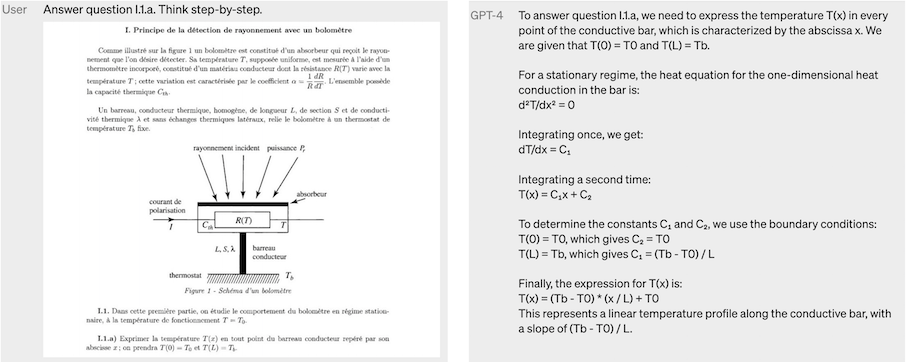

### GPT-4:NLP 基准测试大幅提升

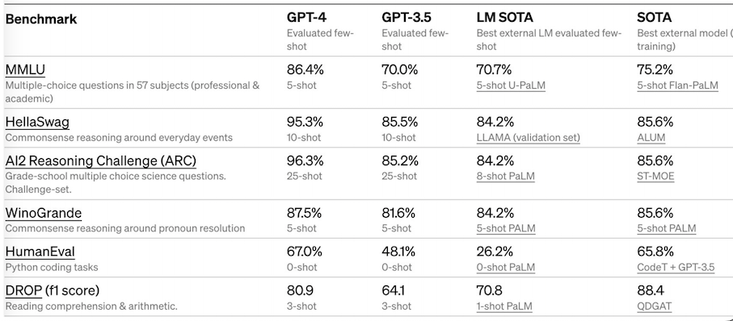

**实测网页代码生成：GPT-4 VS GPT-3.5**

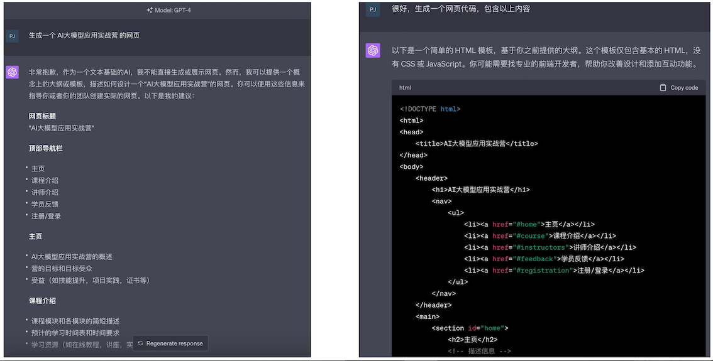

**实测网页代码生成：GPT-4 的变化**


**GPT-4:名语言能力提升**

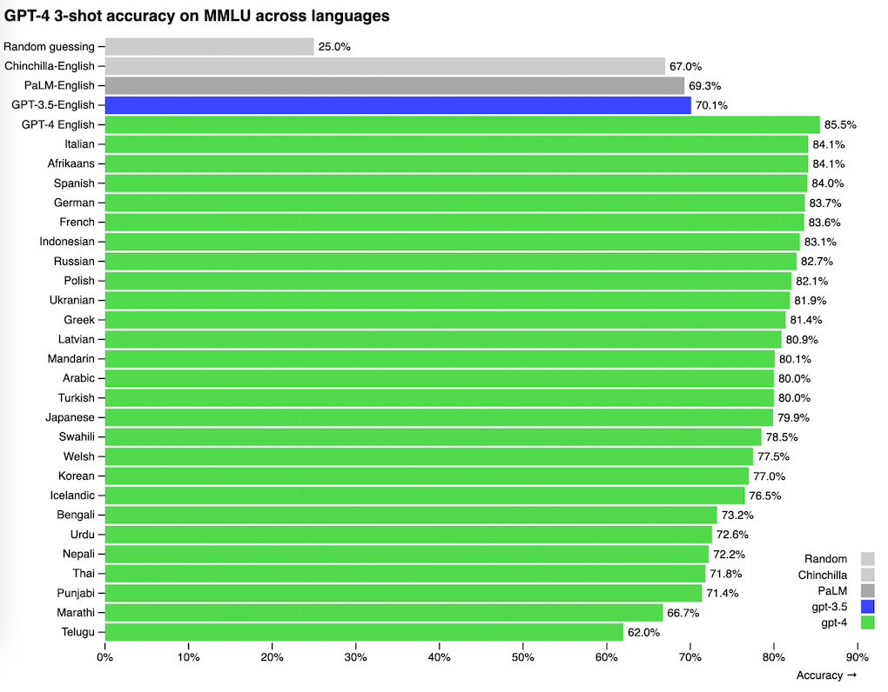

## 提示学习 (Prompt Learning)

**The three settings we explore for in-context learning**

**Zero-shot**

The model predicts the answer given only a natural language description of the task. No gradient updates are performed.

```
Translate English to French => task description
cheese =>   prompt
```

**One-shot**

In addition to the task description, the model sees a single example of the task. No gradient updates are performed.

```
Translate English to French:    task description
sea otter => loutre de mer      example
cheese =>                            prompt
```

Few-shot

In addition to the task description, the model sees a few examples of the task. No gradient updates are performed.

```
Translate English to French:
sea otter => loutre de mer             task description
peppermint => menthe poivrée       example
plush girafe => girafe peluche
```

### Traditional fine-tuning (not used for GPT-3)

**Fine-tuning**

The model is trained via repeated gradient updates using a arge corpus of example tasks.

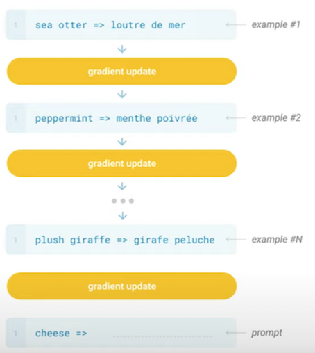

### Prompt Learning VS Prompt Tuning

**<mark>Prompt learning和prompt tuning都是自然语言处理（NLP）中的概念，它们都与如何使用和优化预训练语言模型（例如GPT-3或GPT-4）有关。</mark>**

* **Prompt learning**：是一种方法，**其中模型被训练以响应特定的提示（prompt）**。在这种情况下，提示是模型输入的一部分，它指导模型产生特定类型的输出。例如，如果你向模型提供了“Translate the following English text to French: {text}"这样的提示，模型就会学习到这是一个翻译任务，并尝试将{text}从英语翻译成法语。这种方法的关键在于找到能够引导模型正确响应的有效提示。
* Prompt tuning，又称为"prompt engineering"，是一种**优化技术**，它涉及到寻找或生成能够最大限度提高模型性能的提示。这可能涉及到使用启发式方法、人工智能搜索算法，或者甚至是人工选择和优化提示。Prompt tuning的目标是找到一种方式，使得当给定这个提示时，模型能够生成最准确、最相关的输出。

总的来说，prompt learning和prompt tuning都与如何使用和优化模型的输入提示有关。它们的主要区别在于，**prompt learning更关注于如何训练模型以响应特定的提示，而prompt tuning则更关注于如何找到或生成最优的提示以提高模型的性能。**

## 思维链（Chain-of-Thought，CoT)

**Chain-of-Thought Prompting Elicits Reasoning  in Large Language Models (search)**

### Chain-of-Thought Prompting

CoT Prompting作为一种促进语言模型推理的方法具有几个吸引人的特点：

* 首先，从原则上讲，**CoT允许模型将多步问题分解为中间步骤，这意味着可以将额外计算资源分配给需要更多推理步骤的问题**。
* 其次，CoT提供了对模型行为的可解释窗口，提示了它可能是如何得出特定答案的，并提供了调试推理路径错误之处的机会（尽管完全描述支持答案的模型计算仍然是一个未解决问题）
* **第三，在数学应用题、常识推理和符号操作等任务中都可以使用思维链推理（CoT Reasoning）并且在原则上适用于任何人类能够通过语言解决的任务**。
* 最后，在足够大规模现成语言模型中很容易引发CoT Reasoning，只需在少样本提示示例中包含一些连贯思路序列即可。

### 思维链CoT：开启大模型逻韓推理能力的钥匙

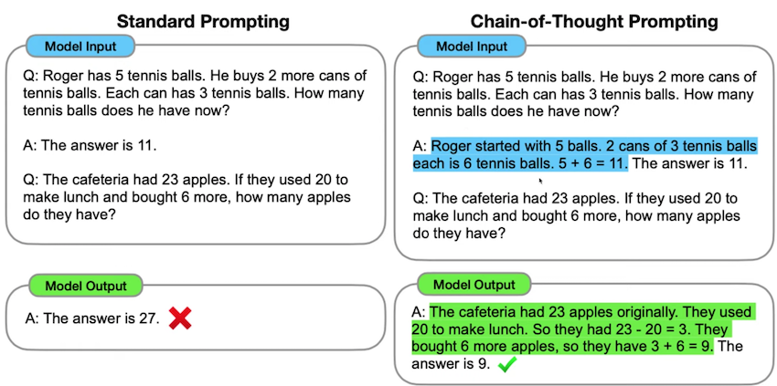

**GPT-3.5：实测简单逻辑题**


**GPT-4：实测简单逻辑题**


**Examples of CoT**


**CoT : Solving Challenging Math Problems**

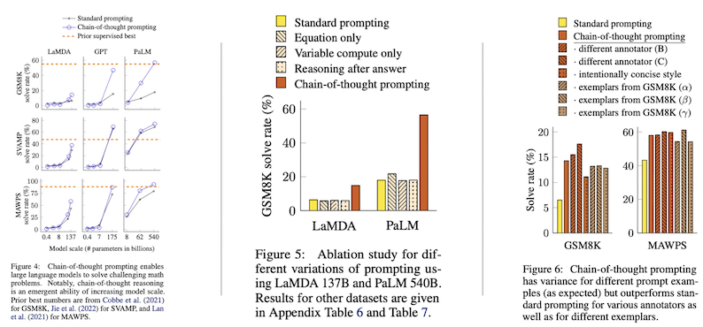

CoT: Commonsense Reasoning


* **CSQA (CommonsenseQA)：**测试模型的常识理解和推理能力的基准测试。题目是一系列选择题，需要借助对世界的基本理解（即常识）来回答。
* **StrategyQA**：这个基准测试旨在评估模型的多跳推理能力。问题的回答通常需要从多个文本片段中提取并整合信息。
* **Date**： 这是一个基准测试，用于评估模型理解和推断日期信息的能力，尤其是在需要从上下文中推断日期时。
* **Sports**：这个基准测试的目标是评估模型在判断体育相关信息的可信度方面的表现，它需要对体育知识和事件的理解。
* **SayCan**：这是一个基准测试，用于评估模型将自然语言指令转换为机器可执行的离散动作序列的能力，这通常在机器人操作或自动化任务中很有用

**CoT 实验结论**

* 对于小模型来说，CoT Prompting 无法带来性能提升，甚至可能带来性能的下降。
* 对于大模型来说，CoT Prompting 涌现出了性能提升
* 对于复杂的问题，CoT Prompting 能获得更多的性能收益。

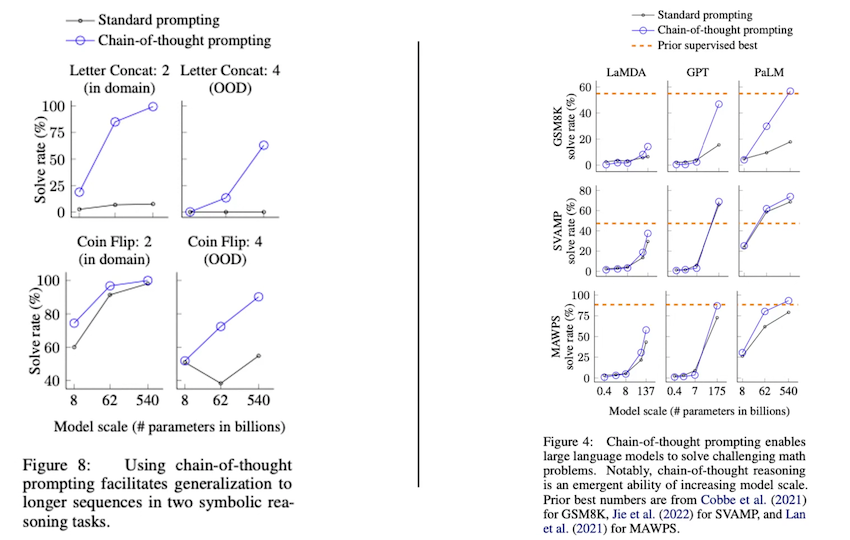

### **CoT Prompt黑魔法: Think step-by-step**

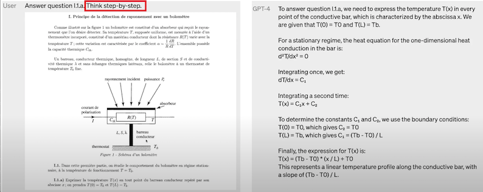


## 自治性（Self-Consistency）：多路径推理

> 黑魔法失效怎么办？


**Self-Consistency：多路径推理**

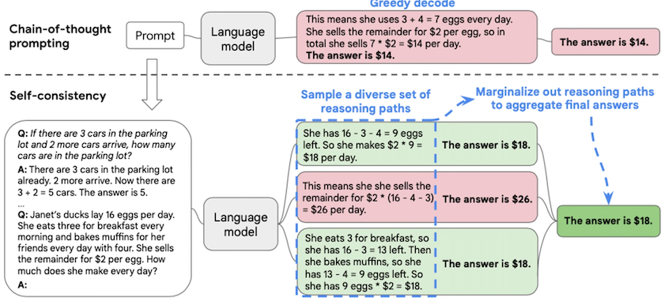

* Figure 1: The self-consistency method contains three steps: 

* (1) prompt a language model using chain-of-thought (CoT) prompting;
*  (2) **<mark>replace the "greedy decode" in CoT prompting by sampling from the language model's decoder to generate a diverse set of reasoning paths; and</mark>**
*  (3) marginalize out the reasoning paths and aggregate by choosing the most consistent answer in the final answer set.

### Self-Consistency提升CoT性能


关于 CoT 与大模型逻辑推理能力的现状

通过思维链，我们可以看到大语言模型的强与弱：

* <mark>**它强在，模型规模的提高，让语义理解、符号映射、连贯文本生成等能力跃升，从而让多步骤推理的思维链成为可能，带来“智能涌现”**</mark>
* <mark>**它弱在，即使大语言模型表现出了前所未有的能力，但思维链暴露了它，依然是鹦鹉学舌，而非真的产生了意识**</mark>

**没有思维链，大**模型几乎无法实现逻辑推理**。

但有了思维链，大语言模型也可能出现错误推理，尤其是非常简单的计算错误。Jason Wei 等的论文中，曾展示过在 GSM8K 的一个子集中，大语言模型出现了8% 的计算错误，比如6* 13=68（正确答案是78）

### Dual process theory of thought

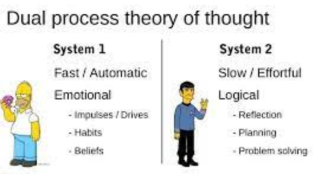

Prompting 示意图

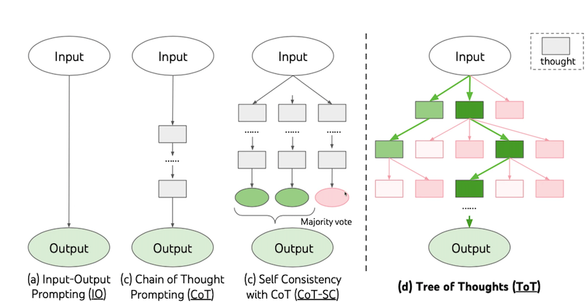

ToT 实验结果：24点游戏

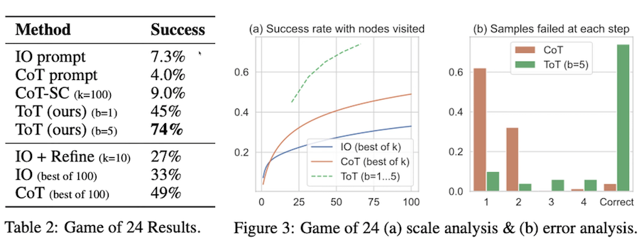

ToT实验结果：创意写作与迷你填字游戏

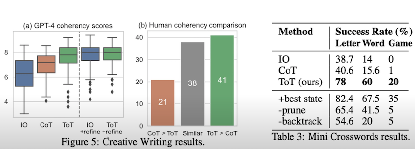

### TOT工作原理解读：Step 1思维分解

虽然CoT样本以连贯的方式呈现思维，没有明确的分解过程，但ToT利用问题属性来设计和分解中间思维步骤。如下表所示，根据不同的问题，一个思维可以是几个词（填字游戏）一行方程式 （24点游戏），或者是整段写作计划（创意写作）。

总体而言，一个思维应该足够“小”，以便语言模型能够生成有前景且多样化的样本（例如生成整本书通常太“大”而无法连贯），同时又足够“大”，以便语言模型能够评估其对于问题求解的前景（例如仅生成一个标记通常太“小”无法评估）


### ToT 工作原理解读：Step 2思维生成


### ToT 工作原理解读： Step 3 状态评估

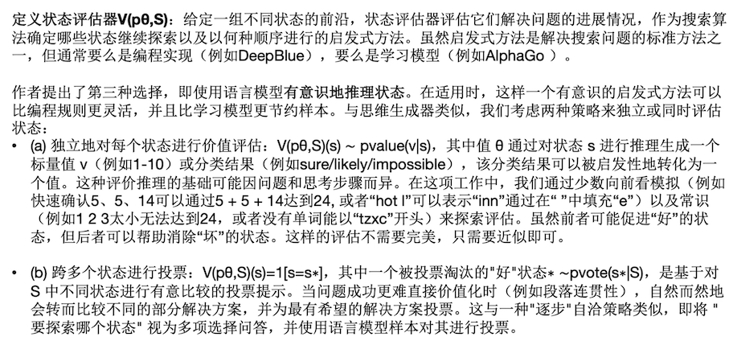

### TOT 工作原理解读：Step 4 搜索算法

最后，在ToT框架内，可以根据树结构插入和使用不同的搜索算法。作者探索了两种相对简单的搜索算法，
并将更高级的算法（例如A* 今儿MCTS）留给末水的工作：

* **(a)广度优先搜素（TOT-BFS)每步维护一组最有希望的状态集合b个**。这适用于24点游戏和创意写作等树深度受限制 （T≤3），并且初始思考步骤可以评估和修剪为一个小集合 (b≤5）
* **(b)深度优先搜索(TOT-DFS）** 首先探索最有希望的状态，直到达到最终输出结果(t>T)，或者状态评估器认为无法解决当前问题。在后一种情况下，从s 开始的子树被修剪以进行开发与利用之间的权衡。在这两种情况下，DFS会回溯到s的父状态以继续探索。

从概念上讲，ToT作为LM通用问题求解方法具有几个优势

* (1）泛化性。IO、CoT、CoT-SC和自我完善都可以看作是ToT的特殊情况 （即有限深度和广度的树)
* (2) 模块化。基本LM以及思考分解、生成、评估和搜索过程都可以独立变化。
* (3) 适应性。可以适应不同的问题属性、LM能力和资源约束。
* (4)方便性。无需额外训练，只需要一个预训练好的LM就足够了。

下一节将展示这些概念上的优势如何在不同问题中转化为强大的实证表现