# 1 大模型的理论与技术的演进

## 从语言模型到大语言模型


**NLP 语言模型技术发展一览**

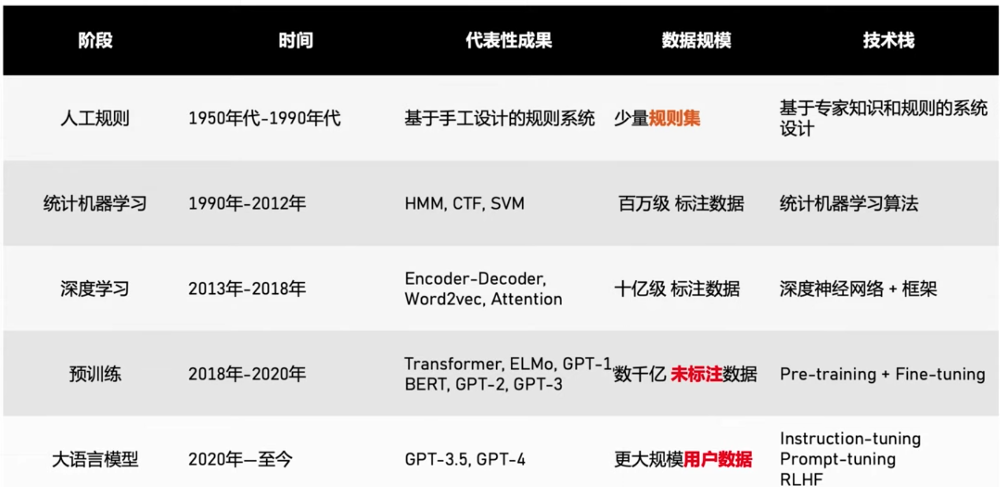

### 从 GPT-1到GPT-3:

**预训练语言模型(Pre-trained language models）**


**预训练语言模型的三种网络架构 (2018-2020）**

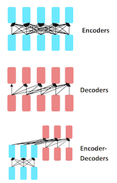

* **编码器**：**编码器主要用于处理和理解输入信息。**这些模型可以获得双向的上下文，即可以同时考虑一个词的前面和后面的信息。由于编码器可以考虑到未来的信息，它们非常适合用于需要理解整个句子的任务，如
文本分类、命名实体识别等。预训练编码器需要使其能够构建强大的表
示，这通常通讨预测某个被遮蔽的单词、预测下一个句子或者其它的预训练任务来实现。

**<mark>BERT就是一种典型的预训练编码器</mark>**

* **解码器：解码器主要用于生成输出信息**。它们是语言模型的基础，用于预测下一个单词。解码器只能考虑到过去的词，而不能考虑到未来的
词，这使得它们非常适合于生成任务，如文本生成、对话系统等。

**<mark>GPT就是一种典型的预训练解码器。</mark>**

* 编码器-解码器：*编码器-解码器结构结合了编码器和解码器的优点*。

编码器首先处理输入信息，然后解码器生成输出信息。这种结构可以考虑
到全局的上下文信息，因此非常适合于需要理解输入信息并生成相应的
输出的任务，如机器翻译、 文本摘要等。如何预训练编码器-解码器模型
是一个开放的问题，因为需要考虑到如何有效地使用编码器和解码器的
特点

**<mark>T5和BART都是典型的预训练编码器-解码器模型。</mark>**


**2018年语言模型进展**

* AI2 released ELMo in spring
* GPT-1 was released in summer, 
* BERT came out October


* ELMo: Deep Contextual Word Embeddings, Al2 & University of Washington 


* GPT-1: Improving Language Understanding by Generative Pre-Training, OpenAl


**Generative Pretrained Transformer (GPT-1) **

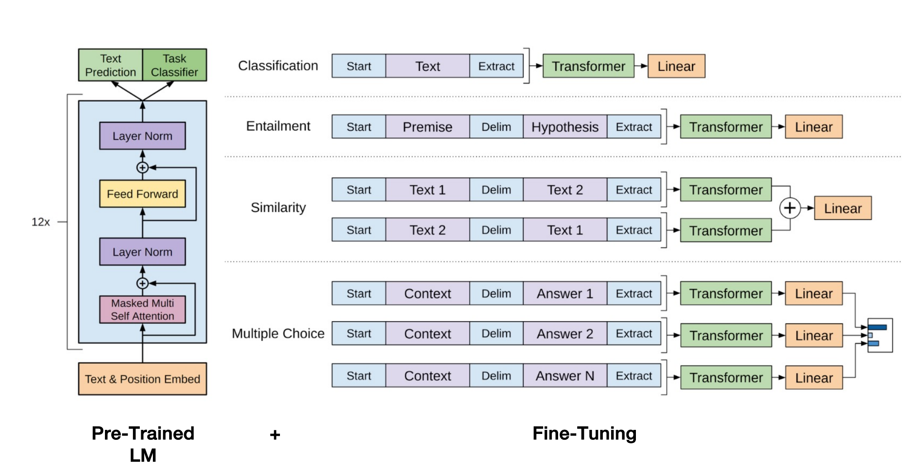


**GPT results on various natural language in erence datasets.**


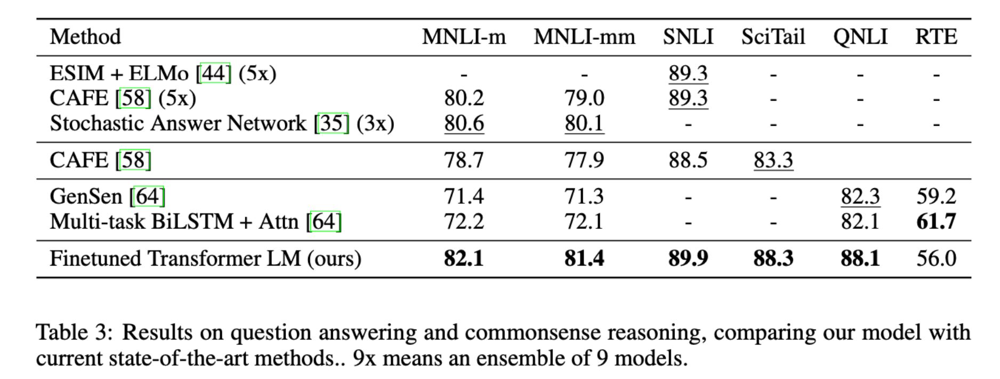

**NLP基准测试介绍**

**MNLl-m(Multi-GenreNaturalLanguageInferenc，matched）**：这是一个自然语言推理任务，其中包括了五个不同类型（类型指的是来源，例如口语、小说等）的文本，并且这些文本在训练和测试集上都是匹配的。任务的目标是根据一个给出的前提判断一个假设是蕴含、矛盾，还是无关。

**MNLl-mm（Multi-GenreNaturalLanguageInference，mismatched）**：这也是一个自然语言推理任务，但与MNLl-m不同的是，训练集和测试集的文本类型是不匹配的。这需要模型具有更好的泛化能力。

**SNLI(Stanford Natural LanguageInference）**：这是一个由斯坦福大学创建的自然语言推理任务，包含了大约55万个人类注释的英文句子对。任务的日标同样是根据一个给出的前提判断一个假设是蕴含、矛盾，还是无关。

**SciTail**：这是一个开放的自然语言推理任务，所有的问题和答案都来自科学领域的教材。任务的日标是根据给出的前提判断一个假设是蕴含还是矛盾。

**QNLI（QuestionNaturalLanguageInference）**：这是一个基于间答的自然语言推理任务，数据来源于SQuAD数据集。任务的目标是根据给出的上下文判断一个假设（问题）是否被蕴含。

**RTE（RecognizingTextualEntailment）**：这是一个文本蕴含识别任务，数据来源于多个版本的PASCALRTE挑战赛。任务的日标是根据一个给出的前提判断一个假设是蕴含还是矛盾。


以上基准测试都是关于自然语言推理的任务，目的是检验模型是否能够理解句子之间的逻辑关系，例如蕴含、矛盾或无关。这些任务在许多自然语言处理任务中都是非常重要的，例如问答、文本摘要、机器翻译等。

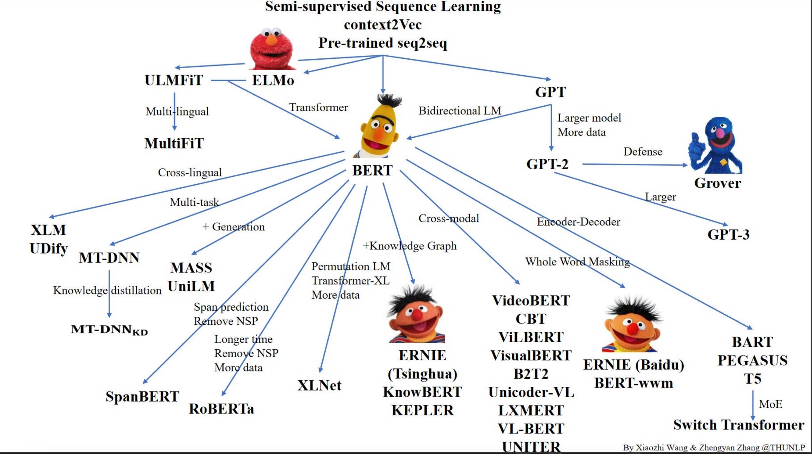


**GPT-3 Training Corpus**


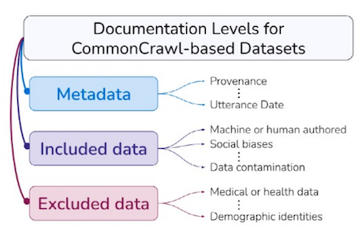

**GPT-3, In-context learning, and very large models**

Very large language models seem to perform some kind of learning **without gradient steps** simply from examples you provide within their contexts.

GPT-3 is the canonical example of this. The largest T5 model had 11 billion parameters. **GPT-3 has 175 billion parameters.**

The in-context examples seem to specify the task to be performed, and the conditional distribution mocks performing the task to a certain extent.

**Input (prefix within a single Transformer decoder context)**:

* thanks -> merci
* hello -> bonjour
* mint -> menthe
* otter ->

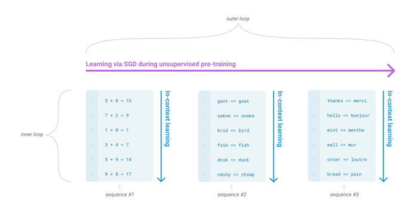

**Language model meta-learning**. 

During unsupervised pre-training, a language model develops a broad set of skills and pattern recognition abilities. 

It then uses these abilities at inference time to rapidly adapt to or recognize
the desired task. 

We use the term "in-context learning" to describe the inner loop of this process, which occurs within the forward-pass upon each sequence. The sequences in this diagram are not intended to be representative of the data a model would see during pre-training, but are intended to show that there are sometimes repeated sub-tasks embedded within a single sequence.

**GPT-3, In-context learning, and very large models**

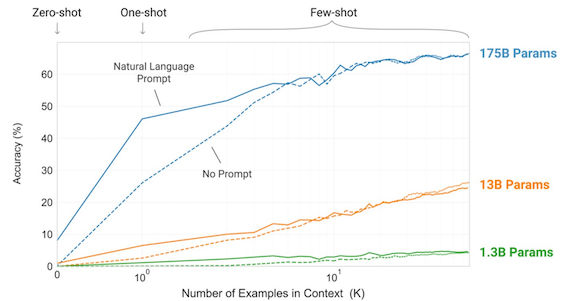

Figure 1.2: Larger models make increasingly efficient use of in-context information. 

We show in-context learning performance on a simple task requiring the model to remove random symbols from a word, both with and without a natural language task description. 

The steeper "in-context learning curves" for large models demonstrate improved ability to learn a task from contextual information. We see qualitatively similar behavior across a wide range of tasks.


**The three settings we explore for in-context learning**

* **Zero-shot**

The model predicts the answer given only a natural language description of the task. No gradient updates are performed.

```
Translate English to French:       task description
cheese=>                           prompt
```

**One-shot**

In addition to the task description, the model sees a single example of the task. No gradient updates are performed.

```
Translate English to French:  <- task description
sea otter => loutre de mer    <- example
cheese =>                     <- prompt
```

**Few-shot**

In addition to the task description, the model sees a few examples of the task. No gradient updates are performed.

```
Translate English to French:    <- Translate English to French:
sea otter => loutre de mer      <- examples 
peppermint => menthe poivrée
plush girafe => girafe peluche
cheese =>                       <- prompt
``` 

**Traditional fine-tuning (not used for GPT-3)**

**Fine-tuning**

The model is trained via repeated gradient updates using a large corpus of example tasks.


**Figure 1.3: Aggregate performance for all 42 accuracy-denominated benchmarks** 


While zero-shot performance improves steadily with model size, few-shot performance increases more rapidly, demonstrating that larger models are more proficient at in-context learning. 

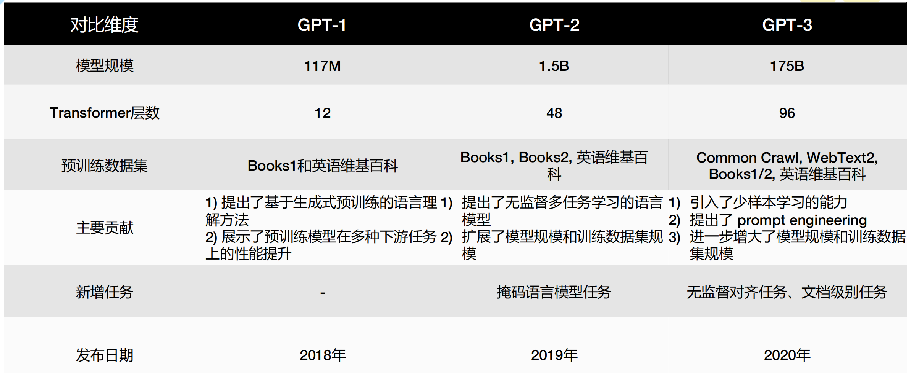

**3个关键概念**


**In-Context Learning**：在上下文中学习指的是大型语言模型如GPT-3的一种能力，即在给定的上下文中使用新的输入来改善模型的输出。**这种学习方式并不涉及到梯度更新或微调模型的参数：而是通过提供一些具有特定格式或结构的示例输入使模型能够在生成输出时利用这些信息。**

如，如果你在对话中包含一些英法翻译的例子，然后问模型一个新的翻译问题，模型可能会根据你提供的上下文示例生成正确的翻译

**Few-Shot Learning**：

少样本学习是指用极少量的标注样本来训练机器学习模型的技术。在GPT-
3的案例中，少样本学习的实现方式是向模型提供少量的输入-输出对示例，这些示例作为对话的一部分，描述了模型应该执行的任务。然后，模型会生成一个个输出，该输出是对与示例类似的新输入的响应。

例如，你可以给模型提供几个英法翻译的例子，然后给出一个新的英文单词让模型翻译，模型会尝试产生一个正确的翻译


**Prompt Engineering**：

**提示工程是指设计和优化模型的输入提示以改善模型的输出**。在大型语言模型中，如何提问或构造输入的方式可能对模型的输出有重大影响。因此，选择正确的提示对于获取有用的输出至关重要。

例如，为了让GPT-3生成一个诗歌，你可能需要提供一个详细的、引导性的提示，如“写一首关于春天的十四行诗”，而不仅仅是“写诗”

## ChatGPT 

### Pre-Trained LM + Fine-Tuning 范式


**OpenAl的模型迭代：预训练与微调的共舞**

在GPT 模型的演进过程中，OpenAl 采用了一系列的训练策略，这包括基础的大规模预训练，也包括后续的指令微调等方法。这两种策略在模型的训练过程中起到了不同的作用

* **预训练(Pre-Trained)**：大规模预训练是为了使模型获取丰富的语言知识和理解能力。在**预训练过程，模型通过大量的无标签数据来学习语言的基础知识，这一过程主要是依赖无监督学习的**。
* 指令微调(Instruction-Tuning)：在预训练模型的基础上，通过针对特定任务的标注数据进行微调能够使模型在特定任务上的表现得到提升。同时，**通过对微调数据的精心设计和选择**，还能够引导模型按照人类的预期来执行任务。**这一过程主要依赖有监督学习.**

在这个过程中，预训练和微调是相辅相成的。**<MARK>预训练为模型提供了丰富的语言知识，而微调则利用这些知识来解決特定的任务</MARK>**。然而，微调的数据量通常比预训练的数据量要少得多，因此微调的主要作用并不是为模型注入新的知识，而是激发和引导模型利用己有的知识来完成特定任务

**在GPT模型的演进过程中，OpenAl还探索了多种微调策路，例如GPT-3.5的分化技能树等**。这些微调策略能够帮助模型在不同的任务上表现得更好，同时也使模型的输出更符合人类的预期。

此外，OpenAl还注意到，**模型在进行微调时可能会出现一些问题，例如数据稀疏性、灾难遗忘、资源浪费和通用性差等。为了解决这些问题，OpenAl提出了一种新的训练策略，即提示学习**。通过设计提示信息，可以激发预训练大模型的能力，从而提高模型在具体任务上的表现。

### OpenAl的模型迭代：预训练与微调的共舞


### GPT-3.5 : code-davinci-002

初代GPT-3.5系列（以下简称新模型）相比 GPT-3 系列模型，具有以下优点：

* **人类指令响应 (Responding to Human Instructions)**：新模型能针对特定指令生成更恰当的回应，而非回复训练集中频繁出现的无关句子
* **任务泛化能力 (Task Generalization)**：当新模型按收大量指令调整后，能自动适应并有效回答未见过的新指令这在应对用户不断变化的问题上至关重要。
* **代码理解与生成 (Code Understanding and Generation)**：经过代码训练的新模型能理解并生成代码，强化了编程相关应用的能力。
* **复杂推理的思维链 (Chain of Thought for Complex Reasoning)**：新模型己提高思维链推理能力，使其能处理需要多步推理的问题，这可能是突破模型缩放法则(scaling laws)限制，实现真正的突现性能力的关键。

在基础模型 code-davinci-002 上指令微调后得到了 text-davinci-002。它在以下数据作了微调：

* （一）人工标注的指令和期待的输出；
* (二）由人工标注者选择的模型输出

### ChatGPT 的三段训练法

* **Step 1 有监督微调 （SFT)**

Collect demonstration data, and train a supervised policy.


* **Step2 奖励机制 （RM)训练**

Collect comparison data and train a reward model.


* **Step3 通过 PPO 根据奖励模型进行强化学习**

	* Optimize a policy against
	* the reward model using
	* reinforcement learning.


### 总结： ChatGPT 是技术和商业的成功结合

1.**模型训练**：虽然GPT-3和ChatGPT都是基于Transformer的语言模型，但在训练数据和目标函数上有所不同。

**GPT-3主要是用大量的非结构化文本进行训练的，而ChatGPT则在GPT-3的基础上进行了进一步的训练，这包括使用与对话相关的数据集和更适合对话任务的训练目标。**

**2.对话管理**： ChatGFT在对话管理方面进行了优化，以提供更自然、连贯的对话体验。这包括保持对话的上下文、处理多轮对话、以及在一个对话中处理多个话题等


**3.用户输入处理：** ChatGPT也进行了优化以更好地处理用户的输入。这包括理解和响应各种类型的查询，如信息查询、任务请求、小说式的输入等。

**4. 输出生成**：ChatGPT进行了一些优化以生成更贴近人类的输出。这包括使用更复杂的生成策、生成更长的响应、以及更好地处理模糊或不确定的输入等

**5. 安全性和道德规范**： ChatGPT还进行了一些改进以提高模型的安全性和符合道德规范。这包括对对模型的过滤和调节，以防止生成不适当或有害的内容，以及对模型进行额外的评估和测试，以确保其在各种情况下都能表现良好。


### GPT 家族技术迭代与改进

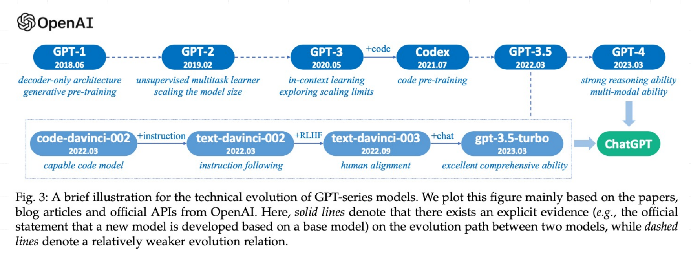


## GPT-4：一个新的开始

### GPT-4： 多模态开启 LLM-native 应用时代

2022年8月，GPT-4 模型训练完成。2023年3月14日，OpenAl 正式发布 GPT-4。与GPT-3和GPT-3.5相比，GPT-4在各方面都有所优化和提升

**1. 多模态模型**

GPT-4支持图像输入，出色的视觉信息理解能力使得GPT-4能对接更多样化的下游任务如：描述不寻常图像中的幽默、总结截屏文本以及回答包含图表的试题。

在文本理解能力上，GPT-4 在中文和多轮对话中也表现出远超 GPT-3.5 的能力

**2 扩展上下文窗口：**

gpt-4 and gpt-4-32k 分别提供了最大长度为8192和32768个token的上下文窗口。这使得GPT-4可以通过更多的上下文来完成更复杂的任务，也为 思维链（CoT）、思维树(TT）等后续工作提供了可能

**GPT+生态**：借助GPT-4强大能力，依托 ChatGPT Plugin 搭建AIGC应用生态商店（类似 App Store)


**应用+GPT**：GPT-4已经被应用在多个领域，包括微软Office、Duolingo、KhanAcademy等。

### GPT-4: 多模态—视觉理解能力


### GPT-4:NLP 基准测试大幅提升


**实测网页代码生成：GPT-4 VS GPT-3.5**


**实测网页代码生成：GPT-4 的变化**

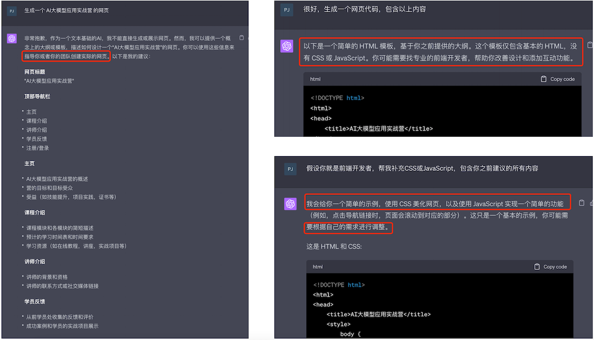

**GPT-4:名语言能力提升**


## 提示学习 (Prompt Learning)

**The three settings we explore for in-context learning**

**Zero-shot**

The model predicts the answer given only a natural language description of the task. No gradient updates are performed.

```
Translate English to French => task description
cheese =>   prompt
```

**One-shot**

In addition to the task description, the model sees a single example of the task. No gradient updates are performed.

```
Translate English to French:    task description
sea otter => loutre de mer      example
cheese =>                            prompt
```

Few-shot

In addition to the task description, the model sees a few examples of the task. No gradient updates are performed.

```
Translate English to French:
sea otter => loutre de mer             task description
peppermint => menthe poivrée       example
plush girafe => girafe peluche
```

### Traditional fine-tuning (not used for GPT-3)

**Fine-tuning**

The model is trained via repeated gradient updates using a arge corpus of example tasks.


### Prompt Learning VS Prompt Tuning

**<mark>Prompt learning和prompt tuning都是自然语言处理（NLP）中的概念，它们都与如何使用和优化预训练语言模型（例如GPT-3或GPT-4）有关。</mark>**

* **Prompt learning**：是一种方法，**其中模型被训练以响应特定的提示（prompt）**。在这种情况下，提示是模型输入的一部分，它指导模型产生特定类型的输出。例如，如果你向模型提供了“Translate the following English text to French: {text}"这样的提示，模型就会学习到这是一个翻译任务，并尝试将{text}从英语翻译成法语。这种方法的关键在于找到能够引导模型正确响应的有效提示。
* Prompt tuning，又称为"prompt engineering"，是一种**优化技术**，它涉及到寻找或生成能够最大限度提高模型性能的提示。这可能涉及到使用启发式方法、人工智能搜索算法，或者甚至是人工选择和优化提示。Prompt tuning的目标是找到一种方式，使得当给定这个提示时，模型能够生成最准确、最相关的输出。

总的来说，prompt learning和prompt tuning都与如何使用和优化模型的输入提示有关。它们的主要区别在于，**prompt learning更关注于如何训练模型以响应特定的提示，而prompt tuning则更关注于如何找到或生成最优的提示以提高模型的性能。**

## 思维链（Chain-of-Thought，CoT)

**Chain-of-Thought Prompting Elicits Reasoning  in Large Language Models (search)**

### Chain-of-Thought Prompting

CoT Prompting作为一种促进语言模型推理的方法具有几个吸引人的特点：

* 首先，从原则上讲，**CoT允许模型将多步问题分解为中间步骤，这意味着可以将额外计算资源分配给需要更多推理步骤的问题**。
* 其次，CoT提供了对模型行为的可解释窗口，提示了它可能是如何得出特定答案的，并提供了调试推理路径错误之处的机会（尽管完全描述支持答案的模型计算仍然是一个未解决问题）
* **第三，在数学应用题、常识推理和符号操作等任务中都可以使用思维链推理（CoT Reasoning）并且在原则上适用于任何人类能够通过语言解决的任务**。
* 最后，在足够大规模现成语言模型中很容易引发CoT Reasoning，只需在少样本提示示例中包含一些连贯思路序列即可。

### 思维链CoT：开启大模型逻韓推理能力的钥匙


**GPT-3.5：实测简单逻辑题**


**GPT-4：实测简单逻辑题**


**Examples of CoT**

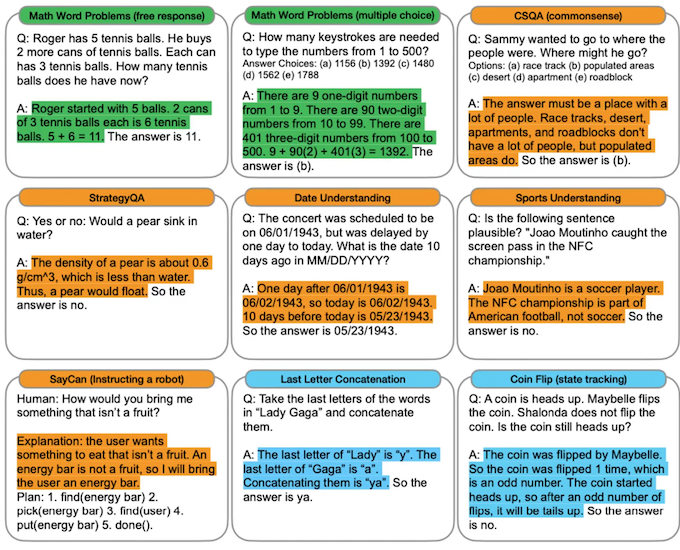

**CoT : Solving Challenging Math Problems**


CoT: Commonsense Reasoning


* **CSQA (CommonsenseQA)：**测试模型的常识理解和推理能力的基准测试。题目是一系列选择题，需要借助对世界的基本理解（即常识）来回答。
* **StrategyQA**：这个基准测试旨在评估模型的多跳推理能力。问题的回答通常需要从多个文本片段中提取并整合信息。
* **Date**： 这是一个基准测试，用于评估模型理解和推断日期信息的能力，尤其是在需要从上下文中推断日期时。
* **Sports**：这个基准测试的目标是评估模型在判断体育相关信息的可信度方面的表现，它需要对体育知识和事件的理解。
* **SayCan**：这是一个基准测试，用于评估模型将自然语言指令转换为机器可执行的离散动作序列的能力，这通常在机器人操作或自动化任务中很有用

**CoT 实验结论**

* 对于小模型来说，CoT Prompting 无法带来性能提升，甚至可能带来性能的下降。
* 对于大模型来说，CoT Prompting 涌现出了性能提升
* 对于复杂的问题，CoT Prompting 能获得更多的性能收益。


### **CoT Prompt黑魔法: Think step-by-step**


## 自治性（Self-Consistency）：多路径推理

> 黑魔法失效怎么办？

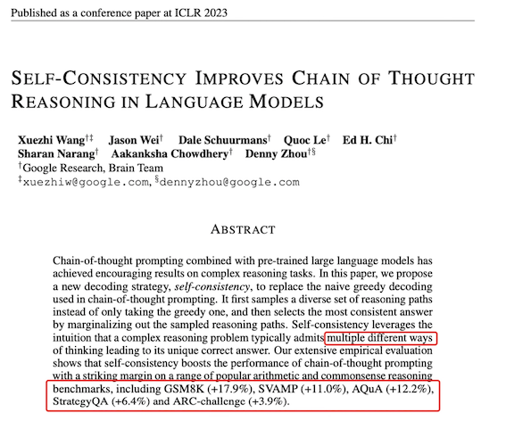

**Self-Consistency：多路径推理**


* Figure 1: The self-consistency method contains three steps: 

* (1) prompt a language model using chain-of-thought (CoT) prompting;
*  (2) **<mark>replace the "greedy decode" in CoT prompting by sampling from the language model's decoder to generate a diverse set of reasoning paths; and</mark>**
*  (3) marginalize out the reasoning paths and aggregate by choosing the most consistent answer in the final answer set.

### Self-Consistency提升CoT性能


关于 CoT 与大模型逻辑推理能力的现状

通过思维链，我们可以看到大语言模型的强与弱：

* <mark>**它强在，模型规模的提高，让语义理解、符号映射、连贯文本生成等能力跃升，从而让多步骤推理的思维链成为可能，带来“智能涌现”**</mark>
* <mark>**它弱在，即使大语言模型表现出了前所未有的能力，但思维链暴露了它，依然是鹦鹉学舌，而非真的产生了意识**</mark>

**没有思维链，大**模型几乎无法实现逻辑推理**。

但有了思维链，大语言模型也可能出现错误推理，尤其是非常简单的计算错误。Jason Wei 等的论文中，曾展示过在 GSM8K 的一个子集中，大语言模型出现了8% 的计算错误，比如6* 13=68（正确答案是78）

### Dual process theory of thought


Prompting 示意图


ToT 实验结果：24点游戏


ToT实验结果：创意写作与迷你填字游戏


### TOT工作原理解读：Step 1思维分解

虽然CoT样本以连贯的方式呈现思维，没有明确的分解过程，但ToT利用问题属性来设计和分解中间思维步骤。如下表所示，根据不同的问题，一个思维可以是几个词（填字游戏）一行方程式 （24点游戏），或者是整段写作计划（创意写作）。

总体而言，一个思维应该足够“小”，以便语言模型能够生成有前景且多样化的样本（例如生成整本书通常太“大”而无法连贯），同时又足够“大”，以便语言模型能够评估其对于问题求解的前景（例如仅生成一个标记通常太“小”无法评估）


### ToT 工作原理解读：Step 2思维生成

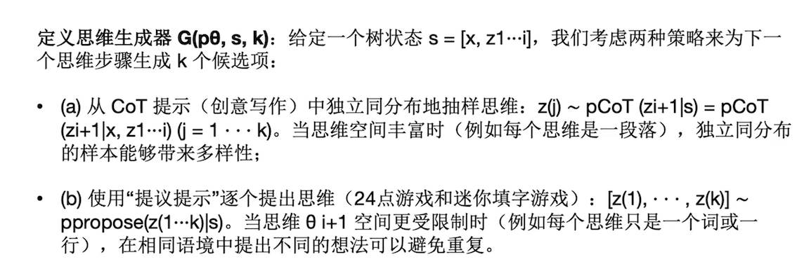

### ToT 工作原理解读： Step 3 状态评估


### TOT 工作原理解读：Step 4 搜索算法

最后，在ToT框架内，可以根据树结构插入和使用不同的搜索算法。作者探索了两种相对简单的搜索算法，
并将更高级的算法（例如A* 今儿MCTS）留给末水的工作：

* **(a)广度优先搜素（TOT-BFS)每步维护一组最有希望的状态集合b个**。这适用于24点游戏和创意写作等树深度受限制 （T≤3），并且初始思考步骤可以评估和修剪为一个小集合 (b≤5）
* **(b)深度优先搜索(TOT-DFS）** 首先探索最有希望的状态，直到达到最终输出结果(t>T)，或者状态评估器认为无法解决当前问题。在后一种情况下，从s 开始的子树被修剪以进行开发与利用之间的权衡。在这两种情况下，DFS会回溯到s的父状态以继续探索。

从概念上讲，ToT作为LM通用问题求解方法具有几个优势

* (1）泛化性。IO、CoT、CoT-SC和自我完善都可以看作是ToT的特殊情况 （即有限深度和广度的树)
* (2) 模块化。基本LM以及思考分解、生成、评估和搜索过程都可以独立变化。
* (3) 适应性。可以适应不同的问题属性、LM能力和资源约束。
* (4)方便性。无需额外训练，只需要一个预训练好的LM就足够了。

下一节将展示这些概念上的优势如何在不同问题中转化为强大的实证表现

## 第一部分：课后习题

* 注意力机制（Attention）的主要用途是什么？
	* A.  优化模型训练速度
	* B.  提高模型准确率
	* **C.  选择重要的信息并忽略不相关的信息**
	* D.  改进模型的可解释性
	* 答：C

* Transformer 模型是基于什么理论构建的？
	* A. 递归神经网络（RNN）
	* B. 卷积神经网络（CNN）
	* **C. 注意力机制（Attention）**
	* D. 自组织映射（SOM）
	* 答：C

* GPT 和 BERT 的主要区别是什么？
	* A. GPT 是基于 Transformer 的，而 BERT 不是
	* B. BERT 是基于 Transformer 的，而 GPT 不是
	* **C. GPT 使用了单向自注意力，而 BERT 使用了双向自注意力**
	* D. GPT 和 BERT 在基本结构上没有区别
	* 答：C

* 在注意力机制中，“Q”、“K”和“V”分别代表什么？
	* **A. 查询、密钥和值**
	* B. 查询、键入和验证
	* C. 快速、关键和验证
	* D. 问题、知识和视觉
	* A

* Transformer 模型是如何解决长距离依赖问题的？	
	* A. 通过递归神经网络（RNN）
	* B. 通过卷积神经网络（CNN）
	* **C. 通过注意力机制（Attention）**
	* D. 通过自组织映射（SOM）
	* 答：C


* GPT 主要用于哪种类型的任务？
	* A. 分类任务
	* B. 回归任务
	* **C. 生成任务**
	* D. 聚类任务
	* 答：C

* 以下哪项是 BERT 的主要创新之处？
	* A. 引入了自注意力机制
	* **B. 使用了双向自注意力机制**
	* C. 提出了新的优化算法
	* D. 突破了模型大小的限制
	* 答：B

* 在 Transformer 模型中，自注意力机制的主要作用是什么？
	* A. 加速模型训练
	* **B. 识别输入中的关键信息**
	* C. 生成高质量的词嵌入
	* D. 提高模型的鲁棒性
	* 答：B

* 基于 Transformer 的模型，如 GPT 和 BERT，主要适用于哪些任务？
	* A. 图像识别
	* **B. 自然语言处理**
	* C. 语音识别
	* D. 强化学习
	* 答：B

* 注意力机制最早是在哪个领域得到应用的？
	* A. 计算机视觉
	* B. 语音识别
	* **C. 自然语言处理**
	* D. 推荐系统
	* 答：C


多项选择题：

以下哪些方法被用于处理序列数据？

* **A. 递归神经网络（RNN）**
* **B. 卷积神经网络（CNN）**
* **C. 注意力机制（Attention）**
* D. 支持向量机（SVM）

答：A、B、C

解释：
 
递归神经网络（RNN）、卷积神经网络（CNN）和注意力机制（Attention）都被广泛应用于处理序列数据。具体来说：
    
* 递归神经网络（RNN）：**用于处理序列数据中的时序关系，能够通过循环单元对序列中的上下文信息进行建模，从而对序列中的每个元素进行处理**。
* 卷积神经网络（CNN）：**主要应用于序列数据中的局部模式识别，可以有效地对时间序列或文本数据中的局部特征进行提取**。
* 注意力机制（Attention）：能够根据输入序列中不同位置的重要性进行加权处理，从而提取相关的特征信息，并在不同任务中取得了显著的效果。
* 支持向量机（SVM）虽然也是一种常用的分类算法，但是主要用于处理结构化数据，而非序列数据。

* 以下哪些模型使用了注意力机制？

	* **A. BERT**
	* **B. GPT**
	* C. LeNet
	* D. ResNet

答：A、B

解释：

BERT和GPT都使用了注意力机制来对输入序列进行编码和解码，从而实现自然语言处理任务，如文本分类、问答系统、文本生成等。

LeNet和ResNet则是图像识别领域的经典模型，主要用于图像分类、目标检测等任务，并没有使用注意力机制。其中，LeNet是最早的卷积神经网络模型之一，ResNet是一种深度残差网络，它通过引入残差连接来训练更深的神经网络。

* 以下哪些模型主要用于自然语言处理任务？
	* **A. GPT**
	* **B. BERT**
	* C. VGG
	* D. LeNet
	* **答：A、B**

解释：
    
* GPT和BERT主要用于自然语言处理任务，如文本分类、问答系统、文本生成等。
* 其中，GPT主要用于生成式自然语言处理任务，如文本生成、机器翻译、故事生成等；
* BERT则主要用于判别式自然语言处理任务，如文本分类、问答系统、命名实体识别等。
* VGG和LeNet则主要用于图像识别任务，其中，VGG是一种经典的卷积神经网络模型，主要用于图像分类任务；
* LeNet是最早的卷积神经网络模型之一，主要用于手写数字识别任务。

下列哪些说法正确描述了注意力机制的作用？

* A. 它可以用来改进模型的训练速度
* **B. 它可以用来挑选出重要的信息并忽略不相关的信息**
* C. 它可以用来生成高质量的词嵌入
*  D. 它可以用来提高模型的鲁棒性
* 答：B

解释：

* 注意力机制的主要作用是对输入序列中的不同位置信息进行加权，从而挑选出重要的信息并忽略不相关的信息。
* 这种加权处理过程可以使模型更加关注重要的信息，从而提高模型的性能和表现。
* 注意力机制并不是用来改进模型的训练速度的，它在某些情况下甚至可能会增加模型的计算复度。
* 注意力机制也不是用来生成词嵌入的，它通常用于对序列进行编码和解码。
* 注意力机制虽然可以提高模型的鲁棒性，但这并不是它的主要作用。


下列哪些说法正确描述了 BERT 模型？

* **A. BERT 模型是基于 Transformer 的**
* **B. BERT 模型使用了双向自注意力机制**
* C. BERT 模型主要用于图像分类任务
* D. BERT 模型突破了模型大小的限制
* **答：A、B**

### 第二部分：相关名词解释


#### 1、LLM（Large Language Model）大语言模型是什么？

LLM是Large Language Model的缩写，指的是大型语言模型。大型语言模型是一类基于深度学习技术的人工智能模型，利用海量的文本数据进行训练，可以学习到自然语言的规律和模式，并且可以用于自然语言生成、理解、翻译、分类等多项自然语言处理任务。

**当前的主流大型语言模型包括GPT-3、BERT、RoBERTa、T5、XLNet等，它们都是基于Transformer架构的预训练模型，在自然语言处理领域具有广泛的应用**。这些模型一般需要使用超级计算机和大规模的训练数据进行训练，因此需要大量的计算资源和时间成本。


#### 2、常见的大语言模型有什么？

目前主流的大语言模型包括但不限于以下几种：
OpenAI公司下面的语言模型：GPT-4、GPT-3.5-turbo、text-davinci-003

* GPT-4（Generative Pre-trained Transformer 4）：由OpenAI开发的一种基于Transformer架构的预训练语言模型，具有非常强大的自然语言生成和理解能力，能够执行多项自然语言处理任务。GPT 就是一种典型的预训练解码器。
* GPT-3.5-turbo 和 text-davinci-003 都是语言模型，它们都可以用于聊天和文本生成等任务。
	* 但是，GPT-3.5-turbo 更适合于聊天任务，因为它具有更高的语言理解能力和对话生成能力。
	* 而 text-davinci-003 更适合于文本生成任务，因为它具有更高的文本生成能力和语言理解能力。

* BERT（Bidirectional Encoder Representations from Transformers）：由Google开发的一种基于Transformer架构的预训练语言模型，具有强大的双向上下文理解能力，被广泛应用于文本分类、问答系统等任务。BERT就是一种典型的预训练编码器
* RoBERTa（Robustly Optimized BERT Pretraining Approach）：由Facebook AI Research开发的一种基于BERT架构的预训练语言模型，采用更大规模的数据和更长的训练时间进行训练，在多项自然语言处理任务上表现优异。
* T5（Text-to-Text Transfer Transformer）：由Google Brain开发的一种基于Transformer架构的通用文本生成模型，可以执行多种自然语言处理任务，如文本摘要、机器翻译、文本分类等。T5和BART都是典型的预训练编码器-解码器模型。
* XLNet（eXtreme MultiLingual Language Model）：由Carnegie Mellon University、Google Brain和其他机构联合开发的一种基于Transformer架
构的预训练语言模型，采用了一种新的预训练方法，可以在多项自然语言处理任务上取得优异的表现。

ChatGLM：

* 1.是由清华大学 KEG 实验室和智谱 AI 公司于 2023 年共同推出的。
* 2.是一种基于 GLM-130B 模型的对话生成模型，在模型的设计和训练过程中，充分利用了 GLM-130B 模型的优势，如多层的 Transformer 编码器、大量的训练数据和自适应的学习能力等。
* 3.它可以通过对大量文本数据进行预训练，自动学习自然语言的规律和模式，从而实现对话生成和自然语言处理任务。
* 4.可以生成自然流畅的对话，并且能够在多个领域和主题上进行对话生成，包括通用对话、技术支持、医疗咨询等。

BARD（Building Automated Responses for Dialog）是由Facebook AI Research于2021年提出的一种自动化对话生成模型。与传统的对话生成模型不同，BARD模型不需要依赖大量的对话数据进行训练，而是通过对话生成引擎和语言模型的结合，可以自动生成自然流畅的对话响应。BARD模型将对话生成看作一个基于模板的文本生成问题，它通过对输入的对话文本进行解析和理解，从而自动构建出一个适用于该对话的模板，然后使用语言模型来自动生成对话响应。BARD模型的优点是在不需要大量对话数据的情况下，可以快速生成高质量的对话响应。这使得BARD模型在对话系统、客服机器人等领域具有广泛的应用前景。

#### 3、Transformer是什么？

Transformer是一种由Google开发的基于自注意力机制（self-attention）的神经网络架构，主要用于自然语言处理任务。**相较于循环神经网络（RNN）和卷积神经网络（CNN）等传统的序列模型，Transformer在处理长序列数据时具有更好的效果和更高的并行性**。

Transformer的核心思想是自注意力机制，它允许模型在处理输入序列时对不同位置的信息进行加权处理。自注意力机制能够有效地捕捉输入序列中的上下文信息，从而提高模型的性能。
Transformer模型由编码器和解码器两部分组成，其中编码器用于将输入序列编码成隐含表示，而解码器则用于根据编码器的输出生成目标序列。

在Transformer中，Attention机制被广泛应用于编码器和解码器的各个层次，从而构建出一个强大的自注意力模型，可以在多项自然语言处理任务上取得优异的表现。

1、编码器（Encoder）：编码器负责将输入序列转换为上下文表示。它由多个相同的层组成，每个层都包含自注意力机制和前馈神经网络。自注意力机制用于捕捉输入序列内部的关系，前馈神经网络用于对位置表示进行非线性变换。
    通俗解释：编码器主要用于处理和理解输入信息。这些模型可以获得双向的上下文，即可以同时考虑一个词的前面和后面的信息。由于编码器可以考虑到未来的信息，它们非常适合用于需要理解整个句子的任务，如
           文本分类、命名实体识别等。预训练编码器需要使其能够构建强大的表示，这通常通过预测某个被遮蔽的单词、预测下一个句子或者其它的预训练任务来实现。BERT就是一种典型的预训练编码器。

2、解码器（Decoder）：解码器根据编码器的输出和之前的生成序列，逐步生成目标序列。与编码器类似，解码器也由多个相同的层组成，每个层包含自注意力机制、编码器-解码器注意力机制和前馈神经网络。
    通俗解释：解码器主要用于生成输出信息。它们是语言模型的基础，用于预测下一个单词。解码器只能考虑到过去的词，而不能考虑到未来的 词，这使得它们非常适合于生成任务，如文本生成、对话系统等。
    GPT就是一种典型的预训练解码器。

3、编码器-解码器注意力机制（Encoder-Decoder Attention）：编码器-解码器注意力机制用于在解码器中对编码器的输出进行注意力计算。它帮助解码器关注输入序列中与当前生成位置相关的信息，有助于生成准确的目标序列。
    通俗解释：结合了编码器和解码器的优点。编码器首先处理输入信息，然后解码器生成输出信息。这种结构可以考虑到全局的上下文信息，因此非常适合于需要理解输入信息并生成相应的输出的任务，如机器翻译、文本摘要等。
    如何预训练编码器-解码器模型是一个开放的问题，因为需要考虑到如何有效地使用编码器和解码器的特点。T5和BART都是典型的预训练编码器-解码器模型。

4、自注意力机制（Self-Attention）：自注意力机制是Transformer的核心机制之一，用于计算序列中每个位置与其他位置的相关性。通过计算相关性得分，并对其他位置的表示进行加权求和，自注意力机制能够捕捉到全局的上下文信息。

5、多头注意力机制（Multi-Head Attention）：多头注意力机制通过将自注意力机制应用于多个子空间，允许模型学习不同层次、不同类型的语义表示。多个子空间的注意力结果进行拼接和线性变换，得到最终的注意力表示。

6、位置编码（Positional Encoding）：位置编码用于引入序列中的顺序信息。它为每个位置分配一个唯一的向量表示，使得模型能够区分不同位置的词语或时间步。

7、前馈神经网络（Feed-Forward Network）：前馈神经网络是一种全连接的前馈网络，用于对位置表示进行非线性变换。它能够学习到位置表示的更高级别的抽象特征，增强模型的表达能力。

这些组件相互协作，使得Transformer能够处理序列建模任务，并在自然语言处理等领域取得了显著的性能提升。

#### 4、RNN是什么？

RNN指的是递归神经网络（Recurrent Neural Network），**是一种用于处理序列数据的神经网络模型。与传统的前馈神经网络不同，递归神经网络在处理序列数据时能够对序列中的上下文信息进行建模**。

它通过引入循环结构，将序列中的每个元素都看作一个时间步，将上一时间步的输出作为当前时间步的输入，从而在序列中引入记忆机制。这使得递归神经网络可以对序列数据中的时序关系进行建模，从而在多个时间步中共享参数，减少了模型的参数数量，也提高了模型的效率。

递归神经网络在自然语言处理、语音识别、机器翻译、图像描述等领域中得到了广泛的应用。然而，由于梯度消失和梯度爆炸等问题的存在，递归神经网络在处理长序列数据时可能会出现性能不佳的情况。

因此，后来的一些模型如LSTM和GRU等被提出来解决这些问题。

#### 5、注意力机制：Attention是什么？与RNNs相比的优势在哪？

注意力机制（Attention）是一种用于加权处理序列数据中不同位置的信息的方法。在自然语言处理和计算机视觉等领域，注意力机制已成为许多成功模型的核心组件。

具体来说，注意力机制可以对输入序列中的每个位置进行加权处理，得到每个位置的权重，然后将加权后的结果进行求和，得到一个加权后的向量表示。

**不同的注意力机制可以通过不同的方式计算权重，例如基于点积、加性、多头等方式**。

1. 解决传统编码器-解码器模型的挑战，避免信息损失和无法建模输入输出对齐的问题。
2. 自动学习注意力权重，捕捉编码器和解码器之间的相关性。
3. 提高模型性能，改善输出质量，并提供更好的解释性。
4. 允许解码器访问整个编码的输入序列，通过注意力权重选择性地关注相关信息。
5. 构建上下文向量，使解码器能够全面访问输入序列并重点关注相关部分。

#### 6.大语言模型之间的本质区别

1. 模型基于的训练架构的区别，如：Transformer 架构 VS RNN架构
2. 模型应用的场景的区别，如：文本生成、对话系统、机器翻译、图像生成等
3. 训练数据和规模的区别，如：GPT-3 和 GPT-4 拥有数十亿甚至千亿级别的参数量，并且使用大量互联网文本数据进行训练；而其他模型则使用较小的参数量和数据集进行训练。

### Q&A问答

1、每次向 GPT 提问，回答注意力的权重都是不一样的吗？

答：不一样，**GPT自注意力模型，GPT在接受问题不同时，计算注意力权重的机制是不同的，回答时的注意力权重也不同**。你问chatgpt相同问题，它不一定给你相同的回答。

2、Transformer 中，如果 Encoder 和 Decoder 都是 Self-Attention ，那么如何处理问题和答案之间的关系？（通过 Mask 吗？）

答：问题与答案之间的信息泄露？ 是通过mask技术，掩码让问题不能全部看到答案，答案不能全部看到问题，避免信息泄露。

3、Encoder-Decoder Attention 是 Self-Attention 吗？

答：不算是，encoder-decoder attention从编码器中能关注到特定的位置，self-attention是模型内部的自注意力机制，可以关注到输入序列中的所有位置。

4、Bert是基于编码器，GPT是基于解码器，不是编码和解码一块用吗？

答：这3句话都没错，2个维度。 Bert和GPT的训练都用到了transformer，都用transformer的编码器和解码器来做预训练。

**但Bert目的是捕捉上下文信息，它强化了编码器能力**。

**GPT的目的是序列生成能力，它用自回归强化了解码器能力**。

5、当前gpt3.5的语义识别和bert哪个强，同样的语料（比如几万条）微调bert和gpt3.5的ada预训练模型哪个效果好？

答：这两个侧重点不同，你关注在上下文信息或语义理解上，就选Bert；关注在任务生成上，就选GPT。侧重点不同。

答：这两个侧重点不同，你关注在上下文信息或语义理解上，就选Bert；关注在任务生成上，就选GPT。侧重点不同。

问：比如企业中后台做一些运维操作，对产品的一些自然语言输入需要解析出操作的对象meta信息，然后作为参数调用api后，解析response最终做一个summary返回给用户。
是不是关注原始输入解析到meta调用api这一步，bert理论上会更有优势？
但实践中看，langchain调用gpt3.5利用 output_parser效果也不错，调整prompt后没看到多少解析不对的情况，然后应该可以调用agent调完api，结合问题，转到gpt优势领域生成回答了
所以是不是可以认为除了一些垂直领域如特定情感分析场景，力大砖飞的GPT可以把所有前辈扫到垃圾桶了？

答：是这样的，关注原始输入解析到meta信息 理论上bert具有优势 Bert可以学习到更加丰富的上下文信息和语义信息， Bert是有优势的。

但实际应用比较多样，垂直领域的应用场景具有特定的语言特征和结构，需要更精细的模型进行调整和优化，针对这种特定领域，langchain调用gpt3.5的精调，可能更具有优势。
不过，对于一些垂直领域，尤其是垂直的狭窄的有很多标注数据的，GPT大语言模型不一定就比其他有针对优化的模型效果更好。

还是要具体场景具体分析，不过对于应用场景，建议可以把longchain的GPT3.5当成baseline，现在用起来成本不高，而且这个baseline起点不低。

6、该怎么理解 transformer 和 langchain 的关系

答：**简单理解，transfomer是用来训练大模型的，大模型的架构**。 

**langchain是一个应用框架，用来帮助我们开发大模型的端到端应用程序的。
gpt-4/gpt-3.5是一个孤立的模型 + 输入输出interface** 

如何用呢，需要其他一些组件，比如数据库、API等，形成一个有机的应用程序。

这个有机的应用程序，可以是我们一行一行自己开发，也可以基于某个框架来快速开发。 “某个框架”->langchain

## 基础篇：大模型基础--理论与技术的演进

* GPT-1 在哪些方面相较于传统的语言模型取得了突破？
	* A. 引入了深度学习框架
	* **B. 利用生成式预训练改善语言理解**
	* C. 实现了图像识别的功能
	* D. 增加了自我监督学习的机制
	* 答：B

* 对于 ChatGPT 来说，其主要的优势是什么？
	* A. 高性能的图像识别
	* **B. 自然且连贯的对话生成**
	* C. 精确的数学运算
	* D. 音乐创作能力
	* 答：B

* GPT-4 相比于 GPT-3.5 主要的技术进步是？
	* A. 提升了模型的大小
	* B. 增加了对话能力
	* **C. 引入了图像识别能力**
	* D. 加强了音乐创作能力
	* 答：C

* 以下哪项技术是与"Chain-of-Thought"最相关的？
	* A. 一元语法分析
	* **B. 多路径推理**
	* C. 自洽性分析
	* D. 情感分析
	* **B**

* “Tree-of-Thoughts” 的主要作用是？
	* A. 实现多轮对话
	* B. 提升语义理解
	* **C. 提供多路径推理**
	* D. 改善模型对话的连贯性
	* 正确答案：C

* GPT-1 的主要研究目标是？
	* A. 多语言模型训练
	* **B. 通过生成式预训练改善语言理解**
	* C. 实现机器自主创作
	* D. 多媒体信息处理
	* 答：B


* 在 GPT-2 中，"模型是无监督多任务学习者"的概念是如何实现的？
	* A. 通过对话管理
	* B. 通过多任务联合训练
	* **C. 通过生成式预训练和特定任务微调**
	* D. 通过强化学习训练
	* 答：C

* GPT-3 的主要特点是？
	* **A. 用极少的样本就可以实现学习**
	* B. 实现了自主创作
	* C. 优化了对话管理能力
	* D. 引入了情感分析功能
	* （正确答案：A）


* GPT-4 的训练中，使用了什么新的技术？
	* A. 情感分析
	* B. 图像识别
	* **C. 混合专家系统**
	* D. 生成对抗网络
	* 答：正确答案：C


* "Self-Consistency: Multi-path Reasoning"的主要目标是？
	* A. 提升模型的情感理解能力
	* B. 提升模型对话的连贯性
	* **C. 通过多路径推理，增强模型的自洽性**
	* D. 提升模型的创作能力
	* 答：正确答案：C

*  GPT-1 的特点:  利用生成式预训练提升语言理解能力
* 在处理对话任务时，ChatGPT的优势： **自然且连贯的对话生成**
* "Chain-of-Thought"与以下哪些概念相关
	*  多路径推理
	* 自洽性分析
* 在 GPT-3 的研究中，哪些是其主要特点？ **用极少的样本就可以实现学习**
* 在 GPT-4 的开发中，哪些新的技术被采用？ **混合专家系统**

### 相关名词解释

1、Prompt Engineering（提示工程）（又称：Prompt Turing） 是人工智能中的一个领域，主要研究如何设计有效的提示或引导，以帮助用户或模型更好地完成特定任务。

* 职责：如何**找到最优的提示**以提高模型的性能。
* Prompt技术（不调模型，引导模型更好输出），是使用预训练语言模型的一系列方法的总称，这些方法不会修改模型的权重。目的都是通过不同的方式来更好的引导模型的输出。主要包括：

In-Context-Learning（上下文学习）：

* zero-shot   直接问不给样例
* one-shot	给一个样例
* few-shot	给多个样例

* Prompt learning    给一定的背景提示内容，使得大语言模型可以更好的理解问题
* Chain of Thoughts  思维链，Let‘s think step by step
* self-consistency   自洽性强调内部逻辑一致，不存在推理逻辑矛盾
* Tree of Thoughts   多路径推理，多方位、多角度观察问题
* Instruction-Tuning（指令微调）：也属于Prompt范畴，通过指令性的提示，引导大语言模型输出。

Fine Tuning（模型的微调方法）： Supervised Fine-Tuning（SFT，有监督的微调）：喂给大模型一定的人工标注的训练数据，让模型习得将输入映射到预期的输出。

总结：

* Prompt技术，主要关注如何通过提供更好的提示来生成更符合用户需求的文本
* Supervised Fine-Tuning，主要关注模型在新任务上的性能改进

2、什么是In-context learning（上下文学习）？什么是Zero-shot, One-shot, Few-shot？【是一种Prompt技术】

In-context Learning关注的是如何 `利用` 输入序列中的 `上下文信息` 来影响模型的输出。

是一种让模型根据给定的几个实例来理解任务并给出答案的学习方法，可以提高模型的泛化能力和适应性，帮助模型更好地理解和处理新的任务和数据。

常见的方法：Zero-shot, One-shot, Few-shot。

目的：主要是解决模型因为训练数据少，导致模型泛化能力差的问题。

* Zero-shot 是在没有接受任何示例训练的情况下，通过适当的提示来进行任务。这需要模型具备广泛的泛化能力，能够从提示中理解任务的要求并生成合适的回答。
* One-shot 是在接受仅一个示例训练的情况下，通过提示来进行任务。尽管只有一个示例，但模型试图从这个示例中学到足够的信息，以在新情境中进行泛化。
* Few-shot 是在接受少量示例训练的情况下，通过提示来进行任务。这种方法允许模型在少量示例上进行训练，从而在新的情境中产生更好的结果。

例如，当你在学习新的单词时，将它们放入句子中以及使用它们，有助于更好地理解它们的含义和用法。这种学习方式强调将知识放入实际情境中，从而更好地理解和记忆。

在例如：多轮对话中的记忆上下文可以被看作是 "in context-learning" 的一种表现。

**3、什么是Prompt Learning？【是一种Prompt技术】**

Prompt Learning 关注的是如何通过设计 `有效的提示` 来 `引导` 模型的输出。

举例：

* 请根据以下提示，生成一篇关于“气候变化对农业的影响”的文章：
* 随着全球气候的不断变化，农业生产面临着越来越大的挑战。极端气候事件，如干旱、洪涝、高温等，对农作物的生长和产量造成了严重影响。此外，气候变化还会导致病虫害的发生和传播，对农业生产带来了更大的压力。因此，我们需要采取有效的措施来应对气候变化对农业的影响，保障粮食安全。
* 请结合相关研究和案例，详细阐述气候变化对农业的具体影响，以及农业生产者、政策制定者和科学家应如何采取措施应对这些挑战。


4、什么是Chain of Thought（思维链） and Self-Consistency（自洽性）and Tree of Thoughts（思维树）？【是一种Prompt技术】

Chain of Thought（CoT）：下面例子中，使用逐步扩展的方式呈现"Chain of Thought"，每一步回答都基于前一步的回答，逐步构建了关于"XXXX"的思维链。这种逐步展开的方式可以更清晰地向用户解释一个复杂问题的多个方面。

```
举例1：User: "为什么要保持身体健康？"

Model: "保持身体健康对于个人的各个方面都非常重要。"
Model: "首先，身体健康可以提高生活质量。"
Model: "这意味着你能够更好地享受生活，从事你喜欢的活动，而不会受到体力上的限制。"
Model: "此外，保持身体健康还有助于预防疾病。"
Model: "通过均衡的饮食和适度的运动，你可以降低患上许多慢性疾病的风险，如心脏病和糖尿病。"
Model: "另外，身体健康也与心理健康紧密相关。"
Model: "运动可以释放身体内的化学物质，有助于减轻压力和焦虑，提升情绪状态。"
Model: "最后，保持身体健康可以增强免疫系统。"
Model: "一个强健的免疫系统能够更好地应对疾病和感染，使你的身体更有抵抗力。"
```

**经典的提示词：Let‘s think step by step！**

举例2：首先，我们需要找出这个问题的关键信息；其次，我们需要将问题转换为数学表达式；最后，我们通过解方程来求解这个问题

**self-consistency（s-c）：确保了模型的回答在逻辑上是合理和可靠的。**

举例：User: "狗的寿命通常有多长？"

Model: "狗的寿命通常因狗的品种和大小而异。较小的狗品种，如吉娃娃，通常寿命更长，可以活到12-20岁。而大型犬，如圣伯纳德，寿命可能较短，大约8-10岁。"

在这个回答中，大语言模型展示了自洽性，它在内部逻辑上保持一致。模型首先指出寿命与狗的品种和大小有关，然后在具体的品种范围内提供了寿命范围。这种逻辑一致性使得回答更加可信，读者不会在回答中找到矛盾之处。

Tree of Thoughts（ToT）：表现为模型在回答问题时按照层次结构组织信息，从整体到细节展开，呈现出一种层次性的结构。

* 举例：User: "手机的重要性是什么？"
* Model: "手机在现代社会中具有重要的地位。从整体来看，手机在以下几个方面具有重要性：通信、信息获取和社交。在通信方面，手机是人们日常交流的重要工具，通过电话、短信和社交媒体，人们可以随时保持联系。信息获取是另一个重要方面，手机让我们能够在任何时候获取新闻、知识和娱乐内容。此外，手机也在社交方面发挥着作用，通过社交应用，人们可以与朋友、家人保持联系，甚至结识新的朋友。总之，手机在多个层面上都具有重要的作用，成为了人们生活中不可或缺的一部分。"

在这个回答中，大语言模型使用了"Tree of Thoughts"的结构，从整体重要性开始，逐步展开到通信、信息获取和社交这三个子主题。每个子主题又分别进一步解释和展开。这种层次性的组织方式帮助读者更清楚地理解回答，从整体到细节逐步展示信息，让回答更具有结构性和连贯性。    

扩充：在ToT框架内，可以根据树结构插入和使用不同的搜索算法。作者探索了两种相对简单的搜索算法，并将更高级的算法(例如AlphaGo(AlphaZero) 蒙特卡洛树搜索（MCTS）)留给未来的工作，TOT-BFS广度优先算法、深度优先搜索(ToT-DFS)）

总之，"Chain of Thought"是思维按照线性顺序连接的方式，"Self-Consistency"是思想和回答内部保持逻辑一致性，而"Tree of Thoughts"是将思维层次化地组织成树状结构。
ToT包含SC，SC包含CoT

5、什么是Instruction-Tuning（指令微调）？【是一种Prompt技术】

也属于Prompt范畴，通过指令性的提示，引导大语言模型输出。

指令微调例子：
    
* 原始指令：生成一段描述夏季的天气的文本。
* 微调后的指令：生成一段描述夏季阳光明媚、温度适宜的天气的文本。

6.其他Prompt技术技巧

* `Pattern-based Prompts`：使用特定的模式或结构化的提示来引导模型生成回答。例如，使用 "What is" 或 "Explain" 这样的模式来获取解释性的回答。
* Cloze-style Prompts：使用不完整的句子或段落，缺少关键信息，让模型填补缺失部分。例如，"The capital of France is ___." 可以引导模型填写空缺。
* Generative Prompts：提供一个开放式的提示，要求模型自由生成相关的回答。例如，"Tell me about" 后面可以是任何话题。
* Adversarial Prompts：引入对抗性元素，让模型在不受到敌对输入的干扰下生成鲁棒的回答。
* Rewrite Prompts：对初始提示进行重写或改写，以使其更清晰、精确或特定。
* Explanation-based Prompts：要求模型不仅给出回答，还要解释其回答的原因或过程。
* Comparison Prompts：要求模型比较两个或多个概念、选项等，并给出有关它们的回答。
* Scenario-based Prompts：在特定场景下设置提示，以促使模型生成在该场景中有意义的回答。
* Socratic Prompts：通过连续提问，引导模型逐步生成更深入的回答，类似于哲学上的苏格拉底式讨论。


### 一些问答

#### 1、SFT fine-tuning、fine-turning 和 Instruction-Tuning的区别？

答：Fine-tuning：微调

* SFT(Supervised Fine-Tuning)：有监督的微调
* Instruction-Tuning：指令微调

* 1.Fine-tuning: 这是一种通用的深度学习训练策略，通常在预训练模型基础上进行，以适应新任务。通过对预训练模型的参数进行微调，使模型能够在特定任务上表现更好。
* 2.SFT: 这是一个监督学习过程，即通过人工标注的训练数据集来调整模型的参数。在这个过程中，模型学习将输入映射到预期的输出。SFT就是一种Fine-tuning的策路。
* 3.Instruction-Tuning: 是OpenAI提出的一种新的训练方法。通过向模型提供人类编写的指导性指令，对模型进行训练和调整。主要用于增强模型对特定指令的响应。

这些指令可以是对输入输出的期望行为描述，如"重要性：高；可读性：中；重要性：低"，从而控制模型在生成文本时更好地满足用户需求。使模型能够正确理解并生成预期的输出。

Prompt和Instruction都是用于指导模型生成输出的文本，不对模型的权重进行修改； fine tunning会对模型的权重进行修改。 Prompt和Instruction比较相似，关注的目标不一样。

#### 2、我要用大模型做分类，我用openai的finetune，效果很好，6w条语料4轮epoch可以到0.94accuracy。但是高质量的语料标注是个难活。我朋友告诉我，prompt-tuning用的语料更少，而语料治疗要求没那么高，而效果更好。

文本分类是一个经典下游任务，如果你的语料本身并没有给使用的OpenAI基础模型增加额外的知识，那么prompt-tuning确实是更有性价比的关于prompt-based learning目的是让大家理解如何从 standard prompt 演进到适用性极高的 ToT 的。

#### 3、思维链，是指提示词提问时的思维链，还是模型回答问题时运用思维链来回答？我的理解是后者，因为昨天的后半程课，全程讲的是模型在回答问题时的思维链逻辑推理，但是助教直播间说的是提示词提问时用思维链方式。能捋一捋吗？昨天并没有讲什么样的提示词规则更高效

对于一个模型在回答问题时的思维链逻辑推理，可以将其理解为模型对输入问题进行处理和分析的过程。这个过程可以看作是一种思维链，其中模型通过触发不同的关联或推理机制来生成答案。

当使用提示词提问时，思维链方式可以指引你以一种递进的思考方式来构建问题。你可以从一个提示词出发，将其作为起点，然后依次深入探索相关的概念、关联或细节，构建一个连贯的问题链条。每个问题都基于前一个问题的答案或信息，从而逐步扩展和深化对问题的理解。

通过思维链方式提问可以帮助你更系统地探索和获取信息，从而得到更准确、全面的回答。这种方法可以用于讨论复杂的主题、解决问题或促进深入思考和探索。

5、有监督学习和无监督学习，远程监督是啥意思

答：有监督，就是你需要标注信息，在给机器学习。 无监督就是你直接可以给，不需要进行标注。 

远程监督是一种半监督学习方法，它的基本思想是利用已有的知识库自动生成标注数据。在远程监督中，模型会利用知识库中的实体和关系信息，自动标注相关的文本数据，

然后使用这些标注数据训练模型。相对于有监督学习，远程监督可以减少标注数据的工作量，但标注数据的质量受到知识库的影响。

6、GPT-4相较GPT-3、GPT-3.5的优势

1. 多模态模型: GPT-4支持图像输入，出色的视觉信息理解能力使得GPT-4能对接更多样化的下游任务， 
	* 如:描述不寻常图像中的幽默、总结截屏文本以及回答包含图表的试题。在文本理解能力上，GPT-4 在中 文和多轮对话中也表现出远超 GPT-3.5 的能力。
2. 扩展上下文窗口:gpt-4 and gpt-4-32k 分别提供了最大长度为8192和32768个token的上下文窗口。
	* 这使得 GPT-4可以通过更多的上下文来完成更复杂的任务，也为 思维链(CoT)、思维树(ToT)等后续工作提供 了可能。
3. GPT+生态 :借助GPT-4强大能力，依托 ChatGPT Plugin 搭建AIGC应用生态商店(类似 App Store)
4. 应用+GPT :GPT-4已经被应用在多个领域，包括微软Office、Duolingo、Khan Academy等。

7、如何使用BERT进行文本分类

- 数据准备：首先，准备你的文本分类数据集。数据集应包含标记好的文本样本和对应的类别标签。确保你有足够的数据用于训练、验证和测试。

- BERT模型选择：选择适合你任务的BERT模型。BERT有不同的变体和大小，如BERT-Base、BERT-Large等。较大的模型通常有更多的参数和更强的表示能力，但训练和推理的速度也更慢。

- 数据预处理：对文本数据进行预处理，使其适应BERT模型的输入格式。首先，将文本切分成词（Word Piece Tokenization），并将每个词转换为对应的词ID。然后，添加特殊标记（如"[CLS]"和"[SEP]"）以表示句子的开始和结束。如果需要，还可以进行填充和截断操作，以保证输入序列的长度一致。

- 模型搭建：根据选择的BERT模型，在代码中构建相应的模型结构。可以使用开源的深度学习框架（如TensorFlow、PyTorch）提供的BERT模型实现，或者使用预训练的BERT权重进行加载。

- 模型训练：使用准备好的数据集对BERT模型进行训练。在训练过程中，使用适当的优化器（如Adam）和损失函数（如交叉熵损失函数）进行参数更新。根据需要，可以使用验证集进行模型的调优和超参数选择。

- 模型评估：在训练完成后，使用测试集评估模型的性能。计算分类准确率、精确率、召回率、F1值等指标来评估模型的表现。

- 推理预测：使用训练好的BERT模型进行推理预测。将待分类的文本转换为BERT模型的输入格式，并通过模型的前向传播获取分类结果。

8、实际案例：A使用 bert 做文本分类，然后每个epoch的loss不是一直下降的，accuracy也不是一直上升的。目前样本量级只有几十条。

解决问题的思路可以关注以下2点。

解决问题的思路可以关注以下2点。
1. 数据工程，需要关注样本量级，是否平衡，特征选择和清洗等预处理
2. 模型工程，需要关注参数是否是最佳值，例如 lr, rc, batch_size...，还有可能关注下BERT是否已经达到天花板，是否需要更大的模型也可以换另外一种做法，把样本扔到嵌入模型取最终向量，在去训练一个分类器，这样更加的快速

现在看起来是欠拟合，你可以尝试加多数据量来解决。这点数据量模型都跑不起来的，用嵌入模型的结果在去sklearn做个简单的分类器（这个步骤是：下游任务的分类训练），就可以得到一个比较好的结果了

总结：目前这个案例中是在模型微调训练阶段的数据集太少了