# 2 大模型开发基础：OpenAIEmbedding

* 通用人工智能的前夜
	* "三个世界〞与“图灵测试〞
	* 计算机的数据表示
	* 表示学习与嵌入
* Embeddings Dev 101
	* 课程内容: GitHub openai-quickstart
	* 快速上手 OpenAl Embeddings
* 快速上手  OpenAl GPT
* 大模型应用最佳实践
* 大模型核心硬件选型指南

## 通用人工智能的前夜

* 波普尔的三个世界
	* 世界一：由物理客体和事件组成的世界比如物质、能量和一切有机和无机物质，也就是哲学中的**客观世界**
	* 世界二: 由心灵主体和其感知事件组成的世界。包括感觉、意识等
心理状态和过程 ，也就是哲学中的**主观世界**；
	* 世界三: **客观知识组成的世界它的内容是思想**，思想的内容可以
被物质化，成为人造产品和文化产品，比如语言艺术品、图书手机．电脑等等一切含有知识、思想的有形的物质当然也包括可以用语言表达出来的，人的意识的固定对象，比如问题、猜想理论、反驳等等

### 图灵测试（Turing Test)

如果一台机器能够与人类展开对话（透过电传设备）而不被辩别出其机器身份，那么称这台机器具有智慧。

这一简化使得图灵能够令人信服地说明“思考的机器”是可能的。论文中还回答了对这一假说的各种常见质疑图灵测试是人工智能哲学方面首个严肃的提案。

### 计算机如何表示客观知识的世界？

**西文表示**

* ASCII（AmericanStandardCodeforInformationInterchange，美国信息交换标准代码）是IEEE（美国电气和电子工程师协会）里程碑之一。1963年发布第一版，最后一次更新在1986年。
* ASCII是基于拉丁字母的一套电脑编码系统。它主要用于显示**现代英语**，而其护展版本延伸美国标准信息交换码则可以部分支持其他西欧语言，并等同于国际标准ISO/IEC646。

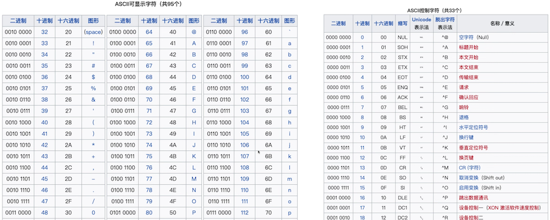

### 中文表示

1. **ASCII扩展**：在早期的计算机系统中，大多采用ASCII码来表示字符。ASCII只能表示128个字符，主要用于表示英文字符。为了表示汉字，各地开始开发基于ASCIl的扩展，如GB2312（中国大陆）、Big5（台湾）、EUC-JP（日本）等。这些编码将ASCII扩展到了256个或更多的字符，使得它们可以表示汉字或者其他非拉了字母的字符。但这些编码往往只能表示一种语言，且在多种语言混合使用时会出现问题。
2. **Unicode和UTF-8**:为了解决多种语言混合使用时的问题，Unicode应运而生。Unicode是一个包含全世界所有字符的编码系统，它将每个字符都映射到一个唯一的数值。UTF-8是Unicode的一种实现方式，它是一种可变长度的编码方式，可以使用1到4个字节来表示一个字符。
3. **One-hot编码（词汇表）**：在机器学习和深度学习的应用中，文本数据通常需要转换为数值型数据。One-hot编码是一种常用的转换方式。在One-hot编码中，每个汉字都被表示为一个只有一个元素为1，其余元素全为0的向量。向量的长度等于汉字的总数量，1的位置表示该汉字的索引。One-hot编码的一个主要优点是它简单直观，但当汉字的数量非常大时，One-hot编码会占用大量的内存。
4. **基于深度学习的语言模型**：在最近的发展中，一种基于深度学习的自然语言处理技术被用于表示文字，包括汉字。**这种技术将每个字或词映射到一个高维向量（称为词嵌入），这个向量可以浦捉到字或词的语义信息**。

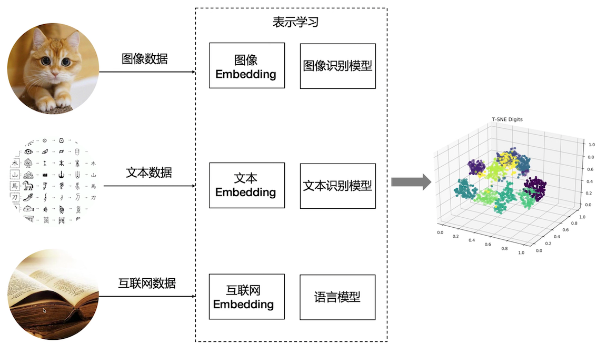

* **Word Embedding**

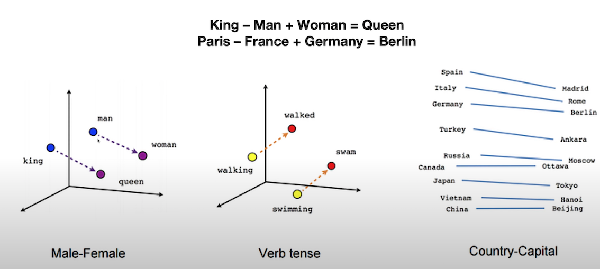

* **Book Embedding**

* **Image Embedding**

t-SNE (t-Distributed Stochastic Neighbor Embedding）

一种统计算法，用于在低维空间（通常是2D或3D，便于可视化）里展示高维数据的结构。其目标是保持原有高维空间中近邻点的距离关系，使得距离近的点在低维空间中仍然距离近，而距离远的点在低维空间中仍然距离远。

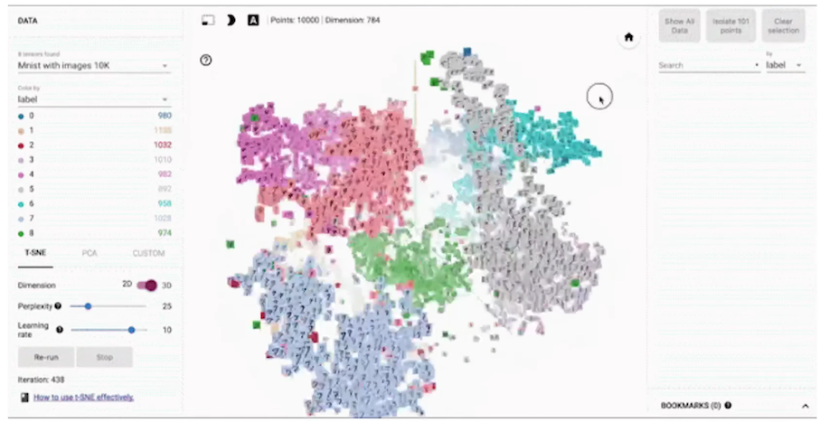

### Embedding

**嵌入（Embedding）**是表示学习的一种特定形式，旨在将高维数据映射到低维空间中的向量表示。

* **词嵌入 (Word Embedding）**：在自然语言处理中，词嵌入将词语映射到低维向量空间，以捕捉词语之间的语义和句法关系。通过学习词嵌入，可以将词语表示为连续的向量，其中相似的词语在向量空间中彼此靠近。它在自然语言处理任务中广泛应用，<mark>包括词语相似度计算、文本分类、命名实体识别等</mark>。词嵌入可以通过word2Vec、Glove 等方法进行学习。
* **图像嵌入 (Image Embedding)**：**在图像处理中，图像嵌入将图像映射到低维向量空间，以表示图像的视觉特征**。这种嵌入方法通常通过使用卷积神经网络 (**Convolutional Neural Networks, CNN**) 等深度学习技术来提取图像的特征表
* **图嵌入 (Graph Embedding）**：是用于学习图结构的表示学习方法，将图中的节点和边映射到低维向量空间中。通过学习图嵌入，可以将复杂的图结构转化为向量表示，**以捕捉节点之间的结构和关联关系**。这些方法可以通过DeepWalk, Node2Vec, GraphSAGE等算法来实现， 图嵌入在图分析、社交网络分析、推荐系统等领域中广泛应用，用于发现社区结构、节点相似性、信息传播等图属性。

包括嵌入在内，表示学习涉及更广泛的概念和方法，以实现对数据的更好理解和表达。

### **Word Embedding**

Word Embedding 为自然语言处理任务提供了更好的单词表示方法，它的应用主要有：

* **语义表示和语义相似度**：word Embedding可 以捕捉到单词之间的语义关系，使得相似含义的单词在向量空间中彼此靠近。这使得我们可以通过计算向量之间的距离或相似度来度量单词的语义相似度。这对于词义消歧、语义搜索、义推理等任务非常有用。
* **词语关系和类比推理**：WordEmbedding可以捕捉到单词之间的关系，如同义词、反义词、上下位关系等。通过在向量空间中进行向量运算，例如求解向量之间的差异或类比推理，我们可以发现词语之间的有趣关系。**例如，对于词语之间的类比关系"king-man+woman=queen”，通过WordEmbedding可以得到类似的结果**。
* **上下文理解：Word Embedding 可以帮助理解单词的上下文信息**。通过学习单词在其周国上下文中的联入表示，我们可以捕捉到单词的语境信息，从而帮助解决语义歧义、词语消歧和指代消解等问题。
* **文本分类和情感分析**：Word Embedding可以提供丰富的词语特征表示，从而改善文本分类和情感分析任务的性能、通过将文本中的词语映射为嵌入向量，并将这些向量作为输入特征，我们可以在分类器或情感分析模型中进行训练和预测
* **机器翻译和生成模型：Word Embedding对于机器翻译和生成模型也是至关重要的**。通过将源语言和目标语言的单词都映射为嵌入向量，可以提高翻译的淮确性和生成模型的质量。嵌入向量可以捕捉到单词之间的语义和句法关系，帮助模型更好地理解和生成自然语言


### **Word Embedding vs Language Model**

* **Word Embedding**：词嵌入通常被用来生成词的向量表示，这个过程通常是**静态**的，即一旦训练完成，每个词的向量表示就确定了。词嵌入的主要目标**是捕获单词或短语的语义和语法信息**，并将这些信息以向量形式表示出来。词嵌入的一个重要特性是，语义上相近的词在嵌入空间中的距离也比较近然而，词嵌入并不能理解上下文信息，即相同的词在不同的上下文中可能有不同的含义，但词嵌入无法区分这些含义
* **Language Model：语言模型则是预测词序列的概率模型**，这个过程通常是**动态**的，会根据输入的上下文进行变化。**语言模型的主要目标是理解和生成文本**。这包括对上下文的理解，词的预测，句子的生成等等。语言模型会用到词嵌，但同时也会对上下文进行建模，这样可以处理词在不同上下文中的不同含义

在某种程度上，你可以将词嵌入看作是语言模型的一部分或者输入，语言模型使用词嵌入捕捉的信息，来进行更深层次的语义理解和文本生成。当然，现在有一些更先进的模型，比如BERT， GPT等，它们生成的是上下文相关的词嵌入，即词的嵌入会根据上下文变化，这样一定程度上弥补了传统词嵌入模型的不足

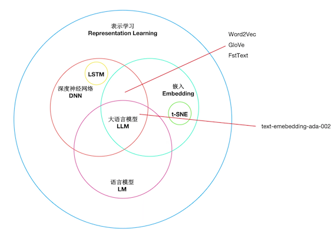

**偏见问题**

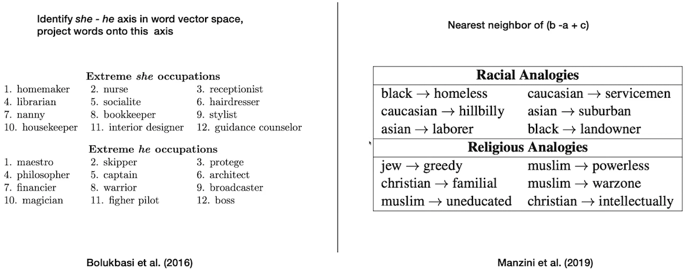


## Embeddings Dev 101

* Python版本：3.10+
* 交互式开发：JupyterLab
* IDE：VSCode，PyCharm
* 大模型：OpenAIAP-KEY

**GitHub openai-quickstart**

[https://github.com/openai/openai-quickstart-python](https://github.com/openai/openai-quickstart-python)

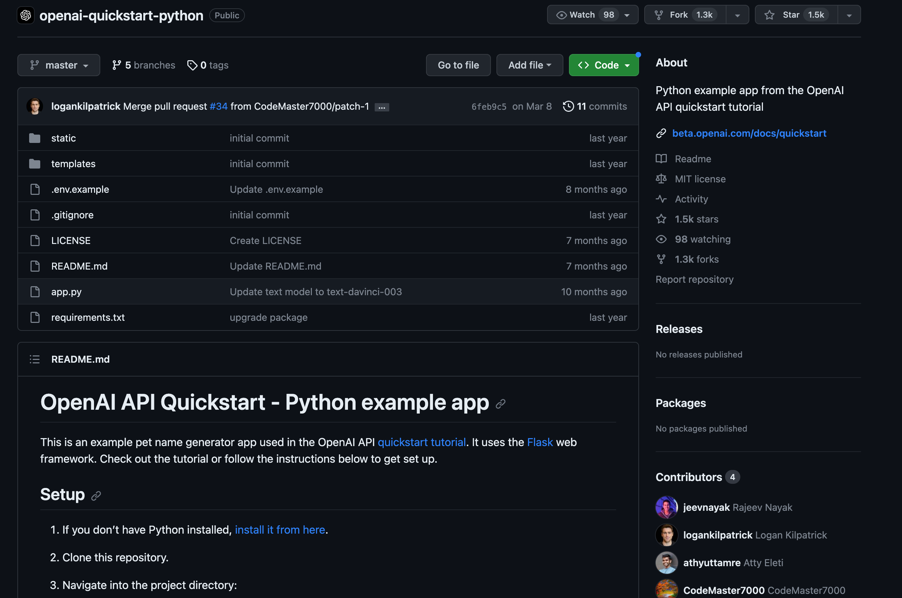

[https://github.com/DjangoPeng/openai-quickstart](https://github.com/DjangoPeng/openai-quickstart)

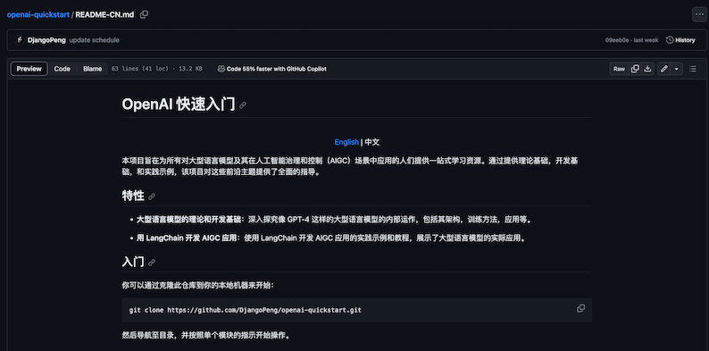

**OpenAI Embeddings**

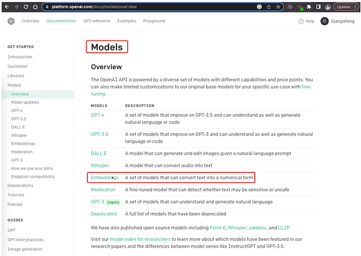

**`embedding.ipynb`**

```
!pip install
openal pandas matplotllb plotly sciklt-learn
```


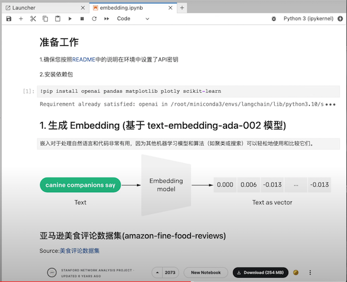


```
# 导入pandas包。Pandas是一个用于数据处理和分析的Python库
# 提供了DataFrame数据结构，方便进行数据的读取、处理、分析等操作。

import pandas as pd
#导入tiktoken库。Tiktoken是OpenAI开发的一个库，用于从模型生成的文本中计算token数量。

import tiktoken
# 从openai.embeddings utils包中导入`get_embedding`函数。
# 这个函数可以获取GPT-3模型生成的嵌入向量。
# 嵌入向量是模型内部用于表示输入数据的一种形式。
from openai.embeddings_utils import get_embedding
```

```
input_datapath = "data/fine_food_reviews_1k.csv"
df = pd.read_cv(input_datapath, index_col=0)
df = df [ "Time", "ProductId", "UserId", "Score", "Summary", "Text" ]]
df = df. dropna()

# 将Summary和“Text”字段组合成新的字段"combined"
df["combined"]  = (
	"Title: " + df.Summary.str.strip()+ "; Content: " + df.Text.str.strip()
	)
df.head(2)
```

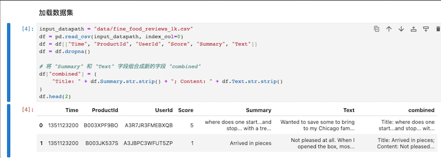

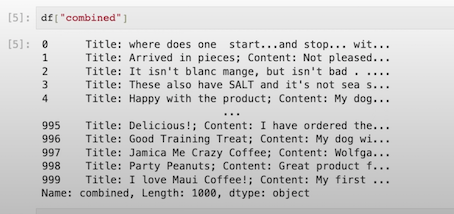

**Embedding 模型关键参数**

```
# 模型类型
# 建议使用官方推荐的第二代嵌入模型：text-embedding-ada-002
embedding_model = "text-embedding-ada-002"

# text-embedding-ada-002模型对应的分词器（TOKENIZER）
embedding_encoding = "c1100k_base"

# text-embedding-ada-002 模型支持的输入最大Token数是8191，向量维度1536
# 在我们的DEMO中过滤Token超过8000的文本

max_tokens = 8000
```

**将样本减少到最近的1,000个评论，并删除过长的样本**


```
# 设置要筛选的评论数量为1000
top_n=1000

# 对DataFrame进行排序，基于“Time”列，然后选取最后的2000条评论
# 这个假设是，我们认为最近的评论可能更相关，因此我们将对它们进行初始筛选
df = df.sort_values(”Time").tail（top_n * 2）

# 丢弃“Time"列，因为我们在这个分析中不再需要它。
df.drop("Time”，axis=1，inplace=True）

# 从'embedding_eneoding'获取编码
encoding = tiktoken.get_encoding(embedding_encoding）

# 计算每条评论的token数量。我们通过使用encoding.encode方法获取每条评论的token数，然后把结果存储在新的'n_tokens'列中。
df["n_tokens"] = df.combined.apply(lambda x: len(encoding.encode(x)))


# 升如果评论的token数量超过最大允许的token数量，我们将忽略（删除）该评论。
# 我们使用`.tai1`方法获取`token`数量在允许范围内的最后`top_n（1000）`条评论。
df= df[df.n_tokens <= max_tokens].tail(top_n）

# 打印出剩余评论的数量
len(df）

1000
```

生成Embeddings并保存（非必须步骤，可直接复用项目中文件）

```
# 实际生成会耗时几分钟
# 提醒：非必须步骤，可直接复用项目中的嵌入文件fine_food_reviews_with_embeddings_1k

df["embedding"] = df.combined.apply(lambda x: get_embedding(x, engine=embedding_model))

output_datapath=“data/fine_food_reviews_with_embeddings_1k_2146.csv)

df.to_csv(output_datapath)
```


2. 读取`fine_food_reviews_with_embeddings_1k`嵌入文件

```
embedding_datapath = "data/fine_food_reviews_with_embeddings_1k.csv'
df_embeded.read = pd.csv(embedding_datapath，index_co1=0）
```

**查看Embedding结果**

```
df_embeded["embedding"] 
```

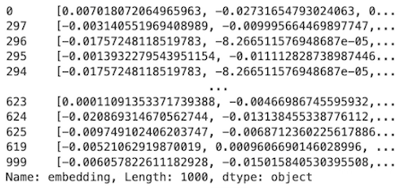


```
len(df_embeded["embedding"][0])

34402

type(df_embeded["embedding"][0])

str

import ast

# 将宇符串转换为向量
df_embeded["embedding vec"] = df_embeded["embedding"].apply(ast.literal_eval)
```

```
len(df_embeded["embedding_vec"][0])

1536
```

**3. 使用t-SNE可视化1536维Embedding美食评论**


```
#导入NumPy 包，Numpy是python的一个开源数值计算扩展。这种工具可用来存储和处理大型矩阵，
#比Python自身的嵌套列表（nested1list structure）结构要高效的多。
import numpy as np

# 从matplotlib包中导入pyplot子库，并将其别名设置为plt。
# matplotlib是一个Python的2D绘图库，pyplot是其子库，提供了一种类似MATLAB的绘图框架
import matplotlib.pyplot as plt
import matplotlib

# 从`sklearn.manifold`模块中导入TSNE类。
# TSNE（t-Distributed Stochastic Neighbor Embedding）是一种用于数据可视化的降维方法，尤其擅长处理高维数据的可视化。
# 它可以将高维度的数据映射到2D或3D的空间中，以便我们可以直观地观察和理解数据的结构。
from sklearn.manifold import TSNE
```

```
type(df_embeded["embedding_vec"]）

pandas.core.series.Series
```

```
#首先，确保你的嵌入向量都是等长的
assert df_embeded['embedding_vec'].apply(len).nunique() == 1

#将嵌入向量列表转换为二维numpy数组
matrix =  np.vstack(df_embeded['embedding_vec'].values）
```

```
#创建一个 t-SNE 模型，t-SNE 是一种非线性降维方法，常用于高维数据的可视化。
# n_components 表示降维后的维度（在这里是2D)
# perplexity 可以被理解为近邻的数量
# random_state 是随机数生成器的种子
# init 设置初始化方式
# learning_rate 是学习率。

tsne = TSNE (n_components=2, perplexity=15, random_state=42, init='random', learning rate=200)
```

```
使用t-SNE对数据进行降维，得到每个数据点在新的2D空间中的坐标
vis dims = tsne.fit transform(matrix)

# 定义了五种不同的颜色，用于在可视化中表示不同的等级
colors =["red", "darkorange", "gold", "turquoise",  "darkgreen"]

# 从降维后的坐标中分别获取所有数据点的横坐标和纵坐标Xforx，yin vis dims]
X = [x for x, y in vis dims]
y = [y for x,y in vis dims]

# 根据数据点的评分(减1是因为评分是从1开始的，而颜色索引是从0开始的）获取对应的颜色索引
color_indices = df_embeded.Score.values - 1


#确保你的数据点和颜色索引的数量匹配
assert len(vis dims) == len (df embeded. Score.values)
```

```
创建一个基于预定义颜色的颜色映射对象
colormap = matplotlib.colors.Listedcolormap（colors）
# 使用matplotlib创建散点图，其中颜色由颜色映射对象和颜色索引共同决定，alpha是点的透明度
plt.scatter(x，y，c=color_indices，cmap=colormap，alpha=0.3）

#为图形添加标题
plt.title("Amazon ratings visualized in language using t-SNE")
```

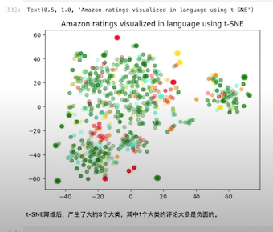


**4. 使用K-Means聚类，然后使用t-SNE可视化**

```
import numpy as np
#从Scikit-learn中导入KMeans类。KMeans是一个实现K-Means聚类算法的类

from sklearn.cluster import KMeans

# np.vstack是一个将输入数据堆叠到一个数组的函数（在垂直方向）。
# 这里它用于将所有的adaembedding值堆叠成一个矩阵。
# matrix=np.vstack(df.ada_embedding.values）

# 定义要生成的聚类数
n_clusters = 4

# 创建一个KMeans对象，用于进行K-Means聚类
# n_clusters 参数指定了要创建的聚类的数量
# init参数指定了初始化方法（在这种情况下是 'k-means++'）
# random_state参数为随机数生成器设定了种子值，用于生成初始聚类中心。
kmeans = KMeans(n_clusters=n_clusters，init='k-means++'，random_state=42）

# 使用matrix（我们之前创建的矩阵）来训练KMeans模型。这将执行K-Means聚类算法。
kmeans.fit(matrix)

# `kmeans.labels_`属性包含每个输入数据点所属的聚类的索引。
# 这里，我们创建一个新的cluster，列，在这个列中，每个数据点都被赋予其所属的聚类的标签

df_embeded['Cluster']= kmeans.labels_
```

`df_embeded['Cluster']`

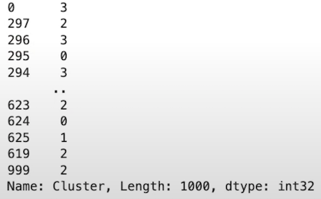

`df_embeded.head(2)`


```
首先为每个聚类定义一个颜色。
colors =["red"，"green"，"blue"，"purple"]


# 然后，你可以使用t-SNE来降维数据。这里，我们只考虑 'embedding_vec' 列
tsne_mode = TSNE(n_components=2, random_state=42）
vis_datatsne = tsne_model.fit_transform(matrix)

# 现在，你可以从降维后的数据中获取x 和y坐标。
x = vis_data[:, 0]
y = vis_data[:, 1]


# 'Cluster'列中的值将被用作颜色索引。
color_indices = df_embeded['cluster'].values

# 创建一个基于预定义颜色的颜色映射对象
colormap = matplotlib.colors.listedcolormap(colors)

# 使用matplotlib创建散点图，其中颜色由颜色映射对象和颜色索引共同决定
plt.scatter(x，y，c=color_indices，cmap=colormap）

# 为图形添加标题
plt.title("clustering visualized in 2D using t-SNE"）

# 显示图形
plt.show(）
```

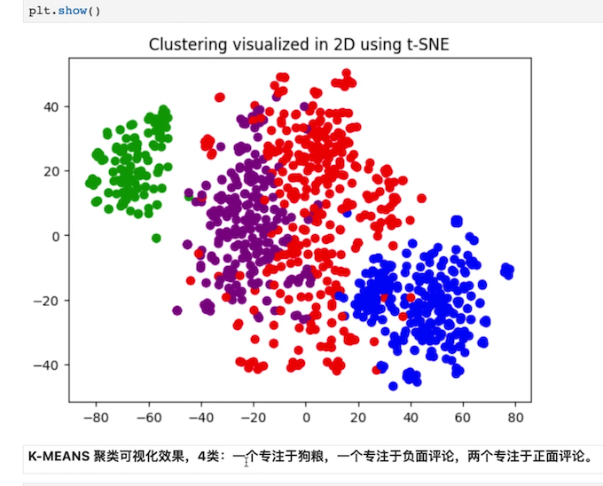

### 5. 使用 Embedding 进行文本搜索


```
# cosine similarity 函数计算两个嵌入向量之间的余弦相似度
from openai.embeddings_utils import get_embedding, cosine_similarity

type(df_embeded["embedding _vec"][0])

list
```

```
# 定义一个名为search_reviews的函数，
# Pandas Dataframe产品描述，数量，以及一个pprint标志（默认值为True）

def search_reviews(df, product_description，n=3，pprint=True）
	product_embedding = get_embedding(
		product_description，
	 	engine="text-embedding-ada-002"
	 )
	 
	df["similarity"]= df.embedding_vec.apply(lambda x: cosine_similarity(x, product_embedding))

results = (
	df.sort_values("similarity", ascending=False
	.head(n)
	.combined.str.replace("Title：", "")
	str.replace（"; Content:", ": ")
	)
	if pprint：
		for r in results：
			print(r[:200]）
			print()

return results
```

```
# 使用delicious beans作为产品描述和3作为数量
# 调用 search_reviews函数来查找与给定产品描述最相似的前3条评论
# 其结果被存储在res变量中。

res = search_reviews(df_embeded, 'delicious beans', n=3）
```


```
df_embeded['Cluster']
```

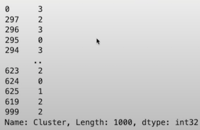

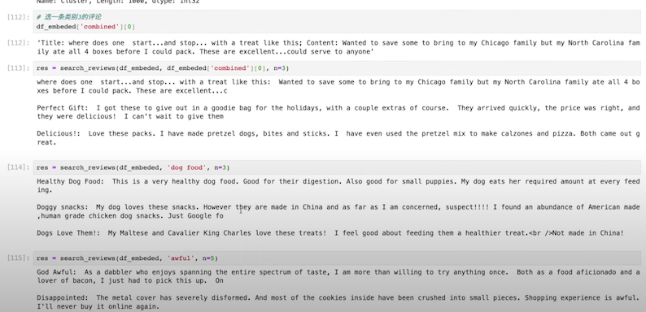

## 大模型实战--Embedding

1、以下哪个观点更接近“图灵测试”的原则？

* A. 人工智能必须具备自我意识。
* **B. 人工智能能够通过模拟人类行为来欺骗人类**。
* C. 人工智能必须能够编写代码。
* D. 人工智能必须能够理解情感。
* 答：B

2、在机器学习中，表示学习的主要目标是什么？

* A. 最小化损失函数
* **B. 寻找数据的最佳表示**
* C. 增加模型的准确性
* D. 避免过拟合
* 答：B

3、Word2Vec 模型主要用于什么任务？

* A. 图像分类
* B. 语音识别
* **C. 单词嵌入学习**
* D. 时间序列预测
* 答：C
* 解释：**Word2Vec是一种流行的词嵌入模型，它的主要任务是学习词向量，这些向量能够捕捉词的语义和语法信息**

4、GloVe 模型是用来做什么的？

* **A. 全局词向量表示学习**
* B. 局部词向量表示学习
* C. 分类任务
* D. 回归任务
* 答：A
* 解释：全称Global Vectors for Word Representation，是一个用于学习全局词向量表示的模型

5、以下哪种方法不属于无监督词嵌入的评估方法？
* A. 直接比较词向量
* B. 使用词向量进行下游任务
* **C. 通过标签预测词向量**
* D. 利用词向量完成类比任务
* 答：C


6、OpenAI Embeddings 主要用于什么？
* A. 处理图像数据
* **B. 提供语言模型预训练**
* C. 对音频数据进行分类
* D. 分析社交媒体数据
* 答：B

7、以下哪个方法不属于词嵌入方法？
* A. Word2Vec
* B. GloVe
* C. FastText
* D. VGG16
* 答：D
* **解释：VGG16 是一种用于处理图像数据的卷积神经网络**

8、词嵌入模型的主要目标是什么？

* A. 最小化预测错误
* **B. 捕捉词义和语法关系**
* C. 提高词汇表的覆盖率
* D. 减少模型的训练时间
* 正确答案：B
* **解释：词嵌入模型的主要目标是捕捉词义和语法关系，通过将词映射到高维空间中，相似的词在空间中的位置会更接近。**


9、在表示学习中，以下哪一种是最常用的表示方式？

* A. 图像
* **B. 词向量**
* C. 音频波形
* D. 视频帧
* 答：B

10、“表示学习”主要是指什么？

* A. 学习数据的原始表示
* **B. 学习数据的有用表示**
* C. 学习数据的随机表示
* D. 学习数据的复杂表示
* 答：B

11、 在 NLP 中，最常用的数据表示方法是什么？

* A. 图像
* B. 视频
* **C. 文本**
* D. 音频
* 答：C

12、 Word2Vec 是一个什么样的模型？

* A. 用于语音识别的模型
* B. 用于图像识别的模型
* **C. 用于词表示学习的模型**
* D. 用于视频处理的模型
* 答：C

13、GloVe 模型的主要目标是什么？

* A. 在给定的文本中找到最频繁出现的词
* B. 在给定的文本中找到最少出现的词
* **C. 在给定的文本中找到相关性最强的词**
* D. 在给定的文本中找到最不相关的词
* 答：C

14、表示学习在自然语言处理中的主要应用是什么？

* A. 语音识别
* **B. 语义理解**
* C. 图像识别
* D. 视频处理
* 答：B

15、 Word2Vec 和 GloVe 有什么共同点？

* A. 都是图像识别模型
* **B. 都是词表示学习模型**
* C. 都是语音识别模型
* D. 都是视频处理模型
* 答：B

16、在 OpenAI Embeddings 中，一般采用什么方法对词进行表示？

* A. 用一个唯一的 ID 表示
* B. 用一个独热向量表示
* **C. 用一个实数向量表示**
* D. 用一个复数向量表示
* 答：C

17、在词向量中，词的相似度通常用什么衡量？

* A. 欧氏距离
* **B. 余弦相似度**
* C. 曼哈顿距离
* D. 切比雪夫距离
* 答：B

18、在表示学习中，为什么要用非监督学习？

* A. 因为监督学习太复杂
* B. 因为监督学习无法处理大数据
* **C. 因为监督学习需要太多的标签数据**
* D. 因为监督学习效果不好
* 答：C

19、在表示学习中，主要使用哪种方法来优化词向量？

* A. 用反向传播优化
* **B. 用随机梯度下降优化**
* C. 用动量法优化
* D. 用牛顿法优化
* 答：B


1、以下哪些是评估词嵌入的常用方法？

* A. 完成类比任务
* B. 用于下游任务
* C. 直接比较词向量
* D. 使用神经网络训练
* **答：A｜B｜C**

2、表示学习的主要目标包括哪些？

* A. 找到数据的最佳表示
* B. 提升模型的预测能力
* C. 降低计算成本
* D. 优化模型参数
* **答：A｜B｜D**

3、以下哪些选项是计算机数据表示的基本单位？

* A. 比特
* B. 字节
* C. 千字节
* D. 兆字节
* 答：A｜B
* 解释：比特是最基本的单位，而字节是常用的存储单位，千字节和兆字节通常用于表示大量数据。

4、Word2Vec 的训练过程主要包括哪些步骤？

* A. 对文本进行分词
* B. 计算词与词之间的关联
* C. 用神经网络学习词嵌入
* D. 调整模型参数以最小化预测错误
* 答：A｜B｜C｜D

5、在表示学习中，以下哪些任务通常会受益于好的表示？

* A. 图像分类
* B. 语音识别
* C. 文本生成
* D. 视频理解
* **答：A｜B｜C｜D**

### 相关名词解释

1、表示学习是什么？表示学习的代表？

答：表示学习就是帮助计算机把原始的、不直观的数据转换成容易处理的形式。
比如，计算机要识别图片中的猫，它不懂图片的内容，只能看到像素点的数字。

而表示学习的任务就是教会计算机如何把这些数字转换成能够描述猫的特征，比如圆圆的脸、
尖尖的耳朵等。这样，计算机在看到新的图片时，就可以利用这些学到的特征来判断是否是猫。
代表如：Embedding、Word2Vec(一种用于学习词向量表示的算法)、自编码器（Autoencoder）等

2、Embedding(嵌入)是什么？举例说明。

答：**Embedding 是表示学习的一种方法。在机器学习和自然语言处理领域，Embedding（嵌入）通常指的是将离散型数据（如单词、词语、类别等）映射到连续型向量空间中的过程。
Word Embedding（词嵌入）、Image Embedding（图像嵌入），将单词或图像映射到向量空间来表示一个物体的方法**。

举个例子，如果我们有一句话“我喜欢机器学习”，Embedding 就会将这个句子转换成一个固定长度的数字向量。这个向量会编码句子中的关键信息，比如“喜欢”、“机器学习”等内容。

3、Word2Vec是什么？举例说明。

答：**Word2Vec是一种用于学习词向量表示的算法**。

它的任务是将这些句子中的每个单词转换成向量。这些向量能够反映单词之间的语义关系，就像把单词映射到向量空间中的某个位置。

举个例子：我们假设Word2Vec把“喜欢”这个单词映射成一个二维向量`[0.5, 0.8]`，而“深度学习”这个单词映射成`[-0.3, 0.6]`，以此类推。

现在，这些向量的有趣之处在于它们捕捉了单词之间的语义关系。例如，两个喜欢某种学习的人（比如“我喜欢机器学习”和“他喜欢深度学习”），它们对应的向量在向量空间中可能会很接近，因为它们的语义相似。

而与学习无关的单词，比如“她热爱自然语言处理”，对应的向量可能会与前面的向量有一定的距离，因为它们在语义上没有那么相似。