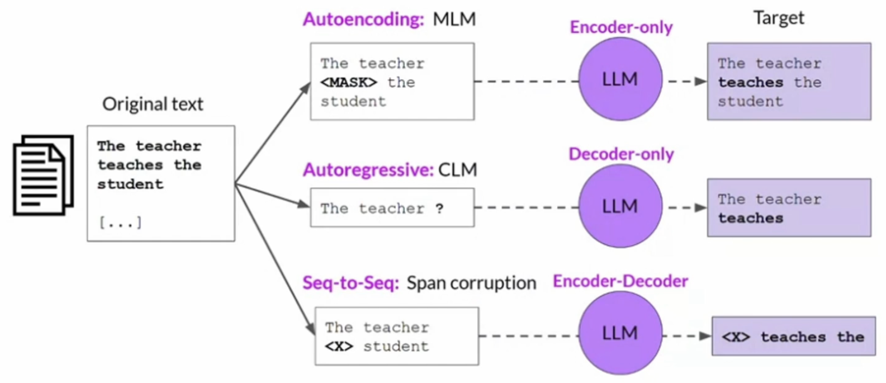
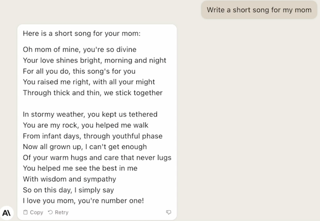
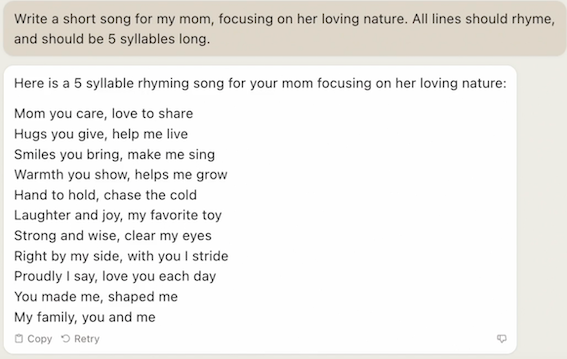
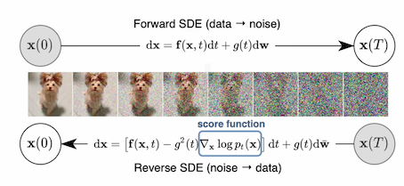
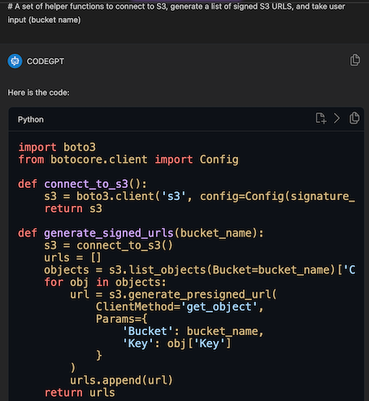
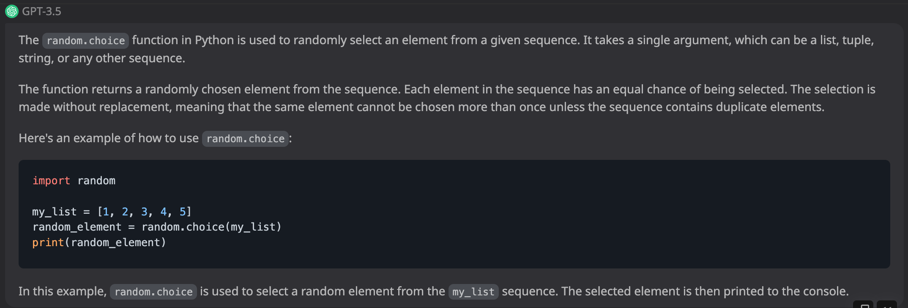
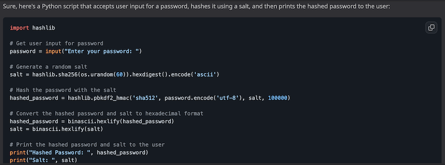
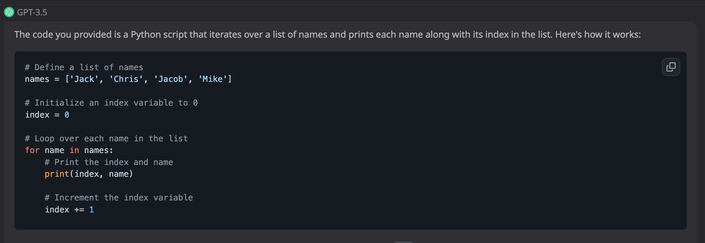
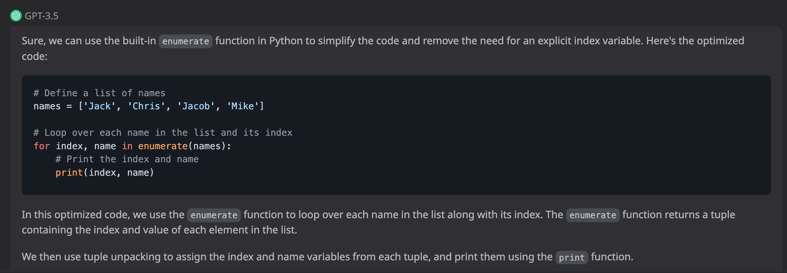
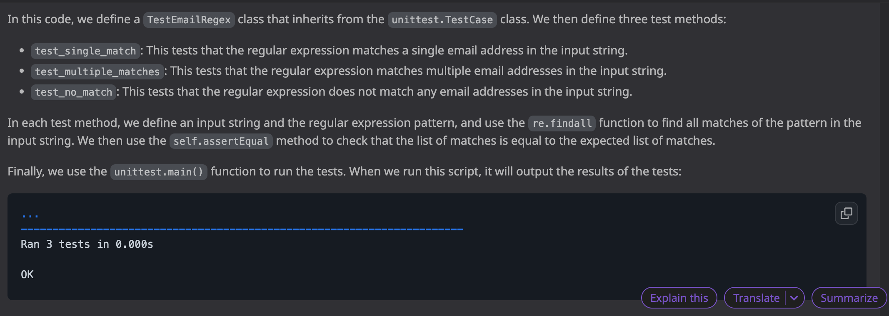

# Prompts & Use ChatGPT as a Powerful Tool for Programming

> The AI will not replace developer, but the developer with AI will replace the developer without without AI

## How do LLMs work?

**Essentially, LLMs are trying to predict missing data.**

Model architectures and pre-training objectives



### How do LLMs work?

Given a **prompt (input)**, the model generates a **completion (output)**


### How do you talk to an LLM?

You pass a prompt to the LLM, and it produces a **completion (a response)**

**Choosing good prompts is critical**

_Vaque prompt:_

> Write a short song for my mom



**Choosing good prompts is critical**

_Detailed prompt_

> Write a short song for my mom, focusing on her loving nature. All lines should rhyme, and should be 5 syllables long.




### Prompt Engineering

Adding **examples** to your prompt can help the model **understand what you want**

**Prompt：**

```
Please fill in the blank to make the lyrics rhyme.

Example:

I'm gettin' busier, can't you tell I got the rhymes that sound so __

Result: well

Example:

The fifth element, never repetitive Highly ___

Result:
```

**Completion:**

competitive


* No examples: "Zero-shot"
* One example: "One-shot"
* Multiple examples: "Few-shot"

### What is Stable Diffusion?

Stable Diffusion is a technique for generating images from a text prompt

**What is "Diffusion"?**

Diffusion means "spreading". Think of a drop of paint in a glass of water: eventually it mixes with the
water completely. 

**What if you could reverse this process?** That's the idea behind Stable Diffusion. The model is trained on progressively more "noisy" trianing images. 

Eventually, the model learns to "work backwards", starting from an image that is pure random noise, and working backwards to a finished image!



**The importance of detailed prompts**

> Prompt:  An old man


**Adding more detail**

We can improve things by adding more details

Component(要素)| Example(样例)
------------- | -------------
Subject  | An old man
Medium  | Oil on canvas
Style	| Portrait
Artist  |  in the style of John Singer Sargent
Website  | (Optional - 可选)
Resolution | Super detailed, fine detail
Super detailed | Natural background
Color  | Vibrant color

An old man, portrait, oil on canvas, in the style of john singer sargent, super detailed, fine detail. natural background, vibrant  color

### What are negative prompts?

We can also add a negative prompt to avoid things we do not want to see in the results

**Negative: White hair, white beard, young, disfigured, ugly, low detail, blurry, dark**


### VSCode Code GPT

[VSCode插件Code GPT](https://github.com/chatanywhere/GPT_API_free/tree/main#vscode%E6%8F%92%E4%BB%B6code-gpt)



```
import boto3
from botocore.client import Config

def connect_to_s3():
    s3 = boto3.client('s3', config=Config(signature_version='s3v4'))
    return s3

def generate_signed_urls(bucket_name):
    s3 = connect_to_s3()
    urls = []
    objects = s3.list_objects(Bucket=bucket_name)['Contents']
    for obj in objects:
        url = s3.generate_presigned_url(
            ClientMethod='get_object',
            Params={
                'Bucket': bucket_name,
                'Key': obj['Key']
            }
        )
        urls.append(url)
    return urls

def get_bucket_name():
    bucket_name = input("Enter the name of the S3 bucket: ")
    return bucket_name
```


The `connect_to_s3()` function creates a connection to S3 using
the `boto3` library. The `generate_signed_urls()` function
takes a bucket name as input, lists all the objects in the bucket, and generates a signed URL for each object. The `get_bucket_name()`
function prompts the user to enter the name of the S3 bucket.

## How to Use ChatGPT as a Powerful Tool for Programming

We will be learning how ChatGPT can: write code from scratch, optimize existing code, explain code we don't understand, convert code between different languages, write unit tests, write comments, help us with starting a new project, and more.

### Sample code 

> **Please write a Python script that loops from 1 to 10 and prints out each number**

GPT-3.5: 


### Language Function analysis

> **what's meaning of random.choice function in python**




### Simple Prompt for GetPassword

> **Write a Python script that accepts user input. This input will be a password. I then want this password to be hashed using a salt. Then print the hashed password to the user.**




```
import hashlib

# Get user input for password
password = input("Enter your password: ")

# Generate a random salt
salt = hashlib.sha256(os.urandom(60)).hexdigest().encode('ascii')

# Hash the password with the salt
hashed_password = hashlib.pbkdf2_hmac('sha512', password.encode('utf-8'), salt, 100000)

# Convert the hashed password and salt to hexadecimal format
hashed_password = binascii.hexlify(hashed_password)
salt = binascii.hexlify(salt)

# Print the hashed password and salt to the user
print("Hashed Password: ", hashed_password)
print("Salt: ", salt)
```


**Improved Prompt**

> **Since the user input is a password, can you make it so that when they type in their input it doesn't show the characters they're typing to the screen?**

Yes, we can use the getpass module in Python to hide the user's input when they type in their password. Here's the modified code:


```
import hashlib
import binascii
import getpass

# Get user input for password
password = getpass.getpass("Enter your password: ")

# Generate a random salt
salt = hashlib.sha256(os.urandom(60)).hexdigest().encode('ascii')

# Hash the password with the salt
hashed_password = hashlib.pbkdf2_hmac('sha512', password.encode('utf-8'), salt, 100000)

# Convert the hashed password and salt to hexadecimal format
hashed_password = binascii.hexlify(hashed_password)
salt = binascii.hexlify(salt)

# Print the hashed password and salt to the user
print("Hashed Password: ", hashed_password)
print("Salt: ", salt)
```


### Code analysis and optimization


```
names = ['Jack', 'Chris', 'Jacob', 'Mike']

index = 0
for name in names:
  print(index, name)
  index += 1
```




> **Please optimize the code I input above**



```
# Define a list of names
names = ['Jack', 'Chris', 'Jacob', 'Mike']

# Loop over each name in the list and its index
for index, name in enumerate(names):
    # Print the index and name
    print(index, name)
```

### Regex Expression Analysis

> **Can you explain what this regular expression does?
[a-zA-ZO-9_.+-]+@[a-zA-ZO-9-]+\.[a-zA-Z0-9-.]+**


> **Can you write a Python script using that regular expression to match email addresses in a string of text?**


```
import re

# Define the regular expression pattern
pattern = r'[a-zA-Z0-9_.+-]+@[a-zA-Z0-9-]+\.[a-zA-Z0-9-.]+'

# Define the input string
text = 'Please contact us at support@example.com for any questions or concerns.'

# Find all email addresses in the input string
matches = re.findall(pattern, text)

# Print the matches
print(matches)

```


> **Can you convert this script to Javascript?**


```
// Define the regular expression pattern
const pattern = /[a-zA-Z0-9_.+-]+@[a-zA-Z0-9-]+\.[a-zA-Z0-9-.]+/g;

// Define the input string
const text = 'Please contact us at support@example.com for any questions or concerns.';

// Find all email addresses in the input string
const matches = text.match(pattern);

// Print the matches
console.log(matches);
```


### Unit Test

> **Write unit tests for the Python version of this code.**


Sure, here are some unit tests for the Python script that uses the regular expression to match email addresses in a string of text:

```
import unittest
import re

class TestEmailRegex(unittest.TestCase):
    def test_single_match(self):
        text = 'Please contact us at support@example.com for any questions or concerns.'
        pattern = r'[a-zA-Z0-9_.+-]+@[a-zA-Z0-9-]+\.[a-zA-Z0-9-.]+'
        matches = re.findall(pattern, text)
        self.assertEqual(matches, ['support@example.com'])

    def test_multiple_matches(self):
        text = 'Please contact us at support@example.com or info@example.com for any questions or concerns.'
        pattern = r'[a-zA-Z0-9_.+-]+@[a-zA-Z0-9-]+\.[a-zA-Z0-9-.]+'
        matches = re.findall(pattern, text)
        self.assertEqual(matches, ['support@example.com', 'info@example.com'])

    def test_no_match(self):
        text = 'Please contact us for any questions or concerns.'
        pattern = r'[a-zA-Z0-9_.+-]+@[a-zA-Z0-9-]+\.[a-zA-Z0-9-.]+'
        matches = re.findall(pattern, text)
        self.assertEqual(matches, [])

if __name__ == '__main__':
    unittest.main()
```



**Split Tests**

> **Can you split those unit tests up?**


`test_single_match.py`

```
import unittest
import re

class TestSingleMatch(unittest.TestCase):
    def test_single_match(self):
        text = 'Please contact us at support@example.com for any questions or concerns.'
        pattern = r'[a-zA-Z0-9_.+-]+@[a-zA-Z0-9-]+\.[a-zA-Z0-9-.]+'
        matches = re.findall(pattern, text)
        self.assertEqual(matches, ['support@example.com'])

if __name__ == '__main__':
    unittest.main()
```


`test_multiple_matches.py`

```
import unittest
import re

class TestMultipleMatches(unittest.TestCase):
    def test_multiple_matches(self):
        text = 'Please contact us at support@example.com or info@example.com for any questions or concerns.'
        pattern = r'[a-zA-Z0-9_.+-]+@[a-zA-Z0-9-]+\.[a-zA-Z0-9-.]+'
        matches = re.findall(pattern, text)
        self.assertEqual(matches, ['support@example.com', 'info@example.com'])

if __name__ == '__main__':
    unittest.main()
```


`test_no_match.py`

```
import unittest
import re

class TestNoMatch(unittest.TestCase):
    def test_no_match(self):
        text = 'Please contact us for any questions or concerns.'
        pattern = r'[a-zA-Z0-9_.+-]+@[a-zA-Z0-9-]+\.[a-zA-Z0-9-.]+'
        matches = re.findall(pattern, text)
        self.assertEqual(matches, [])

if __name__ == '__main__':
    unittest.main()
```


### Code commment & documentation

> **Can you add comments and documentation for that code?**

Sure, here's the Python script with comments and documentation:

```
import unittest
import re

class TestEmailRegex(unittest.TestCase):
    """
    A test suite for the regular expression used to match email addresses in a string of text.
    """

    def test_single_match(self):
        """
        Test that the regular expression matches a single email address in the input string.
        """
        text = 'Please contact us at support@example.com for any questions or concerns.'
        pattern = r'[a-zA-Z0-9_.+-]+@[a-zA-Z0-9-]+\.[a-zA-Z0-9-.]+'
        matches = re.findall(pattern, text)
        self.assertEqual(matches, ['support@example.com'])

    def test_multiple_matches(self):
        """
        Test that the regular expression matches multiple email addresses in the input string.
        """
        text = 'Please contact us at support@example.com or info@example.com for any questions or concerns.'
        pattern = r'[a-zA-Z0-9_.+-]+@[a-zA-Z0-9-]+\.[a-zA-Z0-9-.]+'
        matches = re.findall(pattern, text)
        self.assertEqual(matches, ['support@example.com', 'info@example.com'])

    def test_no_match(self):
        """
        Test that the regular expression does not match any email addresses in the input string.
        """
        text = 'Please contact us for any questions or concerns.'
        pattern = r'[a-zA-Z0-9_.+-]+@[a-zA-Z0-9-]+\.[a-zA-Z0-9-.]+'
        matches = re.findall(pattern, text)
        self.assertEqual(matches, [])

if __name__ == '__main__':
    unittest.main()

```

n this code, we've added comments to each method to describe what it does and what it's testing. We've also added a docstring to the TestEmailRegex class to describe what the test suite is for.

The docstring for the `TestEmailRegex` class is a multi-line string that describes what the test suite is for. It should provide a brief overview of what the tests are testing and any relevant information about the regular expression being tested.

The comments for each method describe what the method is testing and any relevant information about the input string or regular expression being used.

By adding comments and documentation to the code, we can make it easier for other developers to understand what the code does and how to use it.


### Complicate API call


> **Can you write a Python script using the League of Legends API that shows me the percentage of wins for a specific player?**


Sure, here's an example Python script that uses the League of Legends API to calculate the win percentage for a specific player:

```
import requests

# Set up API variables
api_key = 'YOUR_API_KEY'
summoner_name = 'YOUR_SUMMONER_NAME'
region = 'YOUR_REGION'

# Get summoner ID from summoner name
url = f'https://{region}.api.riotgames.com/lol/summoner/v4/summoners/by-name/{summoner_name}?api_key={api_key}'
response = requests.get(url)
summoner_id = response.json()['id']

# Get ranked stats for summoner
url = f'https://{region}.api.riotgames.com/lol/league/v4/entries/by-summoner/{summoner_id}?api_key={api_key}'
response = requests.get(url)
ranked_stats = response.json()

# Calculate win percentage
wins = 0
losses = 0
for stat in ranked_stats:
    if stat['queueType'] == 'RANKED_SOLO_5x5':
        wins = stat['wins']
        losses = stat['losses']
        break

win_percentage = wins / (wins + losses) * 100

# Print win percentage
print(f'{summoner_name} has a {win_percentage:.2f}% win rate in ranked solo queue.')
```


