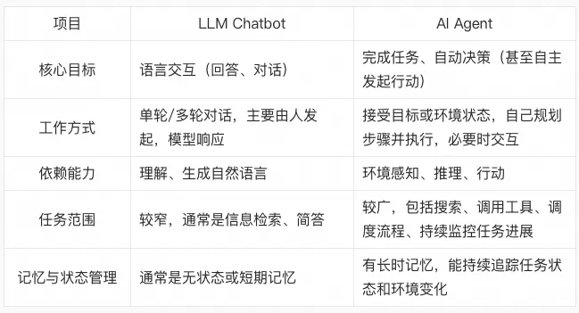
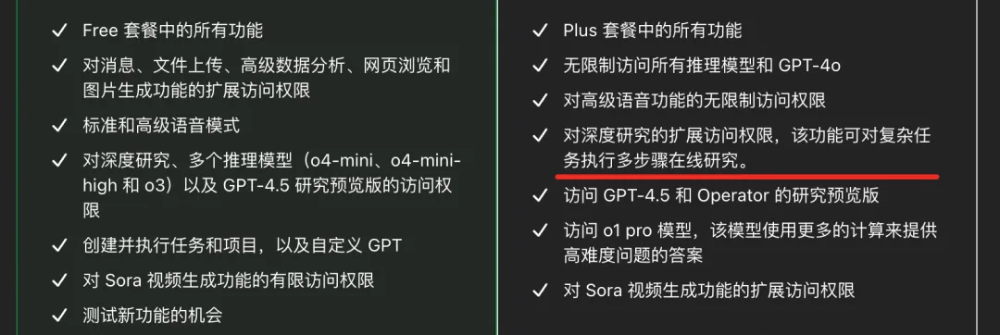
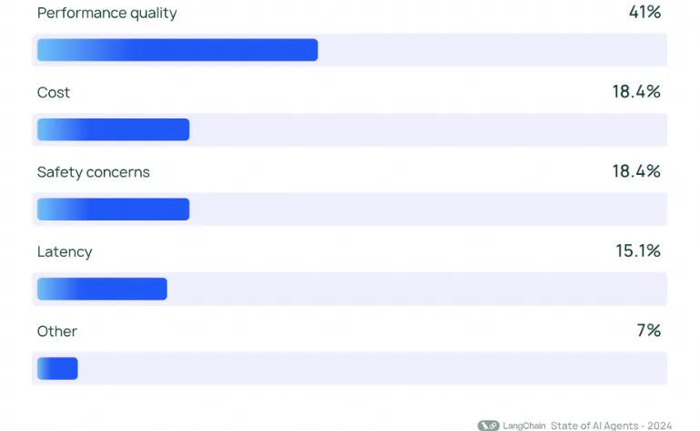
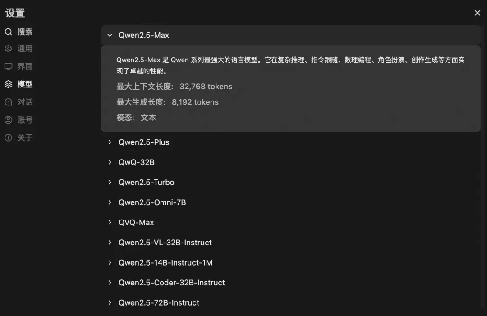
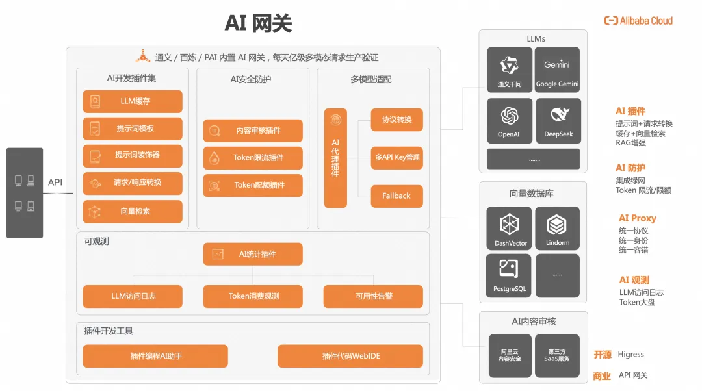
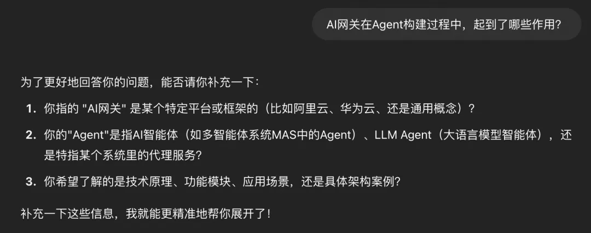
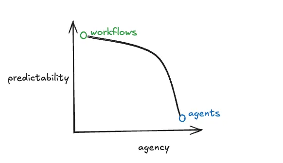

# 0 AI Agent 十问十答

## 1、什么是 AI Agent？

**Agent，中文翻译为代理，顾名思义，代替用户在代理权限内去处理相关事宜。例如我聘请你作为代理律师，那么你将以我的名义进行民事法律行为；再例如我今天休假了，设置同事作为我的代理，去处理审批流等任务**。

而 AI Agent 是指在普通代理的基础上，具备对任务的理解、环境的感知、信息的获取能力，并通过推理能力，自主进行决策和执行。

AI Agent 就是 LLM + 客户端（Chatbot、AI IDE 等）组成的产品，代替我们去自主的完成下达的任务，这里的客户端具备规划、工具使用，甚至记忆的功能，目的都是为了更准确的执行任务

## 2、AI Agent 与传统软件、传统自动化软件有何区别？

传统软件往往依赖用户的明确指令和操作要求，并按照后端系统预设的规则和流程运行，用户须深度参与其中。

**而 AI Agent 借助 LLM 的感知、理解和推理能力，依据任务要求，提取外部知识库（RAG）、联网搜索、借助各种工具和网页、其他软件等进行交互，从而完成代理目标。**

例如，在客服场景，Agent 能像经验丰富的客服人员一样，准确理解客户的问题，迅速从专有知识库中检索相关信息，组织语言，给出恰当且专业的回复，从而独立处理客户咨询、投诉等各类问题。

传统自动化软件虽然也具备依据任务要求，自动对任务进行拆解，并完成目标。例如一些自动化的处理程序，像每天定点发送代金券，定点汇总当日的账单。

但 LLM 驱动的 Agent 可以处理那些传统自动化方法难以应对的复杂任务。例如：

* **需要决策**：根据代码上下文灵活理解意图、自主定位错误、自主规划修复步骤，如代码场景。传统自动化软件只能按规则跑流程，遇到异常或不确定性时无法自主推理和修正。
* **需要连续推理与多步计划**：自动完成有逻辑连贯性的复杂任务，例如撰写长篇技术报告场景。传统自动化软件最多能模板化填充内容，无法根据目标动态规划章节结构、铺设推理链条、前后自洽。
* **需要跨系统自主整合数据**：在多个ERP、CRM、财务系统之间自动生成综合运营报告。传统 RPA（机器人流程自动化）只能定向拉取数据，无法理解数据之间的隐含关联或异常。
* **需要处理模糊、不完整输入**：用户只给出一句含糊需求（如“帮我优化一下销售流程”），系统理解后完成多步落地执行，传统自动化软件需要结构化清晰指令，无法理解模糊自然语言并自主澄清、细化、规划。
* **需要自主学习和演化**：持续优化任务，进行自我纠错。传统自动化工具需要人为设定优化规则，无法根据实际结果自我改进。

简单来讲，AI Agent 是自动化+智能，这就解释了 AI Agent 出现前，已经通过自动化能做的事，AI Agent 能带来哪些变化。

## 3、Chatbot 为何都在向 AI Agent 演进

早期，OpenAI 等基模公司提供的都是"能说会道"的 Chatbot，但几乎大家都开始往"真知实干"的 AI Agent 演进。两者的区别，我们先来汇总一张基础表格。

### 从答疑到连接物理世界

**LLM Chatbot 本质是概率驱动的文本生成器，通过海量语料的训练掌握语言模式，就像一位博闻强记的图书管理员，能复述书中的知识，却因为缺乏对真实世界的理解和调度能力，难以自主决策和行动。**

此后，OpenAI 发布了 Function Call 和 Operator，是技术上向 AI Agent 的探索，而 Devin 和 Manus 则是第一次把 AI Agent 以产品的形态呈现给公众，让大家感受到 AI Agent 到底长什么样，能做些什么。

OpenAI Pro已经提供深度研究的扩展能力。

QWen 即将推出 MCP 插件。

国产 Chatbot 开源客户端四小龙，Cherry Studio、DeepChat、LobeChat 等，也都正在开发对 MCP 的支持。（Higress 提供了 MCP 市场，支持客户端快速提供 MCP 能力，https://mcp.higress.ai/）

抽象来讲，能力边界是 Chatbot 与 AI Agent 的本质差异。Chatbot 向 AI Agent 演进，是技术驱动和市场需求的必然。

###  技术驱动因素

**LLM 能力本身提升了**

部分大语言模型已经可以做复杂推理、链式思考（Chain of Thought），不仅能回答，还能自己拆解问题。

单纯的对话，已经无法充分利用大模型的推理和行动潜力。

**多工具协作（Tool Use）的成熟**

* Agent 可以调用插件、API、浏览器、代码解释器等外部工具，不再只是单一语言生成。
* Chatbot 如果只靠纯语言，很难完成复杂任务（比如订一张机票，需要多步操作）。

**长期记忆和自主性能力发展**

* 记忆机制让 Agent 能记住用户习惯、历史任务，自动优化策略。
* 自主性支持 Agent 根据反馈调整自身行为，不需要用户的每一步指令。

规划和推理模块的成熟：早期 LLM 只能“回答”，而现在已经可以“先思考计划”，再执行，更像人类的助理。

### 市场/需求驱动因素

用户对效率和自动化的要求更高：企业、个人用户都希望AI可以代替人去做琐碎、复杂的连续任务，而不是每次提问每次回答。

商业模式扩展需求：仅靠 Chatbot 很难延续收费模式，而基于 Agent 的服务能拓展出 SaaS、B2B 集成、专属 Agent 市场。

竞争环境变化：几乎所有的一线基模厂商都在发展 AI Agent，以及还有 Manus、AI 编程都在做 AI Agent，预计今年 Q3 会出现很多垂直领域的 AI Agent。

## 四、AI Agent 由哪些组件构成？ 

AI Agent 的构成尚无统一的标准。

Anthropic 认为是大模型基于环境反馈去使用工具的一套程序，并区分了 Workflow（LLM 和工具通过预定义代码路径编排）和 Agent（LLM 动态控制流程和工具使用），且多数生产中的 “智能体系统” 是两者的结合。因此他有以下三个核心要素：

模型（Model）：Agent 的“大脑”，是基座、是引擎。
环境反馈（Context）：定义了模型执行任务时，要用到的信息的总和，包括通过 Tool 拿到的信息、用户输入的信息等等。
工具（Tool）：Agent 的“手脚”，通过所依赖的外部函数或 API（应用程序接口），与外部系统进行交互，获取信息并执行操作。技术实现方式有 OpenAI 的 Function Calling、Computer Use，以及 Antronic 发起的 MCP 通信协议。Google 发起的 A2A，则是 Agent 和 Agent 之间交互的通信协议。
OpenAI 则是定义为模型、工具和指令，弱化了环境反馈（Context），将其下沉到模型层，使命是让 Agent 产品化，例如 OpenAI 最新发布的 o3 已经内置了很多 tools 的能力。

指令（Instruction）：是指 Agent 的行为准则，有了指令，就能唤醒 Agent。高质量的指令技巧能够减少歧义，提高智能代理的执行效果，而高质量的提示词工程能够提升 Agent 对指令的理解准确度。前者是面向结果，后者是面向过程。如果您对 Instruction 理解依旧不清晰，请参考下方的代码样例。
Image
和 Anthropic 定义的区别是，OpenAI 对外部应用程序的调用和调用效果的优化，即 if/else 的判断，下沉到了模型层，由模型来内化，而非编排层来实现。OpenAI 越来越往上，模型定义一切，Anthropic 越来越往外，生态成就一切。

## 五、AI Agent 的工作原理？

AI Agent 的工作原理可以从**感知、认知&推理&决策、行动、反馈和学习**，4个关键过程来解释。

### 感知阶段

这是唤醒 AI Agent 的第一步，感知内容分为。

* 来自物理世界的信息：包括来自客户端的任务，自然语言、代码、多模态等，以及通过传感器、摄像头、麦克风硬件设备的传感信息。
* 来自虚拟环境的信息：从数据库、外部 API 接口等收集到的信息。

### 认知&推理&决策阶段

一旦 AI Agent 感知到环境信息，依赖深度学习、强化学习带来的训练结果，对这些信息进行识别与分析，以便作出明智的决策。这个过程中，会借助 RAG、联网搜索、外部应用和系统调用。

这一阶段是 AI Agent 行为的核心，直接决定了后续行动的有效性。但由于深度学习、强化学习的模型，依旧缺乏完全的可解释性，是输出结果不确定性的主要原因之一。

对于复杂任务，决策并不是一个结果，而是需要经历和环境感知、认知和推理之间反复交互的过程。因此还会受到提示词工程的影响，例如我们在《Promt Engineering》分享的输出长度、top-K 和 top-P 、Temprature 等参数，都会影响到最终的决策结果。

### 行动阶段

最终，AI Agent 根据其决策采取行动。这一阶段的目标是执行之前所做的决策，并进行输出，例如一个模型、一份计划书、甚至是一个物理界的执行动作（如自动驾驶中的车辆控制、机器人执行任务、下单等）。

### 反馈与学习

AI Agent 的能力不仅仅停留在执行阶段，它还会不断地根据执行结果进行反馈，并在每次任务后学习，例如 Monica 提供了记忆功能，通过学习，AI Agent 能够逐渐优化自身的决策过程和行动策略。这一过程通常使用强化学习或其他在线学习技术来实现。

## 6、如何提升 AI Agent 的输出效果？

从 LangChain 的调研来看，41% 的受访者认为性能质量是构建可靠智能体系统的最大限制。

性能质量表现不佳常因模型不够好或传递了错误（或不完整）的上下文，后者更加常见，包括不完整或简短的系统消息、模糊的用户输入、无法访问正确的工具、工具描述不佳、未传递正确的上下文、工具响应格式不佳等。

因此提升 AI Agent 的输出效果，关键也在于模型质量和环境反馈（Context），我们将环境反馈拆解成工具和指令来展开描述。

### 模型类型和质量

**不同模型在任务复杂性、性能和成本方面具有不同的优势和权衡**。

即便是同一个厂商，也会区分推理类模型、复杂任务类模型、多模态模型。我们应根据任务类型选择更适合的模型。下图是 Qwen 官网对主流模型的比对表。

不同厂商相同类型的模型，输出效果也不一样，并且是动态变化的。就好像你的学生，每次拿第一的不会永远是同一个人，不同科目的，也会有不同的排名。

人类竞技有单场胜负，更有 N 连冠。但是人工智能遍布生活中的每一个场景，不是单次结果论英雄的竞技场。因此在供应链视角，企业通常会采用多模型策略，通过 AI 网关在后端对接多个模型，**一是为了提供更加丰富且对口的输出结果，供用户使用；二是满足鉴权、安全防护、限流、可观测、审计等方面的企业级需求**。

### 工具

工具是指 AI Agent 使用外部应用程序或系统的 API 来扩展代理边界的功能。例如 LLM Chatbot 在处理复杂的科学和数学问题时，“幻觉”会被放大。此时，AI Agent 集成 Wolfram Alpha 的 Server，能够准确地执行计算任务，避免因模型自身的局限性而导致的错误。与大语言模型相比，Wolfram Alpha 基于广泛的数学和科学知识库，在处理复杂的数学公式、物理定律和科学概念时，能够进行精确的计算、符号操作和公式推导

工具是指 AI Agent 使用外部应用程序或系统的 API 来扩展代理边界的功能。例如 LLM Chatbot 在处理复杂的科学和数学问题时，“幻觉”会被放大。此时，AI Agent 集成 Wolfram Alpha 的 Server，能够准确地执行计算任务，避免因模型自身的局限性而导致的错误。与大语言模型相比，Wolfram Alpha 基于广泛的数学和科学知识库，在处理复杂的数学公式、物理定律和科学概念时，能够进行精确的计算、符号操作和公式推导。

目前主流的技术实现方式是 MCP 和 Function Call，Function Call 是最早提出的，MCP 是在此基础之上做了协议的标准化。另外，OpenAI 今年1月推出 Operator 的形式 （截屏，以视觉方式读取浏览器的页面信息）来和外部页面进行交互，通过视觉算法模拟用户操作来访问网页信息。优势是 token 消耗少，即便没有 API 接口，也可以进行交互，且更容易适应不同的网站设计和布局变化。但由于客户端实现成本高，视觉算法导致的出错率不可控，服务端没有参与感等原因，并未像 MCP 那样形成广泛共识。 这算是两个技术流派，MCP 和 Function Call 是工程派，Operator 是算法派。

对大部分用户而言，并不会太关注工具背后的技术实现方式，更关注的是工具的添加，别给原本就容易产生幻觉的大模型新增烦恼。其次是信任感，例如 DeepSeek 首次将深度思考的过程呈现给用户时，这对 Chatbot 的体验而言，获得了大幅提升，随后各家都相继推出深度思考的功能。AI Agent 也是类似。MCP 和 Function Call 在用户端呈现的是，Agent 调用 MCP tool 的过程，是代码语言，而 Operator 呈现的是用户语言，例如在 Manus 里，会展示他在页面浏览器的操作过程。后者因为更透明，给用户带来更多的信任感。

另外，从供应端来看，工具虽然拓展了 AI Agent 的想象空间，但也带了一些难题：

* 信息对齐难：LLM 读取 MCP Server 的信息时，就像让两个哲学家用摩斯密码聊黑格尔，调试得当神配合，搞错了那就是哲学灾难。因此，构建 MCP Server，少不了和大模型联调的过程。
* 协议开销大：相比 Chatbot，AI Agent 的上下文记忆链条、任务步骤更多，实时任务秒变“慢动作回放”，单个任务可能耗时半小时。

**这也催生了 MCP as a Service，例如 MCP Marketplace，帮你找到干净好用、无须调优的 Server，通过网关的权限和标签能力来控制工具的使用范围；**

当工具数量的增加，使用 MCP Registry 来解决工具在批量生效、调试、历史版本管理灰度、健康检查的需求。以及 AutoMCP，让模型通过反复试验来学习工具的使用方法，而不只是通过提示工程来优化工具的调用效果。

### 指令

指令分为两类，一类是终端用户提问时的提示词技巧，一类是开发者侧训练大模型用的提示词工程。但无论是哪一种，以下4个可以看作是改善输出结果的原则。

利用现有文档：将现有的操作流程或政策文件转换为智能代理可以理解的指令。

* 终端用户：上传报告、图片，让大模型提取其中内容进行二次加工。
* 开发者：只要是涉及医疗领域的任务，一律自动追加‘答案仅供参考，请咨询专业医生”。

**分解任务：将复杂的任务分解为更小、更清晰的步骤，减少歧义**。

* 终端用户：根据提示词，让大模型输出一篇报告，改为按章节、段落来输出。
* 开发者：将分解用户的任务进分解成计算机语言可以描述和执行的步骤，并针对多选答案和用户完成核实后再执行下一步。

定义明确的行动：确保每个步骤都有具体的行动或输出，避免模糊不清的指令。

* 终端用户：将自己的任务尽可能拆解成计算机能理解的描述，而非即便自然语言也会出现理解偏差的任务或指令。
* 开发者：通过自然语言理解（NLU）将指令拆解成可以精确计算的步骤。

考虑边缘情况：提前规划如何处理用户提供的不完整信息或意外问题。出现问题时能自主纠错，在遇到故障时还可暂停执行并将控制权交回用户。

作为用户，如果编写指令有困难，可以将你觉得满意的任务结果，例如一篇论文、一张图片，喂给模型，由他来生成指令，这是设计指令的有效技巧。同时，指令要常用，内化成习惯，才能更高效的使用 Agent，这就像大部分企业管理者每天早上到公司都会先打开数据系统了解过去1天的业务数据，这时候，“打开数据系统”就是一则对人脑的指令。

指令也正在内化为大模型的能力，通过对话引导的方式来帮助用户将自己的任务描述的更加清楚，因为很多情况下，我们对大模型的输出效果不满意，不是其不够智能，而是我们没有将任务描述、分解的足够明确。来看一个例子。

当我提问：AI 网关在 Agent 构建过程中，起到了哪些作用？显然这个任务描述的不够明确。于是，大模型给出了描述更加明确的方式，如下。

## 7、如何定义 Workflow、Agent、Agentic 的联系和区别？

从第7问开始，之所以会转到 Workflow，是因为当下讨论较多的“ Workflow 是否会被 LLM 颠覆”这个问题，是一个典型的 LLM 侵蚀工程化、产品化的案例，很多人在工程、产品上做了大量的原创设计和调优工作，某一天却被 LLM 直接接管了。而 Workflow 更加特别，由于他的功能和定位，影响到的群体更大。

**Workflow，即工作流，常见于应用编排框架中，是将任务依据特定业务逻辑有序排列的流程，以实现业务流程自动化处理。任务之间有清晰的依赖关系和流转规则，每个任务都有明确的输入、输出和执行逻辑。定义他的是人，优点是确定性足够强，不太会出错，短板是不够泛化。而 LLM 是足够泛化，但确定性不够**。

从语义上看，Agent 是一个名词， Agentic 是一个形容词，前者是以二元的方式来判断某个东西是否是智能体，后者则是更倾向于讨论一个系统的智能体程度。讨论 Agent 的时候，很容易进入将是否使用了 Workflow 来判断这是否一个 AI Agent，尤其是在 Workflow 中了定义了大量的 if/else 逻辑，减弱了大语言模型控制力的时候。讨论 Agentic 的时候，关注的是判断流程是否进入下一步、判断流程是否最终完成、判断是否出现问题、判断出现问题后是否把控制权限交给用户等流程节点时，是由 Workflow 来控制，还是有 LLM 来控制。LLM 控制越多，智能程度越高，反之越低。

现阶段，很多 AI Agent 都存在 Workflow 和 LLM 结合的情况。结合的方式包括：

LLM 赋能 Workflow：在工作流的各个任务环节中，嵌入大模型能力。例如在内容创作工作流里，在素材收集阶段，大模型可对海量的文本、图像等素材进行智能筛选和分类，快速定位符合需求的资源；在创作环节，利用大模型生成初步内容框架或文案，像新媒体文章创作，大模型能依据主题生成文章大纲和部分段落内容，创作者在此基础上优化完善，提升创作效率。
Workflow 驱动 LLM 交互：以工作流的流程逻辑来引导大模型的交互过程。比如在智能客服工作流中，当用户咨询问题时，工作流先对问题进行初步分类，然后根据分类结果调用大模型进行针对性回答。若问题涉及产品使用方法，工作流将问题精准传递给已在产品知识上微调的大模型，获取准确答案后返回给用户，确保回答的专业性和高效性。

## 8、Workflow 和 LLM 如何选择？

首先澄清下，这个标题并不是引导二选一。如第7个 Q&A 所说，大多数实际生产中，AI Agent 的任务处理逻辑设计，是 Workflow 和 LLM 的组合。之所以业内有这样的争论，也许是因为 LLM 派信仰的是智能本身，可以通过指令来提升智能的确定性（参考第6个 Q&A 中的对话案例），Workflow 派信仰的是智能无法覆盖所有场景，必然有场景需要通过 Workflow 来精确决定数据的流动方式。

《How to think about agent frameworks》给出了一个采用 Workflow 和 LLM 的权衡方式。

**图中使用的是 workflow vs. agents，为区别 AI Agent，本文改为 workflow vs. LLM 来描述**

* 低门槛：低门槛框架对初学者友好，容易上手。但自由度会下降，尤其是要去满足复杂的业务需求的情况下。
* 高门槛：高门槛框架意味着学习曲线陡峭，需要具备大量知识或专业技能才能有效使用，但更适用于解决复杂的业务场景。
* 低上限：低上限框架指的是其在所能完成的任务上存在限制。
* 高上限：高上限框架为高级用例提供广泛的功能和灵活性。

* Workflow：上限高，门槛高，你必须自己编写大量的智能体逻辑。
* LLM：门槛低，上限也低，容易上手，但对于复杂用例来说不够用。

以上来自 Langchain 的观点，信仰 LLM 的人一定不认可“ LLM 是门槛低，上限也低，容易上手，但对于复杂用例来说不够用”的论断，随着 LLM 更加智能，并通过对话的方式帮助用户来完善指令，并借助画布等产品交互方式，降低指令的优化难度。完善的内容包括任务的描述完整度和准确度，任务的拆解，每一步骤和用户进行确认，从而减少甚至避免单个步骤90%准确率，10个步骤准确率陡降为90%的10次方的情况。

以这种方式来提升 LLM 在复杂用例的表现。本质上，这是两种技术/产品流派的碰撞。

## 9、什么是 Single-Agent System和 Multi-Agent System？

**Single - Agent System（单智能体系统）：指在一个系统中仅存在单个智能体，该智能体独立完成任务，其决策和行动仅基于自身的感知、知识与能力，不与其他智能体协作或交互。Multi - Agent System（多智能体系统）：由多个智能体组成，这些智能体相互协作、交互，共同完成复杂任务。各智能体具有自主性，可独立做出决策，但通过信息共享、协作等方式实现共同目标**。

预计今年 Q3 会上线很多垂直领域的单智能体系统，例如专注于做表格的，专注于做报告的，专注于做旅行计划的，并逐步呈现互联网 APP 的繁荣景象。这些垂直领域的单智能体系统，将成为未来多智能体系统的协作基础。

对于多智能体系统，理论上可以为经理模式和去中心化模式。经理模式下，存在一个中心 “经理” 代理，它以调用工具的方式协调多个专业代理。“经理” 代理负责将任务分配给合适的专业代理，并整合最终结果，提供统一的用户体验，适用于希望由一个代理掌控工作流程并与用户交互的场景。去中心化模式中，多个代理地位平等，可相互移交任务执行权。当一个代理调用移交函数，新代理立即开始执行并接收最新对话状态。

## 10、为什么需要多智能体系统？

抛开技术因素，会有两个截然不同的观点。

正方：模型越强大，所有 AI Agent 都有可能被“模型即产品”所替代，不需要多智能体系统。

反方：模型再智能，也无法主动甄别所有环境感知（Context），每个细分领域的 Agent，调研类 Agent、Coding Agent、表格 Agent，都需要花大量的时间，少则半年多则一年，去设计环境感知（Context），减少模型幻觉，Agent 会像互联网 APP 那样百家齐放，而不是一家独大。

这个需要时间来证明。单只从技术视角看，多智能体系统是必要的。

### 复杂性管理

随着业务规模和复杂度的提升，单体架构会变得庞大且难以维护，牵一发而动全身，就像大型工厂扩展业务后，内部管理混乱，效率降低。而微服务将业务拆分成多个独立的小服务，每个服务专注于单一功能，降低了系统复杂度。

对于多智能体系统，将复杂任务分解给多个智能体。每个智能体负责特定任务，各自独立运行和决策。以及维护迭代，既利于对每个智能体进行独立调试和迭代，也利于任务的分解，提高了系统的可管理性。例如撰写一篇报告，将任务分别布置给梳理整体报告逻辑的智能体、收集和归类信息的智能体、绘制图表的智能体，每个智能体均有自己的特长。这种设计也是延续了人类社会的分工，一份报告需要有策划、编辑、拍版、设计师等通力协作完成。

### 灵活性和可扩展性

单体架构在扩展新功能或修改现有功能时，往往需要对整个系统进行调整，成本高且风险大，如同在大型工厂里改变生产流程，需要停产并大规模改造。微服务架构则允许独立扩展和修改单个服务，灵活性和扩展性强。

对于多智能体系统，新增或修改一个智能体的功能，不会对其他智能体造成太大影响，还可以根据任务需求灵活增加或减少智能体，提高系统应对变化的能力。用户甚至可以对智能体进行排列组合，例如若发现绘制图表的智能体不够优秀，可以使用另一款多模态智能体。

### 资源成本优化和并行处理

微服务架构中每个服务可以根据自身需求分配资源，实现资源的优化利用，并且不同服务可以并行处理任务，提高整体效率。

如果所有任务都指派给同一个性能最强的智能体，资源消耗大。采用多智能体系统，每个智能体系统因为只擅长各自领域的任务，参数更小，能显著降低资源消耗。另外，每个智能体可以根据自身任务需求分配计算资源、时间等，而且多个智能体可以同时处理不同任务，实现并行处理。

### 容错性和可靠性

单体架构一旦出现故障，整个系统可能会瘫痪；微服务架构中某个服务出现问题，其他服务可以继续运行，通过服务的冗余和容错机制提高系统的可靠性。

对于多智能体系统，某个智能体出现故障，其他智能体可以继续工作，通过智能体之间的协作和备份机制，确保系统整体的稳定性和可靠性 。
