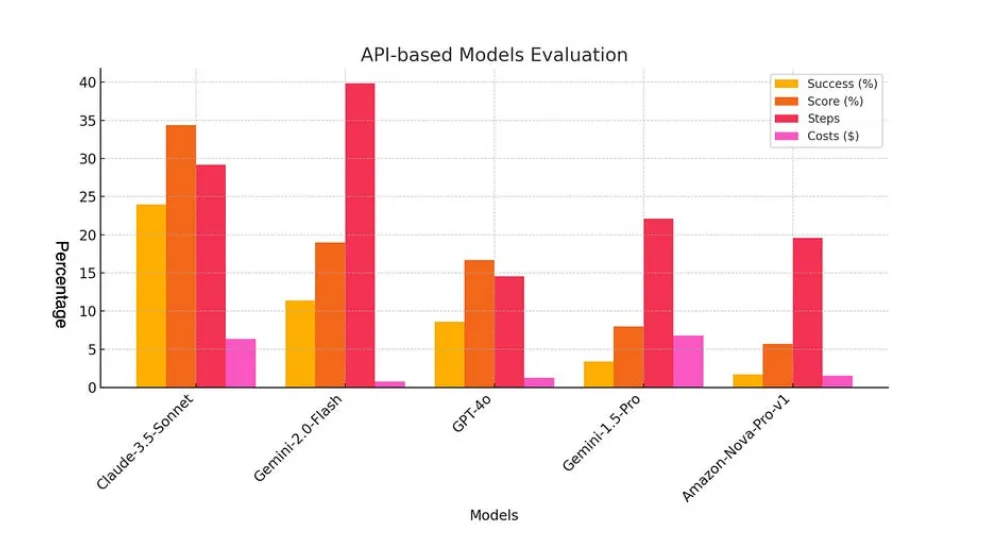
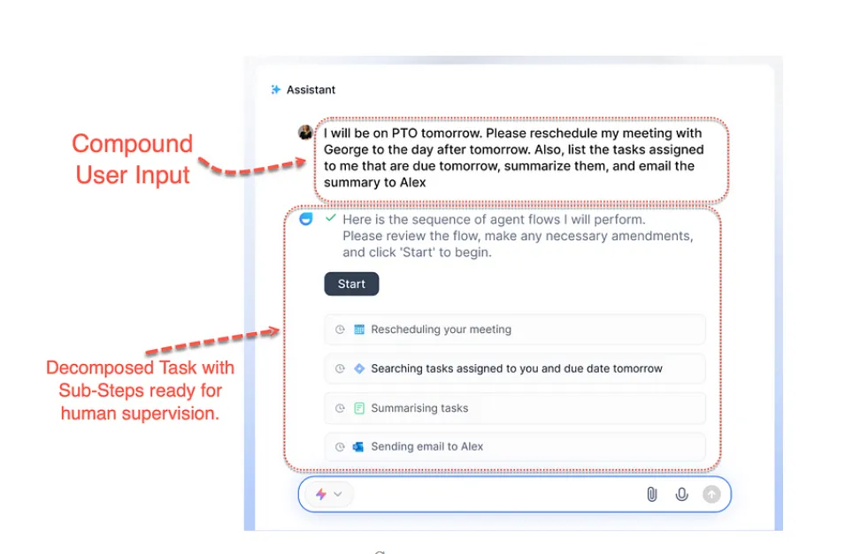
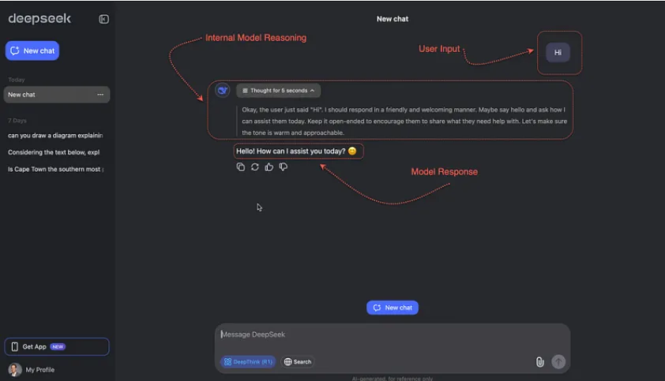

# 5 为什么行业焦点从AI Agents转向Agentic Workflows？

我们正身处一场AI技术大变革中：从大语言模型（LLMs）的诞生，到具备类人交互能力的AI智能体（AI Agents）的崛起，技术浪潮不断向前奔涌。

但在商业落地层面，行业焦点已悄然从单一AI智能体转向更复杂的代理工作流（Agentic Workflows）。这种转变看似微妙，实则是技术演进的必然结果。本文将结合相关技术逻辑，解读这一趋势背后的深层原因。

## 为何行业焦点暂时从AI Agent转移 ？

尽管Salesforce、ServiceNow等巨头曾全力押注AI智能体（AI Agents），但一个残酷的现实正迫使行业转向：现有AI智能体的准确性远未达到商用要求。

**若抛开营销噱头与精美的Demo演示，当前AI智能体的实际成功率仍难以支撑生产级应用——以Claude AI Agent的计算机接口（ACI）为例，其性能仅为人类水平的14%。**

下图来自TheAgentFactory的研究数据，清晰地揭示了AI 智能体在成本、步骤复杂度与成功率间的情况：当前平均成功率仅约20%。这些数字就是当前严峻的现实。

随着OpenAI近期发布其OpenAI Operator组件，AI智能体在计算机操作与网页浏览任务中的准确率已从30%提升至50%，但这一数字仍显著落后于人类70%以上的基线。

更值得警惕的是，研究发现：搭载网页浏览功能的AI智能体极易遭受恶意弹窗攻击，暴露出安全隐患。

当前，AI智能体模拟人类操作主要通过两种技术路径实现：

- 一种是通过网络浏览器（Webvoyager、OpenAI Operator 等）。

- 第二种是通过操作系统的图形化用户界面实现（Anthropic）。

这两种方案的核心逻辑都是将图形化界面转化为API。早期技术曾尝试直接对接各类应用独立API，但因API开发成本过高（需为每个系统定制接口）且商业软件普遍缺乏开放API，这一路线已被主流弃用。

## 为何转向Agentic Workflows?

业界共识已逐渐清晰：现代知识型工作正深陷系统性低效困境。**数据显示，员工平均30%的工作时间耗费在信息检索中，而面对需要跨文档整合信息的复杂问题时，效率断层更为明显**。

代理工作流（Agentic Workflows）的价值正在于此——如下图示，它通过任务推理→拆解→链式执行的机制，将复杂问题拆分为可管理的子任务流，实现系统性提效。

通过代理工作流的链式执行，三个关键能力被注入系统：**可观测性、可审查性与可溯源性**。

这一过程中，数据合成（Data Synthesis）的价值愈发凸显——例如，**面向知识工作者的代理工作流能够将分散的文档、数据与工具整合为一站式决策答案**。

语言模型提供商正在从仅提供模型本身转向提供用户体验。ChatGPT 中的 Deep Research并不是一种新模型，而是 **ChatGPT 中的一种新代理能力，可在互联网上针对复杂任务进行多步骤研究。它能在数十分钟内完成人类需要数小时才能完成的任务**。

这也是一个很好的例子，侧面说明如何综合不同来源的数据来回答用户的问题。这种为特定个体在特定时刻生成定制化数据的理念，或许正是LlamaIndex提出Agentic RAG（代理增强检索）概念的核心思想。

## 推理与解决问题

现代人工智能模型越来越多地将推理作为一项核心功能，通过将复杂问题分解为易于管理的组件，使它们能够解决复杂问题

这种转变的基础是一种创新的方法，即把问题分解成更小的子集，使模型能够系统地解决每个子问题。

通过将推理作为一种内部机制，这些模型可以模拟类似人类的思维过程，从而增强其提供准确而细致的反应的能力。分解策略不仅能提高解决问题的效率，还能提高得出结论的透明度。

因此，用户可以从更易于解释的输出结果中获益，缩小了高级计算与易于理解的决策之间的差距。

早期用户需在提示词中手动植入推理特征——**例如明确要求模型“分三步分析问题”或提供任务拆解示例（Few-shot Learning），才能引导AI完成复杂任务。这种“手把手教做题”的模式，本质上仍是人类思维模式的机械复刻**。