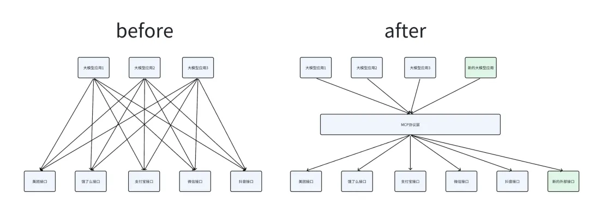

# 1 MCP 介绍

## 1 What


1. 大模型的能力边界是什么？
2. 在 MCP 之前，大模型应用是什么样的？
3. MCP 解决了什么问题？


**模型上下文协议（Model Context Protocol，简称 MCP） 是一种全新的开放协议，专门用于标准化地为大语言模型（LLMs）提供应用场景和数据背景。**

> 你可以把 MCP 想象成 AI 领域的“USB-C 接口”，它能让不同的 AI 模型与外部工具和数据源轻松连接。

### MCP 是干啥的

**大模型的能力**

我们都知道，大模型能做很多事：

- 最基础的是给你解答问题、做 oncall 机器人。
- 现在大模型已经可以联网搜索并给你最新的答案了。
- 大家用过的 Trae 还可以帮大家写代码，只需要说句话，就能帮你把代码写好，同时还能应用到文件中，不需要你自己复制粘贴。
- 前一阵子很火的 Manus，可以帮大家搭建网站，可以当场写代码 debug、运行代码爬取网上信息

前一阵子很火的 Manus，可以帮大家搭建网站，可以当场写代码 debug、运行代码爬取网上信息

> 模型本质上只是一个输入输出流，你给他输入，他给你输出。我们接触最多的就是文字输入输出了。其他也有多模态的输入输出，比如图像、语音、视频。

所以最原始的大模型是不知道周围环境的，也无法知道最新发生的新闻。比如问问 DeepSeek：现在几点了？他很可能无法给出正确的回答。


看起来很傻，我都知道答案了，还用问大模型吗？

那如果前半句话是程序员帮你加上去的，你只需要问后半句呢？**对于不知情的黑盒用户来说，是不是感觉大模型具备了实时获取最新时间的能力了**。

至此，我们对大模型的能力边界有了个简单的认识：大模型是个无状态的大模型，是个无状态的参数集合体。他所有的输出，都来自于自身训练的信息（老数据），以及输入时提供的信息（临时数据）。

为了让大模型能感知到环境，我们需要在临时信息中加入足够多的环境信息，不管这个环境信息是由程序员在黑盒里加上的，还是由用户自己加上的。总之，大模型不是神仙，没给到的信息，他就是不知道。

**让大模型自己探索环境**

上文用一个看起来很傻的例子说明了：必须让大模型知道环境信息，才能根据环境信息得出真实答案。

那么，我们是否可以让大模型自己探索环境。比如我们编写一个 Python 函数，用于获取本地时间：

```
async def local_time() -> str:
    """Get the local time of the machine."""
    import datetime
    return datetime.datetime.now().strftime("%Y-%m-%d %H:%M:%S")
```

再将大模型包装一层，将信息流改进一下：


在改进后的工作流中，工程包装帮用户完善了环境信息，甚至在用户不知情的情况下，与大模型多进行了一次调用。其中红色块，是工程包装层调用了 `local_time` 函数，并将输出拼贴为输入。上述均为简化版。

经过上述的改造，大模型看起来似乎已经有了自己探索环境的能力了。当然没有，这句话应该说：大模型应用有了自己探索环境的能力了。大模型与大模型应用是有区别的，大模型就是指算法模型，大模型应用才是用户端接触到的东西。

**拓展一下**

那么大模型应用的联网是如何实现的？类似的，也是由上述过程实现的，由一个工程包装层，将用户请求包装起来，有一个联网的函数，允许大模型进行调用。对于复杂的函数，由大模型生成结构化的入参。

上述就是大模型的 `function_call` 能力，大模型会根据上下文给出调用外界函数的入参。对于那些复杂的大模型应用，无非是它们工程嵌入的外界函数比较丰富，能做更多的事。

### 这与 MCP 什么关系

MCP 全程 Model Context Protocol，模型上下文协议，其实就是提供了一个通用的工程包装方案。

比如上文中的这个部分，不同大模型应用的 prompt 不同：

```
系统设定：你有一个函数local_time可以调用，该函数可以获取当前实时的时间。用户提问：现在几点了
```

有些可能长这样：

```
系统设定：你有一个函数local_time可以调用，该函数可以获取当前实时的时间，该函数没有入参，出参是字符串。用户提问：现在几点了
```

**或者这样：**

```
系统设定：你有一个以下函数可以调用：
- local_time该函数可以获取当前实时的时间，该函数没有入参，出参是字符串。
- xxxxx
用户提问：现在几点了
```

这些包装的 prompt 都不一样，如果涉及更多的外界函数，比如预定火车票等复杂函数，入参格式必须非常精准。各家的大模型应用都有各家自己的工程包装。

### **在 MCP 之前与之后**

而 MCP 就是这样的一个协议，它提出一个比较通用的方案，将工程包装这个过程规范化，透明化。大家不用关注怎么包装 prompt，只需要关注大模型自身的能力和外界的函数。



在 MCP 推出之前，各厂商处于各自为政的状态，分别对自身的大模型应用进行优化，例如 Trae 和 Manus。这些应用在未运用 MCP 的情况下，已完成对外界函数的整合。不过，它们均是独立实现外部接口的接入，若要扩展功能，就必须重新实现新的接口接入。这种方式极为复杂，缺乏高效性与简洁性。

在 MCP 推出之后，由于各厂商均遵循 MCP 协议，大模型应用厂商仅需依照 MCP 的调用方式，即可使用所有符合该协议的接口。此外，鉴于 MCP 协议具有开放性，会不断有人开发新的外部接口，从而使大模型应用的功能扩展变得极为便捷，如同使用插件一般。此时再回顾本章开头的内容，是否能够理解“MCP 协议是 AI 领域的‘USB - C 接口’”这一表述了呢？