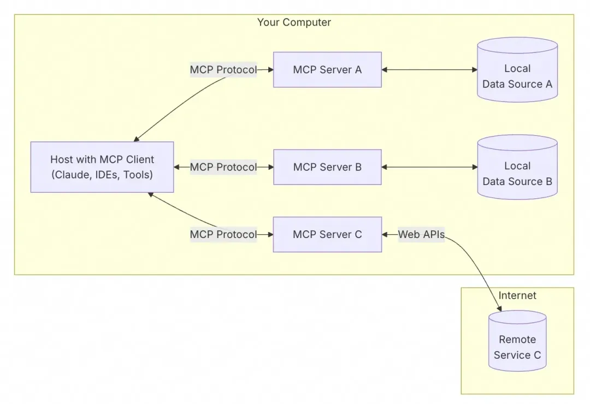
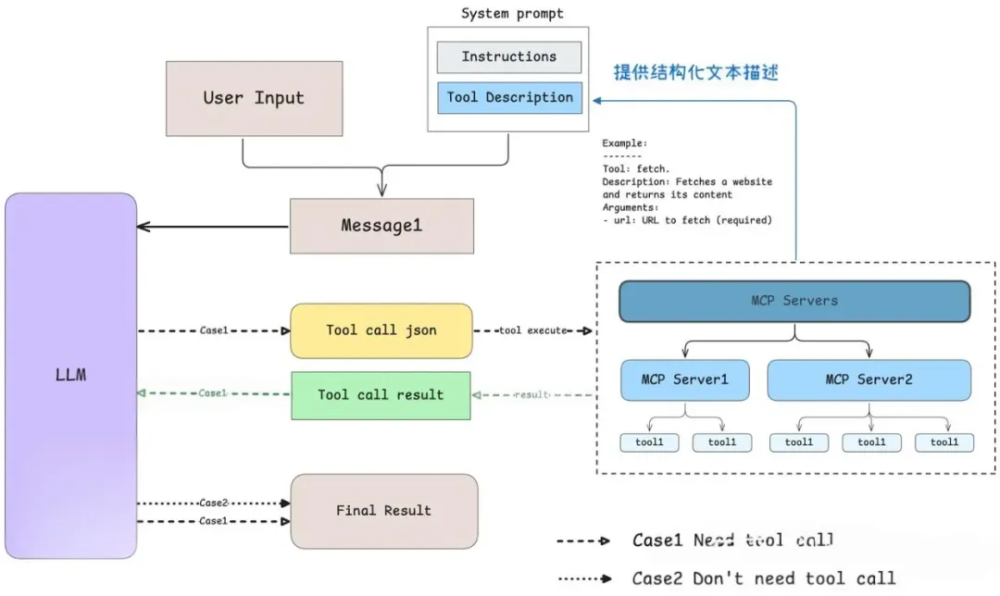
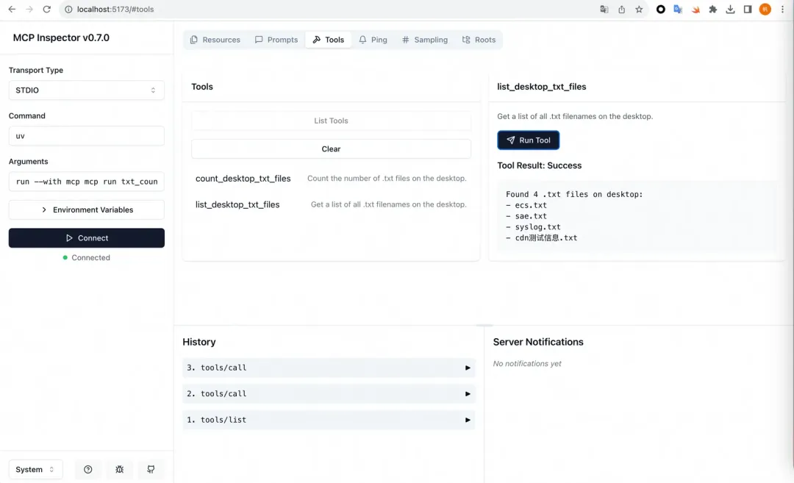
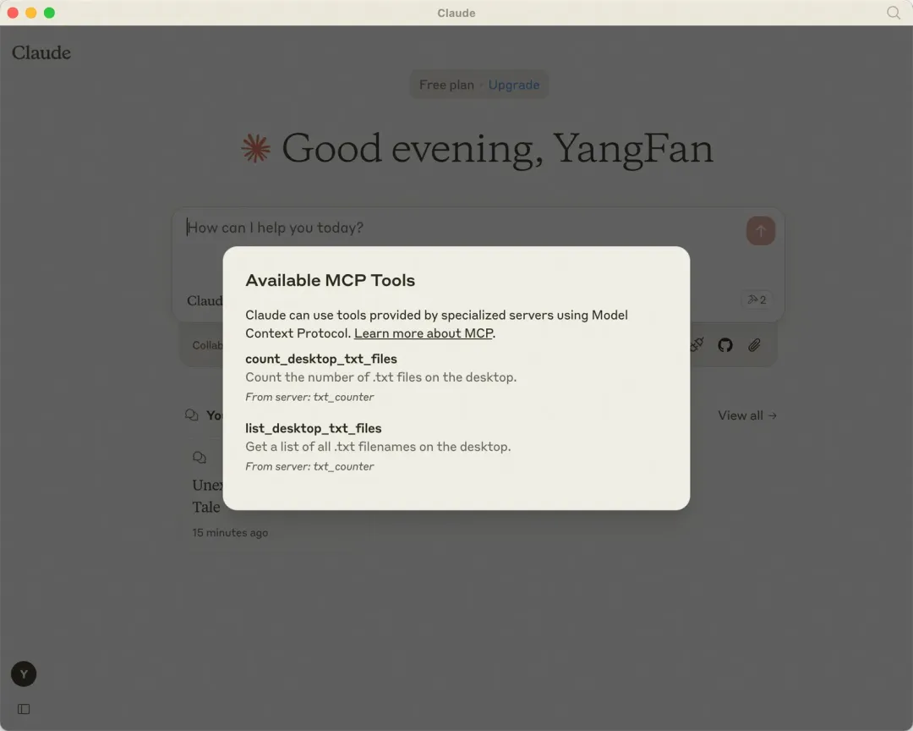
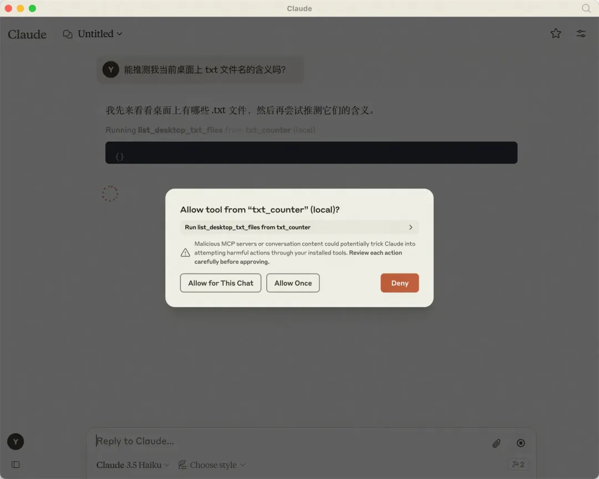
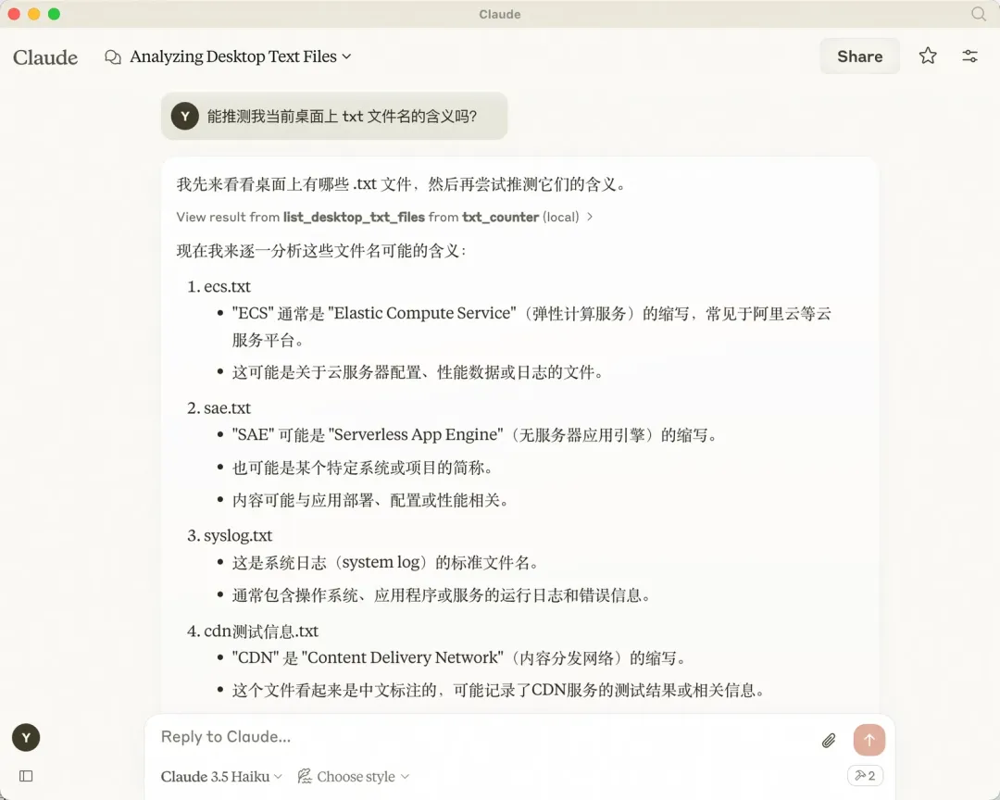
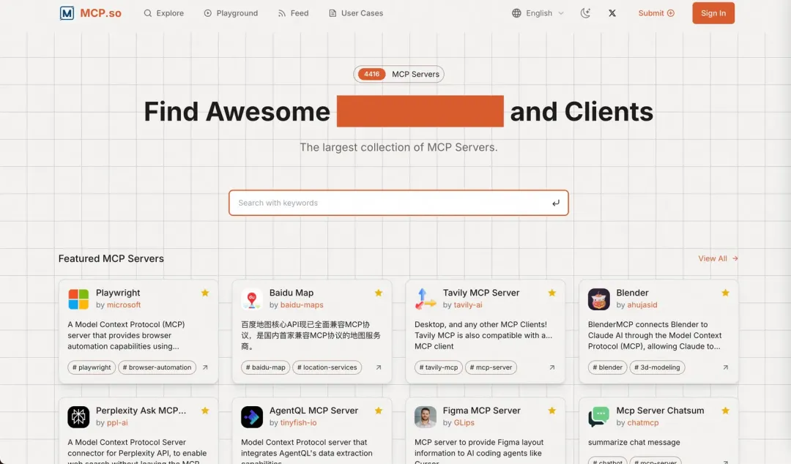

# 2 一文讲透MCP的原理及实践

> MCP (Model Context Protocol) 代表了 AI 与外部工具和数据交互的标准建立。通过本文，我们可以了解到MCP的本质、价值、使用与开发

## 1 MCP是什么

> **MCP 是 Anthropic (Claude) 主导发布的一个开放的、通用的、有共识的协议标准。**

**MCP 是一个标准协议，就像给 AI 大模型装了一个 “万能接口”**，让 AI 模型能够与不同的数据源和工具进行无缝交互。它就像 USB-C 接口一样，提供了一种标准化的方法，将 AI 模型连接到各种数据源和工具。

**MCP 旨在替换碎片化的 Agent 代码集成**，从而使 AI 系统更可靠，更有效。通过建立通用标准，服务商可以基于协议来推出它们自己服务的 AI 能力，从而支持开发者更快的构建更强大的 AI 应用。开发者也不需要重复造轮子，通过开源项目可以建立强大的 AI Agent 生态。

MCP 可以在不同的应用 / 服务之间保持上下文，增强整体自主执行任务的能力。


### MCP 架构

MCP遵循客户端 - 服务器架构，包含以下几个核心部分：


**MCP 主机（MCP Hosts）**：发起请求的 AI 应用程序，比如聊天机器人、AI 驱动的 IDE 等。

**MCP 客户端（MCP Clients）**：在主机程序内部，与 MCP 服务器保持 1:1 的连接。

**MCP 服务器（MCP Servers）**：为 MCP 客户端提供上下文、工具和提示信息

**本地资源（Local Resources）**：本地计算机中可供 MCP 服务器安全访问的资源，如文件、数据库。

**远程资源（Remote Resources）**：MCP 服务器可以连接到的远程资源，如通过 API 提供的数据。



### **为什么需要 MCP 呢？**

举个例子，例如我们目前还不能同时通过某个 AI 应用来做到联网搜索、发送邮件、发布自己的博客等等，这些功能单个实现都不是很难，但是如果要全部集成到一个系统里面，就会变得遥不可及。可以想象一下日常开发中，有一个IDE ，我们可以通过 IDE 的 AI 来完成下面这些工作。


* 询问 AI 来查询本地数据库已有的数据来辅助开发
* 询问 AI 搜索 Github Issue 来判断某问题是不是已知的 bug
* 通过 AI 将某个 PR 的意见发送给同事的即时通讯软件 (例如 Slack) 来 Code Review
* 通过 AI 查询甚至修改当前 AWS、Azure 的配置来完成部署

那有了 MCP 呢？其他服务都遵循 MCP 标准的话，就像万能接口一样，让我们开发更高效了。


**假设你正在使用一个 AI 编程助手来帮助你写代码。这个 AI 助手就是一个 MCP 主机**。

**它需要访问一些外部资源，比如代码库、文档或者调试工具**。MCP 服务器就像是一个中介，它连接了这些资源和 AI 助手。

* **当你需要查找某个函数的用法时，AI 助手通过 MCP 客户端向 MCP 服务器发送请求**。
* MCP 服务器接收到请求后，去代码库或文档中查找相关信息。
* **找到信息后，MCP 服务器将结果返回给 AI 助手**。
* AI 助手根据返回的信息，生成一段代码或解释，展示给你


使用 MCP 后，你直接对 AI 说：“帮我查一下最近数学考试的平均分，把不及格的同学名单整理到值日表里，并在微信群提醒他们补考。”

AI 会自动完成：用 “万能插头” MCP 连接你的电脑，读取 Excel 成绩。用 MCP 连接微信，找到相关聊天记录。用 MCP 修改在线文档，更新值日表。整个过程不需要你手动操作，数据也不会离开你的设备，安全又高效。

**所以，MCP 厉害的地方在于，不用重复造轮子。过去每个软件（比如微信、Excel）都要单独给 AI 做接口，现在 MCP 统一了标准，就像所有电器都用 USB-C 充电口，AI 一个接口就能连接所有工具**。

而且，数据不用上传到云端，AI 直接在本地处理。比如你的成绩单只存在自己电脑里，AI 通过 MCP 读取分析，但数据不会外泄。

MCP 会让 AI 更 “懂” 上下文，比如你让 AI “总结上周班会的重点”，它能自动调取会议录音、聊天记录、笔记文档，综合这些信息给你答案，而不是凭空编造。所以，MCP 为 AI 应用提供了一个强大的工具，使其能够更灵活、更安全地与外部世界交互

## 2 MCP原理

### VS Function Call

MCP的诞生标志着prompt engineering进入了一个新的发展阶段，它通过提供更结构化的上下文信息，显著提升了模型的能力。

在设计prompt时，我们的目标是能够将更加具体的信息（如本地文件、数据库内容或网络实时数据等）集成进来，从而使模型能够更好地理解和解决实际问题

回顾没有 MCP 的时代，为了解决复杂问题，我们不得不手动从数据库中筛选信息或使用工具来检索相关信息，并将其逐一添加到 prompt 中。处理简单问题时如需要大模型做归纳总结这种方法很奏效，但随着问题复杂度的增加，这种方法变得越来越难以应对

为了克服这些挑战，许多大型语言模型（LLM）平台（例如 OpenAI 和 Google）引入了 function call 功能。这一机制允许模型根据需要调用预定义函数以获取数据或执行特定操作，大大提高了自动化程度。

然而，function call 也有其局限性，包括对平台的高度依赖以及不同 LLM 平台间 API 实现的差异，这使得开发者在切换模型时必须重写代码，增加了开发成本。此外，还存在安全性和交互性等方面的挑战。

实际上，数据和工具一直都在那里，关键在于如何更智能、更统一地将它们与模型连接起来。Anthropic 基于这样的需求设计了 MCP，作为 AI 模型的“万能适配器”，让 LLM 能够轻松访问数据或调用工具。具体而言，MCP 的优势体现在以下几个方面：

* **生态系统**：MCP 提供了丰富的插件库，使您的 AI 应用可以直接利用。所有的服务提供商都可以按MCP协议进行接入，开者可以直接使用。可以预见，这个生态会越来越庞大，生态越庞大，AI的能力越强。

* **兼容性**：大家只要遵循一套协议，都可以实现“万物互联”。不限于特定的 AI 模型，任何支持 MCP 的模型都能灵活切换使用。

### 模型如何智能选择Agent/工具

MCP是核心是让我们能方便地调用多个工具，那随之而来的问题是LLM（模型）是在什么时候确定使用哪些工具的呢？ Anthropic 为我们提供了详细的解释，当用户提出一个问题时：

* 客户端（Claude Desktop / Cursor）将问题发送给 LLM。
* LLM 分析可用的工具，并决定使用哪一个（或多个）。
* 客户端通过 MCP Server 执行所选的工具。
* 工具的执行结果被送回给 LLM。
* LLM 结合执行结果，归纳总结后生成自然语言展示给用户！



先理解第一步模型如何确定该使用哪些工具？我们可以参考MCP官方提供的client example为讲解示例，并对相关代码进行了简化处理（移除了不影响逻辑理解的异常控制代码部分）。

通过分析这段代码，可以看出模型是依靠prompt来识别当前可用的工具有哪些。**具体做法是，我们将各个工具的使用描述以文本形式传递给模型，从而使模型能够了解有哪些工具可供选择，并基于实时情况做出最佳选择**。参考代码中的注释部分：

```
... # 省略了无关的代码
 async def start(self):
     # 初始化所有的 mcp server
     for server in self.servers:
         await server.initialize()
 
     # 获取所有的 tools 命名为 all_tools
     all_tools = []
     for server in self.servers:
         tools = await server.list_tools()
         all_tools.extend(tools)
 
     # 将所有的 tools 的功能描述格式化成字符串供 LLM 使用
     # tool.format_for_llm() 我放到了这段代码最后，方便阅读。
     tools_description = "\n".join(
         [tool.format_for_llm() for tool in all_tools]
     )
 
     # 询问 LLM（Claude） 应该使用哪些工具。
     system_message = (
         "You are a helpful assistant with access to these tools:\n\n"
         f"{tools_description}\n"
         "Choose the appropriate tool based on the user's question. "
         "If no tool is needed, reply directly.\n\n"
         "IMPORTANT: When you need to use a tool, you must ONLY respond with "
         "the exact JSON object format below, nothing else:\n"
         "{\n"
         '    "tool": "tool-name",\n'
         '    "arguments": {\n'
         '        "argument-name": "value"\n'
         "    }\n"
         "}\n\n"
         "After receiving a tool's response:\n"
         "1. Transform the raw data into a natural, conversational response\n"
         "2. Keep responses concise but informative\n"
         "3. Focus on the most relevant information\n"
         "4. Use appropriate context from the user's question\n"
         "5. Avoid simply repeating the raw data\n\n"
         "Please use only the tools that are explicitly defined above."
     )
     messages = [{"role": "system", "content": system_message}]
 
     while True:
         # Final... 假设这里已经处理了用户消息输入.
         messages.append({"role": "user", "content": user_input})
 
         # 将 system_message 和用户消息输入一起发送给 LLM
         llm_response = self.llm_client.get_response(messages)
 
     ... # 后面和确定使用哪些工具无关
     
 
 class Tool:
     """Represents a tool with its properties and formatting."""
 
     def __init__(
         self, name: str, description: str, input_schema: dict[str, Any]
     ) -> None:
         self.name: str = name
         self.description: str = description
         self.input_schema: dict[str, Any] = input_schema
 
     # 把工具的名字 / 工具的用途（description）和工具所需要的参数（args_desc）转化为文本
     def format_for_llm(self) -> str:
         """Format tool information for LLM.
 
         Returns:
             A formatted string describing the tool.
         """
         args_desc = []
         if "properties" in self.input_schema:
             for param_name, param_info in self.input_schema["properties"].items():
                 arg_desc = (
                     f"- {param_name}: {param_info.get('description', 'No description')}"
                 )
                 if param_name in self.input_schema.get("required", []):
                     arg_desc += " (required)"
                 args_desc.append(arg_desc)
 
         return f"""
 Tool: {self.name}
 Description: {self.description}
 Arguments:
 {chr(10).join(args_desc)}
 """
```
 
总结：模型是通过 `prompt engineering`，即提供所有工具的结构化描述和 few-shot 的 example 来确定该使用哪些工具。

另一方面，Anthropic 肯定对 Claude 做了专门的训练，毕竟是自家协议，Claude 更能理解工具的 prompt 以及输出结构化的 tool call json 代码。

```
@classmethod
 def from_function(
     cls,
     fn: Callable,
     name: str | None = None,
     description: str | None = None,
     context_kwarg: str | None = None,
 ) -> "Tool":
     """Create a Tool from a function."""
     func_name = name or fn.__name__ # 获取函数名
 
     if func_name == "<lambda>":
         raise ValueError("You must provide a name for lambda functions")
 
     func_doc = description or fn.__doc__ or "" # 获取函数 docstring
     is_async = inspect.iscoroutinefunction(fn)
     
     ... # 更多请参考原始代码...
```

总结：模型是通过 prompt engineering，即提供所有工具的结构化描述和 few-shot 的 example 来确定该使用哪些工具。

另一方面，Anthropic 肯定对 Claude 做了专门的训练，毕竟是自家协议，Claude 更能理解工具的 prompt 以及输出结构化的 tool call json 代码。

### 工具执行与结果反馈机制

工具的执行就比较简单和直接了。承接上一步，我们把 system prompt（指令与工具调用描述）和用户消息一起发送给模型，然后接收模型的回复。当模型分析用户请求后，它会决定是否需要调用工具：

* 无需工具时：模型直接生成自然语言回复。
* 需要工具时：模型输出结构化 JSON 格式的工具调用请求。

如果回复中包含结构化 JSON 格式的工具调用请求，则客户端会根据这个 json 代码执行对应的工具。具体的实现逻辑都在 `process_llm_response`中，代码、逻辑非常简单。

如果模型执行了 tool call，则工具执行的结果 result 会和 system prompt 和用户消息一起重新发送给模型，请求模型生成最终回复。如果 tool call 的 json 代码存在问题或者模型产生了幻觉怎么办呢？通过阅读代码 发现，我们会 skip 掉无效的调用请求。执行相关的代码与注释如下：

```

... # 省略无关的代码
 async def start(self):
     ... # 上面已经介绍过了，模型如何选择工具
 
     while True:
         # 假设这里已经处理了用户消息输入.
         messages.append({"role": "user", "content": user_input})
 
         # 获取 LLM 的输出
         llm_response = self.llm_client.get_response(messages)
 
         # 处理 LLM 的输出（如果有 tool call 则执行对应的工具）
         result = await self.process_llm_response(llm_response)
 
         # 如果 result 与 llm_response 不同，说明执行了 tool call （有额外信息了）
         # 则将 tool call 的结果重新发送给 LLM 进行处理。
         if result != llm_response:
             messages.append({"role": "assistant", "content": llm_response})
             messages.append({"role": "system", "content": result})
 
             final_response = self.llm_client.get_response(messages)
             logging.info("\nFinal response: %s", final_response)
             messages.append(
                 {"role": "assistant", "content": final_response}
             )
         # 否则代表没有执行 tool call，则直接将 LLM 的输出返回给用户。
         else:
             messages.append({"role": "assistant", "content": llm_response})
```

根据上述原理分析，可以看出工具文档至关重要。模型依赖于工具描述文本来理解和选择适用的工具，这意味着精心编写的工具名称、文档字符串（docstring）以及参数说明显得尤为重要。鉴于MCP的选择机制基于prompt实现，理论上任何模型只要能够提供相应的工具描述就能与MCP兼容使用。

## MCP Server 开发实践

对绝大部分 AI 开发者来说，除了了解MCP的原理，我们更关心 Server 的实现。

因此，我这里准备通过一个最简单的示例来介绍如何实现一个 MCP Server。

MCP servers 可以提供三种主要类型的功能：

* Tools（工具）：可以被 LLM 调用的函数或外部服务接口，需要用户授权后执行。
 
* Resources（资源）：提供类似文件的结构化数据，供LLM读取和分析。如本地文件内容、远程api返回的json数据、数据库查询结果等。
 
* Prompts（提示）：预先编写的模板，帮助用户完成特定任务


### **1、使用 LLM 构建 MCP 的最佳实践**


在开始之前，Anthropic 为我们提供了一个基于LLM 的 MCP Server 的最佳开发实践（https://modelcontextprotocol.io/tutorials/building-mcp-with-llms），Guide里面特意提到了，该实践是基于Claude，也可以基于其它LLM。总结如下

1.引入 domain knowledge （说人话就是，告诉他一些 MCP Server 开发的范例和资料）

* 访问 https://modelcontextprotocol.io/llms-full.txt 并复制完整的文档文本。（实测这个太长了，可以忽略）
* 导航到 MCP TypeScript SDK 或 Python SDK Github 项目中并复制相关内容。
* 把这些作为 prompt 输入到你的 chat 对话中（作为 context）。

### **2.描述你的需求**

* 你的服务器会开放哪些资源
* 它会提供哪些工具
* 它应该给出哪些引导或建议 
* 它需要跟哪些外部系统互动

```

... （这里是已经引入的 domain knowledge）

打造一个 MCP 服务器，它能够：

- 连接到我公司的 PostgreSQL 数据库
- 将表格结构作为资源开放出来
- 提供运行只读 SQL 查询的工具
- 包含常见数据分析任务的引导
```

剩下的部分也很重要，但是偏重于方法论，实践性较弱，这里就不展开了，推荐直接看链接：https://modelcontextprotocol.io/tutorials/building-mcp-with-llms。

### 3、手动实践

本节内容主要参考了官方文档：Quick Start: For Server Developers（https://modelcontextprotocol.io/quickstart/server）。

这里准备了一个简单的示例，使用 Python 实现一个 MCP Server，用来统计当前桌面上的 txt 文件数量和获取对应文件的名字（你可以理解为一点用都没有，但是它足够简单，主要是为了难以配置环境的读者提供一个足够短的实践记录）。

以下实践均运行在我的 MacOS 系统上。

**Step1. 前置工作**

* 安装 Claude Desktop。
* Python 3.10+ 环境
* Python MCP SDK 1.2.0+

**Step2. 环境配置**

```

# 安装 uv
curl -LsSf https://astral.sh/uv/install.sh | sh

# 创建项目目录
uv init txt_counter
cd txt_counter

# 设置 Python 3.10+ 环境
echo "3.11" > .python-version

# 创建虚拟环境并激活
uv venv
source .venv/bin/activate

# Install dependencies
uv add "mcp[cli]" httpx

# Create our server file
touch txt_counter.py
```

> Question: 什么是 uv 呢和 conda 比有什么区别？
> 
> 
> Answer: 一个用 Rust 编写的超快速 (100x) Python 包管理器和环境管理工具，由 Astral 开发。定位为 pip 和 venv 的替代品，专注于速度、简单性和现代 Python 工作流。


### **Step3. 构造一个 prompt**

```
"""
... （这里是已经引入的 domain knowledge）
"""

打造一个 MCP 服务器，它能够：
- 功能：
    - 统计当前桌面上的 txt 文件数量
    - 获取对应文件的名字

要求：
- 不需要给出 prompt 和 resource 相关代码。
- 你可以假设我的桌面路径为 /Users/{username}/Desktop
```

Domain Knowledge 复制于 MCP Python SDK的README文件（https://raw.githubusercontent.com/modelcontextprotocol/python-sdk/refs/heads/main/README.md）

### **Step4. 实现 MCP Server**

以下代码由 Claude 3.7 直接生成。当然这里主要是因为需求足够简单，当需要实现一个复杂的 MCP Server 时，可能需要多步的引导和 Debug 才能得到最终的代码。

```

import os
from pathlib import Path
from mcp.server.fastmcp import FastMCP

# 创建 MCP Server
mcp = FastMCP("桌面 TXT 文件统计器")

@mcp.tool()
def count_desktop_txt_files() -> int:
    """Count the number of .txt files on the desktop."""
    # Get the desktop path
    username = os.getenv("USER") or os.getenv("USERNAME")
    desktop_path = Path(f"/Users/{username}/Desktop")

    # Count .txt files
    txt_files = list(desktop_path.glob("*.txt"))
    return len(txt_files)

@mcp.tool()
def list_desktop_txt_files() -> str:
    """Get a list of all .txt filenames on the desktop."""
    # Get the desktop path
    username = os.getenv("USER") or os.getenv("USERNAME")
    desktop_path = Path(f"/Users/{username}/Desktop")

    # Get all .txt files
    txt_files = list(desktop_path.glob("*.txt"))

    # Return the filenames
    if not txt_files:
        return "No .txt files found on desktop."

    # Format the list of filenames
    file_list = "\n".join([f"- {file.name}" for file in txt_files])
    return f"Found {len(txt_files)} .txt files on desktop:\n{file_list}"

if __name__ == "__main__":
    # Initialize and run the server
    mcp.run()
```

任务非常简单，只需要调用非常基本的os就可以完成。

### Step5. 测试 MCP Server

```
$ mcp dev txt_counter.py
Starting MCP inspector...
Proxy server listening on port 3000

MCP Inspector is up and running at http://localhost:5173
```

之后进入到给出的链接中，你大概能按下图进行操作：




### Step6. 接入 Claude

最后一步就是把我们写好的 MCP 接入到 Claude Desktop 中。流程如下：

```

# 打开 claude_desktop_config.json (MacOS / Linux)
# 如果你用的是 cursor 或者 vim 请更换对应的命令
code ~/Library/Application\ Support/Claude/claude_desktop_config.json
```

在配置文件中添加以下内容，记得替换相关路径为实际路径。

```

{
    "mcpServers": {
      "txt_counter": {
        "command": "/opt/homebrew/bin/uv",
        "args": [
          "--directory",
          "/Users/yangfan/mcp/txt_counter",
          "run",
          "txt_counter.py"
        ]
      }
    }
  }
```


uv最好是绝对路径，推荐使用 which uv 获取。

配置好后重启 Claude Desktop，如果没问题就能看到对应的 MCP Server 了。



### Step7. 实际使用

接下来，我们通过一个简单的 prompt 进行实际测试：

```
能推测我当前桌面上 txt 文件名的含义吗？
```

它可能会请求你的使用权限，如图一所示，你可以点击 Allow for This Chat





看起来我们 MCP Server 已经正常工作了！

3、MCP Server Debug

Debug 是一个非常复杂的话题，这里直接推荐官方的教程

* Official Tutorial: Debugging：https://modelcontextprotocol.io/docs/tools/debugging

* Official Tutorial: Inspector：https://modelcontextprotocol.io/docs/tools/inspector

MCP (Model Context Protocol) 代表了 AI 与外部工具和数据交互的标准建立。通过本文，我们可以了解到：

MCP 的本质：它是一个统一的协议标准，使 AI 模型能够以一致的方式连接各种数据源和工具，类似于 AI 世界的"USB-C"接口。

MCP 的价值：它解决了传统 function call 的平台依赖问题，提供了更统一、开放、安全、灵活的工具调用机制，让用户和开发者都能从中受益。

使用与开发：对于普通用户，MCP 提供了丰富的现成工具，用户可以在不了解任何技术细节的情况下使用；对于开发者，MCP 提供了清晰的架构和 SDK，使工具开发变得相对简单。

MCP 还处于发展初期，但其潜力巨大。更重要的是生态，基于统一标准下构筑的生态也会正向的促进整个领域的发展。我们可以看看MCP工具平台：https://mcp.so/


