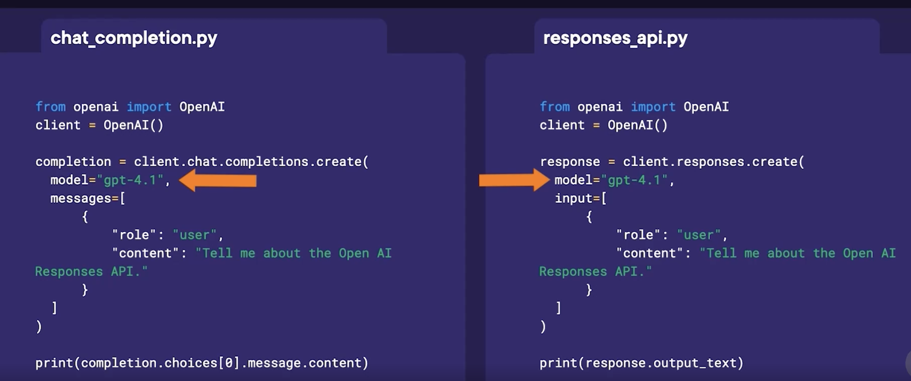

# 0 OpenAI Responses API 与 Agents SDK

## 1 What Is the Responses API?


Responses API 是 OpenAI 推出的新一代核心 API，旨在统一并升级现有的多种接口能力，为构建现代化、具备行动能力（agentic）的 AI 应用提供基础设施。

在早期阶段，OpenAI 先后推出了 **Completions API**（文本生成）、**Chat Completions API**（对话交互）以及 **Assistants API**（工具调用与代理能力）。这些 API 各自服务于不同场景，但也给开发者带来了选择成本和架构复杂性。

Responses API 的核心目标是 **“一体化”** —— 将文本生成、对话、多轮状态管理、工具调用（如网页搜索、文件访问、代码执行）以及代理式工作流统一到一个 API 中。**它不仅继承了 Chat Completions 的易用性，还整合了 Assistants API 的高级能力，并被官方定位为后者的替代方案**。

根据 OpenAI 公告，Assistants API 计划于 2026 年逐步弃用，开发者应开始向 Responses API 迁移。

与 Chat Completions API 相比，Responses API 在文本生成质量上并无差异，但在功能层面显著增强：它原生支持工具调用、内建状态管理（无需手动维护对话上下文）、支持 MCP（Model Context Protocol），并可用于构建多步骤决策与执行的智能体工作流。

因此，Responses API 特别适合需要 **浏览网页、解析文件、执行代码、自动规划与决策** 的应用场景，也被视为 OpenAI 平台未来 Agent 架构的核心基石。

## 二 Chat Completions API 与 Responses API 技术对比表


| 对比维度                   | Chat Completions API | Responses API                                            |
| ---------------------- | -------------------- | -------------------------------------------------------- |
| **API 定位**             | 对话式文本生成接口            | 统一的智能体（Agent）核心 API                                      |
| **设计目标**               | 简单对话与文本生成            | 面向行动的 AI 应用与 Agent 工作流                                   |
| **文本生成能力**             | ✅ 高质量文本生成            | ✅ 同等高质量文本生成                                              |
| **多轮对话支持**             | ✅ 支持                 | ✅ 支持                                                     |
| **状态管理**               | ❌ 需开发者手动维护上下文        | ✅ 内建状态管理（Response / Conversation ID）                     |
| **工具调用（Tools）**        | ❌ 不支持                | ✅ 原生支持                                                   |
| **内建工具类型**             | ❌ 无                  | ✅ Web Search / File Read / Code Execution / Computer Use |
| **文件处理能力**             | ❌ 不支持                | ✅ 支持读取与解析文件（如 PDF）                                       |
| **代码执行能力**             | ❌ 不支持                | ✅ 内建 Code Interpreter                                    |
| **Agentic Workflow**   | ❌ 不适合                | ✅ 原生支持多步骤决策与执行                                           |
| **规划与推理能力**            | ⚠️ 需自行封装             | ✅ 内建 Reason → Plan → Act → Observe 模式                    |
| **MCP 支持**             | ❌ 不支持                | ✅ 支持 Model Context Protocol                              |
| **输出结构**               | 以 `message` 为主       | 多类型输出（text / tool-call / search-call 等）                  |
| **引用 / 注解（Citations）** | ❌ 无                  | ✅ 支持 annotations（如搜索引用）                                  |
| **模型可用性**              | 文本模型为主               | 部分带工具模型仅支持 Responses API                                 |
| **复杂度**                | ⭐ 简单、易上手             | ⭐⭐ 功能强、结构更丰富                                             |
| **适用场景**               | 聊天机器人、文本生成           | 智能助手、自动化任务、AI Agent                                      |
| **未来发展方向**             | 长期持续支持               | OpenAI Agent 生态的核心 API                                   |
| **官方态度**               | 继续维护                 | 推荐作为主力开发接口      

                                         
**Text generation comparison in Python** 
 



**Output Comparison**
                                         
  

## 2 Making Your First Call     

本节内容围绕 Responses API 的基本使用流程与返回结果解析 展开，通过实操演示帮助学习者理解从环境准备到首次 API 调用的完整链路。

在实际工程实践中，本课程示例已调整为 使用 Ollama 运行本地模型（如 qwen2.5:7b、deepseek-r1），以替代远程 OpenAI API。这种方式具有以下特点：

推理与生成完全在本地完成，适用于对数据隐私和离线能力要求较高的场景

API 调用方式在语义上保持一致，但不依赖 OpenAI 账户、API Key 或计费体系

部分 OpenAI Responses API 的高级特性（如结构化 reasoning 字段）在本地模型中以“文本推理”的形式体现，需要通过 Prompt 设计进行引导

这一实践路径更贴近企业内网部署、私有化 AI Agent 系统和成本可控的生产环境。       


```
import json
from openai import OpenAI

client = OpenAI(
    api_key="ollama",  # 随便写
    base_url="http://localhost:11434/v1"
)
```

```
response = client.responses.create(
    model="qwen2.5:7b",
    input="Write one sentence about OpenAI Responses API."
)

print(response.output_text)
```

> The OpenAI Responses API enables developers to integrate sophisticated text generation and conversational AI capabilities into their applications by accessing a powerful language model.
           
### Instructions

```
response = client.responses.create(
    model="qwen2.5:7b",
    instructions="Talk like a pirate.",
    input="How are you?",
)

print(response.output_text)
```

> Arrr, matey! How be ye doin' today? Be ye feelin' swashbucklin' or perhaps ye be landlubberin'?

### Example with system + user:

```
response = client.responses.create(
    model="qwen2.5:7b",
    input=[
        {
            "role": "system",
            "content": "You are a helpful assistant who replies in bullet points.",
        },
        {"role": "user", "content": "Give me tips to focus better while studying."},
    ],
)
```

```
print(response.output_text)  # Main assistant reply (shortcut)
```

```
- Set clear goals for each study session
- Create a dedicated and organized study space
- Use a timer for focused work intervals (e.g., Pomodoro Technique)
- Minimize distractions by turning off notifications
- Maintain good posture to improve mental clarity
- Take regular breaks to avoid burnout
- Stay hydrated and eat healthily
- Use flashcards or quizzes to test retention
- Break large tasks into smaller, manageable parts
```

### Inspecting the response

```
print(response.output)  # Full structured output
```

> [ResponseOutputMessage(id='msg_619012', content=[ResponseOutputText(annotations=None, text='- Set clear goals for each study session\n- Create a dedicated and organized study space\n- Use a timer for focused work intervals (e.g., Pomodoro Technique)\n- Minimize distractions by turning off notifications\n- Maintain good posture to improve mental clarity\n- Take regular breaks to avoid burnout\n- Stay hydrated and eat healthily\n- Use flashcards or quizzes to test retention\n- Break large tasks into smaller, manageable parts', type='output_text', logprobs=None)], role='assistant', status='completed', type='message')]


```
from pprint import pprint

pprint(response.model_dump())
```

```
{'background': None,
 'conversation': None,
 'created_at': 1765721564.0,
 'error': None,
 'id': 'resp_100363',
 'incomplete_details': None,
 'instructions': None,
 'max_output_tokens': None,
 'max_tool_calls': None,
 'metadata': None,
 'model': 'qwen2.5:7b',
 'object': 'response',
 'output': [{'content': [{'annotations': None,
                          'logprobs': None,
                          'text': '- Set clear goals for each study session\n'
                                  '- Create a dedicated and organized study '
                                  'space\n'
                                  '- Use a timer for focused work intervals '
                                  '(e.g., Pomodoro Technique)\n'
                                  '- Minimize distractions by turning off '
                                  'notifications\n'
                                  '- Maintain good posture to improve mental '
                                  'clarity\n'
                                  '- Take regular breaks to avoid burnout\n'
                                  '- Stay hydrated and eat healthily\n'
                                  '- Use flashcards or quizzes to test '
                                  'retention\n'
                                  '- Break large tasks into smaller, '
                                  'manageable parts',
                          'type': 'output_text'}],
             'id': 'msg_619012',
             'role': 'assistant',
             'status': 'completed',
             'type': 'message'}],
 'parallel_tool_calls': None,
 'previous_response_id': None,
 'prompt': None,
 'prompt_cache_key': None,
 'prompt_cache_retention': None,
 'reasoning': None,
 'safety_identifier': None,
 'service_tier': None,
 'status': 'completed',
 'temperature': None,
 'text': None,
 'tool_choice': None,
 'tools': None,
 'top_logprobs': None,
 'top_p': None,
 'truncation': None,
 'usage': {'input_tokens': 33,
           'input_tokens_details': None,
           'output_tokens': 90,
           'output_tokens_details': None,
           'total_tokens': 123},
 'user': None}
```
 
```
# You can also inspect:
print(response.usage.output_tokens)  # Token usage
print(response.usage.total_tokens)  # Total token usage
# print(response.reasoning.effort)
print(response.id)
```

```
90
123
resp_100363
```

### Using reasoning models

✅ 只有 OpenAI 官方 reasoning 模型 才支持：

| OpenAI reasoning | 本地模型 |
| ---------------- | ---- |
| 推理 token 单独解码    | ❌    |
| 推理结构化返回          | ❌    |
| 控制推理强度           | ❌    |
| 推理与回答分离          | ❌    |

**既然模型不支持 reasoning.effort，那就用自然语言提示：**

```
prompt = """
Please reason step by step and explain your logic clearly.

Question:
What’s the next number in the sequence: 2, 6, 12, 20, ...?
"""


response = client.responses.create(
    model="deepseek-r1:1.5b",
    # reasoning={"effort": "medium"},
    input=[{"role": "user", "content": prompt}],
)

# ✅ 只有 OpenAI 官方 reasoning 模型 才支持：

# reasoning.effort

# response.reasoning

# 可控推理强度

print(response.output_text)
```

```
<think>
First, I'll look at the given numbers: 2, 6, 12, 20.

Next, I'll calculate the differences between each consecutive pair to find a pattern:

- 6 - 2 = 4
- 12 - 6 = 6
- 20 - 12 = 8

The differences are 4, 6, and 8. These numbers increase by 2 each time.

To determine the next difference, I'll add 2 to the last difference:

4 (previous difference) + 2 = 6

Finally, I'll add this new difference to the last number in the sequence to find the fifth term:

20 + 6 = 26
</think>

**Solution:**

The given sequence is:  
2, 6, 12, 20, ...

To find the next number in the sequence, let's analyze the pattern.

1. **Calculate the Differences Between Consecutive Terms:**
   - First difference: \( 6 - 2 = 4 \)
   - Second difference: \( 12 - 6 = 6 \)
   - Third difference: \( 20 - 12 = 8 \)

2. **Identify the Pattern in Differences:**
   - The differences are increasing by **2** each time**:  
     4, 6, 8, ...
   
3. **Predict the Next Difference:**
   - Following the pattern, the next difference will be \( 8 + 2 = 10 \).

4. **Determine the Next Term in the Sequence:**
   - Add this new difference to the last term:  
     \( 20 + 10 = 30 \)

**Final Answer:**  
\boxed{30}
```


```
print(response.usage)  # Token usage
# print(response.reasoning.effort)
```

> ResponseUsage(input_tokens=42, input_tokens_details=None, output_tokens=390, output_tokens_details=None, total_tokens=432)

Responses API 为构建面向行动的 AI 应用提供了统一接口，而在本地化实践中，结合 Ollama 运行 qwen2.5 与 deepseek-r1 等模型，可以在保持 Agent 架构一致性的同时，实现更高的数据可控性与部署灵活性。

**通过解析 Responses API 的返回结构，开发者不仅可以获取模型输出结果，还能够系统性地管理请求状态、上下文信息与推理成本，这为构建复杂的 Agent 工作流奠定了工程基础**。

在本地大模型环境下，推理能力更多体现在生成过程本身，而非结构化字段配置，因此 Prompt 设计成为影响推理质量与响应稳定性的关键因素。

相较于传统的文本生成接口，面向 Agent 的 API 设计更强调“规划—行动—反馈”的闭环，这一思想同样适用于本地大模型驱动的智能体系统。


## 3 保留客户端历史

本段内容围绕 **对话状态（Conversation State）管理** 展开，系统阐述了其重要性、实现方式以及在 Responses API 中的具体应用与取舍。

首先强调了对话状态的价值并不仅限于“记住用户说过的话”，而是直接影响到多轮交互中的**准确性、一致性与推理能力**。

良好的上下文管理可以帮助模型在连续对话中保持正确理解，降低重复输入带来的 Token 消耗与成本，**同时支持从任意历史节点进行对话分支（fork），并为更复杂的推理和工具调用打下基础**。

随后，内容通过代码示例展示了**手动管理上下文**的基本思路：将用户与助手的每一轮消息按顺序存储在客户端，并在每次请求时将完整的消息数组作为输入发送给模型。

通过这种方式，模型能够理解完整的对话历史，从而在“再来一个”“继续刚才的话题”等模糊指令下给出符合语境的回应。这种方式灵活、可控，但需要开发者自行维护上下文结构。

在此基础上，介绍了 Responses API 提供的 **自动化上下文管理机制**。

通过在请求中传入 `previous_response_id`，开发者无需手动拼接历史消息，API 会自动将当前请求与指定的历史响应串联起来，形成同一条对话链。**示例中通过“苹果问题”清晰地演示了多轮推理能力：即使后续问题中未显式重复上下文信息，模型仍能基于先前状态给出正确结果**。

Responses API 的另一项重要能力是 **对话分支（Forking）**。开发者可以基于任意历史响应创建新的对话分支，这种机制类似于在 ChatGPT Web UI 中“编辑历史消息后重新生成”，非常适合探索不同推理路径或假设场景。

最后，内容指出了自动上下文管理的**潜在成本问题**。随着对话链不断增长，输入 Token 数量会持续累积，进而显著提高调用成本，并最终触及模型的上下文长度上限。对此，课程展示了一种折中方案：通过删除早期响应来截断对话链，从而降低 Token 使用量。但代价是模型将不再“记得”被删除的历史内容。由此得出结论：在实际项目中，**手动管理上下文并结合截断、摘要等策略，往往在成本与控制力之间更具优势**。


### 可用于技术文章的专业表述（Professional Lines）


> 对话状态管理不仅决定了多轮交互的连贯性，也直接影响模型推理准确性、Token 使用效率以及整体调用成本。

> Responses API 通过 `previous_response_id` 提供了自动化的上下文串联机制，使多轮对话与分支探索在工程实现上更加简洁。

> 对话分支能力为开发者提供了类似版本控制的交互体验，能够在同一上下文基础上并行探索不同推理路径。

> 自动上下文管理虽然降低了开发复杂度，但随着对话链增长，Token 成本也会线性上升，因此在生产环境中需要结合截断或摘要策略进行优化。

> 在复杂或长周期对话场景下，显式的客户端侧上下文管理往往能在可控性与成本之间取得更好的平衡。


### 如何用本地模型实现保留客户端历史

#### ❗ 本地 Ollama / LLM 的基本事实

| 能力                 | 是否存在 |
| ------------------ | ---- |
| 自动记住上一次请求          | ❌    |
| 客户端自动会话管理          | ❌    |
| 类似 ChatGPT 的“对话记忆” | ❌    |
| 服务端保存 conversation | ❌    |

👉 **每一次调用都是全新的推理**

---

### 二、为什么你“以为”它会有历史？

你很可能遇到了下面之一（或多个）👇

#### ❌ 误区 1：以为 `client` 会保存上下文

```python
client = OpenAI(...)
```

或（Ollama 兼容写法）

```python
client = OpenAI(base_url="http://localhost:11434/v1")
```

👉 **client 只是 HTTP 客户端，不是会话对象**

它不会保存：

* 上一次 prompt
* 上一次 response
* 上一次 token

### ❌ 误区 2：以为 Responses API / Chat API 会“自动接着聊”

比如类似：

```python
response = client.responses.create(
    model="qwen2.5:7b",
    input="继续刚才的话"
)
```

模型实际收到的是：

```
“继续刚才的话”
```

但它**根本不知道“刚才的话”是什么**。


#### ❌ 误区 3：把 OpenAI Assistants / ChatGPT 的体验，误认为是模型能力

ChatGPT 能“记住”是因为：

* 浏览器在**不断把完整历史发回服务器**
* 你看到的是 **UI 层做的状态管理**
* 不是模型自己“记得”

---

### 三、99% 出问题的代码结构（你可以对照）

#### ❌ 常见错误写法（没有历史）

```python
def ask_llm(prompt):
    response = client.responses.create(
        model="deepseek-r1",
        input=prompt
    )
    return response.output_text
```

然后：

```python
ask_llm("你好")
ask_llm("我刚才说了什么？")
```

👉 第二次调用 **完全不知道第一次发生了什么**

### 四、正确做法（必须你自己维护历史）

#### ✅ 正确模式：客户端显式保存 history

#### 1️⃣ 用 messages / input 列表累积上下文

```python
conversation = []

def chat(user_input):
    conversation.append({
        "role": "user",
        "content": user_input
    })

    response = client.responses.create(
        model="qwen2.5:7b",
        input=conversation
    )

    assistant_reply = response.output_text

    conversation.append({
        "role": "assistant",
        "content": assistant_reply
    })

    return assistant_reply
```

这样才是**真正的“对话”**。

---

#### 2️⃣ 如果你用的是 Chat Completions 风格

```python
messages = [
    {"role": "system", "content": "You are a helpful assistant."}
]

def chat(user_msg):
    messages.append({"role": "user", "content": user_msg})

    resp = client.chat.completions.create(
        model="qwen2.5:7b",
        messages=messages
    )

    reply = resp.choices[0].message.content
    messages.append({"role": "assistant", "content": reply})
    return reply
```


### 五、为什么 Responses API 里的 `response.id` 也没帮你？

你可能注意到返回里有：

```json
"id": "resp-xxxxx"
```

⚠️ **注意这个重要事实**：

> 在 Ollama / 本地模型中，`response.id`
> ❌ 不代表会话
> ❌ 不代表 conversation
> ❌ 不能自动续聊

它只是一次请求的 ID，用于日志或调试。

---

### 六、如果你想要“更像 ChatGPT”的体验，该怎么做？

#### 推荐 3 个工程级方案（从简单到专业）

---

#### ✅ 方案 1：最简单（列表累积）

适合 Notebook / Demo / 学习

```python
history = []
```

#### ✅ 方案 2：Conversation Manager（推荐）

```python
class Conversation:
    def __init__(self, system_prompt):
        self.messages = [{"role": "system", "content": system_prompt}]

    def ask(self, user_input):
        self.messages.append({"role": "user", "content": user_input})
        resp = client.responses.create(
            model="deepseek-r1",
            input=self.messages
        )
        reply = resp.output_text
        self.messages.append({"role": "assistant", "content": reply})
        return reply
```


#### 🚀 方案 3：Agent 架构（你已经很接近了）

* Memory 模块
* Planner
* Tool Router
* History Truncation（防 token 爆炸）

### 七、为什么这个问题**非常关键**（说句实话）

你现在问的这个问题，**正好是从“会调用模型” → “会做 Agent 系统” 的分水岭**。

> **90% 的初学者都以为是模型不行
> 其实是自己没做状态管理**

###  Conversation State with OpenAI API

**Why Conversation State Is Critical**

* Accuracy across multiple turns
* Reducing token usage
* Fork and continue
* Deeper reasoning and tool use

```
import json
from openai import OpenAI

with open("../config.json") as f:
    config = json.load(f)

# Access API key
api_key = config["openai_api_key"]

client = OpenAI(api_key=api_key)
```

#### Simulate a conversation

```
response = client.responses.create(
    model="gpt-4.1",
    input=[
        {"role": "user", "content": "What is 5+5?"},
        {"role": "assistant", "content": "10"},
        {"role": "user", "content": "Now subtract 2 from it."},
    ],
)

print(response.output_text)
```

> 10 - 2 = **8**

#### Keep a client side history

```
history = [{"role": "user", "content": "tell me a joke"}]

response = client.responses.create(model="gpt-4o-mini", input=history, store=False)

print(response.output_text)

# Add the response to the conversation
history += [{"role": el.role, "content": el.content} for el in response.output]

history.append({"role": "user", "content": "tell me another"})

second_response = client.responses.create(
    model="gpt-4o-mini", input=history, store=False
)

print(second_response.output_text)
```

Output

```
Why did the scarecrow win an award?  

Because he was outstanding in his field!
Why don’t skeletons fight each other?  

They don’t have the guts!
```

#### OpenAI APIs for conversation state

```
# Message 1: John receives apples
first_response = client.responses.create(
    model="gpt-4o",
    input="John has 5 apples. Emma has 10. Emma gives him 3 apples. How many apples do John and Emma have now?",
)
print("Response 1:", first_response.output_text)
```

```
10 - 2 = **8**

Why did the scarecrow win an award?  

Because he was outstanding in his field!
Why don’t skeletons fight each other?  

They don’t have the guts!
Response 1: Initially, John has 5 apples and Emma has 10 apples. If Emma gives John 3 apples:

- John will have: 5 + 3 = 8 apples
- Emma will have: 10 - 3 = 7 apples

So, John now has 8 apples and Emma has 7 apples.
```

```
# Message 2: John eats apples, continuing the thread
second_response = client.responses.create(
    model="gpt-4o-mini",
    previous_response_id=first_response.id,
    input=[
        {
            "role": "user",
            "content": "Then he eats 2 apples. How many does he have left?",
        }
    ],
)
print("Response 2:", second_response.output_text)
```

```
Response 2: If John has 8 apples and he eats 2, he will have:

8 - 2 = 6 apples left.

So, John now has 6 apples.
```

```
# Message 3: John gives half to Emma
third_response = client.responses.create(
    model="gpt-4o-mini",
    previous_response_id=second_response.id,
    input=[
        {
            "role": "user",
            "content": "He gives half of them to Emma. How many apples does each person have now?",
        }
    ],
)
print("Response 3:", third_response.output_text)
```

```
10 - 2 = **8**

Why did the scarecrow win an award?  

Because he was outstanding in his field!
Why don’t skeletons fight each other?  

They don’t have the guts!
Response 1: Initially, John has 5 apples and Emma has 10 apples. If Emma gives John 3 apples:

- John will have: 5 + 3 = 8 apples
- Emma will have: 10 - 3 = 7 apples

So, John now has 8 apples and Emma has 7 apples.
Response 2: If John has 8 apples and he eats 2, he will have:

8 - 2 = 6 apples left.

So, John now has 6 apples.
Response 3: If John has 6 apples and he gives half to Emma, he will give away:

6 / 2 = 3 apples.

Now, after giving 3 apples to Emma:

- John's apples: 6 - 3 = 3 apples
- Emma's apples: 7 + 3 = 10 apples

So, John has 3 apples and Emma has 10 apples now.
```

#### Fork a response at any point

```
# Message 2: John eats apples, continuing the thread
forked_second_response = client.responses.create(
    model="gpt-4o-mini",
    previous_response_id=first_response.id,
    input=[
        {
            "role": "user",
            "content": "Then he eats 1 apple. How many does he have left?",
        }
    ],
)
print("Response 2:", forked_second_response.output_text)
```

```
Response 2: If John eats 1 apple, he will have:

8 - 1 = 7 apples left.

So, John has 7 apples now.
```

> Info: Even when using previous_response_id, all previous input tokens for responses in the chain are billed as input tokens in the API.

```
first_response.usage
```

> ResponseUsage(input_tokens=35, input_tokens_details=InputTokensDetails(cached_tokens=0), output_tokens=68, output_tokens_details=OutputTokensDetails(reasoning_tokens=0), total_tokens=103)

```
second_response.usage
```

> ResponseUsage(input_tokens=124, input_tokens_details=InputTokensDetails(cached_tokens=0), output_tokens=36, output_tokens_details=OutputTokensDetails(reasoning_tokens=0), total_tokens=160)


```
third_response.usage
```

> ResponseUsage(input_tokens=184, input_tokens_details=InputTokensDetails(cached_tokens=0), output_tokens=88, output_tokens_details=OutputTokensDetails(reasoning_tokens=0), total_tokens=272)

```
client.responses.delete(first_response.id)
```

```
# Message 3: John gives half to Emma

third_response = client.responses.create(
    model="gpt-4o-mini",
    previous_response_id=second_response.id,
    input=[
        {
            "role": "user",
            "content": "He gives half of them to Emma. How many apples does each person have now?",
        }
    ],
)
print("Response 3:", third_response.output_text)
```

```
Response 3: If John has 6 apples and he gives half to Emma, he gives away:

6 ÷ 2 = 3 apples.

Now, John has:

6 - 3 = 3 apples.

So, after the transaction:

- John has 3 apples.
- Emma has 3 apples.

Each person has 3 apples.
```

```
third_response.usage
```

> ResponseUsage(input_tokens=81, input_tokens_details=InputTokensDetails(cached_tokens=0), output_tokens=69, output_tokens_details=OutputTokensDetails(reasoning_tokens=0), total_tokens=150)


### 二、为什么这段代码「在 OpenAI 官方 API 能工作，但在 Ollama 一定不行」

✅ 在 OpenAI Responses API 中

* previous_response_id
* 内部 state
* tool calls
* MCP

👉 这些是“服务端能力”

❌ 在 Ollama + 本地模型中

* 没有 session
* 没有 server-side memory
* 没有 response graph
* 没有 response_id 链接机制

👉 所有上下文，必须你自己传

一句话总结：

**Responses API 的“对话连续性”不是协议特性，而是 OpenAI 服务实现**

```
history = []

def ask(user_input):
    history.append({"role": "user", "content": user_input})

    response = client.responses.create(
        model="qwen2.5:7b",
        input=history,
    )

    history.append({
        "role": "assistant",
        "content": response.output_text
    })

    return response.output_text
```


```
ask("John has 5 apples. Emma has 10. Emma gives him 3 apples.")
ask("Then John eats 2 apples. How many does he have left?")
ask("John gives half of them to Emma. How many apples does each person have now?")
```
👉 现在模型真的“记住”了

```
"Sure, let's go through the steps:\n\n1. 

After receiving 3 apples from Emma and eating 2, John has 8 - 2 = 6 apples.\n2. 

John then gives half of his 6 apples to Emma.\n\n

Half of 6 apples is:\n\\[ \\frac{6}{2} = 3 \\text{ apples} \\]\n\n

So, John gives 3 apples to Emma. Now let's update the number of apples each person has:\n\n- John initially had 6 apples and gave away 3, so he now has:\n  \\[ 6 - 3 = 3 \\text{ apples} \\]\n- Emma originally had 10 apples, received 3 from John, and did not eat any, 

so she now has:\n  \\[ 10 + 3 = 13 \\text{ apples} \\]\n\nTherefore, after the exchange, John has 3 apples and Emma has 13 apples."
```

##  Integrating Tools: Web, Functions, Code

**Available Tools**

* Function calling
* Web search
* File search
* Image generation
* Code interpreter
* Computer use


### 从文本到行动：Responses API 工具能力全解析

随着大模型逐渐从“对话助手”演进为“执行型智能体（Agent）”，仅具备文本生成能力已经远远不够。OpenAI 推出的 **Responses API** 正是围绕这一趋势，将多种关键工具能力整合进统一接口，使模型能够在合适的时机主动调用外部能力，完成真实世界中的复杂任务。

###  工具即能力：Responses API 的核心设计理念

在 Responses API 中，“工具（Tools）”并非附加功能，而是模型推理流程中的一等公民。它们包括函数调用、网页搜索、文件与图像处理、代码解释器以及计算机操作能力，共同构成了现代 AI Agent 的执行层。这种设计使模型不再只是生成答案，而是能够**感知需求、规划步骤并执行动作**。

### 函数调用：连接模型与真实系统的桥梁

函数调用（Function Calling）是构建自动化系统和 Agent 工作流的基础能力。开发者可以通过清晰、严格的函数描述和参数定义，让模型在自然语言输入下自动判断是否需要调用函数，并生成结构化的调用参数。这一机制使模型能够安全、可控地访问外部 API 或业务系统，而不依赖脆弱的文本解析逻辑。

### 网页搜索：获取实时信息，但需要成本意识

Responses API 内置的网页搜索工具为模型提供了实时信息获取能力，适用于新闻摘要、本地推荐等场景。但实践中需要注意，搜索深度和上下文规模会显著影响响应时间与成本。通过合理控制 context size，可以在信息质量、延迟和费用之间取得更优平衡，这也是工程化落地时不可忽视的一环。

### 图像生成与多轮编辑：从一次生成到持续创作

在图像生成方面，Responses API 不仅支持高质量的文本生成图像，还支持基于历史响应或图像 ID 的多轮编辑。这种“可追溯、可迭代”的设计，使图像生成更接近真实创作流程，适用于设计迭代、创意生成和产品原型等场景。

### Code Interpreter：让模型“会算、能跑、可解释”

代码解释器（Python Tool）为模型提供了“写代码 + 执行代码 + 解释结果”的闭环能力。相较于直接给出结论，这种方式显著提升了结果的可靠性和可解释性，尤其适合数学推导、数据分析和工程计算等对准确性要求较高的场景。

###  Code  - tools.ipynb

```
import json
from openai import OpenAI

with open("../config.json") as f:
    config = json.load(f)

# Access API key
api_key = config["openai_api_key"]

client = OpenAI(
     base_url="https://openrouter.ai/api/v1",
     api_key=api_key
    )
```

#### Function Calling

```
import requests


def get_weather(latitude, longitude):
    response = requests.get(
        f"https://api.open-meteo.com/v1/forecast?latitude={latitude}&longitude={longitude}&current=temperature_2m,wind_speed_10m&hourly=temperature_2m,relative_humidity_2m,wind_speed_10m"
    )
    data = response.json()
    return data["current"]["temperature_2m"]
```
 
``` 
 tools = [
    {
        "type": "function",
        "name": "get_weather",
        "description": "Get current temperature for provided coordinates in celsius.",
        "parameters": {
            "type": "object",
            "properties": {
                "latitude": {"type": "number"},
                "longitude": {"type": "number"},
            },
            "required": ["latitude", "longitude"],
            "additionalProperties": False,
        },
        "strict": True,
    }
]

input_messages = [
    {"role": "user", "content": "What's the weather like in Paris today?"}
]

response = client.responses.create(
    model="arcee-ai/trinity-mini:free",
    input=input_messages,
    tools=tools,
```    
 
```
for r in response.output:
    print("Function call:", r.name)
    print("Arguments:", r.arguments)
    print("Status:", r.status)
```

```
Function call: get_weather
Arguments: {"latitude":48.8566,"longitude":2.3522}
Status: completed
``` 

```
import json

if r.name == "get_weather":
    args = json.loads(r.arguments)  # parse string → dict
    latitude = args["latitude"]
    longitude = args["longitude"]
    temperature = get_weather(latitude, longitude)
    print(f"The current temperature in Paris is {temperature}°C.")
```

> The current temperature in Paris is 11.3°C.

#### Web search

```
response = client.responses.create(
    model="openai/gpt-oss-20b:free",
    tools=[{"type": "web_search_preview"}],
    input="What is the biggest tech news today in one sentence?",
)

print(response.output_text)
```

> IBM has agreed to buy data‑streaming platform Confluent for $11 billion in cash, a move that will bolster its AI and data‑automation portfolio and make it the largest acquisition in the company’s recent history [techcrunch.com](https://techcrunch.com/2025/12/08/ibm-to-acquire-confluent-for-11b-as-it-seeks-to-bolster-its-data-offerings/)[prnewswire.com](https://www.prnewswire.com/news-releases/ibm-to-acquire-confluent-to-create-smart-data-platform-for-enterprise-generative-ai-302635317.html).

```
print(response.output)
```


```
 [ResponseReasoningItem(id='rs_tmp_sx0e1tf4cd', summary=[], type='reasoning', content=[Content(text='We need to answer: "What is the biggest tech news today in one sentence?" We have to incorporate web search results. The search results include Reuters article about global tech shares surge due to Nvidia\'s AI boom, IBM acquiring Confluent for $11B, Google antitrust remedies, etc. The question: "What is the biggest tech news today in one sentence?" We need to pick the biggest news. Likely the IBM acquisition of Confluent is big. Or the Google antitrust remedies. Which is bigger? IBM acquiring Confluent for $11B is a major deal. Google antitrust remedies also significant. But the question: "today" refers to the date of the search: 2025-12-16. The IBM acquisition was announced Dec 8, 2025. Google antitrust remedies finalized Dec 5, 2025. Which is bigger? IBM acquisition is a big $11B deal. Google antitrust is also huge. But the question: "biggest tech news today" likely refers to the most significant headline. The Reuters article about global tech shares surge due to Nvidia\'s AI boom is also big. But the IBM acquisition is a major corporate event. Let\'s choose IBM acquiring Confluent for $11B. Provide one sentence summarizing. Cite sources: TechCrunch article and PRNewswire. Use markdown links named by domain: techcrunch.com, prnewswire.com. Also maybe mention Reuters? But we can cite TechCrunch and PRNewswire. Provide one sentence: "IBM has agreed to acquire data‑streaming platform Confluent for $11\u202fbillion in cash, positioning the tech giant to strengthen its AI and data offerings." Cite.', type='reasoning_text')], encrypted_content=None, status=None), ResponseOutputMessage(id='msg_tmp_xexiao43uc', content=[ResponseOutputText(annotations=[AnnotationURLCitation(end_index=0, start_index=0, title="Today's Latest Technology News | Reuters", type='url_citation', url='https://www.reuters.com/technology/'), AnnotationURLCitation(end_index=0, start_index=0, title='IBM to acquire Confluent for $11B as it seeks to bolster its data offerings', type='url_citation', url='https://techcrunch.com/2025/12/08/ibm-to-acquire-confluent-for-11b-as-it-seeks-to-bolster-its-data-offerings/'), AnnotationURLCitation(end_index=0, start_index=0, title='IBM to Acquire Confluent to Create Smart Data Platform for Enterprise Generative AI', type='url_citation', url='https://www.prnewswire.com/news-releases/ibm-to-acquire-confluent-to-create-smart-data-platform-for-enterprise-generative-ai-302635317.html'), AnnotationURLCitation(end_index=0, start_index=0, title='Judge finalizes remedies in Google antitrust case', type='url_citation', url='https://www.cnbc.com/2025/12/05/judge-finalize-remedies-in-google-antitrust-case.html'), AnnotationURLCitation(end_index=0, start_index=0, title='Tech - CNBC', type='url_citation', url='https://www.cnbc.com/technology/')], text='IBM has agreed to buy data‑streaming platform Confluent for $11\u202fbillion in cash, a move that will bolster its AI and data‑automation portfolio and make it the largest acquisition in the company’s recent history\u202f[techcrunch.com](https://techcrunch.com/2025/12/08/ibm-to-acquire-confluent-for-11b-as-it-seeks-to-bolster-its-data-offerings/)[prnewswire.com](https://www.prnewswire.com/news-releases/ibm-to-acquire-confluent-to-create-smart-data-platform-for-enterprise-generative-ai-302635317.html).', type='output_text', logprobs=None)], role='assistant', status='completed', type='message')]
```

```
## User location based search

response = client.responses.create(
    model="openai/gpt-oss-120b:free",
    tools=[
        {
            "type": "web_search_preview",
            "user_location": {
                "type": "approximate",
                "country": "GB",
                "city": "London",
                "region": "London",
            },
        }
    ],
    input="What are the best restaurants around Wimbledon?",
)

print(response.output_text)
```

```
Below is a quick‑reference guide to the restaurants that consistently rank highest (by diners, critics and booking data) in and around Wimbledon.  I’ve grouped them by the type of experience you might be after – fine‑dining, casual‑bistro, family‑friendly, ethnic specialties, and “must‑try” hidden gems – and added the key details that most visitors care about (cuisine, price band, OpenTable rating or Infatuation score, and a one‑sentence why it’s worth a reservation).

---

## 1.  Fine‑Dining / “Special‑Occasion” Picks  

| Restaurant | Cuisine | Price* | Rating (OpenTable / Infatuation) | Why it stands out |
|------------|---------|--------|----------------------------------|-------------------|
| **Buenos Aires Argentine Steakhouse** – Wimbledon | Argentinian grill | ££££ (expensive) | 4.8 / 4.8 ⭐ (OT) | Champion‑grade char‑grilled steaks; highlighted as OpenTable’s “Diners’ top pick” for its quality and government‑backed Argentine flagship status【opentable.com】 | 
| **Efes Premium** – Wimbledon | Turkish / Mediterranean | ££££ (expensive) | 4.7 / 4.7 ⭐ (OT) | Upscale Turkish tasting menu with a modern décor; praised for fresh ingredients and a romantic vibe【opentable.com】 | 
| **The Fox and Grapes** – Wimbledon | Modern British gastro‑pub | £££ (moderate) | 4.5 / 4.5 ⭐ (OT) | Bib Gourmand‑awarded, seasonal British dishes and a Josper‑oven steak; a favourite of tennis fans and locals alike【opentable.com】 | 
| **The Rushmere** (formerly The Swan) – Wimbledon | Gastro‑pub, live‑sport TV | ££££ (expensive) | 4.4 / 4.5 ⭐ (OT) | Large screens for sport, hearty British fare and a lively bar atmosphere【opentable.com】 | 
| **Takahashi** – South Wimbledon | Omakase‑style Japanese (12‑seat) | ££££ (expensive) | 4.8 / 4.7 ⭐ (Infatuation) | Intimate, chef‑directed tasting menu that feels private without the ultra‑price tag of central‑London omakase spots【theinfatuation.com】 | 
| **Al Forno** – Wimbledon | Italian (brick‑oven pizza & pasta) | ££££ (expensive) | 4.7 / 4.7 ⭐ (Infatuation) | Rustic brick‑oven pizzas, solid pastas and a standout banoffee; great for groups who want a relaxed yet polished dinner【theinfatuation.com】 | 
| **Grilandia – Wimbledon** | Lebanese / Mediterranean | £££ (moderate) | 4.7 / 4.7 ⭐ (OT) | All‑day brasserie with modern Lebanese mezze, a bright interior and a solid 4.7 rating on OpenTable【opentable.com】 | 

\*Price bands are the OpenTable symbols: £ = budget, ££ = moderate, £££ = expensive, ££££ = very expensive.

---

## 2.  Casual‑Bistro / Lunch‑And‑Brunch Favorites  

| Restaurant | Cuisine | Price | Rating | Highlights |
|------------|---------|-------|--------|------------|
| **The Black Lamb** – Wimbledon Village | Modern British, farm‑to‑fork | £££ (expensive) | 4.6 ⭐ (Map&Family) | Seasonal British set menus, a 5‑course Wimbledon‑fortnight menu, and an on‑site English wine list【mapandfamily.com】 |
| **Light House** – Wimbledon Village | Contemporary European | ££ (moderate) | 4.5 ⭐ (Map&Family) | Rotating seasonal dishes, live‑jazz evenings, and a relaxed garden terrace【mapandfamily.com】 |
| **Light on the Common** – Wimbledon | European‑style café | ££ (moderate) | 4.4 ⭐ (Map&Family) | Breakfast smoothies, market‑fish stew, and a sunny conservatory for brunch【mapandfamily.com】 |
| **The Ivy Café Wimbledon** | Contemporary British | ££££ (expensive) | 4.3 ⭐ (OT) | All‑day menu, stylish interior, and a popular spot for families and business lunches【opentable.com】 |
| **Patara Fine Thai** – Wimbledon | Thai (modern) | £££ (moderate) | 4.8 ⭐ (Infatuation) | Outdoor garden terrace, standout green curry, and a menu that balances authentic Thai with a British twist【theinfatuation.com】 |
| **Thai Tho – Wimbledon** | Thai (classic) | £££ (moderate) | 4.7 ⭐ (OT) | Family‑run, tennis‑player favourite, generous portions of tom yum and curries【opentable.com】 |
| **Megan’s in the Village** | Mediterranean‑inspired (British‑Mediterranean) | ££ (moderate) | 4.5 ⭐ (Map&Family) | Light, airy patio, brunch cocktails, and dog‑friendly outdoor seating【mapandfamily.com】 |
| **Cent Anni** – Wimbledon Village | Italian | ££ (moderate) | 4.8 ⭐ (Map&Family) | Handmade pasta, “Pizza Monday” and “Pasta Tuesday” specials, plus a kids’ menu【mapandfamily.com】 |

---

## 3.  Ethnic & Specialty Restaurants  

| Restaurant | Cuisine | Price | Rating | What makes it a “must‑try” |
|------------|---------|-------|--------|----------------------------|
| **Sticks’n’Sushi – Wimbledon** | Japanese sushi & grilled sticks | ££££ (expensive) | 4.6 ⭐ (OT) / 4.9 ⭐ (Infatuation) | Consistently excellent maki, creative toppings (e.g., tuna‑BBQ sauce) and a sleek interior for date nights【theinfatuation.com】 |
| **Bombay Delight** – Wimbledon | Indian (regional) | £££ (moderate) | 4.7 ⭐ (OT) / 4.7 ⭐ (Infatuation) | Chef‑driven menu with lesser‑known regional dishes, no artificial colours, and a bright, celebratory vibe【opentable.com】【theinfatuation.com】 |
| **Giggling Squid – Wimbledon** | Thai “tapas” | ££ (moderate) | 4.5 ⭐ (TripAdvisor) | Small‑plate Thai street‑food style, vibrant décor, and a popular spot for sharing with friends【tripadvisor.co.uk】 |
| **Maison St Cassien** – Wimbledon Village | Lebanese / Mediterranean | ££ (moderate) | 4.5 ⭐ (Map&Family) | Authentic Lebanese mezze, full English breakfast, and a sunny courtyard that opens at 7 am【mapandfamily.com】 |
| **Chango Empanadas** – Wimbledon High St | Argentine (empanadas) | ££ (moderate) | 4.4 ⭐ (Map&Family) | Hand‑rolled empanadas with creative fillings (pumpkin‑goat cheese, spicy chicken) and a small wine list; perfect for a quick bite【mapandfamily.com】 |
| **Good Fortune Club** – Wimbledon | Dim sum / Chinese | ££ (moderate) | 4.3 ⭐ (Map&Family) | Newer dim‑sum concept with a concise menu, good for a casual lunch or take‑away【mapandfamily.com】 |
| **Rajdoot Tandoori** – Wimbledon Village | Indian (classic) | ££ (moderate) | 4.2 ⭐ (Map&Family) | Family‑run since 1982, reliable curries and a solid dinner‑time menu【mapandfamily.com】 |
| **Village Tandoori** – Wimbledon | Indian (modern) | ££ (moderate) | 4.2 ⭐ (Map&Family) | Recently refurbished, extensive menu, and a good option for late‑evening meals【mapandfamily.com】 |

---

## 4.  Family‑Friendly / Pub‑Style Options  

| Restaurant | Cuisine | Price | Rating | Why families love it |
|------------|---------|-------|--------|----------------------|
| **The Hand in Hand** – Wimbledon Common | British pub | ££ (moderate) | 4.5 ⭐ (Map&Family) | Classic Sunday roast, real‑ale masterclasses, fire‑place and outdoor garden – great for kids and groups【mapandfamily.com】 |
| **The Fox and Grapes** – Wimbledon (also listed above) | British gastro‑pub | £££ (moderate) | 4.5 ⭐ (OT) | Spacious patio, kid‑friendly menu, and a relaxed vibe after a day at the courts【opentable.com】 |
| **Bill’s Restaurant & Bar – Wimbledon** | British (comfort) | ££ (moderate) | 4.4 ⭐ (OT) | Large menu covering breakfast to dinner, vegetarian/vegan options, and a terrace for sunny days【opentable.com】 |
| **The Alexandra** – Wimbledon Hill Rd | British pub | ££ (moderate) | 4.4 ⭐ (TripAdvisor) | Friendly service, solid pub classics, and a convenient location near the station【tripadvisor.co.uk】 |
| **Côte Brasserie – Wimbledon** | French brasserie | £££ (moderate) | 4.2 ⭐ (OT) | Consistent French classics (steak‑frites, croque‑monsieur) and a kids’ menu; good for a relaxed family dinner【opentable.com】 |

---

## 5.  Quick‑Bite / Café Picks (Great for a coffee break or light lunch)

| Spot | What they serve | Rating |
|------|----------------|--------|
| **Saucer & Cup** – Wimbledon Park | Specialty coffee, pastries, light bites | 4.5 ⭐ (TripAdvisor) |
| **Cakes by Robin** – Wimbledon Stadium Business Park | Artisan cakes, coffee, gluten‑free options | 4.5 ⭐ (TripAdvisor) |
| **All Bar One – Wimbledon** | International café‑style menu, brunch plates | 4.3 ⭐ (TripAdvisor) |
| **Franco Manca – Southfields** (near Wimbledon) | Sourdough pizza, simple salads | 4.2 ⭐ (TripAdvisor) |
| **Megan’s in the Village** (also listed above) | Light Mediterranean plates, brunch cocktails | 4.5 ⭐ (Map&Family) |

---

## 6.  How to Choose & Book  

1. **For a special night out** – go for **Buenos Aires**, **Efes Premium**, **Takahashi**, or **Al Forno**.  
2. **For a relaxed lunch or brunch** – try **The Black Lamb**, **Light House**, **Patara**, **Megan’s**, or **Cent Anni**.  
3. **If you’re after Asian flavors** – **Sticks’n’Sushi**, **Giggling Squid**, **Bombay Delight**, or **Thai Tho**.  
4. **Family or group meals** – **The Hand in Hand**, **The Fox and Grapes**, **Bill’s**, or **Côte Brasserie**.  
5. **Quick coffee or snack** – **Saucer & Cup**, **Cakes by Robin**, or **All Bar One**.

All of the restaurants above are available for reservation on **OpenTable** (just search “Wimbledon” on the platform) and most have real‑time availability, especially during the Wimbledon fortnight when bookings fill up fast.  

---

### Bottom Line

Wimbledon’s dining scene is surprisingly diverse: you can enjoy world‑class Argentine steak, refined Japanese omakase, hearty British pub classics, vibrant Thai street‑food, and cozy Mediterranean mezze all within a 10‑minute walk of the tennis grounds.  Pick the vibe you want, check the price band, and book early (especially for the high‑rated spots) – you’ll be set for a memorable meal whether you’re celebrating a victory on Centre Court or just exploring the village’s charming streets.  


*All ratings are current as of the latest data (May 2025). Prices are shown in OpenTable’s “£” symbols; “££” = moderate, “£££” = expensive, “££££” = very expensive.*
```

```
response.usage

ResponseUsage(input_tokens=52805, input_tokens_details=InputTokensDetails(cached_tokens=0), output_tokens=3083, output_tokens_details=OutputTokensDetails(reasoning_tokens=296), total_tokens=55888, cost=0.02, is_byok=False, cost_details={'upstream_inference_cost': None, 'upstream_inference_input_cost': 0, 'upstream_inference_output_cost': 0})
```

```
# You can also adjust context size: low, medium, high

response = client.responses.create(
    model="openai/gpt-oss-120b:free",
    tools=[
        {
            "type": "web_search_preview",
            "search_context_size": "low",
        }
    ],
    input="Who is the CEO of OpenAI?",
)

print(response.output_text)
```

> The chief executive officer of OpenAI is **Sam Altman**【openai.com】. He has held the role since 2019 and continues to lead the company’s AI research and product development efforts【britannica.com】.

```
response.usage

ResponseUsage(input_tokens=46680, input_tokens_details=InputTokensDetails(cached_tokens=0), output_tokens=132, output_tokens_details=OutputTokensDetails(reasoning_tokens=77), total_tokens=46812, cost=0.02, is_byok=False, cost_details={'upstream_inference_cost': None, 'upstream_inference_input_cost': 0, 'upstream_inference_output_cost': 0})
```

#### Image Generation

```
import base64
import json
from openai import OpenAI

client = OpenAI(
    api_key="ollama",  # 随便写
    base_url="http://localhost:11434/v1"
)

response = client.responses.create(
    model="qwen3-vl:4b",
    input="Generate an image of cute coding dog wearing headset and glasses",
    tools=[{"type": "image_generation"}],
)

# Save the image to a file
image_data = [
    output.result
    for output in response.output
    if output.type == "image_generation_call"
]

if image_data:
    image_base64 = image_data[0]
    with open("coding_dog_new.png", "wb") as f:
        f.write(base64.b64decode(image_base64))
```
 
#### Follow up image instructions
 
```
 response_fwup = client.responses.create(
    model="gpt-4.1-mini",
    previous_response_id=response.id,
    input="Now make it wear sunglasses",
    tools=[{"type": "image_generation"}],
)

image_data_fwup = [
    output.result
    for output in response_fwup.output
    if output.type == "image_generation_call"
]

if image_data_fwup:
    image_base64 = image_data_fwup[0]
    with open("coding_dog_sunglasses.png", "wb") as f:
        f.write(base64.b64decode(image_base64))
```

#### Code Interpreter

```
instructions = """
You are a personal math tutor. When asked a math question, 
write and run code using the python tool to answer the question.
"""  # Keep "python tool" phrase in your prompt to ensure the model invokes this tool.

resp = client.responses.create(
    model="kwaipilot/kat-coder-pro:free",
    tools=[{"type": "code_interpreter", "container": {"type": "auto"}}],
    instructions=instructions,
    input="I need to solve the equation 3x + 11 = 14. Can you help me?",
)

print(resp.output)
```

```
[ResponseOutputMessage(id='msg_68776b41673481988ebba3edd1a6e939076deb4565eecd63', content=[ResponseOutputText(annotations=[], text="Sure! Let's solve the equation \\(3x + 11 = 14\\).\n\nI'll solve for \\(x\\).", type='output_text', logprobs=[])], role='assistant', status='completed', type='message'), ResponseCodeInterpreterToolCall(id='ci_68776b4201c48198ad9f17586ff86dcf076deb4565eecd63', code="from sympy import symbols, Eq, solve\n\n# Define the variable\nx = symbols('x')\n\n# Define the equation\nequation = Eq(3*x + 11, 14)\n\n# Solve the equation\nsolution = solve(equation, x)\nsolution", container_id='cntr_68776b40d8748198a9e7352d828f636b0682ffa7a6b3eb87', outputs=None, status='completed', type='code_interpreter_call'), ResponseOutputMessage(id='msg_68776b4646188198b1bb6f7853bc3586076deb4565eecd63', content=[ResponseOutputText(annotations=[], text='The solution to the equation \\(3x + 11 = 14\\) is \\(x = 1\\).', type='output_text', logprobs=[])], role='assistant', status='completed', type='message')]
```

```
for item in resp.output:
    if item.type == "code_interpreter_call":
        print("Code:\n", item.code, "\n")
    elif item.type == "message":
        for content_item in item.content:
            if content_item.type == "output_text":
                print("Text:\n", content_item.text, "\n")
```

```
Text:
 Sure! Let's solve the equation \(3x + 11 = 14\).

I'll solve for \(x\). 

Code:
 from sympy import symbols, Eq, solve

# Define the variable
x = symbols('x')

# Define the equation
equation = Eq(3*x + 11, 14)

# Solve the equation
solution = solve(equation, x)
solution 

Text:
 The solution to the equation \(3x + 11 = 14\) is \(x = 1\).
``` 
 

## 基于 File Search 的知识型智能助手实践

过去，构建一个能够基于私有文件进行问答的智能助手，往往需要开发者自行处理向量数据库、语义检索和数据召回等复杂环节，工程成本和维护成本都相对较高。而借助 **OpenAI 的 File Search 工具与 Responses API**，这一流程被显著简化，知识型助手的开发门槛大幅降低。

在实践中，开发流程主要包括三个步骤：首先，将业务相关文档按照 OpenAI 规范上传为文件资源；其次，创建向量存储（Vector Store），并将文件加入其中以完成语义向量化；最后，在 Responses API 中启用 `file_search` 工具，基于向量存储实现高效、准确的语义检索。整个过程无需开发者自行维护向量数据库或搜索逻辑，极大提升了开发效率。

基于这一能力，可以快速构建一个终端或 Web 形式的智能助手，用于回答用户关于活动安排、规则说明等问题。实际测试表明，该方案不仅响应速度快（通常在数秒内完成），而且通过限制检索结果数量，有效控制了 Token 消耗，具备良好的成本效率。

> File Search 将“知识注入”从复杂的工程问题，转化为标准化的 API 能力，是构建企业级知识问答与内部智能助手的关键基础设施。


                                         
  


**`upload_file.ipynb`**

```
import json
from openai import OpenAI

with open("../config.json") as f:
    config = json.load(f)

# Access API key
api_key = config["openai_api_key"]

client = OpenAI(api_key=api_key)
```

#### Create the file

```
import requests
from io import BytesIO

def create_file(client, file_path):
    if file_path.startswith("http://") or file_path.startswith("https://"):
        # Download the file content from the URL
        response = requests.get(file_path)
        file_content = BytesIO(response.content)
        file_name = file_path.split("/")[-1]
        file_tuple = (file_name, file_content)
        result = client.files.create(file=file_tuple, purpose="assistants")
    else:
        # Handle local file path
        with open(file_path, "rb") as file_content:
            result = client.files.create(file=file_content, purpose="assistants")
    print(result.id)
    return result.id


# Replace with your own file path or URL
file_id = create_file(client, "AI_Summit_Program.pdf")
```

#### Create a vector store

```
vector_store = client.vector_stores.create(name="knowledge_base")
print(vector_store.id)
```

#### Add the file to the vector store

```
client.vector_stores.files.create(vector_store_id=vector_store.id, file_id=file_id)
```

> VectorStoreFile(id='file-ABB2cqjqiMisJchkZfY48q', created_at=1752671502, last_error=None, object='vector_store.file', status='in_progress', usage_bytes=0, vector_store_id='vs_687782eca894819185cc116786181154', attributes={}, chunking_strategy=StaticFileChunkingStrategyObject(static=StaticFileChunkingStrategy(chunk_overlap_tokens=400, max_chunk_size_tokens=800), type='static'))


#### Check status

```
result = client.vector_stores.files.list(vector_store_id=vector_store.id)
print(result)
```

> SyncCursorPage[VectorStoreFile](data=[VectorStoreFile(id='file-ABB2cqjqiMisJchkZfY48q', created_at=1752671502, last_error=None, object='vector_store.file', status='completed', usage_bytes=3091, vector_store_id='vs_687782eca894819185cc116786181154', attributes={}, chunking_strategy=StaticFileChunkingStrategyObject(static=StaticFileChunkingStrategy(chunk_overlap_tokens=400, max_chunk_size_tokens=800), type='static')), VectorStoreFile(id='file-9XcTuxiJTray6ttcpRf1Kw', created_at=1752663761, last_error=None, object='vector_store.file', status='completed', usage_bytes=3118, vector_store_id='vs_687782eca894819185cc116786181154', attributes={}, chunking_strategy=StaticFileChunkingStrategyObject(static=StaticFileChunkingStrategy(chunk_overlap_tokens=400, max_chunk_size_tokens=800), type='static'))], has_more=False, object='list', first_id='file-ABB2cqjqiMisJchkZfY48q', last_id='file-9XcTuxiJTray6ttcpRf1Kw')


## What Is the OpenAI Agents SDK?

Agents are AI assistants that can actually perform tasks autonomously.

### **Building Agents**

**Models**: o1, 03-mini, GPT-4.5, GPT-4o, GPT-4o-mini

**Tools**: Function calling, web search, computer use

**Knowledge and memory**: Vector stores, file search, embeddings

**Guardrails**: Moderation, instruction hierarchy (Python, TypeScript)

**Orchestration**: Agents SDK, tracing, evaluations, fine-tuning


**Main Building Blocks of Agents SDK**


### 内容总结（概述）

本模块系统性介绍了 **OpenAI Agents SDK** 及其在构建自治型智能体（Agentic Applications）中的核心价值。

智能体不再只是被动回答问题的模型，而是能够基于**推理、工具调用、知识与记忆**自主完成任务的 AI 助手。OpenAI 将智能体的构建拆解为多个关键领域：模型（Models）、工具（Tools）、知识与记忆（Knowledge & Memory）、安全防护（Guardrails）以及编排与管理（Orchestration）。

Agents SDK 是一个轻量但功能强大的框架，用于将上述能力高效组合起来，简化复杂的智能体工作流。SDK 提供四个核心构建模块：

* **Agents**：具备指令与工具的专业化 AI 工作单元
* **Handoffs**：支持任务在多个智能体之间的委派与协作
* **Guardrails**：用于输入校验与安全控制，防止异常或不当行为
* **Sessions**：自动维护跨轮次对话状态，免去手动上下文管理

此外，SDK 内建完整的 **Agent Loop**，自动处理工具调用与多步推理流程，并原生支持 Python，使开发者无需引入复杂抽象即可快速构建多智能体系统。同时，内置的 **Tracing 能力**可用于调试、监控与评估智能体行为，并与 OpenAI 平台的评测与优化工具深度集成。


> OpenAI Agents SDK 为构建自治型 AI 系统提供了一种兼顾简洁性与扩展性的工程化方案。通过将模型能力、工具调用、记忆管理与安全机制进行模块化整合，开发者可以从单一智能体快速演进到复杂的多智能体协作体系。其内置的 Agent Loop、自动会话管理与可观测性设计，大幅降低了 Agentic Workflow 的实现门槛，使智能体应用真正具备可落地、可维护与可扩展的工程价值。


  


以下这段代码展示了如何用 Agents SDK 构建一个具备「输入审查 + 意图理解 + 专家路由」能力的本地多智能体系统，并通过 Ollama 实现完全离线运行。

它体现了从 Prompt Engineering 向 Agent System Engineering 的关键转变。

**`first_agents_local.py`**

```
from agents import (
    Agent,
    InputGuardrail,
    GuardrailFunctionOutput,
    Runner,
)
from pydantic import BaseModel
import asyncio
import os
from agents import Agent, Runner

# ---------------------------------------------------------------------
# 0. Ollama OpenAI-compatible configuration
# ---------------------------------------------------------------------

# Ollama 使用 OpenAI-compatible API
os.environ["OPENAI_API_KEY"] = "ollama"  # 任意值即可
os.environ["OPENAI_BASE_URL"] = "http://localhost:11434/v1"
# 关闭 Agents SDK Tracing（本地 Ollama 必须）
os.environ["OPENAI_TRACING"] = "false"

MODEL_NAME = "qwen2.5:7b"   # 或 qwen2.5 / deepseek-r1 等

# ---------------------------------------------------------------------
# 1. Guardrail: “Is this a coding question?”
# ---------------------------------------------------------------------

class CodeQuestionOutput(BaseModel):
    is_code_question: bool
    reasoning: str


guardrail_agent = Agent(
    name="Guardrail check",
    model=MODEL_NAME,
    instructions="Check if the user is asking about programming.",
    output_type=CodeQuestionOutput,
)


async def code_question_guardrail(ctx, agent, input_data):
    result = await Runner.run(
        guardrail_agent,
        input_data,
        context=ctx.context,
    )
    final_output = result.final_output_as(CodeQuestionOutput)
    return GuardrailFunctionOutput(
        output_info=final_output,
        tripwire_triggered=not final_output.is_code_question,
    )


# ---------------------------------------------------------------------
# 2. Specialist coding agents
# ---------------------------------------------------------------------

python_tutor_agent = Agent(
    name="Python Tutor",
    model=MODEL_NAME,
    handoff_description="Answers Python-related programming questions",
    instructions=(
        "You are an expert Python mentor. "
        "Explain concepts clearly and give concise code examples."
    ),
)

javascript_tutor_agent = Agent(
    name="JavaScript Tutor",
    model=MODEL_NAME,
    handoff_description="Answers JavaScript / TypeScript coding questions",
    instructions=(
        "You are an expert JavaScript mentor. "
        "Explain concepts clearly and give concise code examples."
    ),
)

# ---------------------------------------------------------------------
# 3. Triage agent (Manager agent)
# ---------------------------------------------------------------------

triage_agent = Agent(
    name="Triage Agent",
    model=MODEL_NAME,
    instructions=(
        "Decide which tutor agent should answer the user's programming question."
    ),
    handoffs=[python_tutor_agent, javascript_tutor_agent],
    input_guardrails=[
        InputGuardrail(guardrail_function=code_question_guardrail),
    ],
)

# ---------------------------------------------------------------------
# 4. Demo
# ---------------------------------------------------------------------

async def main():
    result = await Runner.run(
        triage_agent,
        "How do I set 1 second delay in JavaScript? Explain shortly.",
    )
    print(result.final_output)

    print("\n" + "-" * 40 + "\n")

    result = await Runner.run(
        triage_agent,
        "How to write a for loop in Python? Explain shortly.",
    )
    print(result.final_output)

    print("\n" + "-" * 40 + "\n")

    result = await Runner.run(
        triage_agent,
        "Who won the World Cup in 1998?",
    )
    print(result.final_output)


if __name__ == "__main__":
    asyncio.run(main())
```

#### Output

```
% python ./first_agents_local.py
[non-fatal] Tracing: request failed: timed out
[non-fatal] Tracing: request failed: timed out
[non-fatal] Tracing: request failed: timed out
[non-fatal] Tracing: max retries reached, giving up on this batch.
[non-fatal] Tracing: request failed: timed out
To set a 1-second delay in JavaScript, you can use the `setTimeout` function. Here’s a concise example:

javascript
setTimeout(() => {
    console.log("This message will be printed after 1 second.");
}, 1000);


In this code:
- `setTimeout` is called with two arguments: 
  - A function that you want to run after the delay.
  - The duration of the delay in milliseconds (1000 milliseconds = 1 second).

This will log "This message will be printed after 1 second." to the console after a 1-second delay.

----------------------------------------

[non-fatal] Tracing: request failed: timed out
[non-fatal] Tracing: request failed: timed out
[non-fatal] Tracing: max retries reached, giving up on this batch.
[non-fatal] Tracing: request failed: timed out
[non-fatal] Tracing: request failed: timed out
[non-fatal] Tracing: request failed: timed out
[non-fatal] Tracing: max retries reached, giving up on this batch.
[non-fatal] Tracing: request failed: timed out
1
[non-fatal] Tracing: request failed: timed out
[non-fatal] Tracing: request failed: timed out
[non-fatal] Tracing: max retries reached, giving up on this batch.
Sure! Let's dive into how to write a for loop in Python.

### For Loop Basics

A `for` loop is used when you want to iterate over a sequence (such as a list, tuple, dictionary, set, or string) or any other iterable object. Here’s a simple example:

python
# Example: Print each number from 1 to 5
numbers = [1, 2, 3, 4, 5]
for number in numbers:
    print(number)


### Looping with Ranges

You can also use the `range` function to generate a sequence of numbers. The `range` function returns an iterator that generates numbers from start (inclusive) to stop (exclusive).

python
# Example: Print numbers from 1 to 5 using range
for i in range(1, 6):
    print(i)


### Looping with Dictionaries

When you want to iterate over the keys, values, or both of a dictionary.

#### Iterating Over Keys:

python
# Example: Print each key in a dictionary
fruits = {"apple": "red", "banana": "yellow", "cherry": "red"}
for fruit in fruits:
    print(fruit)


#### Iterating Over Key-Value Pairs:

python
# Example: Print each key-value pair in a dictionary
fruits = {"apple": "red", "banana": "yellow", "cherry": "red"}
for fruit, color in fruits.items():
    print(f"{fruit} is {color}")


#### Iterating Over Values:

python
# Example: Print the value for each key in a dictionary
fruits = {"apple": "red", "banana": "yellow", "cherry": "red"}
for color in fruits.values():
    print(color)

### Looping with Strings

You can also use `for` loops to iterate over characters in a string.

python
# Example: Print each character in a string
message = "Hello, world!"
for char in message:
    print(char)


Feel free to ask if you have any specific scenarios or further questions about for loops!

----------------------------------------

[non-fatal] Tracing: request failed: timed out
Traceback (most recent call last):
  File "/Users/jacob/learnspace/ai/agent/openai-responses-api-and-agents-sdk/module_2/./first_agents_local.py", line 120, in <module>
    asyncio.run(main())
  File "/Library/Frameworks/Python.framework/Versions/3.12/lib/python3.12/asyncio/runners.py", line 195, in run
    return runner.run(main)
           ^^^^^^^^^^^^^^^^
  File "/Library/Frameworks/Python.framework/Versions/3.12/lib/python3.12/asyncio/runners.py", line 118, in run
    return self._loop.run_until_complete(task)
           ^^^^^^^^^^^^^^^^^^^^^^^^^^^^^^^^^^^
  File "/Library/Frameworks/Python.framework/Versions/3.12/lib/python3.12/asyncio/base_events.py", line 691, in run_until_complete
    return future.result()
           ^^^^^^^^^^^^^^^
  File "/Users/jacob/learnspace/ai/agent/openai-responses-api-and-agents-sdk/module_2/./first_agents_local.py", line 112, in main
    result = await Runner.run(
             ^^^^^^^^^^^^^^^^^
  File "/Library/Frameworks/Python.framework/Versions/3.12/lib/python3.12/site-packages/agents/run.py", line 367, in run
    return await runner.run(
           ^^^^^^^^^^^^^^^^^
  File "/Library/Frameworks/Python.framework/Versions/3.12/lib/python3.12/site-packages/agents/run.py", line 664, in run
    input_guardrail_results, turn_result = await asyncio.gather(
                                           ^^^^^^^^^^^^^^^^^^^^^
  File "/Library/Frameworks/Python.framework/Versions/3.12/lib/python3.12/site-packages/agents/run.py", line 1776, in _run_input_guardrails
    raise InputGuardrailTripwireTriggered(result)
agents.exceptions.InputGuardrailTripwireTriggered: Guardrail InputGuardrail triggered tripwire
```


下面我**站在「Agent / 多智能体系统设计专家」的视角**，对你这段代码做一次**结构化、逐层拆解的专业分析**。我会不仅解释「它做了什么」，还会说明「为什么要这样设计」「设计上的优点 / 隐患」「在真实系统中如何演进」。


### 一、整体架构总览（从系统视角）

这段代码实现的是一个**经典的三层 Agent 架构**：

```
User Input
   │
   ▼
Input Guardrail（输入安全/意图过滤）
   │
   ▼
Triage / Manager Agent（路由与决策）
   │
   ├── Python Specialist Agent
   └── JavaScript Specialist Agent
```

**核心目标**：

> 构建一个「能理解意图 → 校验合法性 → 自动路由到专家」的多智能体系统

这不是聊天机器人，而是一个**自治（autonomous）推理系统**。

---

### 二、核心概念逐一拆解

#### 1️⃣ Agent：不是 Prompt，而是「角色 + 能力 + 边界」

以 `python_tutor_agent` 为例：

```python
python_tutor_agent = Agent(
    name="Python Tutor",
    model=MODEL_NAME,
    handoff_description="Answers Python-related programming questions",
    instructions="You are an expert Python mentor..."
)
```

**从 Agent 设计角度看，它包含 4 个维度：**

| 维度                    | 含义                           |
| --------------------- | ---------------------------- |
| `name`                | 用于推理与 tracing 的**身份标识**      |
| `instructions`        | 决定 agent 的**思维与输出风格**        |
| `handoff_description` | 给 **Manager Agent** 用的“能力说明” |
| `model`               | agent 的**认知能力上限**            |

> ⚠️ 注意：
> `handoff_description` **不是给用户看的**，而是给 *另一个 LLM* 看的。

这意味着你已经在做：

> **LLM → LLM 的能力协商（capability negotiation）**

### 2️⃣ Guardrail Agent：把“安全”从业务逻辑中剥离

```python
guardrail_agent = Agent(
    name="Guardrail check",
    instructions="Check if the user is asking about programming.",
    output_type=CodeQuestionOutput,
)
```

**这是一个**专用判定 Agent**，特点：**

* 只做一件事：**分类 / 判定**
* 使用 `output_type` 强制结构化输出
* 与主业务 Agent 完全解耦

**Guardrail 的运行方式**

```python
async def code_question_guardrail(ctx, agent, input_data):
    result = await Runner.run(guardrail_agent, input_data)
```

你这里做了一件非常专业的事：

> **用 Agent 本身作为 Guardrail，而不是写 if/else**

**好处：**

| 传统 if/else | Agent Guardrail |
| ---------- | --------------- |
| 规则死板       | 语义理解            |
| 维护成本高      | 可演进             |
| 难以多语言      | 天然多语言           |


#### 3️⃣ GuardrailFunctionOutput：控制流“闸门”

```python
return GuardrailFunctionOutput(
    output_info=final_output,
    tripwire_triggered=not final_output.is_code_question,
)
```

这是**系统级控制点**：

* `tripwire_triggered = True`

  * ❌ 终止 Agent 流程
* `False`

  * ✅ 放行给下游 Agent

👉 **注意一个关键设计点**：

> Guardrail 并不“回答用户”，
> 它只**决定是否允许系统继续思考**。

这和 Web 安全中的 **WAF / API Gateway** 是同一思想。


#### 4️⃣ Triage Agent：真正的“Agent Manager”

```python
triage_agent = Agent(
    name="Triage Agent",
    instructions="You determine which agent to use...",
    handoffs=[python_tutor_agent, javascript_tutor_agent],
)
```

这是整套系统的**大脑**。

**它的职责不是回答问题，而是：**

1. 理解用户意图
2. 比较 handoffs 中的能力描述
3. 选择最合适的 Agent
4. 把上下文交接过去

**这是典型的 **LLM-driven routing****

与传统架构对比：

| 传统系统        | Agent 系统    |
| ----------- | ----------- |
| switch / if | 语义推理        |
| 硬编码路由       | 动态能力匹配      |
| 扩展成本高       | 新增 Agent 即可 |


#### 5️⃣ Runner.run：一次“受控自治执行”

```python
result = await Runner.run(triage_agent, input)
```

这一行实际上触发了一个**完整的自治推理循环**：

1. 执行 input guardrails
2. 调用 triage agent
3. 判断是否需要 handoff
4. 执行被选中的 agent
5. 聚合最终输出

> 你并没有写流程控制代码
> **流程由 Agent 自己推导出来**

这正是 Agents SDK 的核心价值。


### 三、从系统工程角度的评价


#### 1️⃣ 职责分离极其清晰

* 判定 ≠ 路由 ≠ 执行
* 每个 Agent 都是 **Single Responsibility**

#### 2️⃣ 可扩展性极强

你现在可以轻松加：

```python
go_tutor_agent
rust_tutor_agent
sql_tutor_agent
```

**无需修改任何已有逻辑**

#### 3️⃣ 真实生产级思路

* Guardrail
* Manager
* Specialist

这是 **AutoGPT / Devin / Copilot 内部常见结构**


### ⚠️ 潜在问题（专家视角）

#### 1️⃣ 推理成本偏高（本地模型尤其明显）

一次请求 ≈ 3 次 LLM 调用

👉 优化方向：

* 合并 Guardrail + Triage
* 或 Guardrail 用 3B 模型


#### 2️⃣ Guardrail 的 JSON 稳定性

本地 Ollama 模型可能：

* 漏字段
* 输出自然语言

👉 生产中建议：

* 在 `instructions` 中强制 JSON
* 或 fallback retry


#### 3️⃣ Triage Agent 的 instructions 偏弱

当前：

```text
You determine which agent to use
```

在复杂场景下，可能：

* 路由不稳定
* 误选 Agent

👉 专家建议：

```text
Choose exactly one agent whose handoff_description best matches the user's intent.
Do not answer the question yourself.
```


## 可配置化智能体：OpenAI Agents SDK 的工程能力解析

OpenAI Agents SDK 提供了高度可配置的智能体（Agent）定义方式，使开发者能够根据业务场景灵活塑造 Agent 的行为、能力与输出形式。通过一组清晰的配置项，Agent 不再是固定逻辑的对话模型，而是可控、可组合的执行单元。

在基础配置层面，每个 Agent 都需要一个唯一的 **Name**，用于日志、Tracing 和运行监控。**Instructions** 相当于系统级指令，用于定义 Agent 的职责与行为准则；而 **Model** 则明确指定所使用的 LLM。与传统接口不同，Agent 可以直接将自定义函数作为 **Tools** 挂载，从而实现更紧密的业务能力集成。

**Context** 是 Agents SDK 中极具工程价值的一项能力，用于在 Agent、工具以及多次 Handoff 之间共享结构化信息。例如，用户身份、订阅状态或业务 ID 都可以通过 Context 注入，并在整个工作流中保持一致。这种设计避免了重复查询与状态同步问题，使多 Agent 协作更加稳定、可预测。

在输出控制方面，SDK 支持为 Agent 定义严格的 **Output Schema**，例如只允许返回特定的数据结构。

**这一能力对于多 Agent 编排尤为关键，能够显著降低输出歧义与模型幻觉，提升系统整体的可靠性。**

此外，Agent 的 **Instructions** 还可以根据运行时条件动态生成，使其在不同场景下展现不同策略，从而构建更具弹性的智能体行为模型。

最后，通过 **Tool Use Settings**，开发者可以精确控制工具调用策略——从完全自动决策，到强制调用指定工具，确保 Agent 行为符合业务预期。

> 通过高度结构化的配置能力，OpenAI Agents SDK 将智能体从“不可控的对话模型”转变为“可编排、可约束、可演进的工程组件”，为构建复杂 Agent 系统提供了坚实基础。

### Basic Configuration

下面是**图片中代码的完整文本版（已逐行还原，可直接复制运行）**：

```python
from agents import Agent, ModelSettings, function_tool


@function_tool
def get_favorite_food(animal: str) -> str:
    return f"{animal.capitalize()}'s favorite food is something tasty."


agent = Agent(
    name="FunFactsAgent",
    instructions="Always answer in a short and fun sentence for kids.",
    model="o3-mini",
    tools=[get_favorite_food],
)
```

**简要说明（便于你写博客时用）**

* `@function_tool`：将普通 Python 函数注册为 Agent 可调用的工具
* `Agent(...)`：定义一个具备**指令 + 模型 + 工具**的智能体
* `instructions`：等价于 system prompt，用于约束 Agent 的风格与行为
* `tools`：直接绑定函数，无需手动写 function schema

**Context Configuration**

下面是**图片中代码的完整文本版（按原样还原，可直接粘贴使用）**：

```python
from dataclasses import dataclass


@dataclass
class UserContext:
    uid: str
    is_pro_user: bool


async def fetch_purchases() -> list[Purchase]:
    return ...


agent = Agent[UserContext](
    ...
)
```

#### 代码要点（可用于博客说明）

* `UserContext`：使用 `@dataclass` 定义 **Agent Context**，用于在整个 agent workflow 中共享用户状态
* `uid` / `is_pro_user`：典型的跨工具、跨 handoff 可复用上下文信息
* `Agent[UserContext]`：通过泛型方式，将 context 类型与 Agent 绑定，实现 **类型安全的上下文访问**
* `context` 在 Agents SDK 中是 **只读共享**，不会因 handoff 改变，非常适合权限、用户态、会话信息


### Output Configuration

下面是**图片中代码的完整文本还原版**（已整理为可直接使用的 Python 代码）：

```python
from pydantic import BaseModel
from agents import Agent


class CalendarEvent(BaseModel):
    name: str
    date: str
    participants: list[str]


agent = Agent(
    name="Calendar extractor",
    instructions="Extract calendar events from text",
    output_type=CalendarEvent,
)
```

#### 这段代码在 Agents SDK 中的技术含义（非常适合写进博客）

**1️⃣ 使用 `output_type` 强约束 Agent 输出**

* `CalendarEvent` 继承自 `Pydantic BaseModel`
* Agent 的输出 **必须** 符合该结构，否则会自动重试或失败
* 这是 **降低幻觉（Hallucination）** 的关键机制

**2️⃣ Agent 不再“自由生成文本”，而是“结构化抽取”**

* 非常适合：

  * 日程 / 表单 / 工单 / 实体抽取
  * 下游系统自动消费（API、数据库、消息队列）

**3️⃣ 与多 Agent 编排天然兼容**

* 上游 Agent：负责理解自然语言
* 下游 Agent：只接收 `CalendarEvent` 类型，零解析成本

> 📌 **一句博客级总结**
> 通过 `output_type` + Pydantic，Agents SDK 将 LLM 从“文本生成器”升级为“类型安全的结构化数据生产者”。

### Dynamic Instructions


```python
def dynamic_instructions(
    context: RunContextWrapper[UserContext],
    agent: Agent[UserContext],
) -> str:
    return (
        f"The user's name is {context.context.name}. "
        "Help them with their questions."
    )


agent = Agent[UserContext](
    name="Triage agent",
    instructions=dynamic_instructions,
)
```


#### 📌 这段代码在 Agents SDK 中的核心意义（博客可直接使用）

**1️⃣ Instructions 不再是静态字符串，而是函数**

* `instructions` 可以是一个 callable
* 在 **每次 Agent 运行前动态生成 system prompt**
* 能基于用户、状态、环境实时调整行为

**2️⃣ `RunContextWrapper` 是动态上下文的入口**

* `context.context` 即你定义的 `UserContext`
* 可安全访问：

  * 用户信息
  * 会话状态
  * 上游 Agent 传递的数据

**3️⃣ 非常适合 Triage / Router / Personalization Agent**

典型使用场景：

* 根据用户等级（Pro / Free）改变回答策略
* 根据历史行为决定是否升级、转交、调用工具
* 多 Agent 系统中的 **入口调度 Agent**

> 🧠 **一句专业总结（可放在博客正文）**
> Dynamic instructions 让 Agent 的 system prompt 从“静态配置”升级为“运行时决策逻辑”，这是构建智能分流与个性化 Agent 的关键能力。


### Forcing Tool Use

```
ModelSettings (tool_choice-None)
# default → "auto" (LLM decides)

ModelSettings (tool_choice="required" )
# must call a tool

ModelSettings (tool_choice="none")
# no tool allowed

ModelSettings (tool_choice="my_tool")
# must call that specific tool
```

## Orchestrating Multi-step Workflows


在完成单个 Agent 的配置之后，OpenAI Agents SDK 的核心能力体现在**多 Agent 工作流的编排（Orchestration）**上。SDK 提供三种运行方式：

* 异步运行
* 同步运行
* 流式运行

其中 **流式运行（streamed runs）** 是实际生产环境中的推荐方式，可显著降低用户感知的响应延迟。

Agent 的执行本质上由一个 **Agent Loop（智能体循环）** 驱动：Runner 以初始 Agent 和输入为起点，调用 LLM 生成输出。如果输出已经满足目标类型且不包含工具调用或 Agent 交接（handoff），循环立即结束；

  

**否则系统将根据输出触发工具调用或切换到新的 Agent，并在更新上下文后继续下一轮循环。为防止无限循环，SDK 通过 `max_turns` 参数强制限制最大迭代次数。**

在多 Agent 场景下，对话状态管理尤为关键。

开发者既可以手动维护输入历史（如使用 `to_input_list`），也可以借助 **Session 机制**（如 `SQLiteSession`）自动完成上下文的读取与持久化，从而简化多轮对话和多会话隔离的复杂度。


在编排策略上，Agents SDK 支持两种主流模式：

* **LLM 驱动的编排**：由模型自主规划步骤、选择工具和 Agent，适合高灵活性与复杂推理场景，但需要清晰的约束、反馈机制与评估体系（如 Evals）。


	* Design clear and effective prompts
	* Monitor and enable agent self-improvement
	* Use specialized agents
	* Research evals


> https://platform.openai.com/docs/guides/evals

* **代码驱动的编排**：通过显式代码控制 Agent 的执行顺序、依赖关系和并行方式，更具确定性、可预测性和工程可控性，适合对性能、成本和稳定性要求较高的系统。


	* Use structured outputs
	* Chain multiple agents
	* Use feedback loops for quality control
	* Speed up with parallel agents


两种方式可以结合使用，以在智能性与可控性之间取得平衡。


**二、技术文章专业表述（可直接引用）**

> **Agents SDK 通过内置的 Agent Loop、Session 管理与灵活的编排机制，将多 Agent 协作从“概念设计”落地为可控、可扩展的工程实践，使开发者能够在模型自主决策与代码确定性控制之间自由权衡，构建高性能、可维护的


### Manage Agent Conversation

好的，下面是**根据你给出的截图完整还原并整理后的代码内容**（直接可复制使用）：

```python
async def main():
    agent = Agent(
        name="QuickMath",
        instructions="Answer with only the final number.",
    )

    thread_id = "thread_1"

    with trace(workflow_name="MathSession", group_id=thread_id):
        # First turn
        result = await Runner.run(
            agent,
            "What is 12 times 8?"
        )
        print(result.final_output)

        # Second turn
        new_input = result.to_input_list() + [
            {
                "role": "user",
                "content": "Now divide it by 4."
            }
        ]

        result = await Runner.run(
            agent,
            new_input
        )
        print(result.final_output)
```

#### 代码要点说明（简要）

* **`Agent`**：定义了一个只输出最终数值的数学 Agent
* **`trace(...)`**：用于将两次调用归属到同一个 workflow / thread，便于调试和可视化
* **`result.to_input_list()`**：手动拼接上一轮对话历史，实现“客户端侧的上下文延续”
* **第二轮调用**：并不会自动记忆上下文，而是显式把历史传回 Runner


### Automatically Manage Conversations with Sessions


```python
async def main():
    agent = Agent(
        name="AnimalHelper",
        instructions="Give short and clear answers about animals.",
    )

    # Create session instance
    session = SQLiteSession("animal_chat_001")

    with trace(
        workflow_name="AnimalTalk",
        group_id="animal_group_001"
    ):
        # First turn
        result = await Runner.run(
            agent,
            "What animal is the biggest in the ocean?",
            session=session
        )
        print(result.final_output)

        # Second turn
        result = await Runner.run(
            agent,
            "How much does it weigh?",
            session=session
        )
        print(result.final_output)
```

---

#### 这个示例在博客里可以强调的几个关键点

* **`SQLiteSession`**
  用于**自动持久化对话历史**，无需手动拼接 `to_input_list()`

* **同一个 `session`**
  第二轮问题 *“How much does it weigh?”* 能正确理解上下文（指蓝鲸）

* **与前一个示例的对比**

  * ❌ 手动管理：`result.to_input_list()`
  * ✅ 自动管理：`SQLiteSession`

一句非常适合放在博客里的总结是：

> **Session 将 Agent 从“无状态函数调用”升级为“有记忆的对话系统”，是构建真实应用的关键能力。**


