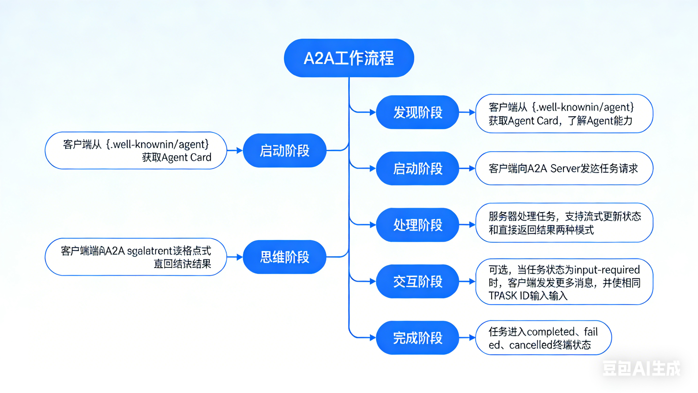

# AI Agent 从入门到精通：核心架构、A2A 协议与落地实践全指南

## AI Agent从入门到精通第一节


AI Agent是大模型走向实际应用的第一步，也是最关键的一步。正是AI Agent赋予了原本只能对话的大模型理解真实世界、感知环境并且采取行动的能力，从而真正把大模型和真实世界连接起来。

以前大家觉得大模型好虚无缥缈，但是现在有了AI Agent之后它就能帮我做事情了。就比如最常用的AI Agent帮我们写代码，在这里给大家演示一下。

- 比如在pure charm里面有一个智能体，大家可以看一下这个智能体。
- 选了智能体之后，这里首先它是大模型，但是它可以读取我电脑的一些内容，我自己电脑是不是相当于真实世界？它可以通过终端一些命令直接在我电脑上输入终端帮我执行这些命令，查看我的内存信息。这就是与真实世界交互的真实案例。
- 在这里让它帮我查看一下电脑的内存分布，然后它就可以帮我查看电脑内存分布。中间有报错，但是它能够知道报错怎么用，可以再进行修改。

通过这些东西，我这些命令也不知道怎么弄，它可以来帮我做。**所以才说AI Agent是最关键的一步，因为它能够让大模型真实的接触到世界**。这个例子先放这，后面还会讲一些更深的例子，这只是个浅显的例子。

下面直接进入正题，就来看一下到底什么是AI Agent。这里我想说如果真的了解了AI Agent，因为这毕竟是个入门的第一节课，如果真的掌握了可以先跳过，后面会讲很多的实战。

### **首先AI Agent是大模型能力的扩展的核心组件。**

这句话要怎么理解？首先是核心扩展的核心，因为大模型是不是只能对话？是不是要扩展它的能力？不想只能对话，感觉单单对话来说太low了，能理解吗？所以要进行扩展。

由什么来扩展？由AI人工智能来扩展，它是来突破大模型局限，局限就只能聊天，构建可执行复杂任务的智能体。在智能体之前也有一些大模型，比如deepseek可以进行网页的搜索，它就是相当于里边嵌入了网页搜索的程序，它可以进行网页搜索，这是一个工具。

**如果工具特别多，几十个工具、几百个工具，单纯的通过简单的程序是办不到的，所以就引入到AI agents**。


AI Agent和大模型的本质的区别到底是怎么样的？可以看下面这句话，AI Agent等于大模型加上规划、工具、记忆。这里边非常重要，


这里通过这几个维度来分析一下大模型和AI Agent的区别。

### 一、LLM与Agent的本质差异

**核心结论：Agent = LLM（基础能力） + 规划 + 工具 + 记忆**


| 能力维度       | LLM（基础模型）| Agent（增强型智能体）| **关键突破**               |
|----------------|----------------------------------|--------------------------------|--------------------------|
| **任务处理**       | 单次响应，无任务延续性          | 多步骤规划与闭环执行          | 解决复杂任务的核心能力   |
| **物理世界交互**   | 仅输出文字/代码，无法调用外部   | 通过工具API操作真实系统       | 从“思考”到“行动”的跨越   |
| **记忆能力**       | 仅对话上下文（短期）| 短期+长期记忆双层架构         | 跨会话、跨任务的知识复用 |
| **典型场景**       | 回答“什么是量子计算？”| “安排下周跨部门会议并生成纪要” | 从问答机到执行者的进化   |


最后讲完之后我们下面再来看下这个直观对比，我们人类是怎么思考的，我们大模型加上AI Agent之后是怎么思考的，要记住这种，我们来看一下。

**人类 vs LLM vs Agent 直观对比**

* **LLM：输入＋思考+输出（如 ChatGPT 回答问题）**
* **人类：输入＋思考+调用工具（计算器/日历）+依赖记忆+规划步骤＋输出**
* Agent:LLM +工具＋记忆 ＋ 规划一 实现类人工作


大家可以看这张图，这张图就是大模型的一个核心，那首先这个记忆的话，短记忆长记忆，工具就非常非常多了，规划的话我们是有很多种的，后面我们会讲到，然后行动的话就执行，这个行动其实内容不是很多，我们重点会讲工具、记忆和规划。

### 二、Agent四大核心组件概述

#### 1. 规划（Planning）—— 任务执行的“大脑”

核心机制：将模糊需求拆解为可执行子任务流，动态调整执行路径


| 关键能力   | 说明                     | 示例场景                                                                 |
|------------|--------------------------|--------------------------------------------------------------------------|
| 任务分解   | 大型任务→子任务序列      | 用户请求“分析Q3销售数据”→拆解为：①获取数据→②清洗数据→③生成图表→④撰写报告 |
| 思维链（CoT） | 逐步推理执行逻辑         | “为什么选择周二上午开会？”→检查日历空闲时段→匹配参会者偏好→输出结论       |
| 自我反思   | 执行中检查逻辑漏洞       | 生成报告后发现数据异常→自动触发重新分析流程                             |
| 终止判断   | 识别任务完成状态         | 当所有子任务完成+用户确认→主动终止运行，避免无限循环                     |


首先看第一个任务，**拆解这个任务拆解**的话是非常重要，不光是AI Agent，现在很多大模型比如说刚刚GPT-4它也有任务拆解啊，下边四维链呢我们按照一个啊逐渐推理的方式一步一步地推，比如说啊一个就以设为例的哈，就一、二、三、四，那么某些获取数据，清理数据，生成图表叫你报告，那么如果说你能够先生成图数据是先生成图表，再新数据吗？肯定是不可以的，对吧？

那么这个逻辑是不能错的，所以说四维链是从一层一层往下的地推，他是不能去错的这社区啊一层一层往下，不可能说我先做这第三层再做第二层，这是不可能不现实的

**自我反思**。自我反思就是如果清理结果错了，是不是要反思代码有没有什么问题？自己做的时候也是，我要写一篇报告，发现效果不太好，假如把论文给导师了，导师说你写的什么东西？是不是要自我反思？我错在哪了？进行修改，这是自我反思。

**终止判断。**终止判断什么意思？就是要判断是否做好了，每一件任务做好了是不是都有结果？来判断结果正确与否，是不是达到我的预期了，就能够判断它是否结束了


### 实操案例信息提取与解析

这是一个AI Agent执行任务的实操案例，核心是展示Agent如何处理“安排会议”的实际需求，具体信息如下：

#### 1. 用户需求

帮我安排下周与技术团队的头脑风暴会，需预留2小时，避开周五

#### 2. Agent规划流程

| 步骤 | 具体内容 | 说明 |
|------|----------|------|
| 1 | 拆解子任务：查日历空闲时段→识别技术团队可用时间→排除周五→创建会议→发送提醒 | 将模糊需求拆解为可执行的连续子任务 |
| 2 | 动态调整：发现周三下午全员有会→自动切换到周二上午 | 执行中根据实际情况灵活调整方案 |
| 3 | 终止条件：收到用户“确认”的回复后停止任务 | 明确任务完成的判断标准，避免无效循环 |


该案例体现了Agent的**规划能力**（任务拆解）、**动态调整能力**（自我优化）和**终止判断能力**，是Agent处理实际复杂任务的典型流程。


### 2. 记忆（Memory）—— 任务执行的“知识库”

核心架构：短期记忆（任务上下文）+ 长期记忆（外部知识库）


| 记忆类型 | 特点 | 存储方式 | 示例 |
|----------|------|----------|------|
| 短期记忆 | 任务执行中的临时上下文 | 对话历史缓存 | 当前任务中记录：<br>-“用户偏好上午会议”<br>-“已调用日历API查询空闲时段” |
| 长期记忆 | 持久化知识，跨任务复用 | 向量数据库（如ChromaDB） | - 公司产品手册（2025版）<br>- 历史会议纪要库<br>- 行业白皮书向量化存储 |


**该双层记忆架构让Agent既可以保留当前任务的临时信息，也能复用跨任务的长期知识，是实现复杂任务连贯执行的关键支撑**。


***记忆功能实操案例***

该案例展示了Agent的短期记忆与长期记忆在实际场景中的应用：


#### 1. 短期记忆应用（“安排会议”任务）

Agent临时存储的任务上下文信息：

```
短期记忆
1 [当前任务状态]
2 - 已查询日历：周二 10:00-12:00 空闲
3 - 用户偏好：上午时段
4 - 下一步：创建会议事件
```


#### 2. 长期记忆应用（“查询新能源市场规模”任务）

用户提问“新能源行业2025年市场规模？”时，Agent从向量知识库检索信息，对应的伪代码逻辑：

```python
# 伪代码：调用向量数据库
retrieved_doc = vector_db.query(
    query="2025 新能源市场规模",
    top_k=1
)
```

该案例体现了短期记忆对当前任务流程的连贯支撑，以及长期记忆对跨任务知识复用的能力，是 Agent 实现高效任务执行的核心记忆机制


该案例体现了短期记忆对**当前任务流程的连贯支撑**，以及长期记忆对**跨任务知识复用的能力**，是Agent实现高效任务执行的核心记忆机制。

### 3. 工具使用（Tools）—— 与物理世界交互的“手”

核心定义：工具矩阵是所有可API化的外部能力，是Agent连接现实世界的载体


| 工具类型     | 功能示例                | 调用场景                     | API示例                          |
|--------------|-------------------------|------------------------------|----------------------------------|
| 信息获取类   | 搜索工具（Google API）  | 获取实时股价、行业新闻       | `Search(query="特斯拉 Q3 财报")` |
| 计算处理类   | 代码执行器（Python沙箱）| 财务模型计算、数据可视化     | `CodeInterpreter(code="import pandas...")` |
| 系统交互类   | 日历API（Google Calendar） | 创建/查询会议             | `Calendar(create_event="...")`   |
| 企业系统类   | 数据库查询工具          | 读取CRM客户数据              | `DBQuery(sql="SELECT * FROM sales")` |


这些工具让Agent突破了大模型仅能输出文本的局限，实现了“获取信息→处理数据→操作系统→调用企业资源”的全链路能力，是Agent从“思考”落地到“行动”的关键支撑。

在AI Agent的运行逻辑中，大模型扮演着**核心决策大脑**的角色——类比人类撰写Word文档时，大脑负责构思内容，而电脑是实现创作的工具载体；

Agent的“大脑”（大模型）同样需要依托工具，才能将抽象的任务指令转化为可执行的实际操作。


#### Agent工具调用的典型工作流

Agent的工具调用是一个“大脑决策→工具匹配→结果整合”的自动化闭环：

1. **大模型决策工具需求**：当用户输入任务后，Agent的核心大模型会先分析任务目标（例如“计算月度销售数据的同比增长率”），自主判断完成该任务需要调用哪些工具；
2. **自动匹配工具矩阵**：大模型会从预设的工具列表中，筛选出适配当前任务的工具（以上述计算任务为例，会匹配“Python代码执行器”工具）；
3. **工具执行与结果回传**：工具调用后生成的结果（如计算出的增长率数值）会回传给大模型；
4. **大模型整合输出**：大模型将工具返回的结果与自身的语义理解能力结合，最终向用户输出结构化的任务结论。


#### 工具调用的核心原则

为了保证工具调用的效率与稳定性，Agent通常遵循以下设计原则：

- **最小调用原则**：仅在大模型无法独立完成任务时（如实时数据查询、复杂计算）才触发工具调用，避免资源冗余；
- **失败重试机制**：支持对工具调用失败的场景自动重试，并可配置重试次数、超时时间，同时可关联备用工具（例如“网络搜索工具”调用失败时，自动切换到备用搜索引擎API）。


这一工作流让Agent实现了“思考（大模型）”与“行动（工具）”的解耦与协同，也是其能够突破纯大模型局限、落地复杂任务的关键设计之一。

#### 工具调用典型工作流与原则

一、典型工作流（以“计算Q3销售额同比增速”为例）

用户输入：“计算Q3销售额同比增速，上季度120万，本季度150万”

1. **工具识别**：Agent判定需调用计算器工具
2. **生成调用指令**：`Calculator(value1=150, value2=120)`
3. **结果整合输出**：工具返回25%，Agent最终响应为：“Q3销售额同比增长25%（120万→150万）”


二、工具调用原则

- 非必要不调用：避免过度依赖工具，仅在大模型无法独立完成时触发
- 失败自动重试：如工具调用超时（如搜索类工具），自动切换备用工具（如备用搜索引擎）

### 4. 执行（Action）—— 任务落地的“行动引擎”

执行逻辑：根据规划和记忆驱动具体动作，形成任务闭环


| 执行阶段   | 关键动作               | 示例                                                                 |
|------------|------------------------|----------------------------------------------------------------------|
| 工具调用   | 调用匹配的API工具      | 调用 `Calendar()` 创建会议 → 返回事件ID `ev_20251110_meeting`        |
| 状态更新   | 将结果写入记忆         | 短期记忆新增：[会议已创建] ID: `ev_20251110_meeting`                 |
| 流程推进   | 触发下一步规划         | 检查“是否需发送提醒”→ 调用邮件API                                    |
| 异常处理   | 失败时自动回退/重试    | 日历API返回 `409 Conflict` → 重新查询空闲时段并重试                  |


**完整工作流示例场景**：会议安排任务

#### AI Agent 任务执行流程：以会议安排为例的落地实践

AI Agent 的核心价值之一，在于将抽象需求转化为可落地的自动化执行链路。任务执行环节作为 Agent 工作流的闭环终端，需结合业务场景定制化设计——不同任务（如数据计算、文件生成、系统操作）的执行逻辑存在差异，以下将以「跨部门会议安排」为典型场景，拆解 Agent 任务执行的核心流程与设计思路。

**一、任务执行的标准化流程框架**

以会议安排任务为例，Agent 的执行链路遵循「需求输入→规划拆解→分步执行→结果校验」的标准化逻辑，具体流程如下：

1. **需求触发与解析**：用户输入模糊需求（如「下周三安排与技术团队的2小时头脑风暴会，避开周五」），Agent 先通过自然语言理解（NLU）提取核心要素：参会对象、时间范围、时长限制、排除条件；
2. **规划方案落地**：基于前期拆解的子任务（查询日历空闲时段→匹配参会者可用时间→排除冲突时段→创建会议→发送通知），Agent 依次触发对应执行动作；
3. **分步执行与状态同步**：
   - 调用日历工具 API 读取当前用户及技术团队成员的日程数据；
   - 自动筛选符合「下周三+2小时+非周五」条件的空闲窗口；
   - 调用会议系统 API 创建会议事件，关联参会者账号；
   - 通过邮件/企业微信工具发送会议邀请，同步会议链接与议程；
4. **结果校验与闭环**：执行完成后，Agent 校验关键节点状态（如会议是否成功创建、参会者是否收到邀请），并向用户返回执行结果摘要（含会议时间、参会名单、修改入口），形成任务闭环。

#### 二、执行流程的定制化设计要点

Agent 的执行环节并非固定模板，需根据业务场景灵活配置，核心设计原则包括：

1. **模块化拆分执行单元**：将复杂任务的执行流程拆分为独立模块（如「数据查询模块」「系统操作模块」「通知模块」），便于后续维护与扩展——例如会议安排任务中，可单独新增「会议纪要生成模块」，在会议结束后自动调用文档工具生成纪要；
2. **状态监听与异常处理**：在执行过程中实时监听工具调用状态，针对异常场景（如日历 API 调用超时、参会者账号不存在）配置兜底策略，确保流程不中断；
3. **适配业务系统接口**：执行流程需与企业现有系统（如 CRM、OA、日历工具）的 API 无缝对接，例如会议安排任务需适配企业微信日历、飞书日历等不同接口协议，确保跨平台兼容性。

简言之，AI Agent 的任务执行环节是「规划逻辑」与「业务落地」的桥梁，通过标准化流程框架+定制化场景适配，实现从「知道怎么做」到「实际能做成」的关键跨越。


## 2 AI Agent 工作流程深度解析：以智能家居温控场景为例

### 引言

在上一节课程中，我们初步梳理了 AI Agent 与大语言模型（LLM）的核心差异，同时概述了 AI Agent 的四大核心组件（规划、记忆、工具、执行）。**本节课将通过一个具象化的智能家居控制案例，带大家深入理解 AI Agent 的完整工作流程，让抽象的技术概念落地为可感知的执行逻辑**。

### 案例背景：智能家居语音控制场景

本次案例的核心需求的是构建一套通过自然语言指令控制家居设备（空调、洗衣机、电视、灯具等）的 AI Agent 系统。**我们以最具代表性的“温度调节”场景为切入点，拆解用户指令“我有点冷，能不能把温度调高一点？”背后的 Agent 工作逻辑，完整还原从指令输入到任务闭环的全流程**。

智能家居 Agent 系统核心信息

* 适用系统：智能家居环境调控 Agent
* 核心能力：动态感知需求 → 智能规划 → 精准执行 → 闭环优化

### AI Agent 核心工作流程：感知→规划→行动→观察闭环

**AI Agent 核心工作流程（以智能家居温控为例）**

AI Agent 的任务执行遵循 **“感知→规划→行动→观察”** 闭环循环，通过动态迭代实现精准任务落地，具体流程如下：

| 流程阶段 | 核心动作 | 示例场景（“我有点冷，调高温度”） | 关键输入/输出 |
|----------|----------|----------------------------------|---------------|
| **感知（Perception）** | 采集多维度信息 | 1. 用户指令：“调高温度”<br>2. 实时环境数据：当前室温20℃<br>3. 历史记忆：用户过往偏好温度23℃ | 输入：指令+环境数据+记忆数据 |
| **规划（Planning）** | 加权决策与路径设计 | 1. 权重配置：用户舒适偏好（40%）+ 环境适配（60%）<br>2. 冲突处理：若夏季高温（需16℃）与用户偏好（23℃）冲突，反问用户确认<br>3. 执行路径：调用温控API→每分钟升温1℃→目标23℃ | 输出：带权重的执行方案 |
| **行动（Action**） | 工具调用与执行 | 1. 调用温控API设置目标温度23℃<br>2. 实时反馈：“预计8分钟后达到23℃”<br>3. 优化设计：<br>- 进度可视化（显示升温剩余时间）<br>- 人工干预接口（支持中断升温） | 输出：工具执行结果+用户反馈 |
| **观察（Observation）** | 结果校验与迭代 | 1. 监测实时温度是否达标<br>2. 询问用户：“当前温度是否合适？”<br>3. 迭代处理：合适则结束任务，不合适则返回“感知”阶段重新调整 | 输入：执行结果+用户反馈 |


**二、案例核心设计亮点**

1. **多维度权重决策**：避免单一因素主导，结合用户偏好与环境场景动态调整，提升决策合理性；
2. **冲突处理机制**：当用户需求与实际场景冲突时，通过主动询问实现人性化交互，而非强制执行；
3. **全流程反馈设计**：从升温进度提示到最终满意度询问，保持用户对任务的知情权与控制权；
4. **灵活干预接口**：支持用户随时中断或调整执行流程，适配不同场景（如夜间用户需快速入睡，减少冗余反馈）。


**三、关键结论**

AI Agent 的工作流程核心是 **“闭环迭代”** 与 **“场景适配”**：通过感知获取全面信息，依托规划制定精准方案，借助行动落地实际操作，基于观察优化后续流程，**最终实现从“被动响应”到“主动适配”的智能升级**。

且模块化的组件设计（工具、记忆、规划）降低了开发门槛，学习阶段可通过调用封装函数快速实现Demo，企业场景需额外考虑并发处理、数据存储等复杂需求。

AI Agent 的本质是一个动态迭代的智能系统，**其工作流程遵循“感知→规划→行动→观察”的循环逻辑**，通过持续交互与调整，确保任务精准落地。以下结合温控场景，逐一拆解各环节的核心机制。

#### 1. 感知（Perception）：多维度信息采集与整合

**核心任务：多模态需求解析**

感知是 Agent 工作的起点，核心目标是全面获取任务相关的多维度信息，为后续决策提供数据支撑。在温控场景中，感知环节需采集三类关键信息：

- **用户指令信息：核心需求“调高温度”，隐含诉求“解决寒冷不适感”**；
- **实时环境数据**：通过传感器或设备接口获取当前室温（案例中为 20℃）；
- **历史记忆数据**：从长期记忆库中调取用户过往温度偏好（如 2023 年 10 月 14 日曾将温度调至 23℃，2025 年 10 月 15 日的历史调节记录等）。

**这三类信息的完整性直接决定了后续决策的合理性，是 Agent 实现“个性化响应”的基础。**

#### 2. 规划（Planning）：加权决策与冲突处理

**核心任务：生成安全可行的行动策略**

规划是 Agent 的“决策中枢”，需基于感知到的信息，制定可执行的任务路径，并处理潜在的需求冲突。本场景中，规划环节包含两大核心动作：

- **加权决策设计**：为避免单一因素主导决策，需为不同影响因子配置权重。例如，将“用户舒适偏好”权重设为 40%，“环境场景适配”权重设为 60%，综合计算后确定目标温度。结合案例数据，用户历史偏好温度为 23℃，当前室温 20℃，最终规划目标为将温度升至 23℃；
- **冲突处理机制**：当用户偏好与实际场景存在矛盾时，Agent 需具备主动交互确认的能力。例如，若用户偏好 23℃，但实时场景为夏季高温（常规适配温度 16℃），Agent 会主动反问用户“当前为夏季高温环境，您希望将温度调至 16℃（场景适配）还是 23℃（个人偏好）？”，通过人性化交互化解决策冲突。


#### 决策因子矩阵

| 因子           | 权重  | 当前值          | 约束条件               |
|----------------|-------|-----------------|------------------------|
| 用户舒适偏好   | 40%   | 23℃（历史均值） | 22-25℃安全范围         |
| 能源效率       | 30%   | 低谷电价时段    | 避免骤升＞5℃           |
| 设备负载       | 20%   | 暖气余量80%     | 单次调节≤3℃            |
| 环境变化速率   | 10%   | 0.5℃/分钟       | 预估达稳时间8分钟      |


#### 3. 行动（Action）：工具调用与优化设计

核心任务：精准执行与透明化反馈

行动环节是 Agent 将规划方案落地的核心，需通过工具调用执行具体操作，并结合用户体验进行优化设计：

- **工具调用执行**：Agent 调用温控设备 API，发送温度调节指令，设置目标温度 23℃，同时配置升温策略（如每分钟升温 1℃）；
- **实时反馈同步**：向用户推送执行状态反馈，例如“已为您启动升温程序，当前室温 20℃，预计 8 分钟后达到目标温度 23℃”，让用户实时掌握任务进度；
- **体验优化设计**：
  - **进度可视化**：支持在设备控制页面显示升温剩余时间、当前温度变化曲线等信息；
  - **人工干预接口**：提供即时中断或调整功能，允许用户在升温过程中随时修改目标温度或停止操作；
  - **场景适配调整**：根据时间、场景动态优化交互频率。例如，夜间 10 点后用户发送调节指令时，减少冗余反馈，仅保留核心执行结果通知，避免影响用户休息。

**执行序列**

* a. **调用温控API**：`set_thermostat(target=23℃, ramp_rate=1℃/min)`
* b. **同步环境联动**：自动关闭窗户传感器（防热量流失）
* c. **用户反馈话术**：
* “已为您调高温度至23℃，暖气将逐步升温。当前室温20℃，预计8分钟后达到舒适状态。需要我提前开启客厅地暖吗？”

关键设计

- 提供**进度可视化（App推送温度变化曲线）**
- 预留**人工干预接口（语音/按钮中断调节）**  
  
  

#### 4. 观察（Observation）：结果校验与迭代优化

**核心任务：闭环验证与策略迭代**

观察是实现任务闭环的关键，Agent 需通过多渠道反馈校验执行效果，并根据结果决定是否进入下一轮循环：

该表格展示了智能家居Agent在观察阶段的核心监测指标、方式及优化触发条件，用于实现任务的闭环优化：

| 指标               | 监测方式                          | 优化触发条件               |
|--------------------|-----------------------------------|----------------------------|
| 环境参数达成率     | IoT传感器每30秒上报               | 偏差＞1℃且持续2分钟        |
| 用户显性反馈       | 语音/APP评分                      | 负面反馈≥1次               |
| 隐性行为信号       | 摄像头动作识别（加衣/开窗）| 检测到御寒动作             |
| 能源消耗效率       | 电表数据对比                      | 超基准值15%                |


- **结果校验**：通过设备传感器监测实时温度是否达到目标值（23℃），同时主动询问用户“当前温度是否合适？”，收集主观体验反馈；
- **迭代处理**：若用户反馈“合适”，则任务结束，将本次调节记录存入长期记忆库；若用户反馈“仍偏冷”或“过暖”，则返回“感知”环节，重新采集用户需求（如“您希望将温度调整至多少度？”），**启动新一轮“感知→规划→行动→观察”循环**。


### 核心设计亮点与实践启示

#### 1. 设计亮点

- 闭环迭代逻辑：通过“感知-规划-行动-观察”的循环机制，实现任务的动态优化，避免单一执行后无反馈的僵化问题；
- 人性化交互设计：在冲突处理、进度反馈、人工干预等环节充分考虑用户需求，平衡“自动化执行”与“用户控制权”；
- 模块化开发思路：核心功能（信息采集、决策规划、工具调用）拆分为独立模块，降低开发难度，便于后续扩展（如新增灯光控制、窗帘调节等功能）。

### 总结

AI Agent 的工作流程核心在于“闭环迭代”与“场景适配”：通过感知环节获取全面信息，依托规划环节制定精准方案，借助行动环节落地实际操作，基于观察环节优化后续流程，最终实现从“被动响应指令”到“主动适配需求”的智能升级。本次案例仅为基础演示，实际开发中可根据具体业务场景（如办公场景的设备联动、工业场景的自动化控制等）灵活调整流程与组件配置。


## 3 AI Agent 三大核心技术深度解析：MCP、Function Calling 与 A2A 协议

###  1 引言

AI Agent 作为大模型落地实际应用的核心载体，其技术栈的完整性直接决定了落地能力。

当前主流科技企业（如顺丰、德勤等）的招聘需求中，**MCP 协议、Function Calling、A2A 协议已成为 AI Agent 相关岗位的硬性要求**。

本文将深度拆解这三大核心技术，结合实操案例与底层逻辑，带大家从理论到实践全面掌握 AI Agent 的技术基石——让大模型从“思想的巨人”升级为“行动的强者”。

### 一、AI Agent 核心定位与技术前提

#### 1. 大模型与 AI Agent 的关系


**大模型是 AI Agent 的“大脑”，提供逻辑推理、语义理解等核心能力**；

**AI Agent 是大模型的“身体”，通过感知、工具、记忆三大组件，将大模型的文字输出转化为实际行动**。二者缺一不可：

- 无 AI Agent 的大模型：仅能局限于对话与文字生成，如同“纸上谈兵”，无法与真实世界交互；
- 无大模型的 AI Agent：**仅能按预设规则执行固定操作，缺乏自主思考与动态调整能力，沦为“没有灵魂的机器人”**。

#### 2. AI Agent 与传统自动化的核心差异

| 对比维度 | 传统自动化 | AI Agent |
|----------|------------|----------|
| **驱动逻辑** | 基于固定规则（if-else） | 基于目标自主规划 |
| **执行方式** | 固定流程，不可动态调整 | 感知环境变化，动态优化路径 |
| **核心依赖** | 预设脚本 | 大模型推理+工具协作 |

简言之，传统自动化是“按指令做事”，而 AI Agent 是“为目标想办法做事”。


**完整Agent的核心组件：**

* **感知懒块**：“眼睛和耳朵”，通过API、搜索引擎，文件系統等获故外部信息
* **工具集**：“手和脚”，可以调用各种函数、API、软件等来影响现实环境
* **记忆模块**：“工作日志和经历”，通过向量数据库或记忆流记录历史，用于长期规划和参考

### 二、核心技术一：MCP 协议——工具调用的“标准化接口”

#### 1. 什么是 MCP 协议？

**MCP（Model-Control Protocol）是 AI Agent 与外部工具之间的“沟通约定”**，**定义了工具的发现、注册、调用等标准化流程**。其核心价值在于解决传统工具调用的“碎片化问题”：

- **无 MCP 时：N 个大模型与 M 个工具需开发 N×M 种适配接口（如 3 个模型+4 个工具需 12 种接口），开发效率极低**；
- **有 MCP 时：所有大模型通过统一接口对接 MCP 协议**，所有工具也通过统一接口注册到 MCP，**仅需 M 种工具接口+1 种模型接口，大幅降低适配成本**。

MCP 本质是一套“约定俗成的格式规范”，并非复杂的底层架构，其核心目标是让大模型与工具的协作更高效、更灵活。

#### 2. MCP 协议实操落地（基于 FastMCP）

**（1）准备工作**

- 开发环境：Python 环境（推荐 3.8+）；
- 核心依赖：FastMCP 库（Python 开源 MCP 实现）；
- 客户端工具：Chatbox（可替换为 Cherry Still、VS Code 等）；
- 可选工具：UV（Python 包管理工具，用于快速安装依赖）。

**（2）核心实现步骤**

1. **安装依赖**：通过 pip 或 UV 安装 FastMCP 包：

   ```bash
   pip install fastmcp
   ```
   
   
2. **定义 MCP 工具描述**：需明确工具名称、功能、参数与返回值，让大模型理解工具用途（避免因描述模糊导致调用失败）。示例代码如下（以“天气查询工具”为例）：

```python
   from fastmcp import MCPTool

   # 定义天气查询工具
   weather_tool = MCPTool(
       name="weather_query",  # 工具名称（大模型可识别）
       description="获取指定城市的实时天气与预报信息",  # 工具功能描述
       parameters=[
           {"name": "city", "type": "string", "required": True, "description": "目标城市名称（如杭州）"}
       ],  # 输入参数
       return_description="返回城市、温度、天气状况、未来24小时预报"  # 返回值描述
   )
```
   
3. **注册工具到 MCP 服务**：初始化本地 MCP 服务，将工具注册进去：
   
```python
   from fastmcp import MCP Server

   # 初始化 MCP 服务器（本地运行）
   mcp_server = MCPServer(host="localhost", port=8080)
   # 注册工具
   mcp_server.register_tool(weather_tool)
   # 启动服务
   mcp_server.start()
```
   
```
 # 导入FastMCP类（核心修复点）
from fastmcp import FastMCP

# 一、创建FastMCP类
mcp = FastMCP("获取天气信息")

# 二、自定义工具（Stdio 模式）
@mcp.tool("获取天气信息")
def get_forecast(city) -> str:
    """
    获取天气信息
    参数:
        city (str): 城市名称
    返回:
        city_forecast : 当前城市的天气信息
    """
    # 这里只是简单的返回一个Mock，真实场景会调用天气API
    return city + "明天有大暴雨！"

# 三、初始化MCP Server
if __name__ == '__main__':
    print("MCP Server is running...")
    mcp.run(transport='stdio')
    print("MCP exist")
```
 
4. **客户端配置（Chatbox）**：

   - 打开 Chatbox，在设置中选择“MCP 配置”；
   - 选择大模型（推荐使用免费额度的 Bgeeling 模型）；
   - 添加 MCP 服务器：填写地址（localhost:8080）、名称（自定义，如“本地天气 MCP”）、类型（本地）；
   - 保存后启用 MCP，即可在对话中调用工具。

 


 


**（3）效果验证**

在 Chatbox 中输入“查询杭州的天气”，大模型会通过 MCP 协议自动调用注册的天气查询工具，返回结构化结果（如“杭州今日气温 25℃，晴，未来 24 小时无降雨”）。若工具调用失败，可通过 SSE 日志查看通讯流程（握手→注册→调用→返回），快速定位问题。


### 三、核心技术二：Function Calling——大模型的“工具调用指南”

#### 1. 什么是 Function Calling？

Function Calling（函数调用）是让大模型“知道何时调用、调用哪个工具”的核心机制，本质是一套精心设计的提示词（Prompt）。其核心目标是：

- 让大模型理解“哪些任务需要调用工具”（如计算、实时数据查询、系统操作等大模型无法独立完成的任务）；
- 让大模型明确“不同任务对应哪个工具”（如天气查询→天气工具，数据计算→计算器工具）。

大模型本身无法主动识别工具用途，需通过 Function Calling 提示词明确其角色定位与能力边界：

- 角色定位：定义大模型的身份（如“智能工具调度专家”）；
- 能力边界：明确“什么场景下调用什么工具”“调用工具的参数要求”“工具返回结果如何处理”。

#### 2. Function Calling 提示词设计示例

以“数值比较工具”为例，设计提示词如下：

```
角色：你是一名智能工具调度专家，负责根据用户需求选择合适的工具并正确调用。
能力边界：
1. 当用户需求为数值大小比较、复杂计算时，必须调用「数值比较工具」（工具名称：number_compare）；
2. 调用该工具时，需确保参数完整：必须包含两个数值（num1、num2），且参数类型为数字；
3. 工具返回结果后，需用自然语言向用户解释比较结果（如“9.1 小于 9.9，因为 9.1 的整数部分与 9.9 相同，小数部分 0.1 < 0.9”）。
工具参数说明：
{
  "name": "number_compare",
  "parameters": [
    {"name": "num1", "type": "number", "required": true},
    {"name": "num2", "type": "number", "required": true}
  ]
}
```

#### 3. 实际效果验证

- 无 Function Calling 时：低能力模型（如 2.57B 参数模型）会直接回答“9.9 小于 9.1”（逻辑错误）；
- 有 Function Calling 时：同一模型会自动调用「数值比较工具」，返回正确结果“9.1 小于 9.9”，并给出合理解释。

这证明 Function Calling 能有效弥补大模型在特定任务（如计算、精准匹配）上的不足，让工具调用更精准、更可靠。


#### Context Engineering

核心现点：Agent的本质就是一个精心设计的Prompt，**大模型本质上是“上下文学习者”：它们没有长期的记忆，每次交互都是独立的。你提供的上下文就是它此次交互的全部世界**

**Context Engineering vs Prompt Engineering:**

* **Prompt Engineering**：主要关注如何设计单次交互的提到可
* **Context Engineering**：关注如何构建完整的上下文，包括：

	* System prompt
	* User message
	* Docs（领城知识，工作对象等）
	* 工作记忆 （Message history）
	* 工具描述（如MCP注册的工具）

	
**Context长度挑战：**

* 工具描述过多可能导致Context Window避出
* 过长的Context会引发Context Rot问题（信息越多，越难focu5，越难抓住重点）
* 人类认知类似：信息量过大时难以抓住重点

### 四、核心技术三：A2A 协议——多 Agent 协作的“沟通桥梁”

#### 1. 什么是 A2A 协议？

A2A（Agent to Agent）协议是解决“单个 Agent 能力上限”的核心技术，定义了多个 AI Agent 之间的发现、协作、任务分配规则。其核心价值在于：


- **单个 Agent 的能力有限（如擅长订票的 Agent 不擅长路线规划），通过 A2A 协议可让多个 Agent 分工协作，共同完成复杂任务**；
- 解决大模型“上下文窗口溢出”问题：**当任务涉及的工具描述、历史记忆、领域知识过多时，单个 Agent 的上下文窗口无法承载，而多 Agent 可拆分任务，各自处理专属模块**。

目前 A2A 协议尚未形成成熟的落地标准，仍处于探索阶段，但多 Agent 协作已成为 AI Agent 发展的必然趋势——如同人类团队分工协作一般，未来复杂任务（如“规划一场跨国旅行”）将由多个专业 Agent 共同完成（订票 Agent+路线规划 Agent+酒店预订 Agent）。

**A2A核心概念说明表**

该表格梳理了A2A协议（多Agent协作协议）的关键组件与定义：

| 概念               | 描述                                                                 |
|--------------------|----------------------------------------------------------------------|
| Agent Card（卡片） | 位于 `/well-known/agent.json`，描述能力、技能、端点URL和认证要求，用于Agent发现 |
| A2A Server（服务器） | 实现协议方法，管理任务执行                                           |
| A2A Client（客户端） | 发送请求（如 `tasks/send` 或 `tasks/sendSubscribe`），消费A2A服务     |
| Task（任务）| 核心工作单位，有唯一ID，状态包括 `submitted`、`working` 等           |
| Message（消息）| 通信单位，角色为 `user` 或 `agent`，包含Parts                        |
| Parts（部分）| 内容单位，包括 `TextPart`、`FilePart`、`DataPart`                    |
| Artifacts（工件）| 任务输出，包含Parts                                                  |
| 流式传输           | 使用SSE事件更新长期任务状态                                           |
| 推送通知           | 通过webhook发送更新                                                  |


#### 2. A2A 协议协作流程（理论框架）

### A2A工作流程

A2A协议下多Agent协作的任务执行流程分为5个阶段：

1. **发现**：客户端从`/.well-known/agent.json`获取Agent Card，了解目标Agent的能力；
2. **启动**：客户端向A2A Server发送任务请求；
3. **处理**：服务器执行任务，根据任务类型选择流式更新状态或直接返回结果；
4. **交互（可选）**：若任务状态为`input-required`，客户端可通过相同Task ID补充输入信息；
5. **完成**：任务进入终端状态（如`completed`完成、`failed`失败、`canceled`取消）。



----

1. **Agent 发现**：通过 A2A 协议注册中心，各 Agent 发布自身能力（如“订票 Agent：支持国内外航班、高铁订票”）；
2. **任务拆分**：主 Agent 接收用户需求后，拆解为子任务（如“跨国旅行”→ 订机票+规划行程+订酒店）；
3. **Agent 调度**：主 Agent 通过 A2A 协议调用对应专业 Agent，分配子任务；
4. **信息同步**：各 Agent 完成子任务后，通过 A2A 协议向主 Agent 反馈结果；
5. **结果整合**：主 Agent 汇总所有子任务结果，向用户输出结构化答案。

当前阶段，可通过 LangGraph 等框架实现简单的多 Agent 协作（如两个 Agent 之间的任务流转），更复杂的 A2A 协议落地需等待行业标准的逐步完善。

### 五、三大核心技术的关系与落地价值

#### 1. 技术关系总结

- MCP 协议：相当于“工具库的标准化货架”，让所有工具按统一规则摆放，方便 Agent 快速取用；
- **Function Calling：相当于“Agent 的工具使用说明书”，让 Agent 知道何时用、用哪个工具**；
- **A2A 协议：相当于“Agent 团队的协作规则”，让多个 Agent 分工协作，解决单个 Agent 无法完成的复杂任务。**

三者共同构成了 AI Agent 的“工具协作生态”，缺一不可：无 MCP 则工具调用效率低，无 Function Calling 则工具调用无方向，无 A2A 则无法突破单个 Agent 的能力上限。

#### 2. 落地价值

掌握这三大核心技术，是 AI Agent 从“Demo 级验证”走向“生产级落地”的关键：

- 个人/小型团队：可快速搭建模块化的 AI Agent 系统，通过调用开源工具或自研工具，实现特定场景需求（如智能家居控制、办公自动化）；
- 企业级应用：可构建规模化的 Agent 平台，支持多工具接入、多 Agent 协作，解决复杂业务问题（如供应链优化、客户服务自动化）；
- 职业发展：当前大模型相关岗位对这些技术的需求极高，掌握后可大幅提升竞争力，适配大模型开发、AI Agent 架构设计等高薪岗位。

### 六、总结与展望

AI Agent 的核心价值在于“让大模型落地”，而 MCP、Function Calling、A2A 协议是实现这一价值的技术基石：**MCP 解决“工具如何高效接入”，Function Calling 解决“工具如何精准调用”，A2A 协议解决“复杂任务如何分工协作”。**

当前 AI Agent 技术仍处于快速发展阶段，A2A 协议等领域尚未形成统一标准，但这也为开发者提供了更多探索空间。未来，随着技术的不断成熟，AI Agent 将实现更高效的工具协作、更智能的任务规划、更灵活的多 Agent 联动，成为连接大模型与真实世界的核心桥梁。

后续我们将深入讲解 LangGraph 等多 Agent 协作框架的实操落地，以及 AI Agent 在企业场景中的复杂问题解决方案，敬请期待！