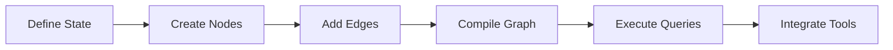

# 1 Introduction to Developing AI Agents

## 2 Understanding Fundamental Concepts of AI Agents


Here's a concise summary of the key points about AI agents from the provided text:

1.  **Definition:** An AI agent is an entity that perceives its environment (physical or digital) through sensors and acts upon that environment using effectors (per ISO definition).


2.  **Core Components:**
    *   **Sensors:** Gather raw data (percepts) from the environment (e.g., cameras, microphones, API calls).
    *   **Control Center:** The "brain" processes percepts, makes decisions, and plans actions (often using an LLM).
    *   **Effectors/Actuators:** Carry out actions to change the environment (e.g., moving an arm, updating a database, generating a report).
    *   **Environment:** The world (physical or digital) the agent operates within.
    *   **User Input:** External input provided (e.g., commands, data) usually by humans or other agents.
    *   **Percepts:** Raw data inputs from sensors.
    *   **Actions:** Changes made in the environment by effectors.


**An agent is anything that can perceive its environment and act upon that environment.**


## Exploring Different Types of AI Agents 

**Types of AI Agents**

* Simple reflex agents
* Model-based reflex agents
* Goal-based agents
* Learning agents

**Simple Reflex Agents** and **Model-Based Reflex Agents**:

### 1.  **Simple Reflex Agents:**

*   **Operation:** React *only* to current percepts (immediate inputs) with no memory of past events.
*   **Requirement:** Work best in **fully observable** environments.
*   **Mechanism:** Follow predefined `condition -> action` rules.
*   **Limitations:**
  *   Cannot learn, adapt, reason, or handle unobservable aspects.
  *   Require increasingly complex rule sets for complex environments (hard to scale/maintain).
*   **Example:** A thermostat turning on heat *only* if current temp < 10°C (fails if a window is open).
*   **Use Cases:** Basic spam filters (keyword matching), simple automated email responders.

> Simple Reflex Agent


Simple reflex agents make decisions based only on current percepts, ignoring history

They work only in fully observable environments

They follow Condition-action rules

- Limited intelligence.
- No knowledge of non-perceptual state aspects.
- Often too large to generate/store.
- Not adaptive to environmental changes

### 2.  **Model-Based Reflex Agents:**


**Model-based agents work in partially observable environments and track situations**

They have two key factors:

- **Model**: Knowledge of how the world works

- **Internal State**: Representation of the current state based on percept history

These agents use their model to make decisions

Updating state requires knowing:

- How the world evolves
- How the agent’s actions affect the world

*   **Operation:** React to current percepts *and* maintain an **internal state** based on past percepts (memory).
*   **Core Components:**
  *   **Model:** Knowledge of "how the world works" (e.g., how actions change the environment).
  *   **Internal State:** Representation of the current world state based on percept history.
*   **Advantage:** More adaptable than simple reflex agents; can handle **partially observable** environments.
*   **Mechanism:** Still use `condition -> action` rules, but conditions can include the internal state.
*   **State Update:** Relies on the model to understand world evolution and action effects.
*   **Use Cases:** Smart thermostats (using history & preferences), smart robotic vacuums (using sensor maps).

### **Key Differences Summarized:**

| Feature          | Simple Reflex Agent        | Model-Based Reflex Agent       |
| :--------------- | :------------------------- | :----------------------------- |
| **Memory**       | None                       | Yes (Internal State)           |
| **Observability**| Requires Full              | Handles Partial                |
| **Adaptability** | None (Rigid Rules)         | Higher (Uses Model & State)    |
| **Complexity**   | Rules bloat in complex env | More complex internally        |
| **Example**      | Basic Thermostat           | Learning Thermostat / Smart Vacuum |

Here's a concise summary of **Goal-Based Agents** and **Learning Agents**:

### 3 **Goal-Based Agents**

- Knowing the current state is not always enough for decision-making 
- Agents need a goal to define desirable outcomes 
- Goal-based agents enhance model-based agents with goal information 
- They select actions to achieve their goal 
- They evaluate action sequences through searching and planning, making them proactive


1.  **Core Function:**  
    *   Plan sequences of actions to achieve **specific goals** (desirable future states).  
    *   Extend model-based agents by incorporating goal information.  
2.  **Key Mechanism:**  
    *   **Searching & Planning:** Evaluate future scenarios to choose actions leading toward the goal.  
    *   **Proactive:** Focus on long-term outcomes rather than immediate reactions.  
3.  **Examples:**  
    *   **Chess AI:** Plans moves to win by evaluating long-term strategies.  
    *   **Logistics Route Optimization:** Plans efficient delivery paths based on priorities (e.g., fuel/time).  

---

### **4 Learning Agents**


A learning agent improves by learning from past experiences

It has four main components:

* **Learning element**: Improves by interacting with the environment
* Critic: Provides feedback on performance.
* Performance element: Selects external actions.
* **Problem generator**: Suggests actions for new experiences.

**Learning agents analyze performance and seek improvements.**


1.  **Core Function:**  
    *   Continuously **adapt and improve** performance through experience.  
    *   Start with basic knowledge and refine over time.
       
2.  **Key Components:**


    | **Component**       | **Role**                                                                 |  
    |---------------------|--------------------------------------------------------------------------|  
    | **Learning Element** | Improves knowledge/behavior based on environmental feedback.            |  
    | **Critic**          | Evaluates performance against a fixed standard (provides feedback).     |  
    | **Performance Element** | Executes actions (e.g., the agent’s decision-making module).          |  
    | **Problem Generator** | Suggests exploratory actions to gain new, informative experiences.   |  

3.  **Examples:**  
    *   **Recommendation Systems (Netflix/Amazon):** Learn user preferences to refine suggestions.  
    *   **Adaptive Thermostats:** Learn user habits (e.g., schedule, temperature preferences) to auto-adjust.  


## 3 Understanding Advanced AI Agents

* Leverage LLMs as a reasoning engine
* Use a language model to plan actions


1.  **Core Engine:** Rely on **LLMs (Large Language Models)** or **LMMs (Large Multimodal Models)** as their reasoning engine to plan and execute action sequences for achieving goals.

**Key Components of Advanced AI Agents**


2.  **Frameworks:** Built using popular frameworks/tools like **LangGraph, CrewAI, OpenAI's Swarm, Microsoft's AutoGen**, and others.

3.  **Control Center:**
    *   **Input Director:** Routes user input to the core model.
    *   **Core Model:** The LLM/LMM that processes input and generates outcomes.
    *   **Orchestrator:** Manages the overall system workflow and autonomy


4.  **Agentic AI:** Systems designed to **act autonomously** towards goals. "Agentic" describes the degree of agent-like qualities on a continuum (flexible categorization).

**The Spectrum of Agentic Systems**

1. Not an agent
2. Rule based
3. ML models
4. Adaptive AI
5. Autonomous

The concept of agentic represents a spectrum of agent-like qualities

5. Agentic AI Design Patterns

**Reflection (RL)**: Agents that can analyze their own outputs and identify areas of improvement

**Tool use:** Agents that can access and utilize tools to enhance their capabilities

**Planning and reasoning**: Agents that can think ahead, consider multiple options, and make informed decisions

**Multi-agent collaboration:** Multiple agents working together to solve complex problems

**Memory management:** Agents that can retain important context and history from past interactions

## 4 Introduction to LangGraph


### **LangGraph Implementation**

Using LangGraph to Create Agentic System for Shop Hours Inquiry

- LangGraph introduced by LangChain

- With LangGraph you can create highly controllable agents

1. **Library Overview**:


   - Stateful multi-actor application builder by LangChain creators  
   - Models workflows as **graphs** with three core components:

     - **State**: Shared data structure that represents the current snapshot (e.g., conversation history)
     
     - **Nodes**: Python functions handling logic of your agents (e.g., process input, call LLMs)
       
     - **Edges**: Python functions that determine which Node to execute next (decide next node based on state)  

3. **Workflow Setup (VS Code/Jupyter)**:  
   - **Dependencies**: Installed `langchain`, `langgraph`, OpenAI integration  
   - **LLM Setup**: Initialized `ChatOpenAI` with `gpt-3.5-turbo`  
   - **State Definition**: Used `MessageState` to store conversation history  
   - **Node Creation**:  
     - Defined `assistant_node` to process user queries + system prompts  
   - **Graph Assembly**:  
     - Added start → assistant → end nodes  
     - Compiled into runnable workflow  
     - Visualized graph structure  

下面是完整的中文翻译：

---

### **使用 LangGraph 构建商店营业时间查询的智能代理系统**

* **LangGraph** 由 **LangChain** 推出
* 使用 LangGraph 可以创建 **高度可控的智能代理（Agent）**

---

**1. 库概述（Library Overview）：**

* 由 LangChain 团队开发的 **有状态（stateful）多智能体应用构建工具**
* 使用 **图结构（graph）** 来描述工作流程，包含三个核心组件：

#### **State（状态）**

* 共享的数据结构
* 用来表示当前系统的快照（例如：对话历史）

####  **Nodes（节点）**

* Python 函数
* 用来处理代理的逻辑（例如：处理输入、调用 LLM 等）

####  **Edges（边）**

* Python 函数
* 用来决定下一个要执行的节点
* 根据当前 State 决策流程走向

---

####  **3. 工作流程设置（VS Code / Jupyter）**

* **依赖安装**：安装 `langchain`、`langgraph`、OpenAI 集成库
* **LLM 设置**：初始化 `ChatOpenAI` 使用 `gpt-3.5-turbo`
* **State 定义**：使用 `MessageState` 保存对话历史
* **节点创建（Node Creation）**：

  * 创建 `assistant_node` 用来处理用户问题和 system prompt
* **图结构构建（Graph Assembly）**：

  * 添加 `start → assistant → end`
  * 编译为可运行的工作流程
  * 可视化图结构


4. **Demo Execution**:  
   - Tested query: *"What is the capital of Sweden?"* → Correctly returned *"Stockholm"*

```
pip install -quit langchain_openai langchain_core langgraph

pip install --upgrade langchain langgraph
```

```
from langchain_openai import ChatOpenAI

llm = ChatOpenAI(
    model="gpt-oss:20b",  # Or the name of the model you downloaded in Ollama
    openai_api_base="http://localhost:11434/v1", # Ollama's API base
    api_key="not-needed"  # LM Studio does not require an API key
)
```


```
from langgraph.graph import MessagesState
from langchain_core.messages import HumanMessage, SystemMessage

sys_msg = SystemMessage(content="You are a helpful assistant to respond to general purpose queries.")

def assistant(state: MessagesState):
    return {"messages": [llm.invoke([sys_msg]+ state["messages"])]}
```

```
from langgraph.graph import START, StateGraph, END
from IPython.display import Image, display

builder = StateGraph(MessagesState)
builder.add_node("assistant", assistant)

builder.add_edge(START, "assistant")
builder.add_edge("assistant", END)

react_graph = builder.compile()
display(Image(react_graph.get_graph(xray=True).draw_mermaid_png(max_retries=5, retry_delay=2.0)))
```


```
messages = [HumanMessage(content="Tell me what is the capital of Sweden?")]
messages = react_graph.invoke({"messages" : messages})

for m in messages ['messages']: 
    m.pretty_print()
```

```
messages = [HumanMessage(content="Tell me what is the capital of Sweden?")]
messages = react_graph.invoke({"messages" : messages})

for m in messages ['messages']: 
    m.pretty_print()
```

### **Key Limitation & Next Step**

- **Problem**: LLMs lack real-time data (e.g., store hours/returns policy).  
- **Solution**: **Tool calling** to integrate APIs/databases (next section).

**CrewAI’s Key Components** 

CrewAI helps you create an organization of AI agents with specialized roles collaborating to accomplish complex tasks.

**Agent**

An autonomous entity that performs tasks and utilizes tools

**Task**

A specific assignment completed by an Agent

**Crew**

A team of agents collaborating to complete tasks

#### **Implementation Flow**



**Essence**: LangGraph enables building stateful agent workflows for Carved Rock's needs, starting with simple Q&A and extending to real-time tool integration.


### With deepseek

```
%%capture --no-stderr

pip install -U langchain-core langchain-community langchain-openai langgraph
```

```
from langchain_openai import ChatOpenAI

# Use your local DeepSeek model running in Ollama
llm = ChatOpenAI(
    model="deepseek-r1:1.5b",      # or deepseek-coder..., deepseek-r1, etc.
    openai_api_base="http://localhost:11434/v1",
    api_key="not-needed",         # Ollama does not require a key
    # verbose=True
)
```

```
from langgraph.graph import MessagesState
from langchain_core.messages import HumanMessage, SystemMessage

sys_msg = SystemMessage(content="You are a helpful assistant to respond to general purpose queries.")

def assistant(state: MessagesState):
    return {"messages": [llm.invoke([sys_msg] + state["messages"])]}
```

```
from langgraph.graph import START, StateGraph, END
from IPython.display import Image, display

builder = StateGraph(MessagesState)
builder.add_node("assistant", assistant)

builder.add_edge(START, "assistant")
builder.add_edge("assistant", END)

react_graph = builder.compile()
display(Image(react_graph.get_graph(xray=True).draw_mermaid_png(max_retries=5, retry_delay=2.0)))
```


```
messages = [HumanMessage(content="Tell me what is the capital of Sweden?")]

result = react_graph.invoke({"messages": messages})

for m in result["messages"]:
    m.pretty_print()
```

```
================================ Human Message =================================

Tell me what is the capital of Sweden?
================================== Ai Message ==================================

<think>
Alright, I need to figure out the capital of Sweden. Let's see... The user has asked for that specific information.

First, I should think about where capitals are often located. Usually, they are major cities. In Sweden, I'm pretty sure Carlsberg is a big city but didn't it get merged with another place? Maybe it was previously part of Gothenburg?

I remember reading that during their unification period, the capital was called "Gothenburg," but over time it became known as Carlsberg. That makes sense because it's a common city name in Sweden and still used today.

Also, when I did some quick research before, yes, the capital was Carlsberg after the merger. So that's probably the correct answer for the user.
</think>

The capital of Sweden is **Carlsberg** after its city has been renamed to honor Carl Bernöglie, the former capital from 1735 to 1906. Though it became officially known as Carlsberg until 1852 when it was part of Gothenburg (Gothenburg being a city near Malmö), as the user suggested, Carlsberg remains the current capital.
```


## Using LangGraph with Tool Calling to Create Agentic Workflow for Shop Hours Inquiry


✅ **Summary**

The article explains how to build a **multi-agent system** using LangGraph, where different specialized agents collaborate to answer user queries. Instead of relying on a single general-purpose agent with many tools, it is recommended to create **multiple specialized agents**, each responsible for a specific task and equipped with its own tools.

A **supervisor agent** (also an LLM-driven agent) is used to analyze user input and determine which specialized agent should handle each subtask.

The demo uses LangGraph’s pre-built agent architectures:

### **1. Specialized Agents**

Two agents are created using `create_react_agent`:

* **time_keeper_agent**

  * Uses a tool that returns the current date and time
  * Has its own system prompt and model

* **schedule_keeper_agent**

  * Uses a tool that provides the shop’s opening hours
  * Also has its own prompt and model

These agents operate independently and handle only their specific responsibilities.

### **2. Supervisor Agent**

A supervisor is created using `create_supervisor`:

* Manages communication between agents
* Routes tasks to the correct agent
* Uses the system prompt to decide when to call each agent
* Adds messages to conversation state with `output_mode`

### **3. Workflow Execution**

The compiled supervisor graph is tested with a combined question:

* *What are the shop’s weekend hours?*
* *Is the shop open now?*

The supervisor coordinates both agents:

* Calls the schedule agent for weekend hours
* Calls the time agent for the current time

The final response correctly determines the weekend hours and concludes that the shop is closed based on the current time (Saturday, 8:27 PM).

---

⭐ **Key Takeaway**

LangGraph makes it easy to build **hierarchical multi-agent systems** with:

* Specialized agents
* Tool-based actions
* A supervisor that orchestrates them

------


下面是上述总结的 **中文翻译版**：

---


文章介绍了如何使用 LangGraph 构建一个 **多智能体系统**，让多个专门代理协作回答用户问题。与其使用一个拥有所有工具的通用型大代理，更推荐创建 **多个各司其职的专门代理（specialized agents）**，每个代理只处理特定任务并使用专属工具。

一个 **监督代理（supervisor agent）** 会负责分析用户输入，并决定将每个子任务分配给哪个专门代理。监督代理本身也是一个 LLM 代理。

在示例中，作者使用 LangGraph 已预构建的代理架构：

---

### **1. 专门代理（Specialized Agents）**

使用 `create_react_agent` 创建了两个代理：

#### **time_keeper_agent（时间代理）**

* 使用一个“返回当前日期时间”的工具
* 拥有独立的 system prompt 和模型

#### **schedule_keeper_agent（营业时间代理）**

* 使用一个“返回商店营业时间表”的工具
* 同样有自己的 prompt 和模型

这两个代理互不干扰，各自处理自己的任务。

---

### **2. 监督代理（Supervisor Agent）**

通过 `create_supervisor` 创建：

* 管理所有代理之间的沟通
* 根据用户问题自动选择需要调用的代理
* 通过 system prompt 设定执行规则
* 通过 `output_mode` 控制消息如何写入状态

---

### **3. 执行工作流程**

测试时输入了两个合并的问题：

* 商店周末的营业时间是多少？
* 现在商店有开吗？

监督代理自动调用：

* 营业时间代理 → 获取周末营业时间
* 时间代理 → 获取当前时间

最终，系统正确得出：

* 周末营业时间
* 当前（周六晚上 8:27）商店已经打烊

---

⭐ **关键结论**

LangGraph 能够轻松搭建 **层级式多智能体系统**，具有：

* 专职代理
* 工具驱动动作
* 监督代理协调角色

让系统更加模块化、更易维护、更准确。

```
%%capture --no-stderr
pip install -quit langchain_openai langchain_core langgraph
```

```
from langchain_openai import ChatOpenAI
import datetime

llm = ChatOpenAI(
    model="gpt-oss:20b",  # Or the name of the model you downloaded in Ollama
    openai_api_base="http://localhost:11434/v1", # Ollama's API base
    api_key="not-needed"  # LM Studio does not require an API key
)

def shopopeninghours () -> str:
    "This tool provides the daily opening hours schedule for a shop."
    schedule = """Monday 10:00am to 08:00pm
                  Tuesday 10:00am to 08:00pm 
                  Wednesday 10:00am to 08:00pm
                  Thursday 10:00am to 08:00pm 
                  Friday 10:00am to 08:00pm
                  Saturday 11:00am to 05:00pm 
                  Sunday 1:00pm to 06:00pm"""
    return schedule

def Currenttime() -> datetime:
    "This tool provides the current date and time." 
    return datetime.datetime.now()

tools = [shopopeninghours,Currenttime]

llm_with_tools = llm.bind_tools(tools)
```

```
from langgraph.graph import MessagesState
from langchain_core.messages import HumanMessage, SystemMessage

sys_msg = SystemMessage(content="""
                    You are a helpful assistant responsible
                    for determining whether a shop is open or closed
                    based on the current time and the shop's opening schedule.""")
      
def assistant(state: MessagesState):
    return {"messages": [llm_with_tools.invoke([sys_msg]+ state["messages"])]}
```

```
from langgraph.graph import START, StateGraph
from langgraph.prebuilt import tools_condition
from langgraph.prebuilt import ToolNode
from IPython.display import Image, display

builder = StateGraph(MessagesState)

builder.add_node("assistant", assistant)
builder.add_node("tools", ToolNode(tools))

builder.add_edge(START, "assistant")
builder.add_conditional_edges("assistant", tools_condition)
builder.add_edge("tools", "assistant")

react_graph = builder.compile()

display(Image(react_graph.get_graph(xray=True).draw_mermaid_png(max_retries=5, retry_delay=2.0)))
```


```
messages = [HumanMessage(content="Tell me if the shop is open right now?")]
messages = react_graph.invoke({"messages" : messages})

for m in messages ['messages']: 
    m.pretty_print()
```

```
================================ Human Message =================================

Tell me if the shop is open right now?
================================== Ai Message ==================================
Tool Calls:
  Currenttime (call_p7bhcmyy)
 Call ID: call_p7bhcmyy
  Args:
================================= Tool Message =================================
Name: Currenttime

2025-11-16 11:24:46.089065
================================== Ai Message ==================================
Tool Calls:
  shopopeninghours (call_ytsmpjt6)
 Call ID: call_ytsmpjt6
  Args:
    date: 2025-11-16T11:24:46+01:00
================================= Tool Message =================================
Name: shopopeninghours

Monday 10:00am to 08:00pm
                Tuesday 10:00am to 08:00pm 
                Wednesday 10:00am to 08:00pm
                Thursday 10:00am to 08:00pm 
                Friday 10:00am to 08:00pm
                Saturday 11:00am to 05:00pm 
                Sunday 1:00pm to 06:00pm
================================== Ai Message ==================================

The shop's opening hours are from 10:00 AM to 08:00 PM on Monday through Friday, from 11:00 AM to 05:00 PM on Saturdays, and from 01:00 PM to 06:00 PM on Sundays.

According to the current time (2025-11-16 11:24:46), which is within the range of Monday's opening hours, the shop is currently **open**.
```

## Learning about Al Agents, Their types, and Architecture Using Real-world Demos


**CrewAI** is an open-source framework for building multi-agent systems, referred to as "crews." A crew is a team of specialized AI agents that collaborate to complete complex tasks.

### Core Concepts:

*   **Agent:** An autonomous unit with a specific role, goal, and backstory that performs tasks using tools.
*   **Task:** A specific assignment for an agent, defined by a description, expected output, and an assigned agent.
*   **Crew:** A group of agents that work together, defining the strategy for task execution and collaboration.

### Key Features & Implementation:

*   **Model Flexibility:** Uses **LiteLLM**, allowing seamless switching between over 100 different language models (default is OpenAI's GPT-4).
*   **Configuration via YAML:** Agents and tasks are typically configured in YAML files, specifying their roles, goals, and backstories.
*   **Dynamic Inputs:** Uses placeholders in configuration files (e.g., `topic`) that are filled with values when the crew is run.
*   **Task Execution:** Supports two methods:
    *   **Sequential:** Tasks run one after another.
    *   **Hierarchical:** A manager agent dynamically assigns tasks.
*   **Output Options:** Tasks can be configured to save their output directly to a file.

根据文章内容，以下是 CrewAI 框架的总结：

**CrewAI** 是一个用于构建多智能体系统的开源框架，该系统被称为“团队”。一个团队是由专门的人工智能智能体组成的，它们相互协作以完成复杂任务。

### 核心概念：

*   **智能体：** 一个具有特定角色、目标和背景的自主单元，能够使用工具执行任务。
*   **任务：** 分配给智能体的具体工作，通过描述、预期输出和指定的智能体来定义。
*   **团队：** 一组共同协作的智能体，定义了任务执行和协作的策略。

### 主要特性与实现：

*   **模型灵活性：** 使用 **LiteLLM**，允许在超过 100 种不同的语言模型之间无缝切换（默认为 OpenAI 的 GPT-4）。
*   **通过 YAML 配置：** 智能体和任务通常在 YAML 文件中进行配置，指定其角色、目标和背景故事。
*   **动态输入：** 在配置文件中使用占位符（例如 `topic`），这些占位符在运行团队时会被填入具体值。
*   **任务执行：** 支持两种方法：
    *   **顺序执行：** 任务一个接一个地运行。
    *   **分层执行：** 一个管理型智能体动态地分配任务。
*   **输出选项：** 可以配置任务将其输出直接保存到文件中。

