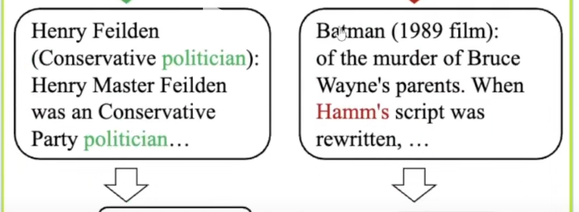

# Agentic RAG 七大架构范式深度解析：从单智能体到端到端自动化

## 引言
随着大模型技术的演进，传统 RAG（检索增强生成）已难以满足复杂场景下的灵活检索、多源信息整合与高精度输出需求。Agentic RAG 作为融合智能体（Agent）能力的进阶形态，通过引入自主决策、分工协作、动态调整等核心特性，让检索系统从“机械匹配信息”升级为“智能解决问题”。

本文将系统拆解 Agentic RAG 的七种核心架构范式，分析其设计逻辑、适用场景、优缺点，为技术选型与系统搭建提供实战参考。

## 一、单智能体架构（Single Agentic RAG）：极简入门的全能选手

> Single-Agent RAG 是 Agentic RAG 的最基础形式，系统中只引入一个智能体（Agent）来执行任务，主要用于处理多数据源检索任务。

### 核心设计逻辑

单智能体架构是 Agentic RAG 的基础形态，核心思路是通过**一个智能体端到端承接全流程任务**。该智能体集“**路由决策、工具调用、信息筛选、答案生成”于一体，无需多角色协作，直接响应用户查询。**

### 架构特点

* **核心角色**：一个智能体负责整个**任务流程，包括检索、工具选择章、上下文判断与答案生成**。
* **路由能力**：该智能体可以作为”路由器”（Router），根据查询内容动态決定从哪个知识源或工具中提取信息。

### 关键特性

1. **角色高度集中**：一个 Agent 同时承担“侦察兵（检索信息）、分析师（判断相关性）、发言人（生成回答）”多重角色；
2. **动态路由能力**：根据用户查询内容灵活选择信息源，例如查询产品价格时调用内部数据库，查询行业趋势时切换至外部搜索引擎；
3. **多工具兼容**：支持接入向量数据库、网页搜索 API、企业内部系统（如 Slack、邮件日志）等多种数据源。

### 执行流程

**用户输入查询 → Agent 自主判断信息需求 → 调用适配工具/数据源检索 → 筛选有效上下文 → 大模型生成最终回答。**

### 适用场景

- 数据源少、任务边界明
- 确的场景（如固定文档库的 FAQ 系统）；
- 快速验证想法、搭建 MVP（最小可行产品）的场景；
- 中小型团队的客服 Agent（需同时访问工单系统、用户历史记录）。

**FAQ 系统**：可根据问题类型判断是从数据库、网页还是 FAQ 文档中获取答案。

**客服 Agent**：接入多个业务系统（工单、邮件、用户行为日志）提供支持。

### 优缺点

| 优点 | 缺点 |
|------|------|
| 实现简单、结构清晰，开发成本低 | **任务复杂时易过载，处理效率下降** |
| 动态选择信息源，比传统 RAG 更灵活 | **功能高度耦合，单独优化某一模块（如检索策略）难度大** |
| 适配小型场景的快速落地需求 | 扩展性差，难以应对多模态、多步骤任务 |

## 二、多智能体协作架构（Multi Agentic RAG）：分工明确的团队作战

**Multi-Agent RAG 是更复杂的 Agentic RAG 实现，系统中引入多个功能划分明确的智能体，通过主控智能体（master agent）协调各个专职智能体（specialized agents）协同完成任务**。

### 核心设计逻辑

针对单智能体的过载问题，多智能体架构通过“**主控 Agent + 专职 Agent**”的分工模式，**将复杂任务拆解为子任务，由不同领域专家各司其职，最终整合结果**。

### 关键角色与职责

1. **主控智能体（Master Agent）**：不参与具体检索，专注三大核心工作
	* 任务拆解（将复杂查询拆分为可执行子任务）
	* 任务分配（匹配对应专职 Agent）
	* 结果汇总（整合子任务输出，形成完整上下文）；
2. 专职智能体（Specialized Agent）：每个 Agent 聚焦单一领域能力，例如“内部文档检索 Agent”“实时网络搜索 Agent”“企业系统数据调取 Agent（对接 ERP/邮箱）”。

* Agent A: 检索内部文档数据
* Agent B: 基于 Web 执行实时搜索
* Agent C：调用公司 API 查邮箱

### 执行流程

用户输入查询 → 主控 Agent 拆解任务 → **分配给对应专职 Agent → 各 Agent 并行检索/处理 → 反馈结果至主控 Agent → 整合上下文 → 大模型生成回答**。

### 适用场景

- 企业级问答系统（需跨内部数据库、产品文档、市场报告、外部新闻整合信息）；
- 多模态信息检索（如图片识别+文字检索+视频片段匹配的协同任务）；
- 跨系统数据整合场景（需同时调用多个内部 API 拉取数据）。

**企业级问答系统**：结合私有知识库、ERP 系统数据、外部 API、公共网页搜索。

**多模态信息检索**：文字 Agent 检索文本，图像 Agent 调用图像识別模块，视频 Agent 查找相关片段。

### 优缺点

| 优点 | 缺点 |
|------|------|
| 模块化强，单个 Agent 可独立升级、替换 | 架构复杂度高，需设计任务调度、Agent 通信机制 |
| 支持复杂任务链，适配多步骤推理需求 | **存在协调风险，可能出现重复检索、信息冲突或遗漏** |
| 并行执行效率高，可针对不同子任务独立调优 | **成本敏感，多 Agent 调用大模型/API 会导致费用与延迟上升** |

## 三、层级式架构（Hierarchical Agentic RAG）：多层治理的可控协作

**核心理念**： **采用多层级（Hierarchical） 智能体架构**，由上层智能体（如主控 Agent）协调下层专职智能体（如检索 Agent、 生成 Agent）完成复杂任务。

### 核心设计逻辑

层级式架构在多智能体基础上引入“**上下级治理关系**”，构建树状组织结构。上**层 Agent 不仅负责任务分配，还能监督下层 Agent 的执行过程，通过动态反馈实现容错与方向校正，解决复杂任务的多层推理问题**。

### 架构特点

* **主控智能体**：负责任务分解、子任务分配和结果整合。
* **专职智能体**：各自承担特定功能，**如检索、生成、验证等**。
* **层级协作**：上层智能体可监督和指导下层智能体的操作。

### 关键特性

- **分层协作**：上层为主控 Agent（任务拆解、监督、结果整合），下层为专职 Agent（执行具体检索/处理任务）；
- **反馈闭环**：上层 Agent 实时观察下层执行结果，若检索质量低则要求重试，若输出偏离主题则调整方向；
- **多级扩展**：可按需增加中间层（如验证层、仲裁层），例如针对冲突信息新增“仲裁 Agent”判断可信度。

### 与多智能体架构的核心差异

- 多智能体架构是“扁平式协作”：**主控 Agent 分配任务后，各专职 Agent 独立执行，无层级依赖**；
- 层级式架构是“树状治理”：**下层 Agent 受上层监督，结果会影响上层决策，形成持续交互的闭环**。

### 适用场景

- 多文档交叉对比问答（需从十几份报告中定位信息并逐级校验）；
- 跨领域复杂信息整合（如同时涉及技术参数、法律合规、市场数据的查询）；
- **对执行过程可控性要求高的场景（如金融、政务领域的精准检索）**。

### 优点

- 模块化与扩展性强，可灵活增加中间治理层；
- **执行过程可控，容错率高，减少结果偏差；**
- **适配多层推理需求，提升复杂任务的处理精度**。

## 四、纠错型架构（Error-Correcting Agentic RAG）：守住准确性底线的自我反思者

引入反馈机制，智能体在生成初步回答后进行自我评估，识别并纠正潜在错误，提升回答质量。

### 核心设计逻辑

针对大模型“幻觉”与事实错误问题，纠错型架构引入“**生成-评估-修正**”的闭环机制。通过专门的“批评者模块”校验初步回答，主动修正事实偏差、逻辑矛盾，确保输出结果的准确性。

### 关键流程

1. **初步生成：Agent 检索上下文后，按传统 RAG 流程生成初步回答**；
2. **批评校验**：专门的 Critic Agent 评估回答——是否与检索事实一致、逻辑是否自洽、是否遗漏关键信息；
3. **迭代修正**：若发现问题，反馈至生成 Agent 重新调整，循环至满足预设质量标准。

### 适用场景

- 对准确性要求极高的领域（如医疗咨询、法律问答、金融数据分析）；
- 需避免事实错误导致严重后果的场景（如药品剂量查询、法条引用咨询）。

### 优点

- 显著降低错误率与幻觉现象，提升输出可信度；
- **形成质量把关机制，适配高风险领域需求**；
- 增强用户信任度，适合作为决策支持工具。

## 五、自适应架构（Adaptive Agentic RAG）：随机应变的策略调整者

智能体根据任务需求和中间结果，动态调整检索策略和工具选择，实现更灵活的任务处理。

### 核心设计逻辑

现实场景中需求常模糊多变、信息来源零散，自适应架构通过“**动态决策+实时反馈**”，让 Agent 不依赖预设脚本，根据任务进展灵活调整检索策略、工具选择与任务拆分方式。

### 关键特性

1. 动态决策：执行中持续评估上下文，例如检索结果过泛时换精准关键词重查，发现多领域需求时自动拆分子任务；
2. **多工具集成：像“瑞士军刀”般适配向量数据库、外部搜索 API、其他 Agent 等多种能力**；
3. **实时反馈：中间结果直接作为下一步决策输入，过程中不断校准方向，而非等到最终才判断对错**。

### 典型场景示例

用户查询“最近值得关注的科技新闻”：

- 第一步调用主流媒体 API 检索，发现内容不够深入；
- 动态切换至专业科技博客重新检索；
- 整合信息后生成结构化回答。

### 适用场景

- 需求模糊、开放或持续演进的场景（如趋势分析、跨领域研究）；
- 信息来源多样且质量不均的场景（如同时检索学术文献、政策文件、行业报告）；
- 任务目标随过程动态变化的场景。

### 优点

- 灵活性与适应性强，应对模糊需求的能力突出；
- 避免盲目检索，将资源集中于有效路径，提升效率与准确性；
- 主动优化策略，而非被动执行预设流程。

## 六、图结构架构（Graph-Structured Agentic RAG）：挖掘隐性关系的推理专家

利用图数据库表示知识结构，智能体通过图遍历和多跳推理，实现更深层次的信息检索和理解。

### 核心设计逻辑

针对实体间复杂关系的检索需求，图结构架构以“**知识图谱**为底层支撑，让 Agent 具备多跳推理能力，从‘点查询’升级为‘路径挖掘’，发现隐藏在多层关系背后的答案。

### 核心组件与流程

#### 1. 知识构建阶段

- **结构化数据（CSV、数据库表）直接转换为图谱节点与关系**；
- **非结构化文本（文档、网页）经分块→实体提取→语义向量生成后，整合进知识图谱，形成实体关系网络**。

#### 2. 查询响应阶段

- 混合检索：结合向量检索（匹配语义相似文本）与图检索（挖掘实体关系路径）；
- 多跳推理：Agent 沿图谱路径跳转，例如从“张三”→“A公司（张三任职CTO）”→“B公司（A公司股东）”→“制裁名单（B公司关联企业）”；
- 结果整合：汇总文本信息与图谱关系，生成结构化回答。

### 关键特性

- 知识图谱驱动：以实体（人、公司、法条）与关系（任职、控股、引用）为核心组织知识；
- 多跳推理能力：突破传统检索的“关键词匹配”局限，挖掘隐性关联；
- 混合检索模式：融合向量检索的广度与图检索的深度。

### 适用场景

- 实体关系密集型任务（如商业尽职调查、法律合规分析）；
- 学术研究（挖掘文献引用关系、领域术语关联）；
- 复杂问题推理（如“某公司高管是否与被制裁企业有关联”）。

### 优点

- 提升信息检索的深度，发现多层隐性关系；
- 增强系统推理能力，从“查找信息”升级为“理解关系”；
- 适配实体密集型场景的精准检索需求。

## 七、文档流程式架构（Document-Flow Agentic RAG）：端到端自动化的文档处理专家

**通过智能体自动化处理文档相关任务，实现从文档解析、信息提取到结构化输出的全流程自动化**。

### 核心设计逻辑

区别于以上“以查询为起点”的架构，文档流程式架构以“**整份文档为输入**”，**通过 Agent 自动化完成“文档解析→信息提取→结构化输出”的全流程，无需人工干预，解决大批量文档处理的效率问题。**

### 关键流程

1. **文档解析**：Agent 识别文档结构（章节、表格、标题、签名位置），适配 PDF、Word、扫描件等多种格式；
2. **信息提取**：结合 RAG 技术精准定位关键信息，例如从合同中提取租赁期、租金、押金，从医疗报告中提取诊断结果；
3. **结构化输出**：将提取的信息组织为 JSON、数据库记录或预设表单，便于下游系统直接使用（如填入 CRM、触发审批流）。

### 适用场景

- 高重复、大批量的文档处理任务（如合同审查、财报分析、表单填写）；
- 文档密集型行业（金融、法律、政务）的自动化流程；
- 需将非结构化文档转换为结构化数据的场景。

### 优点
- 显著提升文档处理效率，降低人工操作成本；
- 输出标准化，适配下游系统集成需求；
- 准确性高，减少人工提取的遗漏与错误。

## 八、七大架构的演进逻辑与选型建议

### 演进路径总结

七种架构并非相互替代，而是沿着“**功能单一→分工协作→精准可控→灵活自适应→深度推理→场景拓展”**的路径演进：

1. 从“单智能体”的极简落地，到“多智能体”的分工协作；
2. 从“层级式”的可控治理，到“纠错型”的准确性保障；
3. 从“自适应”的动态调整，到“图结构”的深度推理；
4. 从“查询响应”到“文档流程”的场景拓展，实现端到端自动化。

### 选型核心原则

1. 按任务复杂度选型：简单场景（少数据源、明确需求）选单智能体；复杂场景（多源信息、多层推理）选多智能体/层级式；
2. 按准确性要求选型：高风险领域（医疗、法律）必选纠错型架构；
3. 按数据类型选型：实体关系密集型任务选图结构架构；文档处理任务选文档流程式架构；
4. 按落地成本选型：快速验证选单智能体；企业级规模化应用选多智能体/层级式+自适应的组合架构。

## 总结

Agentic RAG 的核心价值在于让检索系统具备“自主决策、协作执行、动态优化”的智能能力，从“被动响应查询”升级为“主动解决问题”。

七种架构范式覆盖了从入门到进阶、从单一场景到复杂系统的全需求，实际落地中可根据业务场景灵活组合——例如企业级智能检索系统可融合“层级式治理+自适应路由+图结构推理+纠错机制”，打造兼具效率、精度与灵活性的解决方案。

随着大模型与 Agent 技术的持续发展，Agentic RAG 还将向“多模态协同、跨领域自适应、更低成本部署”方向演进，成为连接多源信息与实际需求的核心桥梁。