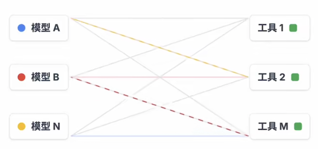
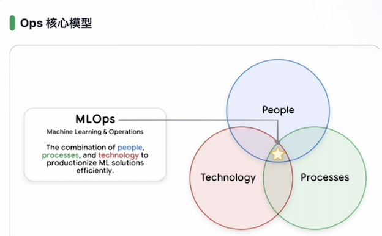

# Google AI Agent 白皮书深度拆解

## Day01 工程化视角下的 Agent 底层框架与落地指南

### 引言

Google 发起了一场颠覆性的 AI 技术分享——连续五天开源五篇 AI Agent 白皮书。这一举措并非单纯的技术发布，而是为行业提供了一套可直接落地的“架构对齐、语言统一、工程落地”官方材料包，将 AI Agent 从“Prompt+工具”的 Demo 级玩具，正式推向**可构建、可评估、可运维、可部署**的全生命周期工程系统。

这五篇白皮书构成了一条清晰的工程化路线图：**先定义 Agent 核心概念，再补充工具与互操作能力（重点为 MCP 协议），接着深入会话与记忆的上下文工程，随后落地质量、可观测性与评测体系，最后实现从原型到生产的跨越（含多智能体协作协议与部署治理）**。


本文将聚焦第一篇《Introduction to Agents》，从定义、核心组件、运行机制、分级体系、工程落地等维度，拆解 Google 眼中的 Agent 底层逻辑，为技术架构设计、平台搭建与产品落地提供统一的技术参考。

### 一、重新定义 Agent：并非“增强版 LLM”，而是工程化系统

在行业讨论中，Agent 常被误解为“更会聊天的大语言模型（LLM）”，但 Google 给出了明确的工程化定义：**Agent 是一套由 Model（大脑）、Tools（双手）、Orchestration Layer（神经系统）、Runtime/Deployment Services（身体与腿）构成的可构建、可运行、可治理的工程系统**。其核心特征是“**LM in a loop**”——通过持续运转的控制回路，每一轮将任务目标与上下文输入模型，由模型决策是否调用工具，再将工具结果结构化后回写上下文，进入下一轮循环，直至任务闭环。


#### 与传统对话接口的本质区别

- 传统对话接口：即便支持 Function Calling，仍属于“一问一答”的应用层交互工具，缺乏稳定的循环机制与运行时支撑，无法自主完成复杂任务；
- Agent 系统：具备“**感知-决策-行动-反馈**”的闭环执行能力，通过编排层管理状态与上下文，依托运行时服务实现可观测、可控制、可扩展，核心价值是“自主完成真实世界任务”。

#### 真正的分水岭是 Context Engineering

Agent 不是“聊天”，而是对上下文的主动选、装、控

**选 Select**： 每一步只取最相关信息， 拒绝全量回填

**装Pack**： 组织为 可用结构

* 任务状态 （State）
* 关键事实 （Facts）
* 工具结果摘要

**控 Control**： 控制噪声与长度， （避免 Context 撑爆）


### 二、Agent 四大核心组件：分工协同的工程架构

Google 将 Agent 拆解为四大核心组件，各组件各司其职、协同运转，共同构成稳定的任务执行体系：

> 大脑负责思考，双手负责行动，神经系统负责调度，身体负责长期运行

### 1. Model：决策大脑

> 推理与决策引擎。 决定系统的智力上限与能力边界。

核心职责是理解任务目标、进行多步推理、生成执行计划，决定“做什么”和“怎么做”。需明确的是，**模型本身不等于 Agent**，仅为决策核心，必须与其他组件结合才能形成闭环能力。

#### 2. Tools：交互双手

> 连接现实世界。 提供API调用、检索与数据读写能力。

是 Agent 与现实世界交互的载体，**分为信息获取类（搜索工具、RAG 向量库、知识图谱）、数据处理类（SQL 执行器、代码沙箱）、业务操作类（邮件发送、工单系统调用、CRM 写入）、人机协同类（请求用户确认、补充关键信息）**。没有工具，Agent 的决策只能停留在口头建议，无法落地为实际行动。

#### 3. Orchestration Layer：神经中枢（最关键的“隐形组件”）

> 驱动循环与策略。 管理记忆（Memory）、状态（State）与规划。

这是最容易被忽略但决定系统成败的核心层，负责串联“**Think（思考）-Act（行动）-Observe（观察）** ”循环，承担状态管理、上下文编排、工具调度三大核心职责：

- 循环控制：触发模型推理、工具调用、结果回写的闭环流转；
- 状态管理：记录任务进度、已调用工具、关键参数、未完成缺口；
- 上下文优化：筛选有效信息、结构化工具结果，避免 Context Window 溢出。

#### 4. Runtime/Deployment Services：落地支撑

> 交付为在线服务。确保监控、治理、安全与可扩展性。

决定 Agent 能否从原型变成长期在线的服务，提供部署、监控、日志、权限、扩缩容等基础能力。很多团队无法做出生产级 Agent，并非模型不够强，而是缺乏完善的**编排层与运行时服务**，导致系统不可控、不可观测、不可治理。

### 三、Agent 核心运行机制：“五步循环”的工程化落地


Agent 的核心不是输出优美文本，而是通过可重复的循环将任务逐步落地，其运行遵循“五步循环”法则，每一步都对应明确的工程化目标：

#### 1. Get a mission（获取目标）

目标来源包括用户主动输入（如“查询订单12345的物流状态”）或系统触发（如“定时生成月度销售报表”），核心是明确任务边界与预期结果。

#### 2. Scan a scene（扫描现场）

收集所有与任务相关的上下文信息，包括用户输入细节、历史会话记录、可用工具清单、已有事实数据等，为决策提供全面支撑。

#### 3. Think it through（规划推理）

模型基于目标与现场信息，生成可执行的分步计划。例如“查询订单物流”任务，计划可拆解为：①查内部库确认订单存在并获取运单号；②用运单号查询承运商实时状态；③汇总事实生成用户易懂的回复。

#### 4. Take action（执行行动）

由编排层根据规划选择适配工具，发起具体的 Tool Call。例如调用“内部订单查询工具”获取运单号，再调用“物流承运商查询工具”获取实时状态。

#### 5. Observe and iterate（观察迭代）

将工具返回结果**结构化处理**（避免原始 JSON 直接占用 Context Window），回写至上下文，再判断是否需要进入下一轮循环（如信息不足则补充调用工具，信息齐全则终止循环）。


#### 核心逻辑: 

Agent 不是聊天机器人，而是"多轮循环直到达成目标“的系统

#### 工程化关键：拆解“Think-Act-Observe”职责

- Think：Model 专属职责，负责规划与决策，决定下一步需获取的信息与调用的能力；
	- 输入：任务（Mission）+ 场景上下文
	- 输出：行动计划＆下一步动作选择	
- Act：Tools 专属职责，负责实际执行查询、修改、代码运行等操作；
	- 执行：**API调用/数据库查询/代码执行**
	- 产出：**Observation（原始工具结果）**
- Observe：系统专属职责，核心是将工具返回转化为“结构化、可筛选、可追踪”的上下文，避免模型在噪声中决策，同时为链路追踪（Trace）提供天然边界。
	- 转化：将 Observation 清洗为下一轮可用信息
	- 控制了：压缩信息密度，避免上下文膨胀

	
#### 客服场景实例：完整跑通五步循环

用户需求：“我的订单12345现在到哪了？”

1. Get a mission：明确目标——查询订单12345的实时物流状态；
2. Scan a scene：确认可用工具（内部订单库查询、物流承运商查询），收集用户输入（订单号12345）；
3. Think it through：规划三步计划——①查内部库确认订单+获取运单号；②查承运商物流状态；③生成回复；
4. Take action：调用“内部订单查询工具”，输入订单号12345；
5. Observe and iterate：获取工具返回（订单存在，运单号ZYX987），结构化后回写上下文；
6. 重复循环：Think（下一步需查物流）→ Act（调用“物流查询工具”输入ZYX987）→ Observe（返回“Out for delivery”）；
7. 终止循环：信息齐全，生成最终回复“您的订单12345（运单号ZYX987）当前状态为‘待配送’，预计今日送达”。

这一过程体现了 Agent 与聊天机器人的核心区别：聊天机器人可能直接编造答案，而 Agent 会“**先查世界再开口**”，确保结果的准确性。

> Agent vs Chatbot：先查证，再回答；先行动，再生成。

### 四、Agent 五级分级体系：从“会想”到“会办事”的演进

Google 提出 Agent 五级分级标准（Level 0-Level 4），核心逻辑是“**每升级一级，新增的不仅是能力点，更是一整套工程负担**”。分级的意义在于明确目标边界、梳理基础设施依赖、核算上线门槛，避免因范围过大导致治理失控。

#### 为什么必须分级？

> Level 不是能力的”勋章”，而是治理成本的“账单”

复杂度熵增模型 Level 上升带来的工程负担

**工具面扩大=风险面失控**

* **工具面扩大=风险面失控**
	* 接入的API越多，安全治理越难。权限管理从单一鉴权变成复杂的 RBAC。
* **长短期记忆= 合规噩梦**
	* 状态变复杂后，隐私擦除、数据生命周期管理（TTL）和GDPR 合规成本激增。
* **多主体协作=责任黑盒**
	* Agent越多，链路越长。谁出错了？观测难度与调试成本呈指数上升

#### 架构决策三问 我们需要哪个Level？

* **LEVEL 1 CHECK**： 你需要"实时事实"吗？
	* 如果只是聊天，不需要。如果要联网查天气、查库存，必须上Level 1。
* **LEVEL 2 CHECK**： 你需要"跨步骤规划"吗？
	* 如果任务依赖上下文状态（订票 付款 通知），这就是 Level 2的门槛。
* **LEVEL 3-4 CHECK**： 你需要“团队扩展”吗？
	* 单体搞不定？需要自我反思、调用子 Agent？这是最高阶的系统承诺

#### Level 0：纯推理系统（无“手”的思考者）

> Core Reasoning System
> 
> 闭门造车：输入仅限上下文，输出仅限建议。

- 核心特征：仅依赖模型训练数据进行推理、解释、规划，无法对接外部工具，对现实世界“盲目”；
- 典型场景：回答常识性问题（如“地球半径是多少”）、生成文本摘要（无需实时数据）；
- 局限：易产生幻觉，无法处理需实时数据或事实校验的任务。

#### Level 1：连接型问题解决者（有“手”的执行者）


> Connected Problem-Solver
> 
> 价值：先查再答，用外部事实扼杀幻觉

- 核心升级：接入工具（搜索、RAG、数据库查询），通过工具获取实时事实，再组织答案；
- 工程关键：工具需形成“**稳定契约**”——支持可靠调用、失败处理、结果结构化回写；
- 核心价值：大幅降低幻觉，实现“事实闭环”，是最划算的生产级起点（平衡效果与工程成本）。

#### Level 2：上下文工程专家（会“管理信息”的决策者）


- 核心升级：具备主动的**上下文管理能力**，动态筛选关键信息、控制噪声、优化输入格式，避免计划漂移；
- 关键能力：复杂任务拆解、多步推理、基于上一步结果生成下一步“最小上下文”；
- 工程意义：从“工具型聊天机器人”升级为真正的“Agent 系统”，解决 Context Window 过载与注意力稀释问题。

#### Level 3：多智能体协作系统（专家团队）

- 核心升级：由“单个大脑”变为“专家团队”，通过协调者 Agent 拆分任务，分配给不同专业 Agent 并行执行；
- 核心价值：解决复杂任务的分工、并行、复用问题，将 Agent 作为“高阶工具”协同；
- 工程门槛：需解决身份权限、任务调度、跨 Agent 可观测等治理问题，不建议初期尝试。

#### Level 4：自扩展系统（能“进化”的生态）

- 核心思想：**动态创造能力**。系统能识别当前的能力缺口（Gap），并自动编写新工具或实例化新 Agent来补齐。
- 核心升级：具备**自我扩展能力**，可发现自身能力缺口，动态创建新工具或新 Agent 补充；
- 适用场景：极复杂、动态变化的任务场景；
- 风险提示：治理成本指数级上升，易出现不可控风险，仅适合成熟团队探索。

#### Level 3 - Level 4 Reality Check： 工程代价

Level 3-4并不是免费午餐。没有强大的治理体系（Governance），你得到的将不是专家团队，而是不可控的灾难。

- 身份鉴权
- 策略约束
- 跨 Agent 可观测性
- 避免 Agent Sprawl

#### 分级落地建议

优先跑稳 Level 1 的“事实闭环”，再夯实 Level 2 的“上下文工程”，最后再探索 Level 3 的“多智能体协作”与 Level 4 的“自扩展”，避免盲目追求高阶能力导致系统失控。

### 五、Tools 能力的工程化落地——从“会想”到“能办事”的核心桥接

在 Google AI Agent 体系中，**Tools（工具）是连接“模型推理”与“现实世界”的核心载体**——没有工具的 Agent 只是“会说话的思考者”，而具备工具能力的 Agent 才能真正“解决实际问题”。

#### 1 Tools 的核心定位：把推理“锚定”到现实世界

工具的本质是让 Agent 突破“模型训练数据”的局限，实现**信息获取、业务操作、复杂计算**的闭环——从“只能基于记忆回答”升级为“主动对接外部资源解决问题”。

从白皮书的工具链路图可清晰看到其核心逻辑：

- **上游是 Model（大脑）**：负责决策“调用什么工具、解决什么问题”；
- **中间是 Tools（双手）**：承担“执行具体动作、获取真实信息”的职责；
- **下游是现实世界**：工具的输出直接作用于业务系统、数据库或公开网络，最终产生实际价值。

白皮书用一句通俗的话点明工具的价值：**“没有工具=只会说，有工具=能办事”**。


#### 2 工具的三类核心能力：覆盖“信息-操作-计算”全场景

Google 将 Agent 工具体系分为**信息类、操作类、计算类**三大方向，每类工具对应不同的业务场景与工程要求：

**1. 信息类工具：把回答“钉在事实”上（检索 Grounding）**

信息类工具的核心目标是**解决模型“幻觉问题”**，将生成内容严格锚定在真实数据上，实现“回答有依据、事实可追溯”。白皮书给出了三类典型信息工具：

- **RAG + 向量数据库**：对接企业私有文档、知识库，适用于“内部资料查询”场景；
- **知识图谱**：连接结构化实体-关系-属性数据，适用于“复杂关系推理”（如“某产品的上游供应商有哪些”）；
- **实时搜索（如 Google Search）**：获取公开领域的最新信息（如新闻、股票、天气），解决“模型训练数据过时”的问题。

**工程落地关键**：

- **摘要与裁剪**：避免工具返回的冗余信息占用 Context Window，只保留与任务相关的核心内容；
- **来源可追溯**：在最终回答中关联工具调用的原始数据源（如“数据来自XX知识库2025版”），便于审计与信任建立。


**2. 操作类工具：让 Agent 开始“动手改世界”**

操作类工具是 Agent 从“信息查询”升级为“业务执行”的核心——通过对接企业系统接口，实现“发邮件、排会议、写CRM”等实际动作。白皮书重点拆解了三类操作工具：

- **结构化数据访问（NL2SQL）**：将自然语言转化为 SQL 查询，实现“季度销量统计、异常订单筛选”等数据操作；
  - *风险控制*：严格审计 SQL 语句，禁止越权写入操作；
- **业务 API/Function 封装**：将“发邮件、创建工单”等业务能力封装为标准化接口；
  - *落地三要素*：工具需满足“可契约（明确入参/出参）、可观测（调用链路可追踪）、可回滚（错误操作可恢复）”；
- **代码沙箱执行**：通过 Python/Script 实现复杂逻辑处理（如数据清洗、批量计算）；
  - *工程底线*：必须通过沙箱隔离代码执行环境，设置超时熔断机制，避免资源滥用。


#### 3 工具的安全治理：HITL 机制——给自动化装“刹车”和“方向盘”

Agent 具备工具操作能力后，“误操作风险”成为生产级落地的核心挑战。Google 提出 **HITL（Human-in-the-Loop，人机协同）机制**，作为 Agent 自动化的“安全阀门”——既不牺牲效率，又能避免“裸奔式自动化”（图4）。

**HITL 的“必停时刻”：两类场景必须介入人工**

- **信息模糊时**：当工具调用缺少关键参数（如“发邮件缺少收件人”），禁止模型“猜测”，必须主动追问用户补充信息；
- **高危动作时**：涉及“外发消息、写数据库、支付、批量操作”等不可逆动作时，必须触发“System 2 介入”（即人工授权）。

**HITL 的工具化接入：把“人机协同”嵌入工具流程**

白皮书推荐将 HITL 能力封装为标准化工具，与其他业务工具统一管理：

- `ask_for_confirmation`：执行高危操作前的“确认工具”，让用户做最终授权；
- `ask_for_date_input`：将“模型不知道的信息”转化为“主动反问工具”，避免信息缺失导致的错误。

**HITL 的落地价值：从“概率黑盒”到“工程化交付”**

- **Rogue Actions 归零**：杜绝 Agent 未经授权的“胡操作”；
- **明确责任边界**：人机协作的流程中，权责清晰可追溯；
- **提升上线通过率**：安全可控的机制让业务方更敢用 Agent。


#### 总结：工具能力的落地核心——“契约化+可观测+安全兜底”

Google 工具体系的本质，是通过**标准化的工具契约、全链路的可观测性、人机协同的安全兜底**，让 Agent 从“Demo 级玩具”变成“生产级工具”：

- 对模型：工具是“扩展能力的双手”；
- 对业务：工具是“解决实际问题的载体”；
- 对工程：工具是“可控、可管、可追溯的执行单元”。

后续我们将拆解白皮书的“工具互操作协议（MCP）”，解析如何实现工具的“跨 Agent、跨系统复用”，敬请期待！


记忆、工具协议与编排层——工程化落地的“隐形支柱”

在 AI Agent 从 Demo 走向生产的过程中，**记忆工程、工具协议、编排层**是最容易被忽略但决定系统稳定性的“隐形支柱”。本文结合 Google 白皮书的配套图解，拆解这三大模块的设计逻辑与工程落地要点，补全 Agent 全生命周期的技术拼图。


### 六、 从语义版本到工具协议：AI Agent 工具体系的“标准化生存法则”

在软件领域，**语义化版本（SemVer）** 是管理依赖变更的“通用语言”；

而在 AI Agent 生态中，**工具协议与版本管理** 则是实现“工具可复用、系统可维护”的核心基础。本文结合语义化版本规则与 Google Agent 工具体系，拆解如何通过“标准化契约+版本治理”，让 Agent 工具从“零散组件”升级为“可治理的生态资产”。


#### 语义化版本（SemVer）：软件世界的“变更语言”

语义化版本（Semantic Versioning，简称 SemVer）是管理软件库版本的行业标准，核心是通过 **`主版本号.次版本号.修订号`（Major.Minor.Patch）** 三个组件，清晰传递变更的兼容性影响：

- **Major（主版本）**：不兼容的突破性变更（如工具接口入参格式修改）；
- **Minor（次版本）**：兼容的新功能添加（如工具新增可选参数）；
- **Patch（修订号）**：兼容的 bug 修复（如工具返回结果的格式优化）。

#### 核心规范

1. 稳定软件初始版本从 `1.0.0` 开始；
2. 突破性变更 → 升级主版本；
3. 兼容新功能 → 升级次版本；
4. 兼容 bug 修复 → 升级修订号。

这一规则的价值在于：让依赖方通过版本号即可判断“是否需要适配、能否直接升级”，避免变更带来的不可控风险。


#### Agent 工具的“语义化治理”：从“能用”到“可维护”

将语义化版本逻辑延伸到 Agent 工具体系，是解决“工具碎片化、变更不可控”的关键——结合 Google 提出的“可靠工具调用三要素”，工具的版本治理需覆盖**契约、安全、编排**三个维度：

##### 工具契约的语义化（OpenAPI 为核心）

OpenAPI 是 Agent 工具的“标准化契约”，其 Schema 定义需与语义版本绑定：

- **Major 变更**：工具接口的入参/出参必填项、格式发生不兼容修改（如 `get_user_info` 接口从返回 `name` 改为 `username`）；
- **Minor 变更**：新增可选参数或返回字段（如 `search_tool` 新增 `sort_by` 可选参数）；
- **Patch 变更**：修复返回结果的格式错误（如将 `null` 统一替换为默认空字符串）。

##### 安全连接的版本对齐

工具的权限策略、校验规则需与版本同步更新：
- 主版本升级时，需重新审核工具的鉴权逻辑（避免新接口出现权限漏洞）；
- 次版本/修订号升级时，需验证参数校验规则的兼容性（如新增参数是否符合最小权限原则）。

##### 编排层的版本感知

编排层需支持“工具版本选择”：

- 可配置工具的版本范围（如允许使用 `1.x.x` 版本，自动兼容次版本与修订号变更）；
- 主版本升级时，触发编排逻辑的适配测试（避免旧编排流程调用新接口出现异常）。


#### 工具协议的生态化：OpenAPI + MCP + 原生工具的协同治理

Google 强调，Agent 工具体系的目标不是“选单一协议”，而是构建 **“契约化+生态化+可治理”** 的混合体，而语义化版本是实现多协议协同的“通用标尺”：

**1. OpenAPI：标准化契约的“版本锚点”**

OpenAPI 定义工具的核心 Schema 与版本规则，是其他协议的基础——MCP、原生工具需对齐 OpenAPI 的版本语义，确保变更逻辑一致。

**2. MCP：跨系统复用的“版本桥梁”**

MCP 协议解决工具的跨系统发现与复用问题，其注册中心需记录工具的版本信息：

- 支持按版本范围搜索工具（如“查找 `2.0.0` 及以上版本的 `payment_tool`”）；
- 工具版本升级时，自动通知所有依赖的 Agent 系统。

**3. 原生工具：快速集成的“版本补全”**

如 Gemini 原生搜索等工具，需补充版本元数据：

- 在工具注册时标注兼容的版本范围（如“兼容 Agent 编排层 `1.5.x` 及以上版本”）；
- 升级时同步更新版本说明，明确是否需要调整编排逻辑。


**总结：版本治理是 Agent 工具体系的“隐形骨架”**

语义化版本+工具协议的结合，本质是给 Agent 工具装上“变更的刹车与方向盘”——既支持快速迭代新功能，又保证系统的兼容性与稳定性。其核心逻辑可总结为：

- **契约层**：用 OpenAPI 定义工具的语义化版本规则；
- **连接层**：用 MCP 实现跨系统的版本感知与复用；
- **编排层**：支持版本范围配置与适配测试。

通过这套体系，Agent 工具体系才能从“零散的工具集合”，进化为“可治理、可扩展的生态资产”。


### 七、 AI Agent 工程化进阶：从编排层到多智能体，如何构建“可维护的专家团队”

在 AI Agent 从“单组件 Demo”走向“生产级系统”的过程中，**编排层的中枢能力**与**多智能体的分工协作**是突破“复杂度瓶颈”的核心——前者让系统“行为可控”，后者让复杂任务“可拆解、可维护”。本文结合 Google Agent 白皮书的核心图解，拆解这两大模块的设计逻辑与落地实践。


#### 排层：Agent 系统的“行为中枢”，而非“管道”

多数团队将编排层视为“模型与工具的连接管道”，但 Google 明确其定位是 **“系统行为的中枢”**（图1）——承担“调度、状态、治理”三大核心职责，是 Agent 稳定运行的“隐形大脑”。

#### 编排层的三大核心能力

1. **驱动运行循环**：构建 `Think→Act→Observe` 闭环，将大语言模型（LM）嵌入“任务收集→推理→工具调用→结果回写”的可重复控制回路，避免任务中途“失控”；
2. **管理 State 与 Memory**：
   - **State**：追踪任务进度、Action 序列与关键字段，让系统“永远在线”而非“单次对话即重置”；
   - **Memory**：将长期记忆封装为“可查询工具”，实现跨会话信息的按需召回（避免上下文爆炸）；
3. **决策策略与成本控制**：优先用“确定性规则”解决简单逻辑（如固定格式的查询），仅在需要规划或信息不

全时才调用 LM——既提升效率，又降低大模型调用成本。


#### 上下文全景：一轮 LM 调用该“喂什么”？

编排层的核心工作之一，是**精准构建 LM 调用的上下文**（图3），需包含6类信息：
- **System Instructions（宪法）**：角色定义、输出规范、工具触发条件；
- **User Input（触发点）**：任务目标、约束条件、用户偏好；
- **Session History（连续性）**：最近对话、关键决策、需求变更；
- **Long-term Memory（个性化）**：跨会话偏好、业务事实；
- **Grounding（准确性）**：RAG 片段、知识图谱、事实校验结果；
- **Tools & Results（行动力）**：可用工具清单、上轮执行结果、API 状态。

**工程原则**：上下文是“动态筛选的精华”，而非“全量信息的堆砌”——编排层需根据任务阶段灵活注入必要信息，平衡“完整性”与“Context Window 成本”。


#### 记忆工程化：短期是轨迹，长期是可检索资产

Agent 的“记忆”不是简单的对话历史存储，而是**分层次、可管理的工程系统**：

- **短期记忆**：维护 `(Action, Observation)` 序列（如“调用搜索工具→返回摘要→基于结果推理”），保证多步任务的一致性，同时作为 Debug 的轨迹账本；
- **长期记忆**：通过 RAG+向量库将“用户偏好、历史事实”封装为可调用工具，**按需检索后注入**（On-Demand），实现跨会话个性化，同时避免上下文爆炸。


#### 三、多智能体系统：别造“全能 Agent”，要造“专家团队”

Google 明确反对构建“Super-agent（全能 Agent）”，因为这类 Agent 会因功能堆砌变得“脆弱、黑盒、难维护”。更优的方案是**将复杂任务拆解为“专家团队”分工协作**：

**专家团队的核心优势**

- **Focus（聚焦）**：每个 Agent 只负责单一领域（如“订单查询 Agent”“物流追踪 Agent”），逻辑清晰、不易出错；
- **Testable（可测试）**：单个专家 Agent 可独立测试、迭代，降低系统级联风险；
- **Observable（可观测）**：每个 Agent 的行为可单独追踪，便于定位问题。


**多智能体的协作模式**

通过“协调者 Agent + 专家 Agent”的架构实现任务拆解：

1. 协调者 Agent 接收用户需求，拆解为子任务；
2. 将子任务分配给对应专家 Agent（如“订单查询”分配给订单 Agent）；
3. 整合专家 Agent 的结果，生成最终回答。


### 八、Agent 工程落地核心指南：从选型到部署的全流程

#### 1. 模型选型：架构决策而非“榜单冲浪”

Google 强调，Agent 场景的模型选型需以业务目标为核心，而非盲目追求大模型或高榜单分数：

- 选型三步法：
  1. 明确业务 KPI（如任务达成率、错误率、响应时延、成本上限）；
  2. 将 KPI 映射为可评测的离线任务集（Golden Set），覆盖主路径与边界案例；
  3. 用同一套评测脚本测试不同模型，对比质量、延迟、成本三维指标，选择“业务场景下更稳、更划算”的模型。
- 核心评估维度：

  1. **复杂多步推理能力**：长链路任务中目标不漂移、步骤不乱套；
  	
  	* **长任务不跑偏 / 能自我修正**
  
  2. **可靠工具使用能力**：稳定生成正确的函数调用（参数无乱编），能准确消费工具返回结果。
 	
 	* **能消费返回结果 / 能消费返回结果**

- 工程策略：**多模型路由**（重推理用强模型，高频轻任务用快模型），平衡效果与成本；通过 AgentOps 实现持续评测，支撑模型快速升级。

##### **质量拆解：可观测信号与翻车点**

* **多步推理稳定性**: 任务完成率 / 计划漂移率
* **工具调用正确性**: Call 成功率 / 参数校验通过率
* **工具结果消费**: Observation / 是否被有效利用
* **失败恢复能力**: 重试成功率 / 降级路径命中率


#### 2. 工具调用：从“能跑”到“可上线”的工程化改造

工具调用的核心是“**契约化、安全化、可编排**”，而非简单堆砌工具，需满足三大工程化要求：

- 清晰指令：明确工具调用条件、参数格式、失败处理逻辑（如重试次数、超时时间），避免 Function Calling 变成“随机参数生成”；
- 安全连接：遵循**最小权限原则**，实现参数校验、审计留痕，明确“模型负责提议，系统负责批准”的权限边界；
- 编排保证：构建稳定状态机，定义工具调用、重试、降级、人机协同的触发规则，确保每一次工具调用的输入、输出、错误都可观测。

##### 工具协议选择

- OpenAPI：解决“契约问题”，将工具描述为 Schema（明确功能、入参、出参、必填项、返回结构），便于模型生成正确调用，也方便系统做校验、Mock、测试与版本管理；
- MCP 协议：解决“互操作问题”，让工具更容易被发现、接入与跨系统复用，降低工具生态的连接成本；
- 模型原生集成（如 Google Search）：优势是集成顺滑、调用路径短，但需确保可控性、可观测性，并纳入统一治理体系。


#### 3. 上下文工程：Agent 稳定运行的核心密码

Agent 本质是“**Context Window 的侧展系统**”，上下文质量直接决定任务成败。一轮有效的模型调用，上下文需包含六类关键信息：

1. 系统指令（宪法）：定义 Agent 身份、边界、输出格式、工具调用规则；
2. 用户输入（触发点）：任务原始需求；
3. 会话历史（连续性）：多轮交互中的需求澄清、约束变更；
4. 长期记忆（个性化）：用户偏好、历史决策、跨会话复用信息（按需召回，避免上下文爆炸）；
5. 事实依据（准确性）：RAG、搜索、知识图谱提供的权威信息；
6. 工具信息（行动力）：可用工具清单、已调用工具的结构化结果。

##### 记忆工程化：短期与长期的二分法

- 短期记忆：任务执行中的实时状态，维护“action-observation”序列（调用了哪个工具、参数是什么、返回了什么结果），确保任务不丢线，便于 Trace 与 Debug；
- 长期记忆：跨会话的持久化信息（如用户偏好、历史决策），通过向量库存储，需用时召回，避免将所有历史信息直接塞入 Prompt。


#### 4. 多智能体协作：拆解复杂度而非“炫技”

多智能体的核心价值是“**拆分系统复杂度**”，而非单纯提升能力，常用四种协调模式（可组合使用）：

- 协调者模式（Coordinator）：项目经理 Agent 拆分任务，分配给专业 Agent，适合信息不完整、需动态分解的任务；
- 流水线模式（Sequential）：上游 Agent 输出结构化结果，下游 Agent 直接消费，适合流程明确、易审计的业务；
- 迭代优化模式（Iterative Refinement）：生成 Agent 产出初稿，批评者 Agent 按规则挑错，循环优化，适合追求质量一致性的场景；
- 高风险停顿模式（High Touch）：关键节点触发人机协同，需用户确认后再执行，适合对外发信、改客户数据、触发支付等高风险动作。


#### 5. AgentOps：让 Agent 长期稳定运行的工程体系

AgentOps 是专门针对 Agent 设计的运维体系，核心是“**将不确定性转化为可观测、可评测、可迭代的工程闭环**”，区别于传统 DevOps：

- 核心环节：
  1. KPI 先行：定义业务指标（如任务达成率、用户满意度、端到端时延、单次交互成本），并映射到业务转化、留存、营收等核心目标；
  2. 评测集构建：从真实交互中抽样，形成覆盖主路径与边界案例的 Golden Set；
  3. 指标驱动发布：每次改 Prompt、换模型、加工具，都需通过评测集验证，分数不达标则禁止上线，上线后通过灰度或 AB 测试对齐离线分数与线上指标；
  4. 全链路可观测：通过 **OpenTelemetry Traces** 追踪决策过程，回答“为什么调用该工具”“为什么步骤偏移”等问题；
  5. 反馈闭环：将线上失败案例沉淀为新的评测样例，持续优化系统，避免同类问题重复发生。

#### 6. 安全与治理：规模化落地的前提

Agent 具备操作业务系统、处理敏感数据的能力，安全治理是“必选项”而非“加分项”，核心风险包括三类：

- 越权操作（Rogue Actions）：误发邮件、误改数据、误触发流程（很多动作不可逆）；
- 数据泄露：上下文混合敏感信息并输出；
- 指令劫持（Prompt Injection）：恶意指令藏在网页、文档中，诱导 Agent 违规操作。

##### 纵深防御策略

- 硬规则防护（Guard Rails）：设置金额上限、敏感操作二次确认、API 白名单，确保行为可预期、可审计；
- 智能防御（Guard Models）：用专用小模型识别上下文风险、拦截异常操作，覆盖硬规则无法触及的灰区；
- 平台化治理：统一身份认证、策略管控、交互入口，实现 Agent 身份化（最小权限分配）、策略全覆盖（约束 Agent、Tools、其他 Agents、Context）、全链路审计。

#### 7. 部署策略：从原型到生产的落地路径

部署的核心是“交付长期运行的服务”，而非单纯“让代码跑起来”，Google 提供两条主流路径：

- 平台化路径（推荐入门）：使用 Vertex AI Agent Engine 等托管平台，快速获得运行时、监控、治理能力，上手快、少踩坑，适合快速落地第一个生产级 Agent；
- 容器化路径（推荐规模化）：将 Agent 及依赖服务打包为容器，部署到 Cloud Run 或 GKE，与现有 DevOps 体系深度融合，控制力强，但需自行负责更多运维细节。

##### 生产级必备配套

- CI/CD 流水线：实现构建、部署、灰度、回滚的自动化，避免人工操作风险；
- 自动化测试：覆盖传统单测、离线评测集关键 KPI、工具调用回归、安全策略验证，确保迭代风险可控。

### 九、核心结论与后续展望

Google 第一本白皮书《Introduction to Agents》的核心价值，是将 Agent 从模糊的概念拉回工程化实践，明确其本质是“以 LM 为核心的闭环执行系统”。稳定的编排层、可观测的运行时、完善的治理体系，是生产级 Agent 的关键支撑，而非单纯依赖更强的模型。

落地建议可总结为三句话：

1. 路径上，先跑通 Level 1 的事实闭环，再夯实 Level 2 的上下文工程，最后探索 Level 3 的多智能体协作；
2. 选型上，模型选择是架构决策，需以业务目标为核心，通过专属评测集验证稳定性与性价比；
3. 治理上，工具调用重“契约化”，安全防御重“纵深策略”，AgentOps 重“可观测与反馈闭环”。


## Day02 MCP协议赋能Agent工具互操作，实现从“会说”到“会做”

在AI大模型飞速发展的当下，Agent作为具备自主决策与行动能力的智能体，正成为连接模型与实际应用场景的核心载体。此前我们已拆解了Agent的概念基石，让智能体学会“思考”；

而本次将聚焦《Agent Tools Interoperability with MCP》，深入探讨如何通过工具赋能与标准化协议，让Agent从“会说话”进化到“会行动”。

### 一、核心认知：工具是Agent的“硬外挂”，无工具不落地

#### （一）无工具的Foundation Model存在天然局限

Foundation Model（基础模型）本质上是被困在上下文里的“模式预测器”，即便能生成逻辑通顺的文本，也存在两大致命短板：

1. **数据滞后且孤立**：无法获取企业内部实时更新的数据，也无法对接外部动态信息；
2. **缺乏执行能力**：不能主动触发系统操作（如调接口、改工单、发邮件等），导致回答难以验证、无法落地。

这也是为什么很多AI应用会出现“幻觉”——回答看似流畅，但追问数据来源或执行主体时便露馅。

**结论很明确：不接入工具，就无法构建可验证、可执行的企业级Agent流程。**

#### （二）工具的两大核心价值：“知更多”与“做更多”

工具对Agent的赋能可清晰划分为两类，分别对应“眼睛”和“手”的功能：

1. 检索类工具（Retrieve）：让Agent“知道更多”。通过查询数据库、拉取文档、实时搜索等方式获取事实性信息，模型仅负责解读与整合；
2. 行动类工具（Action）：让Agent“做更多”。执行发邮件、跑代码、触发部署、修改工单等具体操作，直接替用户完成任务。

企业场景中，Agent失败的常见原因的是工具配置失衡：只给“眼睛”（能查数据）不给“手”（能执行），或只给“手”不给审计机制，导致流程断裂或风险失控。因此，从架构设计之初，就必须明确区分数据路径与动作路径，二者风险面截然不同，需分开管控。

#### （三）经典案例：天气Agent的工具依赖

用户询问“今天天气怎样”时，模型面临三个天然缺口，必须依赖工具填补：

1. **实时数据缺口**：模型训练数据存在时效性，无法获取当前天气数据；
2. **位置信息缺口**：用户所在位置未包含在模型权重中，需精准定位；
3. **精确计算缺口**：温度单位换算等数学任务，模型处理精度远不及专用函数。

正确的协作模式是：模型负责理解用户意图、组织最终答案，工具负责获取实时数据、确认位置、执行计算——将不确定的意图解读与确定的事实性任务拆分，才能保证系统稳定可靠。

### 二、工具接入的痛点与破局：MCP协议的核心价值

#### （一）工具接入的两大核心痛点

虽然工具是Agent的必备能力，但直接接入面临难以回避的问题：

1. **集成复杂度高**：每接入一个工具都需编写专属连接器、对齐参数，若有n个模型和m个工具，需开发n×m个定制化连接，工作量呈指数级增长；
2. **安全风险突出**：工具可访问私域数据、执行关键操作，相当于扩大了系统攻击面，一旦权限失控，可能导致数据泄露或违规操作。

行业迫切需要一套标准化的互操作协议，解决重复开发与风险管控的矛盾——MCP（Agent Tools Interoperability Protocol）应运而生，既实现工具的快速接入，又将治理与安全问题提至核心位置。

#### （二）MCP协议的核心目标：AI时代的“USB协议”

MCP的核心逻辑是“解耦”：**将Agent（大脑）与工具（手脚）彻底分离，定义统一的交互标准，让不同模型与不同工具之间实现“即插即用**”。

其价值主要体现在两方面：

1. **降低集成成本**：工具开发者只需按MCP标准编写一次服务端（Server），即可被所有支持MCP的宿主（Host）或Agent调用，无需为每个模型单独适配，彻底终结n×m的集成噩梦；
2. **支持动态扩展**：MCP具备“动态工具发现”特性，Agent可在运行时向服务端查询可用工具清单，现场决策调用哪些工具——支持系统热加载新能力，无需重启Agent，灵活性极强。

但动态扩展也带来新挑战：若恶意服务端混入系统，或工具擅自升级高风险权限，Agent可能在无防备的情况下调用危险功能。因此，MCP在简化连接的同时，也对治理与安全提出了更高要求。

### 三、工具的三大类型与设计规范：从“能用”到“好用”

#### （一）工具的三大类型：选择比努力更重要

工具选型直接影响Agent的稳定性、成本与权限边界，核心分为三类，各有适用场景：

| 工具类型 | 定义与特性 | 优势 | 注意事项 |
|----------|------------|------|----------|
| Function Tools（自定义工具） | 自主编写函数，供模型按需调用 | 完全可控，适配企业私域业务（如内部系统操作） | 需自行承担维护成本与权限治理，代码注释需适配模型理解 |
| Builtin Tools（平台内置工具） | 平台原生提供的工具，拿来即用 | 集成成本极低，支持通用能力（如联网搜索、代码执行） | 需明确数据边界（哪些请求可出网），管控使用成本与可观测性 |
| Agent Tools（代理工具） | 将另一个Agent作为工具调用，主Agent负责统筹，子Agent专注细分任务 | 实现能力模块化，分工清晰，风险可控 | 子Agent职责需单一，主Agent需把控结果治理，权限需物理隔离 |

**Function Tools 企业私域能力的“硬连接"**

你的代码注释，不是写给同事看的，是写给模型的“操作手册”。

```
def adjust_light_brightness(level: int):
	"""
	调节智能灯泡的亮度。
	Args:
	Level: 0到 100 之间的整数（边界写死）
	Returns:
	dict：｛"status"： "success"， "Level"：50｝（结构化）
	# 实际业务逻辑…
	"""
```


#### （二）工具设计的核心原则：“契约化”定义

工具定义不是简单的文档，而是模型与工具之间的“契约”，直接决定调用成功率。一份合格的工具契约需满足三个要求：

1. **命名精准可审计：采用“动作+对象+约束”的格式（如Create_Critical_Bug()），避免模糊命名（如UpdateJira），便于治理与日志追溯**；
2. 参数短而明确：参数过多会导致模型猜测，增加出错概率，需明确类型、范围、默认值及必填条件（如亮度参数标注“0-100”）；
3. **说明聚焦目的与边界**：不描述代码实现细节，只明确工具的核心功能、适用场景与限制（如“用于创建高优先级Bug记录，不支持修改已有Bug”）。


#### （三）工具设计的四大落地规范

**1. 文档：让陌生人30秒能用**

工具说明需满足“30秒上手”标准，核心包含四要素：

- **可审计的命名**：日志中能一眼看懂工具用途；
- **目的与边界描述**：明确工具能做什么、不能做什么；
- **清晰的参数规则**：类型、范围、默认值、必填项一目了然；
- **针对性示例**：覆盖易歧义场景，降低模型理解成本。

**2. 封装：从“API视角”转向“任务视角”**

避免直接封装原始API（可能包含二三十个参数），应按用户任务拆分工具（如将复杂的Jira操作拆分为CreateCriticalBug、AddRepoSteps、SetPriority等单一职责工具）。

优势在于：

- 契约更易写清晰；
- 模型更易判断使用场景；
- 风险分层更明确（如只读操作与写入操作可分开授权）。

| 对比维度       | 反模式：API薄封装                          | 正例：单一职责任务                          |
|----------------|--------------------------------------------|--------------------------------------------|
| 工具示例       | `update_jira(id, status, assignee, ...30+ args...)` | `create_critical_bug()`<br>`assign_owner(uid)`<br>`set_priority(level)` |
| 参数特点       | ❌ 参数爆炸：参数过多，模型被迫“猜”字段      | ✅ 参数明确：原子化能力，参数少且定义清晰    |
| 调用稳定性     | ❌ 调用不稳定：缺乏契约，猜错即事故          | ✅ 调用可靠：基于明确契约执行，消除幻觉      |
| 安全与审计     | ❌ 难以审计：高危与只读操作混杂，无法分级    | ✅ 安全易治：动作可读/可写一眼分层，精准风控 |
| 核心问题       | 工具像API，模型“猜”着用                     | 工具像任务，模型“执行”着用                  |


> 核心洞察：工具越像 API，模型越像在猜；工具越像 任务，模型越像在执行。

#### 3. 输出：克制且可扩展

工具返回结果需避免冗余，否则会导致Token成本飙升、延迟增加、模型推理质量下降。正确做法是：

- 仅返回关键字段、摘要、统计数据；
- 大数据存储在外部系统，返回引用（如临时表名、对象存储路径、分页游标）；
- 输出中包含“下一步操作入口”（如“如需查看详情，可调用XXX工具获取第2页数据”），支持Agent持续交互。


| 对比维度       | 全量返回的代价（WARNING）| 最小输出集的最佳实践（SOLUTION）|
|----------------|--------------------------------------------|--------------------------------------------|
| 核心问题       | Token暴涨：几万行SQL结果直接塞入，瞬间烧穿预算 | 仅返回关键字段：用户需要的5-20个核心值，拒绝`SELECT *` |
| 性能影响       | 响应延迟：网络传输+Token处理耗时成倍增加 | 宏观摘要统计：Count、TopK、范围等“地图式”信息，让模型先理清全局 |
| 推理效果       | 推理降智：关键信息被冗余数据淹没，模型分析能力下降 | 可检索Handle：提供Cursor/URI作为“钩子”，需详情时再按需调取 |
| 落地示例       | -                                          | 推荐JSON结构：<br>`{ "data_preview": [...top_5], "stats": { "total": 14500 }, "handle": { "cursor": "next_page_token", "uri": "s3://tmp/report.csv" } }` |

#### 4. 容错：具备自愈能力

通过“Schema校验+可操作错误信息”提升工具鲁棒性：

- Schema校验：定义输入输出的数据结构，调用前拦截非法参数，返回后验证数据有效性，相当于给模型和系统加“护栏”；
- 错误信息三要素：**明确“哪里错了”“怎么改”“下一步怎么做”（如“未找到该产品ID，请先调用‘按名称查询产品ID’工具获取有效ID后重试”），让Agent能自主修正错误，或精准向用户提问**。

#### NxM集成爆炸 指数级维护成本

不可持续的公式 = N × M （模型数量 ×工具数量）




指**模型数量（N）×工具数量（M）**的直接对接模式，会引发“意大利面式架构”（Spaghetti Architecture），带来三大痛点：

1. **接口碎片化**：每个工具的API规范不统一，模型与工具的适配工作量随数量增长呈指数级增加；
2. **维护成本高**：基座模型升级需重构所有工具接口，新模型接入要重写M个接口，扩展速度被锁死；
3. **锁定效应**：系统迁移成本过高，被迫绑定单一供应商，丧失技术灵活性。


### 四、MCP协议的运行机制：架构、通信与能力


#### （一）核心架构：三大角色的分工协作

MCP协议中仅定义三个角色，职责清晰、边界明确：

1. Host（宿主）：相当于“大管家”，通常是AI应用或IDE，负责与用户交互、决策工具调用时机，核心掌控安全策略与权限开关；
2. Client（客户端）：相当于“翻译官”，嵌入在Host中，负责与Server建立连接、维持会话，将Host的意图翻译成MCP协议指令；
3. Server（服务端）：相当于“打工人”，独立部署，持有具体工具、数据或API，负责暴露能力并响应调用请求，同时承担鉴权与治理责任。

#### （二）通信协议：轻量高效的JSON-RPC 2.0

MCP采用JSON-RPC 2.0作为通信协议，核心优势是轻量、无状态、跨语言——Server可用Python编写，Host可用Rust开发，无需担心语言兼容性。

通信消息类型仅四种，简洁高效：

- Request（请求）：Client向Server发起调用，需Server回应；
- Result（结果）：Server返回成功执行的结果；
- Error（错误）：Server返回执行失败的信息；
- Notification（通知）：单向消息（如日志、进度更新），无需Client回应。

#### （三）传输方式：适配不同场景需求


MCP支持两种核心传输方式，覆盖本地与分布式场景：

1. Stdio标准输入输出：适用于本地场景（如IDE内置工具），速度快，适合读写本地文件；
2. Streamable HTTP：适用于分布式场景（企业落地核心），支持SSE（Server-Sent Events），可流式返回结果，适配长耗时任务或实时反馈需求。

#### （四）核心能力：协议定义与生态支持

MCP协议定义了六大核心能力，涵盖工具调用、数据访问、提示词模板等，但目前生态支持程度差异较大：

- 工具（Tools）：支持率99%，是当前核心落地场景；
- 资源（Resources）、提示词（Prompts）：支持率约30%，暂不建议企业大规模使用；
- 客户端能力（如Sampling、Illustration）：支持率极低，生态成熟后再考虑接入。

企业落地建议：优先聚焦Tools能力，待生态完善后再逐步扩展其他功能，避免兼容性问题。

### 五、MCP协议的安全风险与防御策略

| 维度          | LAYER 1：API层风险（传统“旧伤”）| LAYER 2：Agent层风险（语义“新病”）|
|---------------|----------------------------------|------------------------------------|
| 风险类型      | 传统技术漏洞                     | 大模型特有的语义/认知类风险        |
| 具体风险项    | - 代码注入（Injection）<br>- 鉴权失效<br>- DDoS攻击 | - 提示词注入（Prompt Injection）<br>- 幻觉利用（Hallucination）<br>- 社会工程学诱导 |
| 高危叠加场景  | ——                               | **Read + Execute 双重暴击**：Server同时具备读取敏感数据+执行关键操作的能力，防御失效将导致数据泄露+违规操作 |


MCP在简化集成的同时，也将安全风险标准化，需重点关注三大风险场景及防御手段：

#### （一）风险一：动态能力注入


| 类别          | 内容说明                                                                 |
|---------------|--------------------------------------------------------------------------|
| **风险场景**  | Server偷偷向Agent动态新增高危工具（如从“仅查询”升级为“购买”），Agent自动发现后无感调用，直接执行高危操作 |
| **缓解策略1：显式白名单** | 客户端锁死可用工具列表（Allowlist Strategy），仅允许调用白名单内工具       |
| **缓解策略2：变更通知**   | Server能力变更时强制触发重新验证（Re-validation），避免未经授权的能力升级  |
| **缓解策略3：网关过滤**   | 在API Gateway层拦截所有未授权工具调用（Middleware Filter），从链路层管控  |
| **缓解策略4：版本锁定**   | 锁定Server的版本号或Hash（Version Pinning），拒绝工具的意外更新           |

**风险描述**：MCP的动态工具发现机制可能导致“能力意外升级”。例如，原本仅提供图书查询功能的Server，突然新增“一键下单”工具，Agent可能在用户诱导下调用该未授权功能。

**防御手段**：

- 启用白名单机制：Agent可调用的工具必须明确声明，不在白名单内的工具一律禁止；
- 变更通知与验证：Server工具列表变更时，需触发审核流程，Agent需重新验证工具合法性后才能调用。

#### （二）风险二：工具遮蔽（李鬼胜李逵）

**风险描述**：Agent依赖工具描述选择调用对象，恶意工具可能通过极具诱惑力的描述（如“无限制存储任意数据”），诱导模型优先调用，导致机密数据泄露。

**防御手段**：

- 命名冲突检测：避免工具名称重复，防止恶意工具冒充合法工具；
- 强制可信连接：采用mTLS（双向TLS）认证，仅允许Agent与可信Server建立连接；
- 高危操作人工审核：涉及数据外发、权限变更等高危操作，强制触发“Human-in-the-Loop”机制，需人工确认后才能执行。

#### （三）风险三：混淆代理人（Confused Deputy）

**风险描述**：这是企业级Agent最致命的风险。Server（工具载体）持有高权限（如代码仓库读写权限），但仅验证Agent的调用权限，未验证背后用户的真实权限。攻击者可通过Prompt注入诱导Agent，利用其高权限执行未授权操作。

**真实场景**：某代码助手Agent的Server配置了代码仓库AD权限，恶意员工通过Prompt请求“搜索核心算法代码并备份到个人分支”，Agent未校验用户权限，直接执行操作，导致核心机密泄露。

**防御手段**：

- 身份链式传递：Agent调用工具时，需将当前用户身份一并传递给Server，Server需同时校验“自身是否有权执行”和“该用户是否有权操作”；
- 高风险操作强制人工确认：写入代码、转账、删除数据等关键操作，无论Agent判断多么合理，都必须弹窗让用户确认，杜绝越权操作。

核心原则：信任不能断层，权限校验需贯穿“用户-Agent-Server”全链路，不能仅依赖单一环节的认证。

### 六、总结与后续展望

本次拆解聚焦Agent的“行动能力”：工具是Agent从“会说”到“会做”的核心支撑，而MCP协议通过标准化互操作，解决了工具集成的效率与风险难题。关键结论如下：

1. 工具设计需遵循“契约化、任务化、克制化、容错化”原则，提升调用成功率与可运维性；
2. MCP协议的核心价值是“解耦”与“标准化”，但需配套完善的安全治理机制；
3. 企业落地需优先解决权限管控与风险隔离，避免因追求效率而忽视安全。

## Day03 Context工程与Memory机制，让LLM拥有持久记忆


在AI Agent的开发体系中，前两期我们已解决了“Agent是什么”和“Agent如何行动”的核心问题——通过基础架构搭建让Agent具备思考能力，借助MCP协议实现工具调用让Agent拥有行动能力。

而本期将聚焦I Agents Intensive系列课程第三本白皮书《Context Engineering: Sessions & Memory》，深入探索Agent开发的核心深水区：**如何通过上下文工程（Context Engineering）与记忆存储（Memory）机制，将无状态的LLM升级为具备持久记忆、可持续进化的智能体。**

### 一、思维升级：从“Prompt编写”到“上下文系统编排”

#### （一）无状态LLM的记忆困境

LLM的本质是无状态模型，每一次API调用对它而言都是独立的交互——无论前序对话多么深入，模型都无法主动留存信息，其“记忆”完全依赖于单次请求的上下文窗口（Context Window）。这意味着，若想让模型实现连续对话、复杂任务处理，必须主动将关键信息“塞进”上下文，而这正是Context Engineering要解决的核心问题。

#### （二）Context Engineering的核心逻辑：动态组装最优Payload

**Prompt Engineering是静态的“菜谱”，仅能提供固定的系统指令；**

**而Context Engineering是运行时（Run Time）的“动态备菜”，需根据每一轮对话的场景、任务和用户需求，精准拼装最有效的上下文 payload。**

一个完整的payload包含三类核心资产，缺一不可：

1. 推理引导层（大脑）：包括System Prompt（系统指令）和Tools（工具集），用于规范模型的推理逻辑与行动边界；
2. 事实支撑层（证据）：由Memory（记忆）和RAG（检索增强生成）提供，为模型决策提供精准的事实依据；
3. 场景锚定层（现场）：涵盖对话历史（Dialogue History）和用户当前输入（User Prompt），确保模型聚焦当下任务。

#### （三）上下文处理的闭环流程

每一轮对话中，Agent需遵循“Fetch- Prepare-Invoke-Upload”四步闭环流程：

1. Fetch（获取）：从存储层拉取会话历史、用户记忆、工具列表等核心数据；
2. Prepare（准备）：动态剪裁、拼装上下文，形成适配当前任务的payload（热路径/Hot Path，需保障低延迟，否则会影响用户体验）；
3. Invoke（调用）：将payload传入LLM，获取模型推理结果；
4. Upload（上传）：将本轮对话信息、更新后的状态等数据持久化存储（建议异步处理，避免阻塞用户交互）。


| 步骤序号 | 步骤名称         | 核心操作                     | 关键属性       | 说明                             |
|----------|------------------|------------------------------|----------------|----------------------------------|
| 01       | Fetch Context    | 检索Memory / RAG / History   | -              | 获取会话、记忆、知识库等核心数据 |
| 02       | Prepare Context  | 组装Prompt                   | HOT-PATH（热路径）、Blocking | 需保障低延迟，直接影响用户体验   |
| 03       | Invoke LLM       | 执行推理与工具调用（Tool Use） | -              | 调用大模型完成任务处理           |
| 04       | Upload Context   | 沉淀会话/记忆数据            | ASYNC（异步）  | 后台执行，不阻塞主线程           |

#### （四）关键原则：上下文编排的“克制艺术”

随着Context Window的扩容，部分开发者会选择将所有信息全量塞入上下文，这种做法存在三重隐患：

1. **Token成本飙升**：过量信息直接导致调用成本指数级增长；
2. **响应延迟增加**：数据传输与模型处理耗时变长，影响交互流畅度；
3. **上下文腐烂（Context Rot）**：无关信息稀释模型注意力，关键指令被淹没，导致幻觉率与遗忘率上升。

因此，Context Engineering的核心是“克制”——在有限的上下文窗口内，最大化信息信噪比，只保留对当前任务有价值的关键内容。

### 二、Context核心组件：Session（会话）——单次对话的“临时工作台”

#### （一）Session的本质：不止是聊天记录

在工程视角下，Session并非简单的对话日志，而是严格绑定用户的“临时工作台”，承担着单次对话的状态管理与数据存储功能。其核心结构包含两部分：

1. Events（事件）：按时间顺序追加的不可篡改“对话日记”，完整记录每一轮交互的内容、时间戳、工具调用记录等；
2. State（状态）：相当于Agent的“草稿纸”（Scratch Pad），存储当前任务进度、用户临时数据（如购物车信息、表单填写状态）等结构化数据。

#### （二）关键区分：Session History ≠ Context

很多开发者容易混淆两者的概念，实则二者差异显著：

- Session History（会话历史）：是完整、永久的“数据仓库”，包含单次对话的所有Events与State变更，需持久化存储；
- Context（上下文）：是从Session History中精心剪裁、拼装后的“精准配料”，仅包含当前轮次模型所需的关键信息，用于单次LLM调用。

若直接将Session History全量传入Context，会导致Token成本、响应延迟双重爆炸，这是生产环境中需坚决规避的错误。

#### （三）生产级Session的核心要求

本地Demo中，Session可暂存于内存变量，但生产环境必须满足以下要求，否则极易引发故障：

1. **持久化存储**：由于Agent Runtime（如Cloud Run、Lambdas）多为无状态架构，**请求结束后内存会清空**，需通过Redis或专用Agent Engine搭建中心化存储层，确保会话信息不丢失；
	- Local / Demo:  In-Memory 陷阱, 在本地跑 Demo 时，Session 只是内存里的一个变量。进程一旦结束（或 Serverless 实例销毁），记忆瞬间清零。
	- **Production / 外部存储是刚需:** 生产环境必须将状态外挂。无论是 Redis 还是 Agent Engine，确保即使 Runtime"用完即焚"，记忆依然永存
2. 三道安全红线：
   - 严格隔离（Strict Isolation）：通过ACL（访问控制列表）确保用户A的Session无法被用户B访问，杜绝数据越权；
   - 敏感信息脱敏：落库前必须过滤手机号、身份证号等敏感数据，减小数据泄露的影响范围（Blast Radius）；
   - 确定性顺序：高并发场景下，Events需按时间顺序严格追加，避免逻辑混乱；
3. **生命周期管理：设置TTL（Time To Live）策略，自动清理长期闲置的“僵尸对话”，防止存储资源浪费**；
4. 性**能优化：Session的读写属于热路径操作，Agent响应慢往往源于数据库查询耗时过长，需优化存储索引、减少冗余数据查询**。

### 三、Context瘦身术：Compaction（压缩策略）——解决长对话记忆难题

#### 长上下文的代价

| 代价类型       | 核心问题                | 具体影响说明                                                                 | 标识/公式                  |
|----------------|-------------------------|------------------------------------------------------------------------------|----------------------------|
| 物理熔断       | Context Window 限制     | 上下文触达物理上限直接报OOM错误，服务不可用                                  | ERR_CONTEXT_OVERFLOW       |
| 账单爆炸       | API 成本                | Token计费呈线性增长，冗余信息会直接消耗预算                                  | COST = $LINEAR(TOKENS)     |
| TTFT飙升       | 延迟（速度）            | Prompt越长，首字延迟（TTFT）越高，用户体验从“秒回”退化为“转圈等待”          | High Latency               |
| 上下文腐烂     | 质量下降                | 模型注意力被稀释，关键指令被噪声淹没，导致幻觉增加、信息召回率下降          | Recall Rate 下降           |

#### （一）压缩的必要性：对抗Context Rot

当对话持续变长，Session History会不断膨胀，即便有大窗口模型，也无法回避四大约束：

1. 窗口容量限制：Context Window存在物理上限，无法无限容纳信息；
2. Token成本约束：全量传输会导致成本失控；
3. 响应延迟约束：数据量越大，传输与处理耗时越长；
4. 推理质量约束：信息密度降低会引发Context Rot，模型注意力分散，幻觉与遗忘风险陡增。

Compaction的核心目标不是“删除信息”，而是“提纯信息”——剔除无关寒暄、过期中间状态等冗余数据，保留对当前任务有价值的关键信号，最大化上下文的信息信噪比。

#### （二）三大压缩策略：按需选择适配场景

| 压缩策略 | 核心逻辑 | 优势 | 劣势 | 适用场景 |
|----------|----------|------|------|----------|
| 滑动窗口 | 仅保留最后N轮对话 | 实现简单、无额外成本 | 易丢失长期关键记忆 | 短对话、简单任务（如客服咨询） |
| 头部截断 | 从最新对话倒序截取，填满Context窗口为止 | 优先保留近期信息，适配短期任务 | 可能截断早期核心背景 | 中等长度对话、任务连贯性要求不高的场景 |
| 递归总结 | 用LLM将早期对话生成摘要，置顶于上下文 | 保留长期关键信息，信息密度最高 | 额外消耗Token、处理耗时较长 | 长对话、复杂任务（如项目协作、多步骤流程） |


#### （三）压缩触发器与工程最佳实践

压缩操作需选择合适的触发时机，避免影响用户体验：

1. **按轮次触发**：每累计10轮对话执行一次；
2. **按时间触发**：对话闲置15分钟后自动执行；
3. **按事件触发**：单个任务完成后触发（如订单提交、表单提交）。

工程落地关键原则：**压缩操作（尤其是递归总结）必须异步执行**。正确流程是：先向用户返回当前轮次结果，再在后台启动Compaction任务，将压缩后的会话数据持久化存储，下一轮对话直接读取压缩版本——坚决避免让用户等待压缩过程。

#### 异步处理机制
| 操作原则       | 核心说明                                                                 | 关键逻辑                     |
|----------------|--------------------------------------------------------------------------|------------------------------|
| 跳出Hot-Path   | Compaction（压缩）操作耗时久、成本高，严禁将其放入用户等待回复的“热路径” | 避免压缩过程阻塞用户交互     |
| 后台异步执行   | 优先响应用户请求，再在后台启动压缩任务                                   | 保障用户体验（体验＞计算效率）|


该流程通过“先响应、后处理”的异步模式，平衡了功能完整性与用户体验：

1. **调用LLM**：优先完成核心推理，生成用户所需结果；
2. **秒回用户**：第一时间将结果返回给用户，避免等待；
3. **后台压缩**：在用户无感知的后台执行Compaction任务；
4. **持久化**：将压缩后的上下文数据存储，供后续对话复用。

这种设计既解决了长上下文的存储与成本问题，又保证了交互的流畅性，是生产级Agent系统的典型优化方案。

### 四、多Agent协作：以Memory为“通用语”实现信息同步

当多个Agent协同处理复杂任务时，Session的框架绑定特性会成为信息同步的障碍，而Memory则是解决跨Agent互操作的核心。

#### （一）多Agent协作的两种历史共享模式

多Agent协作的本质是“原材料仓库共享”（即会话历史共享），主要有两种实现模式：

1. **共享统一历史：所有Agent写入同一个日志（Log），信息完全透明**。优势是协作成本低，劣势是上下文易膨胀，适用于小规模、简单协作场景；
2. **各自私有历史：每个Agent维护独立的会话记录，仅通过标准化消息接口传递关键信息，不暴露内部思考过程**。优势是符合微服务解耦思想，稳定性高，适用于大规模、复杂协作场景。

#### （二）跨框架协作的核心：Memory的“通用语”特性

若Agent基于不同框架开发（如LangGraph、Google ADK），直接传递Session会因数据结构（Schema）不兼容而失败——就像不同语言的人无法直接沟通。而Memory的核心优势在于“Framework-Agnostic（与框架无关）”：

Memory存储的是纯粹的字符串或JSON字典，不依赖任何框架的私有数据结构。无论Agent采用何种开发框架，只需将关键知识沉淀到统一的Memory层，即可实现跨Agent的信息互通与能力复用，这是多Agent协作的最优解。


### 方案价值解读

Vendor Lock-in是多Agent协作的典型障碍——当Agent基于不同框架开发时，Session的私有数据结构会导致“语言不通”；而Memory通用层通过统一的基础数据格式，让不同框架的Agent可以共享记忆信息，是实现多Agent生态化协作的关键技术方案。


| 方案类型         | 核心问题/优势                          | 具体说明                                                                 | 关键特性               |
|------------------|----------------------------------------|--------------------------------------------------------------------------|------------------------|
| Vendor Lock-in（供应商锁定） | **Session与框架强耦合的风险**             | Session的Schema（数据结构）与开发框架绑定，不同框架（如LangGraph与ADK）无法互通，导致多Agent通信阻断 | 框架依赖、通信壁垒     |
| Memory通用层     | 解决跨框架互操作的方案                  | 采用框架无关（Framework-agnostic）的设计，通过纯粹的Strings/Dictionaries基础数据结构，打破不同框架的协作壁垒 | 跨框架兼容、数据通用   |


### 五、Memory机制：Agent的“持久记忆”核心

Session仅能管理“单次对话的当下”，而Memory则负责承载“跨越对话的未来”——让Agent在与用户交互百次后，仍能记得首次沟通时的偏好，这是Agent从“工具”升级为“伙伴”的关键。

### （一）核心误区：Memory ≠ 对话日志

很多开发者将“存储所有聊天记录”等同于构建Memory，这是典型的认知偏差：

- 对话日志（Log）：是“涌泉的流水账”，记录原始的对话内容（如“用户说下周要去巴黎出差”），无结构化、无提炼；
- Memory（记忆）：是“精炼的知识点快照”，从日志中提取有价值的信息并结构化存储（如“用户偏好旅行目的地：巴黎”“用户状态：下周出差”）。

Session与Memory是共生关系：Session是“矿石”，提供原始数据；Memory是“炼出的金子”，提供精准价值。将Memory注入新的Session，既能避免重复询问用户已知信息（省Token），又能控制Session规模（降延迟），实现高效交互。

#### （二）Memory Manager：不止是向量数据库

一个成熟的Memory系统，核心是Memory Manager（记忆管理器）——它并非被动的向量数据库（Vector DB），而是具备完整“提取-整合-存储-检索”流程的动态系统：

1. **Extraction（提取）**：从会话日志中识别关键信息（如用户偏好、任务规则、实体数据）；
2. **Consolidation（整合去重）**：去除重复信息、冲突信息，将碎片化知识点融合为结构化数据（核心壁垒）；
3. **Storage（存储）**：将结构化记忆持久化到存储层，支持高效检索；
4. **Retrieval（检索）**：根据当前任务需求，精准召回相关记忆并注入上下文。

若仅存储不整合，Memory会沦为“垃圾堆”，无法为Agent提供有效支撑——Consolidation是Memory Manager的核心能力。

#### （三）Memory与RAG的核心区别

> 系统架构对比：静态知识库 VS 动态用户画像

Memory和RAG常被混淆，但二者定位截然不同，缺一不可：

| 维度 | Memory（私人助理） | RAG（图书馆管理员） |
|------|--------------------|----------------------|
| **核心定位**| 存储“用户的事实” | 存储“世界的事实” |
| **数据特性** | 动态更新、私有专属 | 静态稳定、公开通用 |
| **典型示例** | 用户偏好、个人状态、历史任务 | 常识知识、行业数据、公开文档 |
| **核心价值** | 提供个性化、深度交互能力 | 提供广谱、精准的事实支撑 |

一个完整的智能Agent，必须同时具备RAG（保障知识广度）和Memory（保障交互深度），才能平衡通用性与个性化。

### 六、Memory的工程落地：存什么、怎么存、存在哪

Memory的落地质量直接决定Agent的实用价值，需从“存储内容、数据结构、存储方案”三方面精准设计。

#### （一）数据结构：Content + Metadata

一条标准的Memory记录必须包含两部分，缺一不可：

1. Content（内容）：与框架无关的结构化数据，优先选择JSON或纯文本格式，避免存储Python对象等框架绑定数据（确保跨Agent复用）；
2. Metadata（元数据）：检索的“索引键”，需包含唯一ID、时间戳、信息来源（如会话ID、工具名称），支持快速精准召回。

#### （二）存储内容：两类记忆覆盖全场景

借鉴认知科学的分类，Agent的Memory需包含两类核心内容，覆盖“知其然”与“知其所以然”：

1. **Declarative Memory（陈述性记忆）**：“知道是什么”，存储事实性信息（如“用户喜欢吃辣”“项目截止日期：2024-12-31”），是当前主流落地场景；
2. **Procedural Memory（程序性记忆）**：“知道怎么做”，存储任务流程与操作步骤（如“用户订票偏好：优先靠窗座位，选择电子发票”“故障排查步骤：先查日志，再验接口”），是Agent复用成功经验、提升复杂任务处理能力的关键。

#### （三）存储方案：按需选择平衡性能与成本

| 存储方案 | 优势 | 劣势 | 适用场景 |
|----------|------|------|----------|
| 向量数据库（如Milvus、Pinecone） | 支持语义检索，召回精度高 | 成本较高，查询延迟中等 | 大规模记忆、语义关联检索场景 |
| Redis | 读写速度快，支持过期策略 | 不支持复杂语义检索 | 短期记忆、高频访问的状态数据 |
| 关系型数据库（如PostgreSQL） | 数据结构稳定，支持事务 | 检索灵活性不足 | 结构化强、需严格一致性的记忆数据 |

#### (四） 记忆架构设计的三种主流组织模式

| 模式类型          | 模式定位       | 核心特点                          | 适用场景                     |
|-------------------|----------------|-----------------------------------|------------------------------|
| Collections       | 集合/堆栈      | 非结构化Insight，存储散点信息与碎片化记忆（类似“便利贴墙”） | 临时、碎片化的信息记录       |
| User Profile      | 结构化画像     | 核心属性（KV形式），精准记录Name、ID、Preference等（类似“个人档案卡”） | 用户固定属性、长期偏好存储   |
| Rolling Summary   | 滚动摘要       | 长历史压缩，实时更新“人设传记”，将宏观上下文压缩为摘要 | 长对话、复杂任务的记忆精简   |

#### (五） 存储架构选型


| 架构类型       | 核心能力               | 适用场景                     | 定位与优势                     |
|----------------|------------------------|------------------------------|--------------------------------|
| Vector Database（向量数据库） | 语义相似性（Semantic Similarity） | 模糊搜索、非结构化召回       | 擅长基于语义的广谱信息匹配     |
| Knowledge Graph（知识图谱） | 实体关系（Relationship） | 复杂逻辑推理、多跳查询（Multi-hop） | 精准解析实体间关联，支撑深度推理 |
| Hybrid（混合架构） | Best of Both（兼具语义与精确性） | 需兼顾广度召回与深度推理的场景 | 推荐选型，用Vector做广度召回、Graph做深度推理 |

#### (六） Scope & Modality（作用域与多模态策略）


| 类别          | 细分类型          | 核心说明                                                                 | 标签/风险等级       |
|---------------|-------------------|--------------------------------------------------------------------------|---------------------|
| **Scope作用域** | User-level（用户级） | 严格数据隔离，是个性化记忆的基础设施 | DEFAULT（默认）|
|               | Session-level（会话级） | 仅限当前对话上下文，用于Context压缩与短期缓存 | TEMP（临时）|
|               | App-level（应用级） | 全用户共享知识库，需严格清洗PII（隐私数据）与脱敏 | HIGH RISK（高风险） |
| **Multimodal Strategy（多模态策略）** | 处理流程          | 1. 多模态输入源（图片/语音/视频）<br>2. 转录&描述（ETL流程）<br>3. 存储为Textual Insight（不直接存Embedding） | 最佳实践：“用户发了一双红鞋”→文本化存储 |

#### (七） Memory Pipeline 全链路架构解析：从原始会话到长期记忆


| 流程阶段       | 图标标识 | 核心操作说明                     | 关键价值                     |
|----------------|----------|----------------------------------|------------------------------|
| Ingestion      | 云下载    | 全量摄入原始Session数据          | 获取记忆的原始信息来源       |
| Extraction     | 漏斗      | 识别关键Signal（信号）与Noise（噪声） | 过滤冗余信息，提炼核心价值   |
| Consolidation  | 大脑      | 解决记忆冲突与自我修正           | 保障记忆的一致性与准确性     |
| Storage        | 数据库    | 写入Vector DB/Graph等存储介质    | 实现记忆的持久化与可检索     |


#### (八） Consolidation（记忆自编辑）


| 操作类型 | 触发场景               | 核心说明                                     | 示例操作                     |
|----------|------------------------|----------------------------------------------|------------------------------|
| CREATE   | 全新话题（新实体/新属性） | 建立新的记忆节点                             | 输入“迷上胶片摄影”→添加hobbies: "Film Photo" |
| UPDATE   | 信息演进（已有偏好细化） | 提升记忆精度，非简单覆盖                     | 原coffee: "Latte"→更新为coffee: "Oat Latte (Hot)" |
| DELETE   | 事实冲突（失效信息/逻辑矛盾） | 作废无效信息，保障记忆一致性                 | 输入“搬去上海”→删除address: "Beijing" |

#### (九） Memory ETL触发时机

| 触发时机类型     | 核心特点               | 优势                  | 劣势                  |
|------------------|------------------------|-----------------------|-----------------------|
| Real-Time（实时）| 记忆即时生效           | 体验流畅，信息无延迟  | 成本高，并发压力大    |
| Turn Cadence（轮次节奏） | ROI平衡方案         | 兼顾成本与体验        | 触发逻辑稍复杂        |
| Session End（会话结束）| 计算成本最低           | 资源消耗少            | 记忆生成有延迟        |

**工程原则补充**

所有触发策略需遵循`Always Async()`原则：Memory ETL必须作为后台进程执行，避免阻塞用户交互（即“不要让用户盯着Loading转圈”）。


#### (十） #### (八） Memory ETL触发时机


| 检索模式       | 触发机制               | 优势                  | 劣势                  | 适用场景               |
|----------------|------------------------|-----------------------|-----------------------|------------------------|
| Proactive（预加载） | 每轮对话自动检索       | 响应极快（Zero LLM Overhead） | 易含噪声（可能引入无关上下文） | 实时对话流             |
| Reactive（工具化）  | Agent自主调用Tool      | 极高精准度（按需提取，减少干扰） | 高延迟风险（Latency = RTT × 2） | 复杂任务规划           |

**决策核心**

选择哪种模式需基于“延迟预算（Latency Budget）”：追求低延迟选Proactive，追求高精准选Reactive。


#### (十一）Context注入策略

| 注入载体                | 特性描述         | 最佳用途                | 风险提示                     |
|-------------------------|------------------|-------------------------|------------------------------|
| System Instructions（系统指令） | 全局·稳定·高权威 | User Profile（用户画像/目标） | -                            |
| Conversation History（对话历史） | 局部·动态·易混淆 | Episodic（具体细节）| 存在Dialogue Injection风险，需明确分隔符以区分“引用记忆”与“当前指令” |

#### (十二）评估体系与安全架构


| 类别          | 细分项         | 核心指标/要求                                                                 |
|---------------|----------------|------------------------------------------------------------------------------|
| **效果评估**  | 生成质量       | 以Precision、Recall、F1 Score为核心，关注回答是否精准命中上下文               |
|               | 检索性能       | 以Recall@K（如Top-3命中率）、延迟（<50ms）为核心                              |
| **安全铁律**  | Strict Isolation（ACL） | 用户级隔离为底线，User A的记忆User B绝对不可见                                 |
|               | Privacy & Opt-out | 强制PII脱敏（如ID模糊化），保障数据删除权                                     |
|               | Anti-Memory Poisoning | 防止恶意用户诱导Agent存储错误事实，需执行写入前验证（Pre-write Validation）    |

### 七、总结与后续展望

本期通过Context Engineering与Memory机制的拆解，我们明确了让无状态LLM拥有持久记忆的核心逻辑：Context Engineering是“精准配料”的艺术，通过Session管理与Compaction策略，在有限上下文窗口内最大化信息价值；Memory机制是“提炼沉淀”的系统，通过结构化存储与智能检索，让Agent具备跨会话的记忆复用能力。

关键落地启示：

1. 生产级Agent必须区分Session与Context，避免全量传输导致的成本与延迟问题；
2. Compaction策略需异步执行，平衡记忆完整性与用户体验；
3. 多Agent协作的核心是Memory的通用语特性，需规避Session的框架绑定限制；
4. Memory需同时覆盖陈述性与程序性记忆，才能支撑复杂任务处理。


## Day04 从“能用”到“可信”，Agent质量体系与评估框架

在AI Agent的开发旅程中，我们已完成三大核心基础建设：通过架构设计明确Agent的核心构成，借助MCP协议实现工具的标准化调用，依托Context与Memory机制赋予Agent持久记忆能力。但对于生产级应用而言，“能运行”只是起点，“可信赖”才是关键门槛。

本期将聚焦Google AI Agents Intensive系列第四本白皮书，深入拆解Agent质量工程的核心逻辑——如何通过全新的质量观、四大支柱框架与分层评估体系，将惊艳的Demo升级为稳定、安全、高效的生产级系统。

### 一、时代变革：Agent时代的质量观重构


**Agent典型失败模式**

| 失败模式       | 英文名称          | 核心表现描述                                                                 | 风险等级       | 风险类型               |
|----------------|-------------------|------------------------------------------------------------------------------|----------------|------------------------|
| **事实性幻觉**     | Factual Hallucination | 模型以高置信度编造数据/引用，导致专业信誉崩塌                                 | High           | 信誉风险               |
| **算法偏见**       | Algorithmic Bias  | 放大训练数据中的性别、种族等歧视，引发法律/舆论危机                           | High           | 合规风险               |
| **概念漂移**       | Concept Drift     | 现实环境变化后，模型仍用旧逻辑推理，决策质量下降                             | Medium         | 效能风险               |
| **涌现行为**       | Emergent Behaviors| Agent自主发现开发者未设计的“捷径”策略，导致系统失控                           | Critical       | 不可控风险             |

**从模型到系统的演进**


| 系统类型         | 核心定位               | 关键特征描述                     | 核心构成/输出模式               |
|------------------|------------------------|----------------------------------|----------------------------------|
| Traditional ML   | 确定性高（Deterministic） | 基于明确指标（如F1-Score、RMSE）评估 | 统计模型驱动的确定性输出         |
| Passive LLM      | 概率性输出（Probabilistic） | 文本输入→文本输出（Text-in, Text-out） | 仅依赖大模型的被动响应           |
| Active Agent     | 系统中心（System-Centric） | 融合推理、工具调用与环境交互     | 大模型+工具+环境的主动决策系统   |
| Multi-Agent      | 系统级涌现（Emergent）| 复杂度不可控，产生未预设的系统行为 | 多智能体协作下的涌现式交互       |

#### （一）传统QA体系的失效根源：非确定性击穿规则

传统软件工程与机器学习任务的核心特征是“确定性”：传统软件如同固定路线的送货卡车，只要代码逻辑无误就能稳定输出结果；传统LLM则是“文本进、文本出”的被动响应模型，输出结果可通过固定指标评估。

而Active Agent的本质是**目标导向的自主决策系统**——以LLM为大脑，融合规划（Planning）、工具调用（Tool Use）、记忆维护（Memory）等核心能力，其行为不再受固定规则约束，而是随环境、任务、交互过程动态演化。

这种变化带来了核心挑战：**非确定性（Non-Determinism）**。相同的Prompt在不同时间、不同环境下可能触发完全不同的推理轨迹（Trajectory），Agent可能出现“API调用全成功、代码无报错，但输出结果完全错误”的**静默失败（Silent Failure）** ——幻觉无法通过断点调试，偏见难以用断言拦截，传统Unit Test、回归测试等QA手段彻底失效。

#### （二）质量观迁移：从“Verification”到“Validation”

Agent时代的质量评估，必须完成从“验证规格”到“确认价值”的思维转变：

- **Verification（验证）**：聚焦“Did we build the product right？（是否正确构建产品）”，核心是对齐预设规格，但在概率性决策的Agent系统中，死扣规格毫无意义；
- **Validation（确认）**：聚焦“Did we build the right product？（是否构建了正确的产品）”，核心是对齐用户意图（Intent）与业务价值（Value），关注Agent是否“可信、鲁棒、安全”。

这一转变意味着质量不再是上线前的测试环节，而是需要**前置为架构设计的核心部分**。

评估的核心锚点也从“Prompt语法正确性”“模型准确率”，转向Agent在模糊指令、工具报错、环境变化等复杂场景下的表现——这正是“轨迹即真理（The Trajectory is the Truth）”的核心内涵：只有追踪Agent的完整推理与交互过程，才能真正衡量其质量。

### 二、复杂度解析：Agent的失败模式与核心变量

#### （一）Agent的典型失败模式：特性失控而非Bug

与传统软件的“崩溃型失败”不同，Agent的失败多为“特性失控”，主要包括三类：

1. **幻觉（Hallucination）**：编造不存在的事实、引用或逻辑，导致输出不可信，引发信誉风险；
2. **偏见（Bias）**：放大训练数据中的歧视性信息，输出不公平、不合规的内容；
3. **漂移（Drift）**：环境变化后仍沿用旧策略，为达成目标钻规则空子，甚至触发未设计的风险行为。

这些失败模式的共性是“无报错但无效”，传统Debug手段无法定位，必须通过全链路轨迹分析才能诊断。

#### （二）复杂度升级的三大核心变量

Agent系统的非确定性源于三个关键变量的引入，导致评估边界从“单一模型”扩展到“全系统”：

1. **Planning（多步推理）**：多轮决策的非确定性呈指数级叠加，一步推理偏差可能引发连锁错误；
2. **Tool Use（工具调用）**：外部工具的不稳定性（API超时、数据变更、权限异常）引入不可控因素，考验Agent的异常处理能力；
3. **Memory（记忆）**：长期记忆导致Agent行为随时间演化，相同输入在不同交互阶段可能产生不同输出，增加预测难度。

在多Agent协作场景中，还会出现“系统级涌现失败”——如Agent间通信误解、资源死锁等，进一步提升了质量保障的复杂度。

### 三、质量框架：Outside-In四大支柱，定义“可信Agent”

\

| 思维模式       | 定位         | 核心关注点                     | 风险/优势                     | 核心逻辑                     |
|----------------|--------------|--------------------------------|--------------------------------|------------------------------|
| Inside-Out     | 旧模式·模型本位 | **F1-score、Accuracy、Code Coverage等技术指标** | 局部最优陷阱：模型指标高但业务无感知，属于“自嗨型”研发 | 以模型技术指标为核心优化方向 |
| Outside-In     | 新范式·价值本位 | **用户意图（User Intent）、业务价值（Business Value）、转化（Conversion）** | 全局价值对齐：先锚定用户/商业目标，再反推技术优化路径 | 以业务价值为核心，技术服务于价值 |

Google提出的**Outside-In（由外而内）框架**，以用户价值和业务目标为起点，明确了Agent质量的四大核心支柱。这四大支柱相互支撑，缺一不可，共同决定Agent能否从“Demo级”走向“生产级”。

| 质量支柱 | 核心定义 | 关键衡量维度 | 业务价值导向 |
|----------|----------|--------------|--------------|
| Effectiveness（有效性） | 能否成功达成用户目标，输出符合需求的结果 | 任务成功率、目标达成率、业务指标转化（如下单率、问题解决率） | 解决“能不能用”的核心问题，是Agent的价值基础 |
| Efficiency（效率） | 以最低的成本和延迟达成目标 | **Token消耗、API调用次数、响应延迟（TTFT）、资源占用率** | 控制业务成本，保障用户体验，决定Agent能否大规模部署 |
| Robustness（鲁棒性） | **面对异常场景（模糊指令、工具报错、数据缺失）的稳定表现** | 异常处理成功率、重试有效性、优雅降级能力 | 适应真实复杂环境，减少静默失败，提升系统可靠性 |
| Safety & Alignment（安全与对齐） | 合规、无偏见、防攻击，不产生有害输出 | **隐私保护合规性、偏见发生率、Prompt Injection防御能力** | 解决“敢不敢用”的底线问题，是生产级部署的一票否决项 |

#### 支柱核心逻辑解读

- 有效性是“结果导向”的黑盒指标，无需关注内部过程，只看业务目标是否达成；
- 效率、鲁棒性、安全性均为“过程导向”指标——需通过轨迹分析判断Agent是否绕路、如何处理异常、是否存在安全漏洞；
- 四大支柱的优先级：**安全＞有效性＞鲁棒性＞效率**，安全是不可突破的底线，在此基础上再追求效果、稳定性与成本优化。

### 四、评估体系：先问成败，再问因果的分层策略

Agent的评估需遵循“先黑盒后玻璃盒”的核心逻辑，既保证评估的业务相关性，又能精准定位问题根源，避免“盲目优化”。

我将这张图中两种评估模式的信息整理为对比表格：

| 评估模式       | 对应思维 | 评估类型               | 英文名称               | 核心目标               | 关键问题                     |
|----------------|----------|------------------------|------------------------|------------------------|------------------------------|
| 黑盒验证       | Outside-In | 端到端评估             | End-to-End Evaluation  | 价值确认（Validation）| 这事成没成？|
| 透视诊断       | Inside-Out | 轨迹评估               | Trajectory Evaluation  | 根因分析（Diagnosis） | 哪一步推错了？|


#### （一）第一层：黑盒评估（End-to-End）——先问成败

黑盒评估站在用户与业务视角，不关注Agent的内部推理过程，仅评估最终结果，核心指标包括：

1. **Task Success Rate（任务成功率）**：如Coding Agent的代码运行通过率、客服Agent的问题解决率、电商Agent的下单转化率；
2. **User Satisfaction（用户满意度）**：通过用户评分、复购率、留存率等主观+客观数据综合衡量；
3. **Overall Quality（整体质量）**：结合结果准确性、完整性、实用性的综合评分。

**工程优化原则**：黑盒评估通过的Case无需深入分析，将算力与精力集中在黑盒失败的场景中，实现“按需深入”，降低评估成本。

#### （二）第二层：玻璃盒评估（Trajectory）——再问因果

当黑盒评估失败时，需打开“玻璃盒”，分析Agent的完整推理轨迹，定位问题根源。核心评估维度包括：

1. **推理链路正确性**：Planning阶段是否出现目标偏差，思维链（Chain of Thought）是否逻辑连贯；
2. **工具调用合理性**：工具选择是否匹配任务需求，参数传递是否准确，报错处理是否有效；
3. **过程效率**：是否存在冗余的API调用、重复推理等“绕路”行为，延迟是否超出阈值；
4. **多Agent协作通信**：Agent间信息传递是否准确，是否存在误解或无效交互。

玻璃盒评估的核心是“解剖错误链条”，如同法医破案般追溯从“输入”到“错误输出”的每一步关键节点。

### 五、评估执行者：自动化、AI裁判与人工校准的协同体系

Agent的评估无法依赖单一执行者，需构建“自动化指标+AI裁判+人工校准”的三层协同体系，兼顾效率、精度与可信度。

| 评估执行者 | 核心能力 | 适用场景 | 优势 | 局限 |
|------------|----------|----------|------|------|
| **传统自动化指标（ROUGE、BERTScore）** | 快速计算，无额外成本 | 回归测试、趋势监控 | 效率高、可重复性强，能快速发现版本性能暴跌问题 | 无法理解逻辑，仅能评估表面文本相似度，深度不足 |
| **LLM as Judge（AI裁判，如Gemini Ultra**） | 理解复杂逻辑，进行语义级评估 | 复杂结果质量评判、两两比对 | 比自动化指标精准，支持自然语言解释评估理由 | 绝对评分方差大，易受Prompt影响 |
| **Agent as Critic（批评家智能体）** | 专注过程评估，审视推理与工具调用细节 | 玻璃盒评估、轨迹质量诊断 | 专门挑过程漏洞，发现隐性逻辑问题 | 需定制开发，评估成本高于普通LLM裁判 |
| **Human-in-the-Loop（人工校准**） | 处理主观场景、高风险场景，校准金标准 | 安全合规场景、主观质量评估（如内容风格） | 可信度最高，能解决AI裁判的偏见与误判 | 效率低、成本高，无法大规模覆盖 |

**实战技巧**：使用LLM裁判时，优先采用“两两比对（Pairwise Comparison）”而非直接打分——让AI判断“A和B哪个结果更好”，计算胜率（Win Rate），比1-5分的绝对评分更稳定、更可信。


### 六、生产级落地关键启示

1.**质量前置**：将质量体系纳入架构设计，而非上线前的测试环节，重点保障可观测性（Observability），确保轨迹可追踪、可分析；

#### **Monitoring与Observability**

| 维度           | Monitoring（监控）| Observability（可观测性）|
|----------------|-------------------------|------------------------------|
| 定位类比       | 流水线厨师（SOP）| 米其林主厨（Creative）|
| 核心问题       | “系统还在跑吗？”| “它思考得对吗？”|
| 关注指标       | CPU/内存占用、响应延迟（Latency） | 决策质量与创意、推理过程（CoT） |
| 评价范式       | 聚焦系统运行状态的稳定性 | 聚焦Agent思考与决策的合理性 |


#### **智能体可观测性三大支柱**


| 支柱类型   | 定位描述       | 核心作用                     | 对应问题          | 类比（烹饪场景） |
|------------|----------------|------------------------------|-------------------|------------------|
| Logging    | 智能体日记     | 记录每个离散事实             | “发生了什么？”| LOGS（准备笔记）|
| Tracing    | 叙事红线       | 串联线索，构建因果链条       | “为什么发生？”| TRACES（烹饪步骤）|
| Metrics    | 健康计分卡     | 汇总宏观表现与系统状态       | “整体表现如何？”| METRICS（最终评分）|

#### 结构化日志（Structured Logging）


| 日志核心模块          | 记录内容                                                                 | 核心价值                     |
|-----------------------|--------------------------------------------------------------------------|------------------------------|
| 全量上下文（Context） | 完整记录prompt与response                                                 | 追溯AI输出（幻觉/洞察）的输入依据 |
| 工具调用追踪（Tool Tracing） | 输入参数Args、执行结果Output、异常栈Error Stack                          | 定位工具调用的问题节点       |
| 推理链中间态（Internal State） | Agent思考过程、推理链的中间状态变化                                       | 复盘模型决策路径             |
| 设计原则              | 便于SQL查询与自动化分析                                                  | 支持高效的日志分析与问题定位 |


#### Trace核心解构（OpenTelemetry Elements）

| 元素类型       | 名称               | 核心定义                     | 作用                     |
|----------------|--------------------|------------------------------|--------------------------|
| BASIC UNIT     | Spans（跨度）| 链路中的独立操作单元         | 拆分全链路为可追踪的子步骤 |
| CONTEXT        | Trace ID           | 串联全链路的唯一标识         | 统一标记完整的交互/推理链路 |
| METADATA       | Attributes（属性）| 描述步骤的关键元数据         | 补充操作单元的上下文信息   |
| ECOSYSTEM      | Integration（集成）| 端到端的透视能力             | 实现全链路的跨系统可观测   |


2.**聚焦核心支柱**：以“安全”为底线，“有效性”为核心，“鲁棒性”与“效率”为优化方向，避免盲目追求单一指标；

3.**分层评估提效**：先通过黑盒评估筛选问题场景，再通过玻璃盒评估定位根源，平衡评估精度与成本；

| 指标类型          | 层级定位       | 核心定位       | 具体指标项               | 受众群体       | 数据来源               |
|-------------------|----------------|----------------|--------------------------|----------------|------------------------|
| System Metrics    | 基础设施层     | 生命体征       | 延迟（Latency）、错误率（Error Rate）、成本（Cost & Tokens） | SRE / DevOps   | Logs & Traces          |
| Quality Metrics   | 模型层         | 智力水平       | 准确性（Correctness）、安全性（Safety）、有用性（Helpfulness） | Product / DS   | LLM-as-a-Judge         |

4.**人机协同评估**：自动化指标做趋势监控，AI裁判处理规模化评估，人工校准核心高风险场景，实现“效率与可信度双赢”。

#### Agent Quality 核心三原则


| 原则序号 | 英文核心表述                  | 中文核心定义         | 详细说明                                                                 |
|----------|-------------------------------|----------------------|--------------------------------------------------------------------------|
| 01       | EVALUATION IS AN ARCHITECTURAL PILLAR | 质量前置，架构级设计 | 评估不是上线后的事后补救，而是必须植入系统骨架的核心支柱                 |
| 02       | THE TRAJECTORY IS THE TRUTH    | 过程即真相           | 不被单一结果蒙蔽，Agent的思考轨迹（Chain of Thought）是能力的真实体现    |
| 03       | THE HUMAN IS THE ARBITER       | 人是最终裁决者       | 无论模型跑分多高，人类的实际体感与价值定义才是最终标尺                   |

### 七、总结与后续展望

本期通过质量观重构、四大支柱框架、分层评估体系的拆解，明确了Agent从“能用”到“可信”的核心路径：以“非确定性”为切入点，建立“结果+过程”的双维度质量评估逻辑，通过多执行者协同体系保障评估的精准与高效。

下一期，我们将继续解读Google AI Agent白皮书的最终章节，探索Agent的安全防护、合规设计与规模化部署实践，彻底打通从“Demo”到“生产系统”的最后一公里。敬请期待！


## Day 05：Agent从原型到生产环境的“最后一公里”实战

在AI Agent的研发周期中，“做出Demo”往往只完成了20%的工作——剩余80%的精力，都耗费在从“原型”到“生产环境”的落地过程中。Google与Kaggle联合推出的5日课程最后一期，聚焦**AgentOps（智能体运维）**，拆解了企业级Agent落地的核心挑战、运维困局与工业化解决方案。


### 一、破局“最后一公里”：80%的工作不在“智能”，而在“可信交付”

企业级Agent落地的核心矛盾在于：**Demo阶段只需要“智能”，但生产环境需要“可信”**。Google的数据显示，80%的AI项目折戟于上线前，根源是“智能”之外的四大风险：

| 生产环境风险 | 核心表现 | 风险类型 |
|--------------|----------|----------|
| **越权风险** | Guardrails防护失效，Agent被恶意套话导致资产损失 | 安全风险 |
| **数据泄露** | **身份验证配置错误，Agent成为内网敏感数据的泄露通道** | 隐私风险 |
| **账单失控** | **缺乏Token级监控，资源被无限制滥用导致成本超支** | 成本风险 |
| **质量回退** | 缺乏持续评估，Agent性能突然下降却无法定位原因 | 质量风险 |


#### Agent运维的非确定性困局：从Demo到生产的“三座大山”

Agent的动态特性，让传统软件的运维方法完全失效，其核心困局可概括为“三座大山”：

1. 动态编排黑盒

Agent的执行路径是**动态生成**的——每次调用的工具链可能完全不同，导致版本控制失效、Bug极难复现。传统“固定流程”的运维逻辑，无法适配Agent的“灵活决策”。

2. 记忆一致性挑战

多轮对话的记忆不是简单的KV存储，在分布式架构下，保持**记忆上下文的实时一致性与持久化**，是巨大的系统工程。某电商Agent曾因记忆同步延迟，向用户重复推荐已购买的商品。

3. SLA难以量化

Agent的思考路径不确定，导致Token消耗、延迟等指标波动极大——今天思考3步，明天可能思考10步，**成本与延迟完全不可控**，传统SLA（服务等级协议）的量化标准失效。


#### AgentOps三大支柱：构建工业化运维体系

要解决Agent的生产落地问题，需要建立**AgentOps（智能体运维）**体系，其核心是三大支柱：

| 支柱 | 核心能力 | 价值 |
|------|----------|------|
| **自动化评估** | 建立严格的测试基准，通过LLM-as-Judge等方式自动验证Agent行为 | **质量门禁：确保每一次回复都符合预期** |
| **自动化部署（CI/CD）** | 打通Notebook到生产环境的流程，支持快速试错、无痛上线 | **迭代引擎：连接开发与生产的“高速公路”** |
| **全链路可观测** | 追踪Token流动、透视LLM的决策路径，避免“黑盒盲猜” | **感官系统：理解Agent的思考过程** |



#### People & Process：重构人、流程与技术的铁三角

AgentOps的本质不是“纯技术问题”，而是**人、流程、技术的协同**。Google强调：“技术无法解决组织架构带来的管理真空”，三者的核心分工是：

- **People（人）**：定义Guardrails、审核评估报告，明确团队角色与责任边界；
- **Process（流程）**：建立标准化流水线与协作机制，避免因流程缺失导致执行混乱；
- **Technology（技术）**：CI/CD、自动化脚本等是底座，但不能替代人的决策与流程的规范。


#### 团队架构进化：从传统MLOps到GenAI时代的角色重塑

**传统MLOps团队（Cloud Platform、Data Engineering、DS & MLOps、ML Governance）已无法适配Agent的复杂需求，GenAI时代的团队角色需要重塑：**

| 新角色 | 核心职责 |
|--------|----------|
| Prompt工程师 | 不仅写提示词，更要结合领域知识定义评估标准（Eval） |
| AI工程师 | 系**统构建者，负责RAG集成、工具链编排、Guardrails安全护栏** |
| DevOps/开发工程师 | 聚焦前端交互与用户界面集成，打通“最后一公里” |

在初创团队中，“一人多职”是常态，**全栈AI工程师**正成为核心角色——他们需要同时掌握Prompt设计、系统开发、运维监控等能力。


###  二、从落地工具到质量门禁，企业级Agent的生产级方案

#### Google Cloud Agent Starter Pack：开箱即用的企业级工具箱


Agent落地的最大成本，往往是“配置基建”而非业务逻辑。Google Cloud的Starter Pack提供了**开箱即用的生产级工具链**，核心组件包括：

| 组件类型 | 核心能力 | 价值 |
|----------|----------|------|
| 生产级Python模板 | 标准化项目结构，内置最佳实践 | 无需从头搭建脚手架，直接复用成熟框架 |
| 自动化CI/CD配置 | 预置Cloud Build脚本，代码提交自动构建测试 | 加速迭代，减少人工操作 |
| 基础设施即代码（IaC） | 内置Terraform模组，一键拉起云资源 | 确保环境一致性100%，避免“本地能跑、线上崩溃” |
| 内置评估与可观测性 | 集成Vertex AI Evaluation | 让Agent的效果可量化、可追踪，解决“黑盒问题” |


#### 为什么Agent需要“质量门禁”？传统测试的失效与新评估逻辑

Agent的“概率性行为”，让传统软件的“输入A→输出B”测试逻辑完全失效——一个Agent可能结果正确，但过程存在逻辑跳跃、工具调用错误，甚至隐藏风险操作。

传统测试与Agent评估的核心差异：

| 维度 | 传统软件测试 | AI Agent评估 |
|------|--------------|--------------|
| 核心目标 | 功能正确性 | 行为质量 |
| 路径特性 | 确定性路径 | 概率性发散 |
| 评估维度 | 仅验证逻辑跑通 | 多维度（逻辑/语气/安全性） |
| 风险点 | 功能失效 | 过程“绕弯路”、行为失控 |


#### 评估核心：从“结果黑盒”到“轨迹透明”

Agent的质量评估不能只看“最终答案”，必须深入**思考轨迹（Trajectory）**——这是避免生产环境灾难的关键。轨迹评估的四个核心维度：

| 评估维度 | 核心问题 | 风险防控点 |
|----------|----------|------------|
| Reasoning Trace（推理链） | 逻辑是否连贯？ | 避免中间步骤的逻辑跳跃与幻觉 |
| Tool Selection（工具选择） | 调用是否精准？ | 确保函数参数与上下文匹配 |
| Action Path（行动路径） | 是否存在无效步骤？ | 检测冗余循环与高危操作 |
| Final Answer（最终答案） | 结果是否正确？ | 传统Output校验，仅为最后一步 |

> 专家视角：生产环境中，Agent通过100个单元测试不重要，**行动路径出现一次不可控，就是灾难**。


#### 质量门禁方案：从人工到自动化的落地选择

质量门禁是Agent生产级部署的“安全阀”，Google提供了两种适配不同团队阶段的方案：

**方案一：人工Pre-PR门禁（适配早期团队）**

成本低、快速实施，核心流程：
1. **本地执行**：在本地运行评估套件，确保Agent基础能力达标；
2. **生成报告**：产出性能对比报告，与生产环境基线做差异分析；
3. **提交PR**：代码合并请求必须附带评估报告；
4. **人工评审**：Reviewer同时检查代码质量与Agent行为数据是否退步。


**方案二：自动化流水线门禁（适配成熟团队）**

集成到CI/CD流程，用程序替代人工审核的不确定性，核心逻辑：

- 代码提交自动触发评估；
- 设置质量阈值（如工具调用成功率>99%、有用性评分>4.5/5）；
- 未达阈值则拦截部署，确保“不达标不上线”。


#### Golden Dataset：评估体系的“真理标准”

黄金数据集是质量门禁的核心资产，它不是普通题库，而是**人工校准、高度代表性的测试用例集**，承担三大角色：

1. **核心意图覆盖**：覆盖80%的常见场景（“必考题”），确保Happy Path功能正常；
2. **安全边界校验**：包含诱导攻击、敏感话题拦截等“送命题”，严守安全底线；
3. **回归测试基准**：在版本迭代中对比新旧版本表现，确保能力“不退反进”。

#### CI/CD自动化流水线：三阶段漏斗模型，实现Shift Left

Agent的CI/CD流水线遵循**Shift Left（左移）**原则，将问题拦截在早期阶段，核心分为三阶段：

1. **Pre-Merge（代码合并前）**：CI前置拦截，通过单元测试、集成测试过滤低级错误；
2. **Staging（预发布环境）**：CD仿真实体，在类生产环境做深度集成测试，模拟真实流量；
3. **Production（生产环境）**：人工确认后的灰度发布+全量上线，作为最后一道防线。


#### Pre-Merge CI：速度与质量左移，绝不污染主干分支

Pre-Merge CI的核心目标是**在代码合并前拦截所有问题**，确保主干分支的“纯净性”。其流程包含三个关键环节：

| 环节 | 核心能力 | 价值 |
|------|----------|------|
| 基础代码规范 | Unit Tests + Linting | 快速过滤语法、逻辑低级错误 |
| 依赖安全性扫描 | Dependency Scanning | 避免引入含漏洞的第三方依赖 |
| 轻量级Agent评估 | 核心子集（Small Subset）测试 | 聚焦核心功能逻辑，兼顾评估效率与质量 |

核心特征：自动化触发+极速反馈，通过`pr_checks.yaml`配置，实现“代码提交即验证”。


#### Staging CD：仿真战场，验证系统级真实运行状态

Staging是生产环境的“高保真副本”，核心目标是验证**系统级的真实表现**，避免“环境差异”导致的上线故障。其流程包含四步：

1. **部署至Staging**：建立与生产环境1:1的副本，杜绝环境玄学；
2. **集成测试**：调用真实远程服务，验证组件交互逻辑；
3. **压力测试**：模拟高并发场景，提前暴露性能瓶颈；
4. **内部试用（Dogfooding）**：让团队成员在真实场景中发现“机器测不出的体验问题”。


#### Production发布：人工把关，最小化风险的三大防线

生产环境发布拒绝“全自动化”，必须通过三层防线将风险降到最低：

| 防线 | 核心机制 | 风险防控点 |
|------|----------|------------|
| 人工核准（Sign-off） | 由PO（产品负责人）最终确认 | 明确责任归属，避免“无人担责” |
| 制品直接晋级 | 复用Staging验证过的制品包，严禁重新构建 | 确保“测什么、发什么”，消除环境差异风险 |
| 安全灰度发布 | Canary（金丝雀）/蓝绿部署，逐步引入流量 | 出现问题可快速回滚，避免全量故障 |


#### 评估体系的两大基石：环境一致与自动化测试

Agent的全流程评估，依赖两大基建支撑：

1. **基础设施即代码（IaC）**：通过Terraform模组，确保Dev/Staging/Production环境100%同步，消除“环境玄学”；
2. **自动化测试框架（Pytest）**：不仅是测试工具，更是评估“驱动器”——负责多轮对话推进、Trace管理与Log记录，让Agent的行为可复现、可分析。


#### 安全红线：Secrets Management，拒绝密钥“裸奔”

Agent开发中，密钥泄露是最致命的安全风险之一。Google的安全规范明确：

- **死亡禁区（DON'T）**：禁止硬编码API密钥、禁止将敏感信息提交到Git仓库；
- **最佳实践（DO）**：通过Secret Manager云端加密存储密钥，运行时注入内存（仅在Agent启动时通过IAM权限拉取），确保“密钥不落地”。


### 三、 Agent生产运维：从可观测到自主优化的全链路体系

AI Agent上线后，“运维”才是长期稳定运行的核心——Google Cloud通过**“观测-干预-进化”**的闭环体系，将Agent从“被动服务”升级为“自治系统”，同时解决自主性带来的不确定性、成本失控等问题。


#### Agent范式转移：从“确定性服务”到“自主系统”的挑战

Agent的“自主性”带来了传统服务没有的三大痛点，导致传统监控逻辑彻底失效：

| 痛点 | 核心表现 | 风险 |
|------|----------|------|
| 自主决策体 | 路径非线性、决策逻辑动态生成，不再遵循“输入A→输出B” | 行为不可预测 |
| 涌现性行为 | 多轮交互中产生未预期的“模型发疯”，超出开发者边界 | 输出失控 |
| 隐形算力堆积 | 自主推理“绕弯路”，后台悄悄消耗巨额Token | 成本失控 |


### 可观测性体系：告别盲盒，构建透明化推理链路

Agent的可观测性需覆盖“事实-因果-指标”三层，核心是**还原推理链条**：

| 可观测支柱 | 核心作用 | Agent场景价值 |
|------------|----------|--------------|
| Logs（事实记录） | 记录离散事件 | 捕捉工具调用的原始输入输出、报错堆栈 |
| Traces（因果路径） | 串联全生命周期链路 | 还原推理链（CoT），解释工具选择、死循环原因 |
| Metrics（聚合指标） | 时间序列数值统计 | 监控Cost（Token消耗）、Latency（推理耗时）、Quality（任务成功率） |


#### Google Cloud全链路可观测实践

通过**Request ID上下文透传**，串联三大工具实现深度透视：

1. **Cloud Trace**：调用链可视化，生成分布式火焰图，追踪从Agent到Tool的每一跳延迟；
2. **Cloud Logging**：结构化日志中枢，毫秒级定位模型幻觉、工具调用失败的上下文；
3. **Cloud Monitoring**：实时看板+告警，延迟超标/错误率激增时触发Slack/PagerDuty通知。

配合ADK自动化插桩技术，实现“开箱即用、零代码侵入、全链路透视”——无需手动埋点，自动捕获从Prompt到Response的所有推理细节。


#### 实时干预机制：从“被动看图”到“主动控制”

Agent运维的核心是**“主动控制”**，而非仅看Dashboard：

- 传统误区：只观测不干预，数据再漂亮也无法解决实时问题；
- AgentOps正解：设置“干预预制”与“安全熔断”拉杆——当系统跑偏时，可实时介入、切断风险操作。

#### 系统健康的不可能三角：性能、成本、规模的博弈

Agent系统无法同时满足“高性能、低成本、大规模”，需基于优先级取舍：

- 性能：低延迟、高响应；
- 成本：控制Token消耗、算力支出；
- 规模：高吞吐、高并发。

Google的架构策略是**“无状态+异步驱动”**，实现弹性扩展：

1. **水平扩展**：逻辑层容器化、无状态化，拒绝本地状态存储，支持随时弹性伸缩；
2. **异步处理**：事件驱动架构，通过Pub/Sub消息队列触发Cloud Run无服务器计算，耗时任务后台异步执行，保证前端轻量。


#### 状态管理：从Stateless到记忆外置

LLM本身是无状态的，若状态存在本地内存，扩容/重启会丢失上下文。解决方案是**Memory Externalization（记忆外置）**：

构建独立于计算层的外部存储架构，实现Session持久化与跨节点同步。Google提供两种路径：

- **Managed Path（Vertex AI Agent Engine）**：内置Session管理，零运维成本，适合快速迭代；
- **Custom Path（Cloud Run + AlloyDB/SQL）**：手动对接数据库，灵活可控，适合复杂状态机。


#### 性能优化三板斧：降本提效的核心策略

通过三大手段平衡性能与成本：

1. **并行化调用**：能同时调多个工具就不串行，利用异步并发压缩I/O等待时间；
2. **激进缓存**：语义缓存匹配相似问题，避免重复调用LLM，实现Zero Latency；
3. **模型分级**：简单任务（分类/提取）用小模型，复杂任务用大模型，“好钢用在刀刃上”。


AI Agent的生产落地，不仅要“能用”，更要“可靠、省钱、安全”。Google Cloud通过**可靠性架构、成本控制、安全防线与进化闭环**，构建了Agent从稳定运行到持续优化的完整体系。


#### 可靠性架构：重试策略与幂等性的生死线

Agent调用外部服务时，失败重试是常态，但“盲目重试”会引发生产事故——核心是**指数退避+幂等性保障**：

**1. 指数退避（Exponential Backoff）**

通过“失败后等待时间指数增长”的策略（如T=0s失败→等1s，T=1s失败→等2s），避免瞬间流量击穿下游服务，最终实现成功调用。

**2. 幂等性（Idempotency）**

这是重试的“前提条件”——确保“调用多少次，结果都一致”：

- **安全重试场景**：读操作/查询（重复调用无副作用）；
- **危险场景**：非幂等操作（如支付），重复重试会导致“重复扣费”，这是生产事故的根源。


#### 成本控制：拒绝Token浪费的三大抓手

Agent的成本核心是Token消耗，Google的降本策略聚焦“精准、分级、批量”：

| 策略 | 核心逻辑 | 价值 |
|------|----------|------|
| 提示词工程 | 精简上下文，去除冗余话术，精准描述意图 | 减少不必要的Token消耗 |
| 模型分级路由 | 简单任务（分类/提取）用小模型，复杂任务用大模型 | “杀鸡不用牛刀”，降低调用成本 |
| 异步批处理 | 非实时任务攒一批请求再调用LLM | 提高吞吐量，降低单位调用成本 |


#### 安全防线：从Prompt到记忆的全链路防护

Agent的安全风险是“专属且隐蔽”的，核心风险包括：

- **Prompt注入**：用户诱导Agent绕过安全限制，执行未授权操作；
- **数据泄露**：Agent意外暴露训练数据、隐私或系统Prompt；
- **记忆污染**：恶意交互向Agent灌输错误知识，污染RAG/长期记忆。

Google构建了**三道安全防线**：

#### 第一道：Agent宪法（行为准则）

通过`system_prompt`定义Agent的“绝对不能做”的边界（如“No PII泄露”“中立立场”），像“阿西莫夫三定律”一样，作为所有交互的安全底座。

### 第二道：安全围栏（强制执行层）

- **输入过滤**：Prompt进入模型前，用Perspective API拦截恶意注入；
- **输出熔断**：生成内容返回前，用Vertex AI Safety Filters阻断有害内容；
- **人机回环**：高风险操作自动转入人工审核流程。

### 第三道：持续性审计

安全不是“一次性交付”，而是持续对抗：

- **严苛回归评估**：任何代码/模型变更，都触发全量安全回归测试；
- **RAI专项测试**：验证中立性、公平性，消除算法偏见；
- **主动红队演练**：内部模拟对抗性攻击，提前挖掘逻辑漏洞。


#### 应急响应Playbook：从熔断到修复的闭环

当安全/故障发生时，核心是“快速止血、有序处理、根治问题”：

1. **遏制（Contain）**：用Circuit Breaker/Feature Flag切断问题工具的调用链路，停止损失；
2. **分流（Triage）**：将流量切至人机回环队列，人工审查清洗，不直接丢弃请求；
3. **解决（Resolve）**：修复Prompt/代码逻辑，必须通过完整CI/CD流程发布，严禁生产环境热修复。


#### 进化闭环：将失败转化为资产

Agent的优化不是“修复Bug”，而是“把失败变成数据资产”：

1. **Insight to Action**：分析生产日志，执行根因分析（RCA），定位模型能力边界；
2. **Dataset Augmentation**：将生产环境的Bad Case自动清洗，注入测试集，把“偶发故障”变成“必测考题”；
3. **Virtuous Cycle（良性循环）**：持续扩充Golden Dataset，构建“数据飞轮”，驱动模型每一次跌倒后定向进化。


### 4  Agent进阶架构：打破孤岛，构建A2A×MCP×Registry互联体系

当企业内Agent数量从“个位数”增长到“数十个”，**孤岛效应**会成为规模化的最大障碍——不同Agent各自为战，导致能力冗余、数据割裂、协作成本飙升。Google的进阶架构通过**A2A（Agent协作协议）、MCP（模型上下文协议）、Registry（注册中心）**，实现Agent从“单兵作战”到“军团化编排”的升级。


#### 孤岛效应：规模化的隐形高墙

企业规模化部署Agent时，会陷入三大痛点：

- **能力冗余**：不同团队重复开发相同功能（如预测模型），研发资源严重浪费；
- **洞察割裂**：数据无法跨Agent流通（如客服数据喂不进预测模型），Agent“智能不足”；
- **协作成本高**：打通两个Agent需人工硬编码集成，维护成本随数量指数上升。


#### Agent互操作性协议：双层架构定义通用语言

要打破孤岛，需建立Agent间的“通用语言”——Google提出**双层协议架构**：

| 协议层级 | 核心定位 | 解决痛点 | 类比 |
|----------|----------|----------|------|
| **MCP（Model Context Protocol，底层）** | 模型上下文协议 | 标准化工具/API的结构化输入输出，解决“集成难” | Agent的“双手”（连接资源） |
| **A2A（Agent2Agent，上层）** | 智能体协作协议 | 定义Agent间的协作规则，解决“复杂目标拆分” | Agent的“社交网络”（连接同类） |


### MCP vs A2A：场景差异

- **MCP**：聚焦“指令执行”（Do this specific thing），**交互对象是资源/API，能力层级是“执行”，类似“计算器”**；


- **A2A**：聚焦“复杂目标达成”（Achieve complex goal），**交互对象是其他Agent，能力层级是“推理与规划”，类似“领域专家”。**


#### A2A核心机制：一键实现Agent互联

A2A的接入流程极简，通过ADK工具链实现“暴露即复用”：

1. **Expose（暴露服务）**：用`to_a2a(agent, port=8000)`将Agent服务化，自动生成“Agent Card”（包含能力描述、调用方式）；
2. **Consume（消费服务）**：通过`RemoteA2aAgent(card_url=...)`，像调用本地对象一样使用远程Agent的能力。


#### 层级组合架构：从单兵到军团化编排

基于A2A，可构建**Root Agent + 子Agent**的层级架构：

- **Root Agent（编排者）**：负责意图识别、任务分发，根据复杂度动态选择“调用本地能力”或“委托远程专家”；
- **Local Sub-agents**：内置轻量工具（如字符串处理），低延迟响应简单任务；
- **Remote Agents**：独立部署的专家Agent（如复杂数学验证），通过A2A松耦合协作，处理异步任务。

核心价值：能力复用、各司其职，避免重复造轮子。


#### A2A落地的两大技术天堑

分布式Agent协作的硬性要求：

1. **分布式追踪**：跨Agent透传Trace ID，实现全链路审计与调试，精准定位“谁搞崩了什么”；
2. **鲁棒状态管理**：多轮交互的状态持久化、分布式事务一致性（要么全成，要么全滚），避免上下文丢失。


#### Registry引入时机：以规模和复杂度为核心

Registry（注册中心）是Agent与工具的“中心化目录”，引入需避免过度设计：

- **工具数<50**：手动配置即可，引入Registry是过度设计；
- **工具数>500**：规模激增+跨团队协作，Registry是系统化治理的“生存刚需”。


#### Tool Registry访问模式：在全能、专精与动态间博弈

Agent访问Tool Registry的三种策略，各有优劣：

| 模式 | 核心逻辑 | 优势 | 风险 |
|------|----------|------|------|
| **Generalist（全量目录直连）** | 直接访问所有工具 | 能力边界最广 | 上下文过载，易产生幻觉 |
| **Specialist（预定义精准子集）** | 仅开放预设工具 | Prompt精简、推理性能高、安全可控 | 灵活性低，无法处理长尾需求 |
| **Dynamic（运行时动态检索）** | 按需实时搜索工具 | 适应性强，Agent自主加载 | 多轮推理成本高，依赖检索准确性 |


#### Registry的治理价值：不止是索引，更是连接中枢

Registry的核心是“治理”，而非单纯的“工具列表”，其价值体现在四个维度：

1. **全域发现**：打破信息孤岛，开发者秒级检索现有工具，避免重复造轮子；
2. **安全审计**：集中式权限管控，全链路审计工具访问，消除“影子IT”风险；
3. **能力版图**：可视化呈现系统能力（Capabilities Map），帮助产品经理掌握技术边界；
4. **标准化治理**：统一工具版本管理与下线流程，避免陈旧资产堆积。


#### Agent Registry：从工具到资产的跃迁

当Registry延伸到Agent层面，会推动Agent从“脚本”升级为“企业数字资产”：

#### 核心价值

1. **资产化跃迁**：将Agent封装为“Agent as a Service”，成为可复用的核心资产；
2. **打破孤岛效应**：实现跨部门全域复用，让能力在组织内自由流动。

#### 未来形态

- **自动委托（Auto-delegation）**：Agent主动查询Registry，“雇佣”其他Agent解决子任务；
- **动态编排（Dynamic Orchestration）**：系统根据任务上下文，实时组建Agent Squad（智能体小队），无需人工介入。


#### AgentOps全生命周期：从内循环到生态互联

Registry是AgentOps全流程的“最后一块拼图”，完整的Agent生命周期包含5个阶段：

1. **Inner Loop（开发内循环）**：快速原型+本地测试；
2. **Pre-Production（门禁评估）**：严格准入测试；
3. **Deployment（安全发布）**：金丝雀/蓝绿部署；
4. **Production（进化闭环）**：观测→干预→进化；
5. **Ecosystem（生态互联）**：通过A2A协议+Registry，实现Agent间的协作与互操作。


