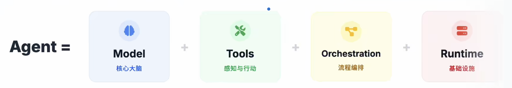

## Day01 工程化视角下的 Agent 底层框架与落地指南

### 引言

Google 发起了一场颠覆性的 AI 技术分享——连续五天开源五篇 AI Agent 白皮书。这一举措并非单纯的技术发布，而是为行业提供了一套可直接落地的“架构对齐、语言统一、工程落地”官方材料包，将 AI Agent 从“Prompt+工具”的 Demo 级玩具，正式推向**可构建、可评估、可运维、可部署**的全生命周期工程系统。

这五篇白皮书构成了一条清晰的工程化路线图：**先定义 Agent 核心概念，再补充工具与互操作能力（重点为 MCP 协议），接着深入会话与记忆的上下文工程，随后落地质量、可观测性与评测体系，最后实现从原型到生产的跨越（含多智能体协作协议与部署治理）**。

本文将聚焦第一篇《Introduction to Agents》，从定义、核心组件、运行机制、分级体系、工程落地等维度，拆解 Google 眼中的 Agent 底层逻辑，为技术架构设计、平台搭建与产品落地提供统一的技术参考。

### 一、重新定义 Agent：并非“增强版 LLM”，而是工程化系统

在行业讨论中，Agent 常被误解为“更会聊天的大语言模型（LLM）”，但 Google 给出了明确的工程化定义：**Agent 是一套由 Model（大脑）、Tools（双手）、Orchestration Layer（神经系统）、Runtime/Deployment Services（身体与腿）构成的可构建、可运行、可治理的工程系统**。其核心特征是“**LM in a loop**”——通过持续运转的控制回路，每一轮将任务目标与上下文输入模型，由模型决策是否调用工具，再将工具结果结构化后回写上下文，进入下一轮循环，直至任务闭环。

#### 与传统对话接口的本质区别

- 传统对话接口：即便支持 Function Calling，仍属于“一问一答”的应用层交互工具，缺乏稳定的循环机制与运行时支撑，无法自主完成复杂任务；
- Agent 系统：具备“**感知-决策-行动-反馈**”的闭环执行能力，通过编排层管理状态与上下文，依托运行时服务实现可观测、可控制、可扩展，核心价值是“自主完成真实世界任务”。

#### 真正的分水岭是 Context Engineering

Agent 不是“聊天”，而是对上下文的主动选、装、控

**选 Select**： 每一步只取最相关信息， 拒绝全量回填

**装Pack**： 组织为 可用结构

* 任务状态 （State）
* 关键事实 （Facts）
* 工具结果摘要

**控 Control**： 控制噪声与长度， （避免 Context 撑爆）

### 二、Agent 四大核心组件：分工协同的工程架构

Google 将 Agent 拆解为四大核心组件，各组件各司其职、协同运转，共同构成稳定的任务执行体系：

> 大脑负责思考，双手负责行动，神经系统负责调度，身体负责长期运行

### 1. Model：决策大脑

> 推理与决策引擎。 决定系统的智力上限与能力边界。

核心职责是理解任务目标、进行多步推理、生成执行计划，决定“做什么”和“怎么做”。需明确的是，**模型本身不等于 Agent**，仅为决策核心，必须与其他组件结合才能形成闭环能力。

#### 2. Tools：交互双手

> 连接现实世界。 提供API调用、检索与数据读写能力。

是 Agent 与现实世界交互的载体，**分为信息获取类（搜索工具、RAG 向量库、知识图谱）、数据处理类（SQL 执行器、代码沙箱）、业务操作类（邮件发送、工单系统调用、CRM 写入）、人机协同类（请求用户确认、补充关键信息）**。没有工具，Agent 的决策只能停留在口头建议，无法落地为实际行动。

#### 3. Orchestration Layer：神经中枢（最关键的“隐形组件”）

> 驱动循环与策略。 管理记忆（Memory）、状态（State）与规划。

这是最容易被忽略但决定系统成败的核心层，负责串联“**Think（思考）-Act（行动）-Observe（观察）** ”循环，承担状态管理、上下文编排、工具调度三大核心职责：

- 循环控制：触发模型推理、工具调用、结果回写的闭环流转；
- 状态管理：记录任务进度、已调用工具、关键参数、未完成缺口；
- 上下文优化：筛选有效信息、结构化工具结果，避免 Context Window 溢出。

#### 4. Runtime/Deployment Services：落地支撑

> 交付为在线服务。确保监控、治理、安全与可扩展性。

决定 Agent 能否从原型变成长期在线的服务，提供部署、监控、日志、权限、扩缩容等基础能力。很多团队无法做出生产级 Agent，并非模型不够强，而是缺乏完善的**编排层与运行时服务**，导致系统不可控、不可观测、不可治理。

### 三、Agent 核心运行机制：“五步循环”的工程化落地

Agent 的核心不是输出优美文本，而是通过可重复的循环将任务逐步落地，其运行遵循“五步循环”法则，每一步都对应明确的工程化目标：

#### 1. Get a mission（获取目标）

目标来源包括用户主动输入（如“查询订单12345的物流状态”）或系统触发（如“定时生成月度销售报表”），核心是明确任务边界与预期结果。

#### 2. Scan a scene（扫描现场）

收集所有与任务相关的上下文信息，包括用户输入细节、历史会话记录、可用工具清单、已有事实数据等，为决策提供全面支撑。

#### 3. Think it through（规划推理）

模型基于目标与现场信息，生成可执行的分步计划。例如“查询订单物流”任务，计划可拆解为：①查内部库确认订单存在并获取运单号；②用运单号查询承运商实时状态；③汇总事实生成用户易懂的回复。

#### 4. Take action（执行行动）

由编排层根据规划选择适配工具，发起具体的 Tool Call。例如调用“内部订单查询工具”获取运单号，再调用“物流承运商查询工具”获取实时状态。

#### 5. Observe and iterate（观察迭代）

将工具返回结果**结构化处理**（避免原始 JSON 直接占用 Context Window），回写至上下文，再判断是否需要进入下一轮循环（如信息不足则补充调用工具，信息齐全则终止循环）。

#### 核心逻辑: 

Agent 不是聊天机器人，而是"多轮循环直到达成目标“的系统

#### 工程化关键：拆解“Think-Act-Observe”职责

- Think：Model 专属职责，负责规划与决策，决定下一步需获取的信息与调用的能力；
	- 输入：任务（Mission）+ 场景上下文
	- 输出：行动计划＆下一步动作选择	
- Act：Tools 专属职责，负责实际执行查询、修改、代码运行等操作；
	- 执行：**API调用/数据库查询/代码执行**
	- 产出：**Observation（原始工具结果）**
- Observe：系统专属职责，核心是将工具返回转化为“结构化、可筛选、可追踪”的上下文，避免模型在噪声中决策，同时为链路追踪（Trace）提供天然边界。
	- 转化：将 Observation 清洗为下一轮可用信息
	- 控制了：压缩信息密度，避免上下文膨胀

	
#### 客服场景实例：完整跑通五步循环

用户需求：“我的订单12345现在到哪了？”

1. Get a mission：明确目标——查询订单12345的实时物流状态；
2. Scan a scene：确认可用工具（内部订单库查询、物流承运商查询），收集用户输入（订单号12345）；
3. Think it through：规划三步计划——①查内部库确认订单+获取运单号；②查承运商物流状态；③生成回复；
4. Take action：调用“内部订单查询工具”，输入订单号12345；
5. Observe and iterate：获取工具返回（订单存在，运单号ZYX987），结构化后回写上下文；
6. 重复循环：Think（下一步需查物流）→ Act（调用“物流查询工具”输入ZYX987）→ Observe（返回“Out for delivery”）；
7. 终止循环：信息齐全，生成最终回复“您的订单12345（运单号ZYX987）当前状态为‘待配送’，预计今日送达”。

这一过程体现了 Agent 与聊天机器人的核心区别：聊天机器人可能直接编造答案，而 Agent 会“**先查世界再开口**”，确保结果的准确性。

> Agent vs Chatbot：先查证，再回答；先行动，再生成。

### 四、Agent 五级分级体系：从“会想”到“会办事”的演进

Google 提出 Agent 五级分级标准（Level 0-Level 4），核心逻辑是“**每升级一级，新增的不仅是能力点，更是一整套工程负担**”。分级的意义在于明确目标边界、梳理基础设施依赖、核算上线门槛，避免因范围过大导致治理失控。

#### 为什么必须分级？

> Level 不是能力的”勋章”，而是治理成本的“账单”

复杂度熵增模型 Level 上升带来的工程负担

**工具面扩大=风险面失控**

* **工具面扩大=风险面失控**
	* 接入的API越多，安全治理越难。权限管理从单一鉴权变成复杂的 RBAC。
* **长短期记忆= 合规噩梦**
	* 状态变复杂后，隐私擦除、数据生命周期管理（TTL）和GDPR 合规成本激增。
* **多主体协作=责任黑盒**
	* Agent越多，链路越长。谁出错了？观测难度与调试成本呈指数上升

#### 架构决策三问 我们需要哪个Level？

* **LEVEL 1 CHECK**： 你需要"实时事实"吗？
	* 如果只是聊天，不需要。如果要联网查天气、查库存，必须上Level 1。
* **LEVEL 2 CHECK**： 你需要"跨步骤规划"吗？
	* 如果任务依赖上下文状态（订票 付款 通知），这就是 Level 2的门槛。
* **LEVEL 3-4 CHECK**： 你需要“团队扩展”吗？
	* 单体搞不定？需要自我反思、调用子 Agent？这是最高阶的系统承诺

#### Level 0：纯推理系统（无“手”的思考者）

> Core Reasoning System
> 
> 闭门造车：输入仅限上下文，输出仅限建议。

- 核心特征：仅依赖模型训练数据进行推理、解释、规划，无法对接外部工具，对现实世界“盲目”；
- 典型场景：回答常识性问题（如“地球半径是多少”）、生成文本摘要（无需实时数据）；
- 局限：易产生幻觉，无法处理需实时数据或事实校验的任务。

#### Level 1：连接型问题解决者（有“手”的执行者）

> Connected Problem-Solver
> 
> 价值：先查再答，用外部事实扼杀幻觉

- 核心升级：接入工具（搜索、RAG、数据库查询），通过工具获取实时事实，再组织答案；
- 工程关键：工具需形成“**稳定契约**”——支持可靠调用、失败处理、结果结构化回写；
- 核心价值：大幅降低幻觉，实现“事实闭环”，是最划算的生产级起点（平衡效果与工程成本）。

#### Level 2：上下文工程专家（会“管理信息”的决策者）

- 核心升级：具备主动的**上下文管理能力**，动态筛选关键信息、控制噪声、优化输入格式，避免计划漂移；
- 关键能力：复杂任务拆解、多步推理、基于上一步结果生成下一步“最小上下文”；
- 工程意义：从“工具型聊天机器人”升级为真正的“Agent 系统”，解决 Context Window 过载与注意力稀释问题。

#### Level 3：多智能体协作系统（专家团队）

- 核心升级：由“单个大脑”变为“专家团队”，通过协调者 Agent 拆分任务，分配给不同专业 Agent 并行执行；
- 核心价值：解决复杂任务的分工、并行、复用问题，将 Agent 作为“高阶工具”协同；
- 工程门槛：需解决身份权限、任务调度、跨 Agent 可观测等治理问题，不建议初期尝试。

#### Level 4：自扩展系统（能“进化”的生态）

- 核心思想：**动态创造能力**。系统能识别当前的能力缺口（Gap），并自动编写新工具或实例化新 Agent来补齐。
- 核心升级：具备**自我扩展能力**，可发现自身能力缺口，动态创建新工具或新 Agent 补充；
- 适用场景：极复杂、动态变化的任务场景；
- 风险提示：治理成本指数级上升，易出现不可控风险，仅适合成熟团队探索。

#### Level 3 - Level 4 Reality Check： 工程代价

Level 3-4并不是免费午餐。没有强大的治理体系（Governance），你得到的将不是专家团队，而是不可控的灾难。

- 身份鉴权
- 策略约束
- 跨 Agent 可观测性
- 避免 Agent Sprawl

#### 分级落地建议

优先跑稳 Level 1 的“事实闭环”，再夯实 Level 2 的“上下文工程”，最后再探索 Level 3 的“多智能体协作”与 Level 4 的“自扩展”，避免盲目追求高阶能力导致系统失控。

### 五、Tools 能力的工程化落地——从“会想”到“能办事”的核心桥接

在 Google AI Agent 体系中，**Tools（工具）是连接“模型推理”与“现实世界”的核心载体**——没有工具的 Agent 只是“会说话的思考者”，而具备工具能力的 Agent 才能真正“解决实际问题”。

#### 1 Tools 的核心定位：把推理“锚定”到现实世界

工具的本质是让 Agent 突破“模型训练数据”的局限，实现**信息获取、业务操作、复杂计算**的闭环——从“只能基于记忆回答”升级为“主动对接外部资源解决问题”。

从白皮书的工具链路图可清晰看到其核心逻辑：

- **上游是 Model（大脑）**：负责决策“调用什么工具、解决什么问题”；
- **中间是 Tools（双手）**：承担“执行具体动作、获取真实信息”的职责；
- **下游是现实世界**：工具的输出直接作用于业务系统、数据库或公开网络，最终产生实际价值。

白皮书用一句通俗的话点明工具的价值：**“没有工具=只会说，有工具=能办事”**。

#### 2 工具的三类核心能力：覆盖“信息-操作-计算”全场景

Google 将 Agent 工具体系分为**信息类、操作类、计算类**三大方向，每类工具对应不同的业务场景与工程要求：

**1. 信息类工具：把回答“钉在事实”上（检索 Grounding）**

信息类工具的核心目标是**解决模型“幻觉问题”**，将生成内容严格锚定在真实数据上，实现“回答有依据、事实可追溯”。白皮书给出了三类典型信息工具：

- **RAG + 向量数据库**：对接企业私有文档、知识库，适用于“内部资料查询”场景；
- **知识图谱**：连接结构化实体-关系-属性数据，适用于“复杂关系推理”（如“某产品的上游供应商有哪些”）；
- **实时搜索（如 Google Search）**：获取公开领域的最新信息（如新闻、股票、天气），解决“模型训练数据过时”的问题。

**工程落地关键**：

- **摘要与裁剪**：避免工具返回的冗余信息占用 Context Window，只保留与任务相关的核心内容；
- **来源可追溯**：在最终回答中关联工具调用的原始数据源（如“数据来自XX知识库2025版”），便于审计与信任建立。

**2. 操作类工具：让 Agent 开始“动手改世界”**

操作类工具是 Agent 从“信息查询”升级为“业务执行”的核心——通过对接企业系统接口，实现“发邮件、排会议、写CRM”等实际动作。白皮书重点拆解了三类操作工具：

- **结构化数据访问（NL2SQL）**：将自然语言转化为 SQL 查询，实现“季度销量统计、异常订单筛选”等数据操作；
  - *风险控制*：严格审计 SQL 语句，禁止越权写入操作；
- **业务 API/Function 封装**：将“发邮件、创建工单”等业务能力封装为标准化接口；
  - *落地三要素*：工具需满足“可契约（明确入参/出参）、可观测（调用链路可追踪）、可回滚（错误操作可恢复）”；
- **代码沙箱执行**：通过 Python/Script 实现复杂逻辑处理（如数据清洗、批量计算）；
  - *工程底线*：必须通过沙箱隔离代码执行环境，设置超时熔断机制，避免资源滥用。

#### 3 工具的安全治理：HITL 机制——给自动化装“刹车”和“方向盘”

Agent 具备工具操作能力后，“误操作风险”成为生产级落地的核心挑战。Google 提出 **HITL（Human-in-the-Loop，人机协同）机制**，作为 Agent 自动化的“安全阀门”——既不牺牲效率，又能避免“裸奔式自动化”（图4）。

**HITL 的“必停时刻”：两类场景必须介入人工**

- **信息模糊时**：当工具调用缺少关键参数（如“发邮件缺少收件人”），禁止模型“猜测”，必须主动追问用户补充信息；
- **高危动作时**：涉及“外发消息、写数据库、支付、批量操作”等不可逆动作时，必须触发“System 2 介入”（即人工授权）。

**HITL 的工具化接入：把“人机协同”嵌入工具流程**

白皮书推荐将 HITL 能力封装为标准化工具，与其他业务工具统一管理：

- `ask_for_confirmation`：执行高危操作前的“确认工具”，让用户做最终授权；
- `ask_for_date_input`：将“模型不知道的信息”转化为“主动反问工具”，避免信息缺失导致的错误。

**HITL 的落地价值：从“概率黑盒”到“工程化交付”**

- **Rogue Actions 归零**：杜绝 Agent 未经授权的“胡操作”；
- **明确责任边界**：人机协作的流程中，权责清晰可追溯；
- **提升上线通过率**：安全可控的机制让业务方更敢用 Agent。

#### 总结：工具能力的落地核心——“契约化+可观测+安全兜底”

Google 工具体系的本质，是通过**标准化的工具契约、全链路的可观测性、人机协同的安全兜底**，让 Agent 从“Demo 级玩具”变成“生产级工具”：

- 对模型：工具是“扩展能力的双手”；
- 对业务：工具是“解决实际问题的载体”；
- 对工程：工具是“可控、可管、可追溯的执行单元”。

后续我们将拆解白皮书的“工具互操作协议（MCP）”，解析如何实现工具的“跨 Agent、跨系统复用”，敬请期待！

记忆、工具协议与编排层——工程化落地的“隐形支柱”

在 AI Agent 从 Demo 走向生产的过程中，**记忆工程、工具协议、编排层**是最容易被忽略但决定系统稳定性的“隐形支柱”。本文结合 Google 白皮书的配套图解，拆解这三大模块的设计逻辑与工程落地要点，补全 Agent 全生命周期的技术拼图。

### 六、 从语义版本到工具协议：AI Agent 工具体系的“标准化生存法则”

在软件领域，**语义化版本（SemVer）** 是管理依赖变更的“通用语言”；

而在 AI Agent 生态中，**工具协议与版本管理** 则是实现“工具可复用、系统可维护”的核心基础。本文结合语义化版本规则与 Google Agent 工具体系，拆解如何通过“标准化契约+版本治理”，让 Agent 工具从“零散组件”升级为“可治理的生态资产”。

#### 语义化版本（SemVer）：软件世界的“变更语言”

语义化版本（Semantic Versioning，简称 SemVer）是管理软件库版本的行业标准，核心是通过 **`主版本号.次版本号.修订号`（Major.Minor.Patch）** 三个组件，清晰传递变更的兼容性影响：

- **Major（主版本）**：不兼容的突破性变更（如工具接口入参格式修改）；
- **Minor（次版本）**：兼容的新功能添加（如工具新增可选参数）；
- **Patch（修订号）**：兼容的 bug 修复（如工具返回结果的格式优化）。

#### 核心规范

1. 稳定软件初始版本从 `1.0.0` 开始；
2. 突破性变更 → 升级主版本；
3. 兼容新功能 → 升级次版本；
4. 兼容 bug 修复 → 升级修订号。

这一规则的价值在于：让依赖方通过版本号即可判断“是否需要适配、能否直接升级”，避免变更带来的不可控风险。

#### Agent 工具的“语义化治理”：从“能用”到“可维护”

将语义化版本逻辑延伸到 Agent 工具体系，是解决“工具碎片化、变更不可控”的关键——结合 Google 提出的“可靠工具调用三要素”，工具的版本治理需覆盖**契约、安全、编排**三个维度：

##### 工具契约的语义化（OpenAPI 为核心）

OpenAPI 是 Agent 工具的“标准化契约”，其 Schema 定义需与语义版本绑定：

- **Major 变更**：工具接口的入参/出参必填项、格式发生不兼容修改（如 `get_user_info` 接口从返回 `name` 改为 `username`）；
- **Minor 变更**：新增可选参数或返回字段（如 `search_tool` 新增 `sort_by` 可选参数）；
- **Patch 变更**：修复返回结果的格式错误（如将 `null` 统一替换为默认空字符串）。

##### 安全连接的版本对齐

工具的权限策略、校验规则需与版本同步更新：
- 主版本升级时，需重新审核工具的鉴权逻辑（避免新接口出现权限漏洞）；
- 次版本/修订号升级时，需验证参数校验规则的兼容性（如新增参数是否符合最小权限原则）。

##### 编排层的版本感知

编排层需支持“工具版本选择”：

- 可配置工具的版本范围（如允许使用 `1.x.x` 版本，自动兼容次版本与修订号变更）；
- 主版本升级时，触发编排逻辑的适配测试（避免旧编排流程调用新接口出现异常）。

#### 工具协议的生态化：OpenAPI + MCP + 原生工具的协同治理

Google 强调，Agent 工具体系的目标不是“选单一协议”，而是构建 **“契约化+生态化+可治理”** 的混合体，而语义化版本是实现多协议协同的“通用标尺”：

**1. OpenAPI：标准化契约的“版本锚点”**

OpenAPI 定义工具的核心 Schema 与版本规则，是其他协议的基础——MCP、原生工具需对齐 OpenAPI 的版本语义，确保变更逻辑一致。

**2. MCP：跨系统复用的“版本桥梁”**

MCP 协议解决工具的跨系统发现与复用问题，其注册中心需记录工具的版本信息：

- 支持按版本范围搜索工具（如“查找 `2.0.0` 及以上版本的 `payment_tool`”）；
- 工具版本升级时，自动通知所有依赖的 Agent 系统。

**3. 原生工具：快速集成的“版本补全”**

如 Gemini 原生搜索等工具，需补充版本元数据：

- 在工具注册时标注兼容的版本范围（如“兼容 Agent 编排层 `1.5.x` 及以上版本”）；
- 升级时同步更新版本说明，明确是否需要调整编排逻辑。

**总结：版本治理是 Agent 工具体系的“隐形骨架”**

语义化版本+工具协议的结合，本质是给 Agent 工具装上“变更的刹车与方向盘”——既支持快速迭代新功能，又保证系统的兼容性与稳定性。其核心逻辑可总结为：

- **契约层**：用 OpenAPI 定义工具的语义化版本规则；
- **连接层**：用 MCP 实现跨系统的版本感知与复用；
- **编排层**：支持版本范围配置与适配测试。

通过这套体系，Agent 工具体系才能从“零散的工具集合”，进化为“可治理、可扩展的生态资产”。

### 七、 AI Agent 工程化进阶：从编排层到多智能体，如何构建“可维护的专家团队”

在 AI Agent 从“单组件 Demo”走向“生产级系统”的过程中，**编排层的中枢能力**与**多智能体的分工协作**是突破“复杂度瓶颈”的核心——前者让系统“行为可控”，后者让复杂任务“可拆解、可维护”。本文结合 Google Agent 白皮书的核心图解，拆解这两大模块的设计逻辑与落地实践。

#### 排层：Agent 系统的“行为中枢”，而非“管道”

多数团队将编排层视为“模型与工具的连接管道”，但 Google 明确其定位是 **“系统行为的中枢”**（图1）——承担“调度、状态、治理”三大核心职责，是 Agent 稳定运行的“隐形大脑”。

#### 编排层的三大核心能力

1. **驱动运行循环**：构建 `Think→Act→Observe` 闭环，将大语言模型（LM）嵌入“任务收集→推理→工具调用→结果回写”的可重复控制回路，避免任务中途“失控”；
2. **管理 State 与 Memory**：
   - **State**：追踪任务进度、Action 序列与关键字段，让系统“永远在线”而非“单次对话即重置”；
   - **Memory**：将长期记忆封装为“可查询工具”，实现跨会话信息的按需召回（避免上下文爆炸）；
3. **决策策略与成本控制**：优先用“确定性规则”解决简单逻辑（如固定格式的查询），仅在需要规划或信息不

全时才调用 LM——既提升效率，又降低大模型调用成本。

#### 上下文全景：一轮 LM 调用该“喂什么”？

编排层的核心工作之一，是**精准构建 LM 调用的上下文**（图3），需包含6类信息：
- **System Instructions（宪法）**：角色定义、输出规范、工具触发条件；
- **User Input（触发点）**：任务目标、约束条件、用户偏好；
- **Session History（连续性）**：最近对话、关键决策、需求变更；
- **Long-term Memory（个性化）**：跨会话偏好、业务事实；
- **Grounding（准确性）**：RAG 片段、知识图谱、事实校验结果；
- **Tools & Results（行动力）**：可用工具清单、上轮执行结果、API 状态。

**工程原则**：上下文是“动态筛选的精华”，而非“全量信息的堆砌”——编排层需根据任务阶段灵活注入必要信息，平衡“完整性”与“Context Window 成本”。

#### 记忆工程化：短期是轨迹，长期是可检索资产

Agent 的“记忆”不是简单的对话历史存储，而是**分层次、可管理的工程系统**：

- **短期记忆**：维护 `(Action, Observation)` 序列（如“调用搜索工具→返回摘要→基于结果推理”），保证多步任务的一致性，同时作为 Debug 的轨迹账本；
- **长期记忆**：通过 RAG+向量库将“用户偏好、历史事实”封装为可调用工具，**按需检索后注入**（On-Demand），实现跨会话个性化，同时避免上下文爆炸。

#### 三、多智能体系统：别造“全能 Agent”，要造“专家团队”

Google 明确反对构建“Super-agent（全能 Agent）”，因为这类 Agent 会因功能堆砌变得“脆弱、黑盒、难维护”。更优的方案是**将复杂任务拆解为“专家团队”分工协作**：

**专家团队的核心优势**

- **Focus（聚焦）**：每个 Agent 只负责单一领域（如“订单查询 Agent”“物流追踪 Agent”），逻辑清晰、不易出错；
- **Testable（可测试）**：单个专家 Agent 可独立测试、迭代，降低系统级联风险；
- **Observable（可观测）**：每个 Agent 的行为可单独追踪，便于定位问题。

**多智能体的协作模式**

通过“协调者 Agent + 专家 Agent”的架构实现任务拆解：

1. 协调者 Agent 接收用户需求，拆解为子任务；
2. 将子任务分配给对应专家 Agent（如“订单查询”分配给订单 Agent）；
3. 整合专家 Agent 的结果，生成最终回答。

### 八、Agent 工程落地核心指南：从选型到部署的全流程

#### 1. 模型选型：架构决策而非“榜单冲浪”

Google 强调，Agent 场景的模型选型需以业务目标为核心，而非盲目追求大模型或高榜单分数：

- 选型三步法：
  1. 明确业务 KPI（如任务达成率、错误率、响应时延、成本上限）；
  2. 将 KPI 映射为可评测的离线任务集（Golden Set），覆盖主路径与边界案例；
  3. 用同一套评测脚本测试不同模型，对比质量、延迟、成本三维指标，选择“业务场景下更稳、更划算”的模型。
- 核心评估维度：

  1. **复杂多步推理能力**：长链路任务中目标不漂移、步骤不乱套；
  	
  	* **长任务不跑偏 / 能自我修正**
  
  2. **可靠工具使用能力**：稳定生成正确的函数调用（参数无乱编），能准确消费工具返回结果。
 	
 	* **能消费返回结果 / 能消费返回结果**

- 工程策略：**多模型路由**（重推理用强模型，高频轻任务用快模型），平衡效果与成本；通过 AgentOps 实现持续评测，支撑模型快速升级。

##### **质量拆解：可观测信号与翻车点**

* **多步推理稳定性**: 任务完成率 / 计划漂移率
* **工具调用正确性**: Call 成功率 / 参数校验通过率
* **工具结果消费**: Observation / 是否被有效利用
* **失败恢复能力**: 重试成功率 / 降级路径命中率

#### 2. 工具调用：从“能跑”到“可上线”的工程化改造

工具调用的核心是“**契约化、安全化、可编排**”，而非简单堆砌工具，需满足三大工程化要求：

- 清晰指令：明确工具调用条件、参数格式、失败处理逻辑（如重试次数、超时时间），避免 Function Calling 变成“随机参数生成”；
- 安全连接：遵循**最小权限原则**，实现参数校验、审计留痕，明确“模型负责提议，系统负责批准”的权限边界；
- 编排保证：构建稳定状态机，定义工具调用、重试、降级、人机协同的触发规则，确保每一次工具调用的输入、输出、错误都可观测。

##### 工具协议选择

- OpenAPI：解决“契约问题”，将工具描述为 Schema（明确功能、入参、出参、必填项、返回结构），便于模型生成正确调用，也方便系统做校验、Mock、测试与版本管理；
- MCP 协议：解决“互操作问题”，让工具更容易被发现、接入与跨系统复用，降低工具生态的连接成本；
- 模型原生集成（如 Google Search）：优势是集成顺滑、调用路径短，但需确保可控性、可观测性，并纳入统一治理体系。

#### 3. 上下文工程：Agent 稳定运行的核心密码

Agent 本质是“**Context Window 的侧展系统**”，上下文质量直接决定任务成败。一轮有效的模型调用，上下文需包含六类关键信息：

1. 系统指令（宪法）：定义 Agent 身份、边界、输出格式、工具调用规则；
2. 用户输入（触发点）：任务原始需求；
3. 会话历史（连续性）：多轮交互中的需求澄清、约束变更；
4. 长期记忆（个性化）：用户偏好、历史决策、跨会话复用信息（按需召回，避免上下文爆炸）；
5. 事实依据（准确性）：RAG、搜索、知识图谱提供的权威信息；
6. 工具信息（行动力）：可用工具清单、已调用工具的结构化结果。

##### 记忆工程化：短期与长期的二分法

- 短期记忆：任务执行中的实时状态，维护“action-observation”序列（调用了哪个工具、参数是什么、返回了什么结果），确保任务不丢线，便于 Trace 与 Debug；
- 长期记忆：跨会话的持久化信息（如用户偏好、历史决策），通过向量库存储，需用时召回，避免将所有历史信息直接塞入 Prompt。

#### 4. 多智能体协作：拆解复杂度而非“炫技”

多智能体的核心价值是“**拆分系统复杂度**”，而非单纯提升能力，常用四种协调模式（可组合使用）：

- 协调者模式（Coordinator）：项目经理 Agent 拆分任务，分配给专业 Agent，适合信息不完整、需动态分解的任务；
- 流水线模式（Sequential）：上游 Agent 输出结构化结果，下游 Agent 直接消费，适合流程明确、易审计的业务；
- 迭代优化模式（Iterative Refinement）：生成 Agent 产出初稿，批评者 Agent 按规则挑错，循环优化，适合追求质量一致性的场景；
- 高风险停顿模式（High Touch）：关键节点触发人机协同，需用户确认后再执行，适合对外发信、改客户数据、触发支付等高风险动作。

#### 5. AgentOps：让 Agent 长期稳定运行的工程体系

AgentOps 是专门针对 Agent 设计的运维体系，核心是“**将不确定性转化为可观测、可评测、可迭代的工程闭环**”，区别于传统 DevOps：

- 核心环节：
  1. KPI 先行：定义业务指标（如任务达成率、用户满意度、端到端时延、单次交互成本），并映射到业务转化、留存、营收等核心目标；
  2. 评测集构建：从真实交互中抽样，形成覆盖主路径与边界案例的 Golden Set；
  3. 指标驱动发布：每次改 Prompt、换模型、加工具，都需通过评测集验证，分数不达标则禁止上线，上线后通过灰度或 AB 测试对齐离线分数与线上指标；
  4. 全链路可观测：通过 **OpenTelemetry Traces** 追踪决策过程，回答“为什么调用该工具”“为什么步骤偏移”等问题；
  5. 反馈闭环：将线上失败案例沉淀为新的评测样例，持续优化系统，避免同类问题重复发生。

#### 6. 安全与治理：规模化落地的前提

Agent 具备操作业务系统、处理敏感数据的能力，安全治理是“必选项”而非“加分项”，核心风险包括三类：

- 越权操作（Rogue Actions）：误发邮件、误改数据、误触发流程（很多动作不可逆）；
- 数据泄露：上下文混合敏感信息并输出；
- 指令劫持（Prompt Injection）：恶意指令藏在网页、文档中，诱导 Agent 违规操作。

##### 纵深防御策略

- 硬规则防护（Guard Rails）：设置金额上限、敏感操作二次确认、API 白名单，确保行为可预期、可审计；
- 智能防御（Guard Models）：用专用小模型识别上下文风险、拦截异常操作，覆盖硬规则无法触及的灰区；
- 平台化治理：统一身份认证、策略管控、交互入口，实现 Agent 身份化（最小权限分配）、策略全覆盖（约束 Agent、Tools、其他 Agents、Context）、全链路审计。

#### 7. 部署策略：从原型到生产的落地路径

部署的核心是“交付长期运行的服务”，而非单纯“让代码跑起来”，Google 提供两条主流路径：

- 平台化路径（推荐入门）：使用 Vertex AI Agent Engine 等托管平台，快速获得运行时、监控、治理能力，上手快、少踩坑，适合快速落地第一个生产级 Agent；
- 容器化路径（推荐规模化）：将 Agent 及依赖服务打包为容器，部署到 Cloud Run 或 GKE，与现有 DevOps 体系深度融合，控制力强，但需自行负责更多运维细节。

##### 生产级必备配套

- CI/CD 流水线：实现构建、部署、灰度、回滚的自动化，避免人工操作风险；
- 自动化测试：覆盖传统单测、离线评测集关键 KPI、工具调用回归、安全策略验证，确保迭代风险可控。

### 九、核心结论与后续展望

Google 第一本白皮书《Introduction to Agents》的核心价值，是将 Agent 从模糊的概念拉回工程化实践，明确其本质是“以 LM 为核心的闭环执行系统”。稳定的编排层、可观测的运行时、完善的治理体系，是生产级 Agent 的关键支撑，而非单纯依赖更强的模型。

落地建议可总结为三句话：

1. 路径上，先跑通 Level 1 的事实闭环，再夯实 Level 2 的上下文工程，最后探索 Level 3 的多智能体协作；
2. 选型上，模型选择是架构决策，需以业务目标为核心，通过专属评测集验证稳定性与性价比；
3. 治理上，工具调用重“契约化”，安全防御重“纵深策略”，AgentOps 重“可观测与反馈闭环”。
