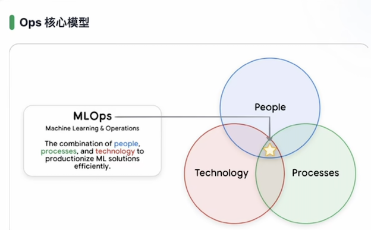
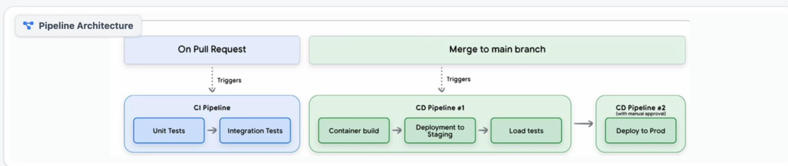
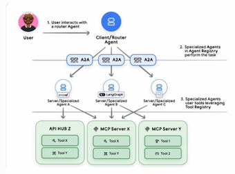

## Day 05：Agent从原型到生产环境的“最后一公里”实战

在AI Agent的研发周期中，“做出Demo”往往只完成了20%的工作——剩余80%的精力，都耗费在从“原型”到“生产环境”的落地过程中。Google与Kaggle联合推出的5日课程最后一期，聚焦**AgentOps（智能体运维）**，拆解了企业级Agent落地的核心挑战、运维困局与工业化解决方案。

### 一、破局“最后一公里”：80%的工作不在“智能”，而在“可信交付”

企业级Agent落地的核心矛盾在于：**Demo阶段只需要“智能”，但生产环境需要“可信”**。Google的数据显示，80%的AI项目折戟于上线前，根源是“智能”之外的四大风险：

| 生产环境风险 | 核心表现 | 风险类型 |
|--------------|----------|----------|
| **越权风险** | Guardrails防护失效，Agent被恶意套话导致资产损失 | 安全风险 |
| **数据泄露** | **身份验证配置错误，Agent成为内网敏感数据的泄露通道** | 隐私风险 |
| **账单失控** | **缺乏Token级监控，资源被无限制滥用导致成本超支** | 成本风险 |
| **质量回退** | 缺乏持续评估，Agent性能突然下降却无法定位原因 | 质量风险 |

#### Agent运维的非确定性困局：从Demo到生产的“三座大山”

Agent的动态特性，让传统软件的运维方法完全失效，其核心困局可概括为“三座大山”：

1. 动态编排黑盒

Agent的执行路径是**动态生成**的——每次调用的工具链可能完全不同，导致版本控制失效、Bug极难复现。传统“固定流程”的运维逻辑，无法适配Agent的“灵活决策”。

2. 记忆一致性挑战

多轮对话的记忆不是简单的KV存储，在分布式架构下，保持**记忆上下文的实时一致性与持久化**，是巨大的系统工程。某电商Agent曾因记忆同步延迟，向用户重复推荐已购买的商品。

3. SLA难以量化

Agent的思考路径不确定，导致Token消耗、延迟等指标波动极大——今天思考3步，明天可能思考10步，**成本与延迟完全不可控**，传统SLA（服务等级协议）的量化标准失效。

#### AgentOps三大支柱：构建工业化运维体系

要解决Agent的生产落地问题，需要建立**AgentOps（智能体运维）**体系，其核心是三大支柱：

| 支柱 | 核心能力 | 价值 |
|------|----------|------|
| **自动化评估** | 建立严格的测试基准，通过LLM-as-Judge等方式自动验证Agent行为 | **质量门禁：确保每一次回复都符合预期** |
| **自动化部署（CI/CD）** | 打通Notebook到生产环境的流程，支持快速试错、无痛上线 | **迭代引擎：连接开发与生产的“高速公路”** |
| **全链路可观测** | 追踪Token流动、透视LLM的决策路径，避免“黑盒盲猜” | **感官系统：理解Agent的思考过程** |

#### People & Process：重构人、流程与技术的铁三角

AgentOps的本质不是“纯技术问题”，而是**人、流程、技术的协同**。Google强调：“技术无法解决组织架构带来的管理真空”，三者的核心分工是：

- **People（人）**：定义Guardrails、审核评估报告，明确团队角色与责任边界；
- **Process（流程）**：建立标准化流水线与协作机制，避免因流程缺失导致执行混乱；
- **Technology（技术）**：CI/CD、自动化脚本等是底座，但不能替代人的决策与流程的规范。

#### 团队架构进化：从传统MLOps到GenAI时代的角色重塑

**传统MLOps团队（Cloud Platform、Data Engineering、DS & MLOps、ML Governance）已无法适配Agent的复杂需求，GenAI时代的团队角色需要重塑：**

| 新角色 | 核心职责 |
|--------|----------|
| Prompt工程师 | 不仅写提示词，更要结合领域知识定义评估标准（Eval） |
| AI工程师 | 系**统构建者，负责RAG集成、工具链编排、Guardrails安全护栏** |
| DevOps/开发工程师 | 聚焦前端交互与用户界面集成，打通“最后一公里” |

在初创团队中，“一人多职”是常态，**全栈AI工程师**正成为核心角色——他们需要同时掌握Prompt设计、系统开发、运维监控等能力。

###  二、从落地工具到质量门禁，企业级Agent的生产级方案

#### Google Cloud Agent Starter Pack：开箱即用的企业级工具箱

Agent落地的最大成本，往往是“配置基建”而非业务逻辑。Google Cloud的Starter Pack提供了**开箱即用的生产级工具链**，核心组件包括：

| 组件类型 | 核心能力 | 价值 |
|----------|----------|------|
| 生产级Python模板 | 标准化项目结构，内置最佳实践 | 无需从头搭建脚手架，直接复用成熟框架 |
| 自动化CI/CD配置 | 预置Cloud Build脚本，代码提交自动构建测试 | 加速迭代，减少人工操作 |
| 基础设施即代码（IaC） | 内置Terraform模组，一键拉起云资源 | 确保环境一致性100%，避免“本地能跑、线上崩溃” |
| 内置评估与可观测性 | 集成Vertex AI Evaluation | 让Agent的效果可量化、可追踪，解决“黑盒问题” |

#### 为什么Agent需要“质量门禁”？传统测试的失效与新评估逻辑

Agent的“概率性行为”，让传统软件的“输入A→输出B”测试逻辑完全失效——一个Agent可能结果正确，但过程存在逻辑跳跃、工具调用错误，甚至隐藏风险操作。

传统测试与Agent评估的核心差异：

| 维度 | 传统软件测试 | AI Agent评估 |
|------|--------------|--------------|
| 核心目标 | 功能正确性 | 行为质量 |
| 路径特性 | 确定性路径 | 概率性发散 |
| 评估维度 | 仅验证逻辑跑通 | 多维度（逻辑/语气/安全性） |
| 风险点 | 功能失效 | 过程“绕弯路”、行为失控 |

#### 评估核心：从“结果黑盒”到“轨迹透明”

Agent的质量评估不能只看“最终答案”，必须深入**思考轨迹（Trajectory）**——这是避免生产环境灾难的关键。轨迹评估的四个核心维度：

| 评估维度 | 核心问题 | 风险防控点 |
|----------|----------|------------|
| Reasoning Trace（推理链） | 逻辑是否连贯？ | 避免中间步骤的逻辑跳跃与幻觉 |
| Tool Selection（工具选择） | 调用是否精准？ | 确保函数参数与上下文匹配 |
| Action Path（行动路径） | 是否存在无效步骤？ | 检测冗余循环与高危操作 |
| Final Answer（最终答案） | 结果是否正确？ | 传统Output校验，仅为最后一步 |

> 专家视角：生产环境中，Agent通过100个单元测试不重要，**行动路径出现一次不可控，就是灾难**。

#### 质量门禁方案：从人工到自动化的落地选择

质量门禁是Agent生产级部署的“安全阀”，Google提供了两种适配不同团队阶段的方案：

**方案一：人工Pre-PR门禁（适配早期团队）**

成本低、快速实施，核心流程：
1. **本地执行**：在本地运行评估套件，确保Agent基础能力达标；
2. **生成报告**：产出性能对比报告，与生产环境基线做差异分析；
3. **提交PR**：代码合并请求必须附带评估报告；
4. **人工评审**：Reviewer同时检查代码质量与Agent行为数据是否退步。

**方案二：自动化流水线门禁（适配成熟团队）**

集成到CI/CD流程，用程序替代人工审核的不确定性，核心逻辑：

- 代码提交自动触发评估；
- 设置质量阈值（如工具调用成功率>99%、有用性评分>4.5/5）；
- 未达阈值则拦截部署，确保“不达标不上线”。

#### Golden Dataset：评估体系的“真理标准”

黄金数据集是质量门禁的核心资产，它不是普通题库，而是**人工校准、高度代表性的测试用例集**，承担三大角色：

1. **核心意图覆盖**：覆盖80%的常见场景（“必考题”），确保Happy Path功能正常；
2. **安全边界校验**：包含诱导攻击、敏感话题拦截等“送命题”，严守安全底线；
3. **回归测试基准**：在版本迭代中对比新旧版本表现，确保能力“不退反进”。

#### CI/CD自动化流水线：三阶段漏斗模型，实现Shift Left

Agent的CI/CD流水线遵循**Shift Left（左移）**原则，将问题拦截在早期阶段，核心分为三阶段：

1. **Pre-Merge（代码合并前）**：CI前置拦截，通过单元测试、集成测试过滤低级错误；
2. **Staging（预发布环境）**：CD仿真实体，在类生产环境做深度集成测试，模拟真实流量；
3. **Production（生产环境）**：人工确认后的灰度发布+全量上线，作为最后一道防线。

#### Pre-Merge CI：速度与质量左移，绝不污染主干分支

Pre-Merge CI的核心目标是**在代码合并前拦截所有问题**，确保主干分支的“纯净性”。其流程包含三个关键环节：

| 环节 | 核心能力 | 价值 |
|------|----------|------|
| 基础代码规范 | Unit Tests + Linting | 快速过滤语法、逻辑低级错误 |
| 依赖安全性扫描 | Dependency Scanning | 避免引入含漏洞的第三方依赖 |
| 轻量级Agent评估 | 核心子集（Small Subset）测试 | 聚焦核心功能逻辑，兼顾评估效率与质量 |

核心特征：自动化触发+极速反馈，通过`pr_checks.yaml`配置，实现“代码提交即验证”。

#### Staging CD：仿真战场，验证系统级真实运行状态

Staging是生产环境的“高保真副本”，核心目标是验证**系统级的真实表现**，避免“环境差异”导致的上线故障。其流程包含四步：

1. **部署至Staging**：建立与生产环境1:1的副本，杜绝环境玄学；
2. **集成测试**：调用真实远程服务，验证组件交互逻辑；
3. **压力测试**：模拟高并发场景，提前暴露性能瓶颈；
4. **内部试用（Dogfooding）**：让团队成员在真实场景中发现“机器测不出的体验问题”。

#### Production发布：人工把关，最小化风险的三大防线

生产环境发布拒绝“全自动化”，必须通过三层防线将风险降到最低：

| 防线 | 核心机制 | 风险防控点 |
|------|----------|------------|
| 人工核准（Sign-off） | 由PO（产品负责人）最终确认 | 明确责任归属，避免“无人担责” |
| 制品直接晋级 | 复用Staging验证过的制品包，严禁重新构建 | 确保“测什么、发什么”，消除环境差异风险 |
| 安全灰度发布 | Canary（金丝雀）/蓝绿部署，逐步引入流量 | 出现问题可快速回滚，避免全量故障 |

#### 评估体系的两大基石：环境一致与自动化测试

Agent的全流程评估，依赖两大基建支撑：

1. **基础设施即代码（IaC）**：通过Terraform模组，确保Dev/Staging/Production环境100%同步，消除“环境玄学”；
2. **自动化测试框架（Pytest）**：不仅是测试工具，更是评估“驱动器”——负责多轮对话推进、Trace管理与Log记录，让Agent的行为可复现、可分析。

#### 安全红线：Secrets Management，拒绝密钥“裸奔”

Agent开发中，密钥泄露是最致命的安全风险之一。Google的安全规范明确：

- **死亡禁区（DON'T）**：禁止硬编码API密钥、禁止将敏感信息提交到Git仓库；
- **最佳实践（DO）**：通过Secret Manager云端加密存储密钥，运行时注入内存（仅在Agent启动时通过IAM权限拉取），确保“密钥不落地”。

### 三、 Agent生产运维：从可观测到自主优化的全链路体系

AI Agent上线后，“运维”才是长期稳定运行的核心——Google Cloud通过**“观测-干预-进化”**的闭环体系，将Agent从“被动服务”升级为“自治系统”，同时解决自主性带来的不确定性、成本失控等问题。

#### Agent范式转移：从“确定性服务”到“自主系统”的挑战

Agent的“自主性”带来了传统服务没有的三大痛点，导致传统监控逻辑彻底失效：

| 痛点 | 核心表现 | 风险 |
|------|----------|------|
| 自主决策体 | 路径非线性、决策逻辑动态生成，不再遵循“输入A→输出B” | 行为不可预测 |
| 涌现性行为 | 多轮交互中产生未预期的“模型发疯”，超出开发者边界 | 输出失控 |
| 隐形算力堆积 | 自主推理“绕弯路”，后台悄悄消耗巨额Token | 成本失控 |

### 可观测性体系：告别盲盒，构建透明化推理链路

Agent的可观测性需覆盖“事实-因果-指标”三层，核心是**还原推理链条**：

| 可观测支柱 | 核心作用 | Agent场景价值 |
|------------|----------|--------------|
| Logs（事实记录） | 记录离散事件 | 捕捉工具调用的原始输入输出、报错堆栈 |
| Traces（因果路径） | 串联全生命周期链路 | 还原推理链（CoT），解释工具选择、死循环原因 |
| Metrics（聚合指标） | 时间序列数值统计 | 监控Cost（Token消耗）、Latency（推理耗时）、Quality（任务成功率） |

#### Google Cloud全链路可观测实践

通过**Request ID上下文透传**，串联三大工具实现深度透视：

1. **Cloud Trace**：调用链可视化，生成分布式火焰图，追踪从Agent到Tool的每一跳延迟；
2. **Cloud Logging**：结构化日志中枢，毫秒级定位模型幻觉、工具调用失败的上下文；
3. **Cloud Monitoring**：实时看板+告警，延迟超标/错误率激增时触发Slack/PagerDuty通知。

配合ADK自动化插桩技术，实现“开箱即用、零代码侵入、全链路透视”——无需手动埋点，自动捕获从Prompt到Response的所有推理细节。

#### 实时干预机制：从“被动看图”到“主动控制”

Agent运维的核心是**“主动控制”**，而非仅看Dashboard：

- 传统误区：只观测不干预，数据再漂亮也无法解决实时问题；
- AgentOps正解：设置“干预预制”与“安全熔断”拉杆——当系统跑偏时，可实时介入、切断风险操作。

#### 系统健康的不可能三角：性能、成本、规模的博弈

Agent系统无法同时满足“高性能、低成本、大规模”，需基于优先级取舍：

- 性能：低延迟、高响应；
- 成本：控制Token消耗、算力支出；
- 规模：高吞吐、高并发。

Google的架构策略是**“无状态+异步驱动”**，实现弹性扩展：

1. **水平扩展**：逻辑层容器化、无状态化，拒绝本地状态存储，支持随时弹性伸缩；
2. **异步处理**：事件驱动架构，通过Pub/Sub消息队列触发Cloud Run无服务器计算，耗时任务后台异步执行，保证前端轻量。

#### 状态管理：从Stateless到记忆外置

LLM本身是无状态的，若状态存在本地内存，扩容/重启会丢失上下文。解决方案是**Memory Externalization（记忆外置）**：

构建独立于计算层的外部存储架构，实现Session持久化与跨节点同步。Google提供两种路径：

- **Managed Path（Vertex AI Agent Engine）**：内置Session管理，零运维成本，适合快速迭代；
- **Custom Path（Cloud Run + AlloyDB/SQL）**：手动对接数据库，灵活可控，适合复杂状态机。

#### 性能优化三板斧：降本提效的核心策略

通过三大手段平衡性能与成本：

1. **并行化调用**：能同时调多个工具就不串行，利用异步并发压缩I/O等待时间；
2. **激进缓存**：语义缓存匹配相似问题，避免重复调用LLM，实现Zero Latency；
3. **模型分级**：简单任务（分类/提取）用小模型，复杂任务用大模型，“好钢用在刀刃上”。

AI Agent的生产落地，不仅要“能用”，更要“可靠、省钱、安全”。Google Cloud通过**可靠性架构、成本控制、安全防线与进化闭环**，构建了Agent从稳定运行到持续优化的完整体系。

#### 可靠性架构：重试策略与幂等性的生死线

Agent调用外部服务时，失败重试是常态，但“盲目重试”会引发生产事故——核心是**指数退避+幂等性保障**：

**1. 指数退避（Exponential Backoff）**

通过“失败后等待时间指数增长”的策略（如T=0s失败→等1s，T=1s失败→等2s），避免瞬间流量击穿下游服务，最终实现成功调用。

**2. 幂等性（Idempotency）**

这是重试的“前提条件”——确保“调用多少次，结果都一致”：

- **安全重试场景**：读操作/查询（重复调用无副作用）；
- **危险场景**：非幂等操作（如支付），重复重试会导致“重复扣费”，这是生产事故的根源。

#### 成本控制：拒绝Token浪费的三大抓手

Agent的成本核心是Token消耗，Google的降本策略聚焦“精准、分级、批量”：

| 策略 | 核心逻辑 | 价值 |
|------|----------|------|
| 提示词工程 | 精简上下文，去除冗余话术，精准描述意图 | 减少不必要的Token消耗 |
| 模型分级路由 | 简单任务（分类/提取）用小模型，复杂任务用大模型 | “杀鸡不用牛刀”，降低调用成本 |
| 异步批处理 | 非实时任务攒一批请求再调用LLM | 提高吞吐量，降低单位调用成本 |

#### 安全防线：从Prompt到记忆的全链路防护

Agent的安全风险是“专属且隐蔽”的，核心风险包括：

- **Prompt注入**：用户诱导Agent绕过安全限制，执行未授权操作；
- **数据泄露**：Agent意外暴露训练数据、隐私或系统Prompt；
- **记忆污染**：恶意交互向Agent灌输错误知识，污染RAG/长期记忆。

Google构建了**三道安全防线**：

#### 第一道：Agent宪法（行为准则）

通过`system_prompt`定义Agent的“绝对不能做”的边界（如“No PII泄露”“中立立场”），像“阿西莫夫三定律”一样，作为所有交互的安全底座。

### 第二道：安全围栏（强制执行层）

- **输入过滤**：Prompt进入模型前，用Perspective API拦截恶意注入；
- **输出熔断**：生成内容返回前，用Vertex AI Safety Filters阻断有害内容；
- **人机回环**：高风险操作自动转入人工审核流程。

### 第三道：持续性审计

安全不是“一次性交付”，而是持续对抗：

- **严苛回归评估**：任何代码/模型变更，都触发全量安全回归测试；
- **RAI专项测试**：验证中立性、公平性，消除算法偏见；
- **主动红队演练**：内部模拟对抗性攻击，提前挖掘逻辑漏洞。

#### 应急响应Playbook：从熔断到修复的闭环

当安全/故障发生时，核心是“快速止血、有序处理、根治问题”：

1. **遏制（Contain）**：用Circuit Breaker/Feature Flag切断问题工具的调用链路，停止损失；
2. **分流（Triage）**：将流量切至人机回环队列，人工审查清洗，不直接丢弃请求；
3. **解决（Resolve）**：修复Prompt/代码逻辑，必须通过完整CI/CD流程发布，严禁生产环境热修复。

#### 进化闭环：将失败转化为资产

Agent的优化不是“修复Bug”，而是“把失败变成数据资产”：

1. **Insight to Action**：分析生产日志，执行根因分析（RCA），定位模型能力边界；
2. **Dataset Augmentation**：将生产环境的Bad Case自动清洗，注入测试集，把“偶发故障”变成“必测考题”；
3. **Virtuous Cycle（良性循环）**：持续扩充Golden Dataset，构建“数据飞轮”，驱动模型每一次跌倒后定向进化。

### 4  Agent进阶架构：打破孤岛，构建A2A×MCP×Registry互联体系

当企业内Agent数量从“个位数”增长到“数十个”，**孤岛效应**会成为规模化的最大障碍——不同Agent各自为战，导致能力冗余、数据割裂、协作成本飙升。Google的进阶架构通过**A2A（Agent协作协议）、MCP（模型上下文协议）、Registry（注册中心）**，实现Agent从“单兵作战”到“军团化编排”的升级。

#### 孤岛效应：规模化的隐形高墙

企业规模化部署Agent时，会陷入三大痛点：

- **能力冗余**：不同团队重复开发相同功能（如预测模型），研发资源严重浪费；
- **洞察割裂**：数据无法跨Agent流通（如客服数据喂不进预测模型），Agent“智能不足”；
- **协作成本高**：打通两个Agent需人工硬编码集成，维护成本随数量指数上升。

#### Agent互操作性协议：双层架构定义通用语言

要打破孤岛，需建立Agent间的“通用语言”——Google提出**双层协议架构**：

| 协议层级 | 核心定位 | 解决痛点 | 类比 |
|----------|----------|----------|------|
| **MCP（Model Context Protocol，底层）** | 模型上下文协议 | 标准化工具/API的结构化输入输出，解决“集成难” | Agent的“双手”（连接资源） |
| **A2A（Agent2Agent，上层）** | 智能体协作协议 | 定义Agent间的协作规则，解决“复杂目标拆分” | Agent的“社交网络”（连接同类） |

### MCP vs A2A：场景差异

- **MCP**：聚焦“指令执行”（Do this specific thing），**交互对象是资源/API，能力层级是“执行”，类似“计算器”**；

- **A2A**：聚焦“复杂目标达成”（Achieve complex goal），**交互对象是其他Agent，能力层级是“推理与规划”，类似“领域专家”。**

#### A2A核心机制：一键实现Agent互联

A2A的接入流程极简，通过ADK工具链实现“暴露即复用”：

1. **Expose（暴露服务）**：用`to_a2a(agent, port=8000)`将Agent服务化，自动生成“Agent Card”（包含能力描述、调用方式）；
2. **Consume（消费服务）**：通过`RemoteA2aAgent(card_url=...)`，像调用本地对象一样使用远程Agent的能力。

#### 层级组合架构：从单兵到军团化编排

基于A2A，可构建**Root Agent + 子Agent**的层级架构：

- **Root Agent（编排者）**：负责意图识别、任务分发，根据复杂度动态选择“调用本地能力”或“委托远程专家”；
- **Local Sub-agents**：内置轻量工具（如字符串处理），低延迟响应简单任务；
- **Remote Agents**：独立部署的专家Agent（如复杂数学验证），通过A2A松耦合协作，处理异步任务。

核心价值：能力复用、各司其职，避免重复造轮子。

#### A2A落地的两大技术天堑

分布式Agent协作的硬性要求：

1. **分布式追踪**：跨Agent透传Trace ID，实现全链路审计与调试，精准定位“谁搞崩了什么”；
2. **鲁棒状态管理**：多轮交互的状态持久化、分布式事务一致性（要么全成，要么全滚），避免上下文丢失。

#### Registry引入时机：以规模和复杂度为核心

Registry（注册中心）是Agent与工具的“中心化目录”，引入需避免过度设计：

- **工具数<50**：手动配置即可，引入Registry是过度设计；
- **工具数>500**：规模激增+跨团队协作，Registry是系统化治理的“生存刚需”。

#### Tool Registry访问模式：在全能、专精与动态间博弈

Agent访问Tool Registry的三种策略，各有优劣：

| 模式 | 核心逻辑 | 优势 | 风险 |
|------|----------|------|------|
| **Generalist（全量目录直连）** | 直接访问所有工具 | 能力边界最广 | 上下文过载，易产生幻觉 |
| **Specialist（预定义精准子集）** | 仅开放预设工具 | Prompt精简、推理性能高、安全可控 | 灵活性低，无法处理长尾需求 |
| **Dynamic（运行时动态检索）** | 按需实时搜索工具 | 适应性强，Agent自主加载 | 多轮推理成本高，依赖检索准确性 |

#### Registry的治理价值：不止是索引，更是连接中枢

Registry的核心是“治理”，而非单纯的“工具列表”，其价值体现在四个维度：

1. **全域发现**：打破信息孤岛，开发者秒级检索现有工具，避免重复造轮子；
2. **安全审计**：集中式权限管控，全链路审计工具访问，消除“影子IT”风险；
3. **能力版图**：可视化呈现系统能力（Capabilities Map），帮助产品经理掌握技术边界；
4. **标准化治理**：统一工具版本管理与下线流程，避免陈旧资产堆积。

#### Agent Registry：从工具到资产的跃迁

当Registry延伸到Agent层面，会推动Agent从“脚本”升级为“企业数字资产”：

#### 核心价值

1. **资产化跃迁**：将Agent封装为“Agent as a Service”，成为可复用的核心资产；
2. **打破孤岛效应**：实现跨部门全域复用，让能力在组织内自由流动。

#### 未来形态

- **自动委托（Auto-delegation）**：Agent主动查询Registry，“雇佣”其他Agent解决子任务；
- **动态编排（Dynamic Orchestration）**：系统根据任务上下文，实时组建Agent Squad（智能体小队），无需人工介入。

#### AgentOps全生命周期：从内循环到生态互联

Registry是AgentOps全流程的“最后一块拼图”，完整的Agent生命周期包含5个阶段：

1. **Inner Loop（开发内循环）**：快速原型+本地测试；
2. **Pre-Production（门禁评估）**：严格准入测试；
3. **Deployment（安全发布）**：金丝雀/蓝绿部署；
4. **Production（进化闭环）**：观测→干预→进化；
5. **Ecosystem（生态互联）**：通过A2A协议+Registry，实现Agent间的协作与互操作。