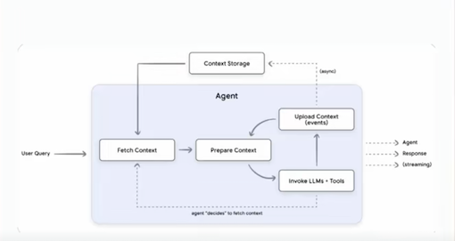
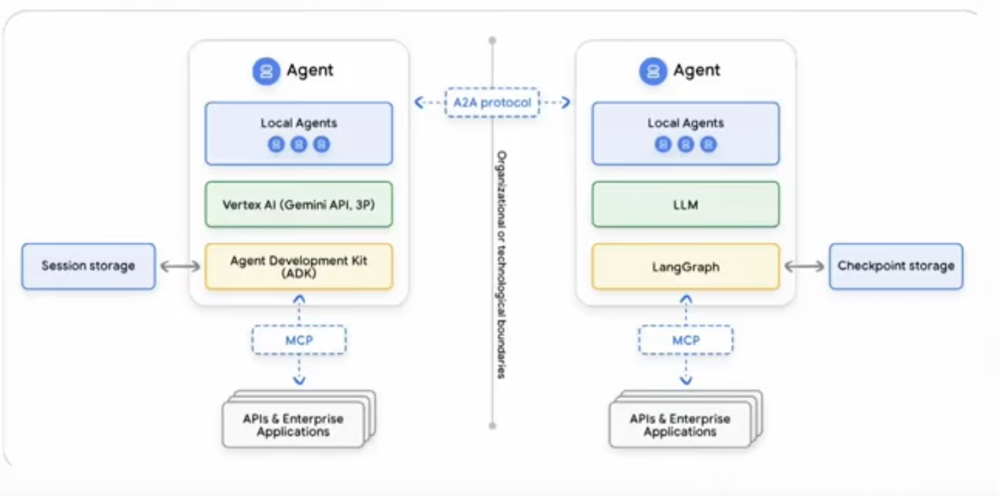
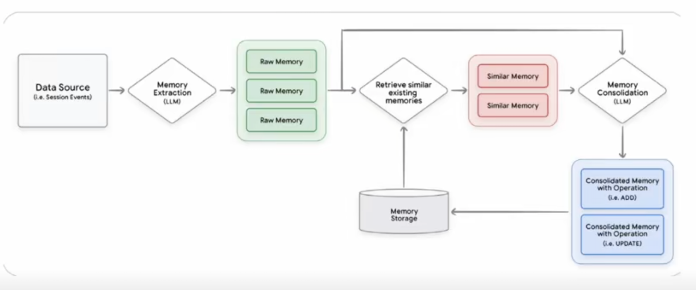

## Day03 Context工程与Memory机制，让LLM拥有持久记忆

在AI Agent的开发体系中，前两期我们已解决了“Agent是什么”和“Agent如何行动”的核心问题——通过基础架构搭建让Agent具备思考能力，借助MCP协议实现工具调用让Agent拥有行动能力。

而本期将聚焦I Agents Intensive系列课程第三本白皮书《Context Engineering: Sessions & Memory》，深入探索Agent开发的核心深水区：**如何通过上下文工程（Context Engineering）与记忆存储（Memory）机制，将无状态的LLM升级为具备持久记忆、可持续进化的智能体。**

### 一、思维升级：从“Prompt编写”到“上下文系统编排”

#### （一）无状态LLM的记忆困境

LLM的本质是无状态模型，每一次API调用对它而言都是独立的交互——无论前序对话多么深入，模型都无法主动留存信息，其“记忆”完全依赖于单次请求的上下文窗口（Context Window）。这意味着，若想让模型实现连续对话、复杂任务处理，必须主动将关键信息“塞进”上下文，而这正是Context Engineering要解决的核心问题。

#### （二）Context Engineering的核心逻辑：动态组装最优Payload

**Prompt Engineering是静态的“菜谱”，仅能提供固定的系统指令；**

**而Context Engineering是运行时（Run Time）的“动态备菜”，需根据每一轮对话的场景、任务和用户需求，精准拼装最有效的上下文 payload。**

一个完整的payload包含三类核心资产，缺一不可：

1. 推理引导层（大脑）：包括System Prompt（系统指令）和Tools（工具集），用于规范模型的推理逻辑与行动边界；
2. 事实支撑层（证据）：由Memory（记忆）和RAG（检索增强生成）提供，为模型决策提供精准的事实依据；
3. 场景锚定层（现场）：涵盖对话历史（Dialogue History）和用户当前输入（User Prompt），确保模型聚焦当下任务。

#### （三）上下文处理的闭环流程

每一轮对话中，Agent需遵循“Fetch- Prepare-Invoke-Upload”四步闭环流程：

1. Fetch（获取）：从存储层拉取会话历史、用户记忆、工具列表等核心数据；
2. Prepare（准备）：动态剪裁、拼装上下文，形成适配当前任务的payload（热路径/Hot Path，需保障低延迟，否则会影响用户体验）；
3. Invoke（调用）：将payload传入LLM，获取模型推理结果；
4. Upload（上传）：将本轮对话信息、更新后的状态等数据持久化存储（建议异步处理，避免阻塞用户交互）。

| 步骤序号 | 步骤名称         | 核心操作                     | 关键属性       | 说明                             |
|----------|------------------|------------------------------|----------------|----------------------------------|
| 01       | Fetch Context    | 检索Memory / RAG / History   | -              | 获取会话、记忆、知识库等核心数据 |
| 02       | Prepare Context  | 组装Prompt                   | HOT-PATH（热路径）、Blocking | 需保障低延迟，直接影响用户体验   |
| 03       | Invoke LLM       | 执行推理与工具调用（Tool Use） | -              | 调用大模型完成任务处理           |
| 04       | Upload Context   | 沉淀会话/记忆数据            | ASYNC（异步）  | 后台执行，不阻塞主线程           |

#### （四）关键原则：上下文编排的“克制艺术”

随着Context Window的扩容，部分开发者会选择将所有信息全量塞入上下文，这种做法存在三重隐患：

1. **Token成本飙升**：过量信息直接导致调用成本指数级增长；
2. **响应延迟增加**：数据传输与模型处理耗时变长，影响交互流畅度；
3. **上下文腐烂（Context Rot）**：无关信息稀释模型注意力，关键指令被淹没，导致幻觉率与遗忘率上升。

因此，Context Engineering的核心是“克制”——在有限的上下文窗口内，最大化信息信噪比，只保留对当前任务有价值的关键内容。

### 二、Context核心组件：Session（会话）——单次对话的“临时工作台”

#### （一）Session的本质：不止是聊天记录

在工程视角下，Session并非简单的对话日志，而是严格绑定用户的“临时工作台”，承担着单次对话的状态管理与数据存储功能。其核心结构包含两部分：

1. Events（事件）：按时间顺序追加的不可篡改“对话日记”，完整记录每一轮交互的内容、时间戳、工具调用记录等；
2. State（状态）：相当于Agent的“草稿纸”（Scratch Pad），存储当前任务进度、用户临时数据（如购物车信息、表单填写状态）等结构化数据。

#### （二）关键区分：Session History ≠ Context

很多开发者容易混淆两者的概念，实则二者差异显著：

- Session History（会话历史）：是完整、永久的“数据仓库”，包含单次对话的所有Events与State变更，需持久化存储；
- Context（上下文）：是从Session History中精心剪裁、拼装后的“精准配料”，仅包含当前轮次模型所需的关键信息，用于单次LLM调用。

若直接将Session History全量传入Context，会导致Token成本、响应延迟双重爆炸，这是生产环境中需坚决规避的错误。

#### （三）生产级Session的核心要求

本地Demo中，Session可暂存于内存变量，但生产环境必须满足以下要求，否则极易引发故障：

1. **持久化存储**：由于Agent Runtime（如Cloud Run、Lambdas）多为无状态架构，**请求结束后内存会清空**，需通过Redis或专用Agent Engine搭建中心化存储层，确保会话信息不丢失；
	- Local / Demo:  In-Memory 陷阱, 在本地跑 Demo 时，Session 只是内存里的一个变量。进程一旦结束（或 Serverless 实例销毁），记忆瞬间清零。
	- **Production / 外部存储是刚需:** 生产环境必须将状态外挂。无论是 Redis 还是 Agent Engine，确保即使 Runtime"用完即焚"，记忆依然永存
2. 三道安全红线：
   - 严格隔离（Strict Isolation）：通过ACL（访问控制列表）确保用户A的Session无法被用户B访问，杜绝数据越权；
   - 敏感信息脱敏：落库前必须过滤手机号、身份证号等敏感数据，减小数据泄露的影响范围（Blast Radius）；
   - 确定性顺序：高并发场景下，Events需按时间顺序严格追加，避免逻辑混乱；
3. **生命周期管理：设置TTL（Time To Live）策略，自动清理长期闲置的“僵尸对话”，防止存储资源浪费**；
4. 性**能优化：Session的读写属于热路径操作，Agent响应慢往往源于数据库查询耗时过长，需优化存储索引、减少冗余数据查询**。

### 三、Context瘦身术：Compaction（压缩策略）——解决长对话记忆难题

#### 长上下文的代价

| 代价类型       | 核心问题                | 具体影响说明                                                                 | 标识/公式                  |
|----------------|-------------------------|------------------------------------------------------------------------------|----------------------------|
| 物理熔断       | Context Window 限制     | 上下文触达物理上限直接报OOM错误，服务不可用                                  | ERR_CONTEXT_OVERFLOW       |
| 账单爆炸       | API 成本                | Token计费呈线性增长，冗余信息会直接消耗预算                                  | COST = $LINEAR(TOKENS)     |
| TTFT飙升       | 延迟（速度）            | Prompt越长，首字延迟（TTFT）越高，用户体验从“秒回”退化为“转圈等待”          | High Latency               |
| 上下文腐烂     | 质量下降                | 模型注意力被稀释，关键指令被噪声淹没，导致幻觉增加、信息召回率下降          | Recall Rate 下降           |

#### （一）压缩的必要性：对抗Context Rot

当对话持续变长，Session History会不断膨胀，即便有大窗口模型，也无法回避四大约束：

1. 窗口容量限制：Context Window存在物理上限，无法无限容纳信息；
2. Token成本约束：全量传输会导致成本失控；
3. 响应延迟约束：数据量越大，传输与处理耗时越长；
4. 推理质量约束：信息密度降低会引发Context Rot，模型注意力分散，幻觉与遗忘风险陡增。

Compaction的核心目标不是“删除信息”，而是“提纯信息”——剔除无关寒暄、过期中间状态等冗余数据，保留对当前任务有价值的关键信号，最大化上下文的信息信噪比。

#### （二）三大压缩策略：按需选择适配场景

| 压缩策略 | 核心逻辑 | 优势 | 劣势 | 适用场景 |
|----------|----------|------|------|----------|
| 滑动窗口 | 仅保留最后N轮对话 | 实现简单、无额外成本 | 易丢失长期关键记忆 | 短对话、简单任务（如客服咨询） |
| 头部截断 | 从最新对话倒序截取，填满Context窗口为止 | 优先保留近期信息，适配短期任务 | 可能截断早期核心背景 | 中等长度对话、任务连贯性要求不高的场景 |
| 递归总结 | 用LLM将早期对话生成摘要，置顶于上下文 | 保留长期关键信息，信息密度最高 | 额外消耗Token、处理耗时较长 | 长对话、复杂任务（如项目协作、多步骤流程） |

#### （三）压缩触发器与工程最佳实践

压缩操作需选择合适的触发时机，避免影响用户体验：

1. **按轮次触发**：每累计10轮对话执行一次；
2. **按时间触发**：对话闲置15分钟后自动执行；
3. **按事件触发**：单个任务完成后触发（如订单提交、表单提交）。

工程落地关键原则：**压缩操作（尤其是递归总结）必须异步执行**。正确流程是：先向用户返回当前轮次结果，再在后台启动Compaction任务，将压缩后的会话数据持久化存储，下一轮对话直接读取压缩版本——坚决避免让用户等待压缩过程。

#### 异步处理机制
| 操作原则       | 核心说明                                                                 | 关键逻辑                     |
|----------------|--------------------------------------------------------------------------|------------------------------|
| 跳出Hot-Path   | Compaction（压缩）操作耗时久、成本高，严禁将其放入用户等待回复的“热路径” | 避免压缩过程阻塞用户交互     |
| 后台异步执行   | 优先响应用户请求，再在后台启动压缩任务                                   | 保障用户体验（体验＞计算效率）|

该流程通过“先响应、后处理”的异步模式，平衡了功能完整性与用户体验：

1. **调用LLM**：优先完成核心推理，生成用户所需结果；
2. **秒回用户**：第一时间将结果返回给用户，避免等待；
3. **后台压缩**：在用户无感知的后台执行Compaction任务；
4. **持久化**：将压缩后的上下文数据存储，供后续对话复用。

这种设计既解决了长上下文的存储与成本问题，又保证了交互的流畅性，是生产级Agent系统的典型优化方案。

### 四、多Agent协作：以Memory为“通用语”实现信息同步

当多个Agent协同处理复杂任务时，Session的框架绑定特性会成为信息同步的障碍，而Memory则是解决跨Agent互操作的核心。

#### （一）多Agent协作的两种历史共享模式

多Agent协作的本质是“原材料仓库共享”（即会话历史共享），主要有两种实现模式：

1. **共享统一历史：所有Agent写入同一个日志（Log），信息完全透明**。优势是协作成本低，劣势是上下文易膨胀，适用于小规模、简单协作场景；
2. **各自私有历史：每个Agent维护独立的会话记录，仅通过标准化消息接口传递关键信息，不暴露内部思考过程**。优势是符合微服务解耦思想，稳定性高，适用于大规模、复杂协作场景。

#### （二）跨框架协作的核心：Memory的“通用语”特性

若Agent基于不同框架开发（如LangGraph、Google ADK），直接传递Session会因数据结构（Schema）不兼容而失败——就像不同语言的人无法直接沟通。而Memory的核心优势在于“Framework-Agnostic（与框架无关）”：

Memory存储的是纯粹的字符串或JSON字典，不依赖任何框架的私有数据结构。无论Agent采用何种开发框架，只需将关键知识沉淀到统一的Memory层，即可实现跨Agent的信息互通与能力复用，这是多Agent协作的最优解。

### 方案价值解读

Vendor Lock-in是多Agent协作的典型障碍——当Agent基于不同框架开发时，Session的私有数据结构会导致“语言不通”；而Memory通用层通过统一的基础数据格式，让不同框架的Agent可以共享记忆信息，是实现多Agent生态化协作的关键技术方案。

| 方案类型         | 核心问题/优势                          | 具体说明                                                                 | 关键特性               |
|------------------|----------------------------------------|--------------------------------------------------------------------------|------------------------|
| Vendor Lock-in（供应商锁定） | **Session与框架强耦合的风险**             | Session的Schema（数据结构）与开发框架绑定，不同框架（如LangGraph与ADK）无法互通，导致多Agent通信阻断 | 框架依赖、通信壁垒     |
| Memory通用层     | 解决跨框架互操作的方案                  | 采用框架无关（Framework-agnostic）的设计，通过纯粹的Strings/Dictionaries基础数据结构，打破不同框架的协作壁垒 | 跨框架兼容、数据通用   |

### 五、Memory机制：Agent的“持久记忆”核心

Session仅能管理“单次对话的当下”，而Memory则负责承载“跨越对话的未来”——让Agent在与用户交互百次后，仍能记得首次沟通时的偏好，这是Agent从“工具”升级为“伙伴”的关键。

### （一）核心误区：Memory ≠ 对话日志

很多开发者将“存储所有聊天记录”等同于构建Memory，这是典型的认知偏差：

- 对话日志（Log）：是“涌泉的流水账”，记录原始的对话内容（如“用户说下周要去巴黎出差”），无结构化、无提炼；
- Memory（记忆）：是“精炼的知识点快照”，从日志中提取有价值的信息并结构化存储（如“用户偏好旅行目的地：巴黎”“用户状态：下周出差”）。

Session与Memory是共生关系：Session是“矿石”，提供原始数据；Memory是“炼出的金子”，提供精准价值。将Memory注入新的Session，既能避免重复询问用户已知信息（省Token），又能控制Session规模（降延迟），实现高效交互。

#### （二）Memory Manager：不止是向量数据库

一个成熟的Memory系统，核心是Memory Manager（记忆管理器）——它并非被动的向量数据库（Vector DB），而是具备完整“提取-整合-存储-检索”流程的动态系统：

1. **Extraction（提取）**：从会话日志中识别关键信息（如用户偏好、任务规则、实体数据）；
2. **Consolidation（整合去重）**：去除重复信息、冲突信息，将碎片化知识点融合为结构化数据（核心壁垒）；
3. **Storage（存储）**：将结构化记忆持久化到存储层，支持高效检索；
4. **Retrieval（检索）**：根据当前任务需求，精准召回相关记忆并注入上下文。

若仅存储不整合，Memory会沦为“垃圾堆”，无法为Agent提供有效支撑——Consolidation是Memory Manager的核心能力。

#### （三）Memory与RAG的核心区别

> 系统架构对比：静态知识库 VS 动态用户画像

Memory和RAG常被混淆，但二者定位截然不同，缺一不可：

| 维度 | Memory（私人助理） | RAG（图书馆管理员） |
|------|--------------------|----------------------|
| **核心定位**| 存储“用户的事实” | 存储“世界的事实” |
| **数据特性** | 动态更新、私有专属 | 静态稳定、公开通用 |
| **典型示例** | 用户偏好、个人状态、历史任务 | 常识知识、行业数据、公开文档 |
| **核心价值** | 提供个性化、深度交互能力 | 提供广谱、精准的事实支撑 |

一个完整的智能Agent，必须同时具备RAG（保障知识广度）和Memory（保障交互深度），才能平衡通用性与个性化。

### 六、Memory的工程落地：存什么、怎么存、存在哪

Memory的落地质量直接决定Agent的实用价值，需从“存储内容、数据结构、存储方案”三方面精准设计。

#### （一）数据结构：Content + Metadata

一条标准的Memory记录必须包含两部分，缺一不可：

1. Content（内容）：与框架无关的结构化数据，优先选择JSON或纯文本格式，避免存储Python对象等框架绑定数据（确保跨Agent复用）；
2. Metadata（元数据）：检索的“索引键”，需包含唯一ID、时间戳、信息来源（如会话ID、工具名称），支持快速精准召回。

#### （二）存储内容：两类记忆覆盖全场景

借鉴认知科学的分类，Agent的Memory需包含两类核心内容，覆盖“知其然”与“知其所以然”：

1. **Declarative Memory（陈述性记忆）**：“知道是什么”，存储事实性信息（如“用户喜欢吃辣”“项目截止日期：2024-12-31”），是当前主流落地场景；
2. **Procedural Memory（程序性记忆）**：“知道怎么做”，存储任务流程与操作步骤（如“用户订票偏好：优先靠窗座位，选择电子发票”“故障排查步骤：先查日志，再验接口”），是Agent复用成功经验、提升复杂任务处理能力的关键。

#### （三）存储方案：按需选择平衡性能与成本

| 存储方案 | 优势 | 劣势 | 适用场景 |
|----------|------|------|----------|
| 向量数据库（如Milvus、Pinecone） | 支持语义检索，召回精度高 | 成本较高，查询延迟中等 | 大规模记忆、语义关联检索场景 |
| Redis | 读写速度快，支持过期策略 | 不支持复杂语义检索 | 短期记忆、高频访问的状态数据 |
| 关系型数据库（如PostgreSQL） | 数据结构稳定，支持事务 | 检索灵活性不足 | 结构化强、需严格一致性的记忆数据 |

#### (四） 记忆架构设计的三种主流组织模式

| 模式类型          | 模式定位       | 核心特点                          | 适用场景                     |
|-------------------|----------------|-----------------------------------|------------------------------|
| Collections       | 集合/堆栈      | 非结构化Insight，存储散点信息与碎片化记忆（类似“便利贴墙”） | 临时、碎片化的信息记录       |
| User Profile      | 结构化画像     | 核心属性（KV形式），精准记录Name、ID、Preference等（类似“个人档案卡”） | 用户固定属性、长期偏好存储   |
| Rolling Summary   | 滚动摘要       | 长历史压缩，实时更新“人设传记”，将宏观上下文压缩为摘要 | 长对话、复杂任务的记忆精简   |

#### (五） 存储架构选型

| 架构类型       | 核心能力               | 适用场景                     | 定位与优势                     |
|----------------|------------------------|------------------------------|--------------------------------|
| Vector Database（向量数据库） | 语义相似性（Semantic Similarity） | 模糊搜索、非结构化召回       | 擅长基于语义的广谱信息匹配     |
| Knowledge Graph（知识图谱） | 实体关系（Relationship） | 复杂逻辑推理、多跳查询（Multi-hop） | 精准解析实体间关联，支撑深度推理 |
| Hybrid（混合架构） | Best of Both（兼具语义与精确性） | 需兼顾广度召回与深度推理的场景 | 推荐选型，用Vector做广度召回、Graph做深度推理 |

#### (六） Scope & Modality（作用域与多模态策略）

| 类别          | 细分类型          | 核心说明                                                                 | 标签/风险等级       |
|---------------|-------------------|--------------------------------------------------------------------------|---------------------|
| **Scope作用域** | User-level（用户级） | 严格数据隔离，是个性化记忆的基础设施 | DEFAULT（默认）|
|               | Session-level（会话级） | 仅限当前对话上下文，用于Context压缩与短期缓存 | TEMP（临时）|
|               | App-level（应用级） | 全用户共享知识库，需严格清洗PII（隐私数据）与脱敏 | HIGH RISK（高风险） |
| **Multimodal Strategy（多模态策略）** | 处理流程          | 1. 多模态输入源（图片/语音/视频） 2. 转录&描述（ETL流程） 3. 存储为Textual Insight（不直接存Embedding） | 最佳实践：“用户发了一双红鞋”→文本化存储 |

#### (七） Memory Pipeline 全链路架构解析：从原始会话到长期记忆

| 流程阶段       | 图标标识 | 核心操作说明                     | 关键价值                     |
|----------------|----------|----------------------------------|------------------------------|
| Ingestion      | 云下载    | 全量摄入原始Session数据          | 获取记忆的原始信息来源       |
| Extraction     | 漏斗      | 识别关键Signal（信号）与Noise（噪声） | 过滤冗余信息，提炼核心价值   |
| Consolidation  | 大脑      | 解决记忆冲突与自我修正           | 保障记忆的一致性与准确性     |
| Storage        | 数据库    | 写入Vector DB/Graph等存储介质    | 实现记忆的持久化与可检索     |

#### (八） Consolidation（记忆自编辑）

| 操作类型 | 触发场景               | 核心说明                                     | 示例操作                     |
|----------|------------------------|----------------------------------------------|------------------------------|
| CREATE   | 全新话题（新实体/新属性） | 建立新的记忆节点                             | 输入“迷上胶片摄影”→添加hobbies: "Film Photo" |
| UPDATE   | 信息演进（已有偏好细化） | 提升记忆精度，非简单覆盖                     | 原coffee: "Latte"→更新为coffee: "Oat Latte (Hot)" |
| DELETE   | 事实冲突（失效信息/逻辑矛盾） | 作废无效信息，保障记忆一致性                 | 输入“搬去上海”→删除address: "Beijing" |

#### (九） Memory ETL触发时机

| 触发时机类型     | 核心特点               | 优势                  | 劣势                  |
|------------------|------------------------|-----------------------|-----------------------|
| Real-Time（实时）| 记忆即时生效           | 体验流畅，信息无延迟  | 成本高，并发压力大    |
| Turn Cadence（轮次节奏） | ROI平衡方案         | 兼顾成本与体验        | 触发逻辑稍复杂        |
| Session End（会话结束）| 计算成本最低           | 资源消耗少            | 记忆生成有延迟        |

**工程原则补充**

所有触发策略需遵循`Always Async()`原则：Memory ETL必须作为后台进程执行，避免阻塞用户交互（即“不要让用户盯着Loading转圈”）。

#### (十） #### (八） Memory ETL触发时机

| 检索模式       | 触发机制               | 优势                  | 劣势                  | 适用场景               |
|----------------|------------------------|-----------------------|-----------------------|------------------------|
| Proactive（预加载） | 每轮对话自动检索       | 响应极快（Zero LLM Overhead） | 易含噪声（可能引入无关上下文） | 实时对话流             |
| Reactive（工具化）  | Agent自主调用Tool      | 极高精准度（按需提取，减少干扰） | 高延迟风险（Latency = RTT × 2） | 复杂任务规划           |

**决策核心**

选择哪种模式需基于“延迟预算（Latency Budget）”：追求低延迟选Proactive，追求高精准选Reactive。

#### (十一）Context注入策略

| 注入载体                | 特性描述         | 最佳用途                | 风险提示                     |
|-------------------------|------------------|-------------------------|------------------------------|
| System Instructions（系统指令） | 全局·稳定·高权威 | User Profile（用户画像/目标） | -                            |
| Conversation History（对话历史） | 局部·动态·易混淆 | Episodic（具体细节）| 存在Dialogue Injection风险，需明确分隔符以区分“引用记忆”与“当前指令” |

#### (十二）评估体系与安全架构

| 类别          | 细分项         | 核心指标/要求                                                                 |
|---------------|----------------|------------------------------------------------------------------------------|
| **效果评估**  | 生成质量       | 以Precision、Recall、F1 Score为核心，关注回答是否精准命中上下文               |
|               | 检索性能       | 以Recall@K（如Top-3命中率）、延迟（<50ms）为核心                              |
| **安全铁律**  | Strict Isolation（ACL） | 用户级隔离为底线，User A的记忆User B绝对不可见                                 |
|               | Privacy & Opt-out | 强制PII脱敏（如ID模糊化），保障数据删除权                                     |
|               | Anti-Memory Poisoning | 防止恶意用户诱导Agent存储错误事实，需执行写入前验证（Pre-write Validation）    |

### 七、总结与后续展望

本期通过Context Engineering与Memory机制的拆解，我们明确了让无状态LLM拥有持久记忆的核心逻辑：Context Engineering是“精准配料”的艺术，通过Session管理与Compaction策略，在有限上下文窗口内最大化信息价值；Memory机制是“提炼沉淀”的系统，通过结构化存储与智能检索，让Agent具备跨会话的记忆复用能力。

关键落地启示：

1. 生产级Agent必须区分Session与Context，避免全量传输导致的成本与延迟问题；
2. Compaction策略需异步执行，平衡记忆完整性与用户体验；
3. 多Agent协作的核心是Memory的通用语特性，需规避Session的框架绑定限制；
4. Memory需同时覆盖陈述性与程序性记忆，才能支撑复杂任务处理。
