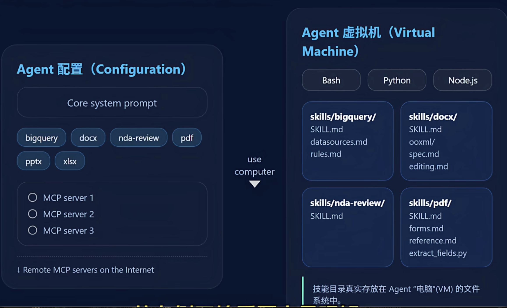
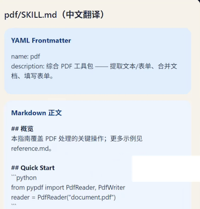
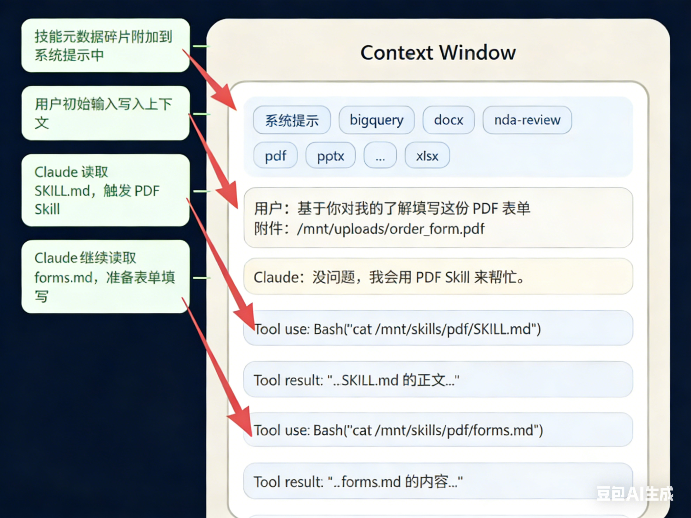

# Equipping agents for the real world with Agent Skills

## 1 Agent架构的SOP革命：Anthropic Skill机制让AI从“会聊”到“会做”

AI Agent正迎来从“对话交互”到“任务执行”的关键转折，但在真实世界场景中，它们往往面临“知其然，不知其所以然”的困境——空有强大的模型能力，却缺乏落地任务所需的过程知识与组织背景。

2025年10月16日，Anthropic发布的官方文档《Equipping agents for the real world with Agent Skills》，提出了革命性的Skill机制，为Agent突破落地瓶颈提供了标准化解决方案，让智能体真正具备“会做事”的核心能力。

### 一、Agent的真实世界困境：聪明却“无经验”的新员工

Anthropic在文档中明确指出，即便强大如Claude，在处理真实世界任务时仍存在两大核心能力缺口，这恰如一位聪明但毫无工作经验的新员工：

#### 1. 缺乏过程知识：不知道“事情该怎么做”

新员工入职第一天，即便智商再高，也会困惑“报销流程是什么”“如何提交代码”“合同审批要走哪些步骤”。同样，Agent若没有明确的流程指引，**面对“生成合规文档”“提取合同字段”等具体任务时**，要么输出杂乱无章，要么遗漏关键步骤，无法形成标准化结果。

#### 2. 缺乏组织背景：不知道“东西在哪里”

新员工不清楚“项目API密钥存放在哪里”“汇报模板的格式要求”“客户资料的存储路径”，就无法高效开展工作。Agent也面临同样问题——没有对组织内部资源、配置、模板的认知，即便能理解任务意图，也因缺少必要的资源支撑而无法落地。

这两大缺口，让Agent始终停留在“能聊天、难落地”的阶段。而Anthropic提出的Skill机制，正是为Agent量身打造的“标准化入职手册”，填补过程知识与组织背景的双重空白。

### 二、Skill机制核心解析：Agent的“可动态加载能力模块”

#### 1. Skill的定义：结构化的“任务解决方案包”、

Skill并非简单的知识片段，而是由**指令（instructions）、脚本（scripts）、资源（resources）** 组成的结构化文件夹，智能体能够动态发现、挂载并使用这些内容，精准提升特定任务的执行表现。

这三要素形成了完整的任务闭环，恰好对应Agent的两大能力缺口：

- **指令+脚本**：解决“不知道怎么做”的过程知识缺口，明确任务的步骤、逻辑与执行方式；
- **资源**：解决“不知道东西在哪里”的组织背景缺口，提供任务所需的模板、配置文件等关键素材。

#### 2. Skill的核心优势：动态扩展，突破上下文限制

与传统“固定在系统提示中”的知识不同，Skill具备**动态加载特性**：

- **当Agent面对不同任务时（如分析财报、处理PDF、生成合规报告），会主动检索并匹配最相关的Skill**；
- 无需重启系统，**即可实时挂载Skill中的SOP、脚本与模板，让输出更精准、一致且可复制**；
- 突破了大模型上下文窗口的限制，让Agent的智能边界随任务需求实时扩展，实现“近似无限上下文”的工作流。

简单来说，Skill赋予了Agent“按需学习”的心智模式——面对新任务时，无需重新训练模型，只需加载对应的Skill模块，就能快速具备专业的任务执行能力。

### 三、Skill的系统架构：从配置到执行的全链路逻辑

Skill机制的落地，依赖“Agent配置+虚拟机执行”的双层架构，清晰划分了“决策”与“执行”的边界：

LLM通过 Agent 配置找到技能，再让虚拟机加载技能目录并执行脚本。

#### 1. 右侧：Agent虚拟机——“动手做事”的硬件基础

虚拟机是Agent的“电脑与双手”，是任务的实际执行载体，核心包含两大能力：

- 环境支撑：内置Python引擎与Bash命令行终端，支持执行脚本、操作文件（如`ls`列出文件、`cut`提取内容）等实际操作；
- 存储载体：文件系统中存放着所有Skill的实体文件，包括指令文档、Python脚本、JSON配置、docx模板等，供虚拟机随时调用。

这一设计让Agent摆脱了“只能输出文字”的局限，真正具备了“动手操作”的能力。

#### 2. 左侧：Agent配置——“思考决策”的大脑索引

左侧的LLM（大语言模型）是Agent的决策中心，而Agent配置则是LLM可访问的“Skill索引”，核心包含：、

- 核心系统提示：定义Agent的基础行为准则与工作边界；
- 已装备技能清单：列出可用的Skill名称与简介（如PDF处理、合同提取、财报分析等），方便LLM快速检索。

#### 3. 全链路执行流程

当Agent需要处理某一任务时，执行逻辑如下：

1. LLM（大脑）通过任务意图，从Agent配置的技能清单中匹配目标Skill；
2. 通过Tool工具向虚拟机发送指令（如`run bash command`），调用对应的Skill文件；
3. 虚拟机读取Skill中的指令、脚本与资源，执行具体操作（如运行Python脚本提取PDF字段、调用模板生成文档）；
4. 执行结果返回给LLM，由LLM整合后输出最终结果，或决定下一步操作。

### 四、Skill vs Tool：流程编排者与原子执行者的本质区别

> Skill  不是 Tool，它是 Tool 的 SOP

**很多人会混淆Skill与Tool，但二者在架构中的角色、定位完全不同——Skill是“调用Tool的SOP”，Tool是“被Skill调用的原子能力**”，具体差异可通过下表清晰区分：

| 对比维度 | Tool（工具） | Skill（技能模块） |
|----------|--------------|-------------------|
| 核心定位 | 回答“我能做什么” | 回答“我该如何做好这件事” |
| 技术本质 | 原子化能力（API/函数） | 完整SOP（指令+脚本+资源） |
| 角色属性 | 被动执行者，等待调用 | 主动编排者，指导LLM调用Tool |
| 核心目标 | 提供单一执行能力 | 封装可移植、可复用的过程知识 |
| 类比对象 | 一台功能强大的烤箱 | 一份详细的烤鸡食谱（含原料、温度、步骤） |

简单来说，Tool是“硬件”，提供基础执行能力；Skill是“软件+说明书”，通过编排Tool的使用流程，实现复杂任务的标准化落地。Skill并非替代Tool，而是让Tool的能力得到更高效、精准的发挥。

### 五、总结：Skill机制开启Agent落地新时代

Anthropic的Skill机制，本质是为Agent建立了“过程知识标准化、组织背景资源化、能力扩展动态化”的落地体系。它让Agent从“聪明的聊天机器人”，升级为“具备专业执行能力的数字化员工”：

- 对企业而言，Skill可复用、可移植，无需重复开发，降低了Agent的落地成本；
- 对开发者而言，Skill的结构化设计让任务逻辑更清晰，便于维护与迭代；
- 对用户而言，Agent的输出更一致、更精准，真正能解决真实世界的具体问题。

随着Skill机制的普及，Agent将彻底摆脱“纸上谈兵”的困境，在办公自动化、企业流程优化、专业任务处理等场景中发挥核心价值。而Skill与Tool的协同模式，也为后续Agent架构的演进提供了清晰的方向——未来，Agent的竞争核心，将是“Skill生态的丰富度与复用性”。

## 2 突破上下文限制：Anthropic Skill的渐进式机制实现“近似无限上下文”

大模型的上下文窗口始终是Agent落地的核心瓶颈——过长的文本会导致推理效率下降、成本飙升，而复杂任务又离不开海量过程知识与资源支撑。Anthropic在《Equipping agents for the real world with Agent Skills》中提出的**渐进式批露机制**，通过“分层加载+认知与执行分离”的架构设计，让Agent无需扩大上下文窗口，就能实现“近似无限上下文”的工作模式，彻底解决了“信息过载”与“知识不足”的矛盾。

### 一、Skill的内部结构：以skill.md为核心的结构化目录

要理解渐进式机制，首先要明确Skill的底层结构。每个Skill本质是一个标准化文件夹，其核心入口是**skill.md文件**——相当于技能的“使用说明书”，统筹元数据、核心指令与资源关联，具体结构如下：

#### 1. 核心入口：skill.md的双重角色

skill.md文件分为两部分，既承担“技能索引”功能，又包含“核心执行逻辑”：

- 顶部YAML元数据区（frontmatter）：包含两个关键字段——`name`（技能名称，如“pdf处理”）和`description`（技能简介，如“从PDF中抽取文本和表单字段”），用于系统快速识别技能用途；
- 正文Markdown区：存储技能的核心指令、SOP流程（如PDF字段提取的步骤），是Agent执行任务的核心依据。

### 2. 附属资源：无限扩展的外部文件

Skill文件夹中除skill.md外，还可包含各类附属文件，构成任务执行的“资源库”：

- 文档类：如forms.md（表单提取规则）、reference.md（参考资料）；
- 配置类：如.json格式的参数配置文件；
- 脚本类：如.py格式的执行脚本（用于字段提取、数据处理等）。

这些附属文件不直接加载进上下文，而是通过指令按需调用，为“无限上下文”提供了基础。

#### 3. 预加载设计：只加载“索引”，不加载“全文”

**系统启动时，会自动扫描所有Skill的skill.md文件，但仅提取YAML元数据（name和description）预加载到系统提示词中。**

这意味着Agent启动后，立刻知道“自己拥有哪些技能、能做什么”，但无需加载技能的完整内容——既节省了Token成本，又为后续分层加载埋下伏笔。

### 二、渐进式批露机制：三层加载，随用随取

渐进式批露的核心逻辑，如同阅读一本结构化手册：**先看目录（元数据），再读相关章节（核心指令），最后按需查阅细节（附属文件）**。Anthropic将其拆解为三层加载机制，每层都对应明确的加载时机、内容与Token消耗：

| 加载层级 | 文件位置 | 核心内容 | 加载方式 |  Token消耗 | 核心作用 |
|----------|----------|----------|----------|------------|----------|
| **Level 1：元数据层** | skill.md顶部YAML | 技能名称（name）、技能简介（description） | 系统启动时始终加载 | 约100 Token | 让Agent快速知晓“有哪些技能、能做什么”，无需加载完整内容 |
| **Level 2：核心指令层** | skill.md正文Markdown | 技能的SOP流程、核心执行逻辑 | 技能被触发时加载 | 平均<5000 Token | 提供任务执行的关键步骤，确保Agent“知道怎么做” |
| **Level 3：附属资源层** | Skill文件夹内其他文件（.md/.json/.py等） | 参考资料、配置参数、执行脚本 | 指令要求时按需加载 | 理论无上限 | 补充任务所需的细节资源，支持复杂操作 |

### 关键优势：Token消耗与任务复杂度解耦

传统Agent需将所有相关知识一次性塞进上下文，导致Token消耗随任务复杂度指数增长；

而渐进式加载仅在需要时提取对应层级的信息，比如处理PDF时，仅加载“PDF技能”的核心指令，无需加载其他无关技能的内容，大幅降低了上下文压力。

### 三、核心突破：认知与执行分离，避免上下文“撑爆”

为什么Level 3可以包含海量文件甚至超长脚本，却不会导致上下文溢出？关键在于Anthropic设计的**认知与执行分离架构**——将Agent的“思考空间”与“行动空间”彻底拆分：

#### 认知空间与执行空间核心对比表

| 对比维度 | 认知空间（Cognition） | 执行空间（Execution） |
|----------|------------------------|------------------------|
| 核心定义 | 模型的思考空间，承载推理所需关键信息 | 任务的行动空间，负责实际操作与数据存储 |
| 包含内容 | 系统提示、技能元数据、被触发技能的Markdown正文 | forms.md、reference.md等文档、.py脚本、PDF等真实文件 |
| 核心功能 | 完成推理、总结、决策等脑力活动 | 执行脚本运行、文件读取、数据处理等实际操作 |
| 信息特点 | 体量小、易压缩，仅保留本轮任务必需信息 | 可包含海量文件，支持复杂操作，理论无容量上限 |
| 运行机制 | 随任务推进动态筛选关键信息，剔除冗余 | 接收模型工具调用指令，执行后返回精简结果 |
| 优势特性 | 聚焦核心推理，避免上下文冗余与成本浪费 | 执行结果确定、可复现，效率高于语言描述 |
| 典型示例 | 识别PDF处理需求，明确需调用extract_fields.py脚本 | 运行Python脚本提取PDF字段，生成forms.json并返回执行结果 |

#### 1. 认知空间(Cognition)：上下文仅承载“思考所需信息”

Agent的上下文（思考空间）仅包含三类核心信息，体量始终可控：

- **系统提示词+所有Skill的Level 1元数据（索引）**；
- **被触发技能的Level 2核心指令（SOP）**；
- **任务执行过程中产生的结果（如脚本运行反馈）**。

这部分信息聚焦“决策与判断”，Token消耗始终维持在低水平，不会因附属资源增多而膨胀。

#### 2. 行动空间：外部虚拟机承载“执行与存储”

所有复杂操作（如脚本运行、文件读取）都在**外部虚拟机**中执行，构成Agent的“行动空间”：

- 虚拟机内置Python引擎、Bash终端，支持运行.py脚本、操作文件（如`ls`列出文件、`run bash command`执行脚本）；
- 附属资源（脚本、配置文件）存储在虚拟机的文件系统中，Agent不会“阅读”脚本内容，而是通过指令调用执行；
- 执行结果仅返回精简反馈（如“字段提取完成，结果已保存为forms.json”），不传递原始脚本或海量数据。

#### 实例验证：PDF字段提取的执行流程

以“提取PDF表单字段”任务为例，认知与执行分离的架构优势一目了然：

1. Agent通过Level 1元数据识别“PDF处理技能”，加载Level 2核心指令（如“读取forms.md规则→运行extract_fields.py脚本”）；
2. 收到“运行脚本”指令后，Agent向虚拟机发送`run bash command`命令，不加载5000行的Python脚本到上下文；
3. 虚拟机执行脚本，完成字段提取后，仅返回“提取成功”的精简结果；
4. **Agent基于结果继续决策，全程上下文仅承载“指令+反馈”，无冗余信息**。

正如Anthropic在文档中强调：“具备合适框架、状态和代码执行工具的Agent，无需将Skill的全部内容加载到上下文窗口，Skill可捆绑的上下文量实际上是无限的。”

### 四、额外价值：外部脚本带来确定性与效率

渐进式机制不仅解决了上下文限制，还通过外部脚本执行提升了任务的“确定性与效率”：

- 确定性：语言模型处理排序、数学运算、字段提取等任务时，易出现误差，而Python脚本执行结果可重复、可验证，避免“幻觉”；
- **效率：脚本执行速度远超模型推理，尤其处理海量数据时，能大幅降低延迟与Token成本**；
- 可维护性：脚本与配置文件独立于模型，修改任务逻辑时无需调整Prompt，直接更新文件即可，降低迭代成本。

### 五、上下文动态变化全过程：从触发到完成

Skill被触发后，上下文的动态加载流程清晰可追溯，全程保持“按需扩展、无用即弃”：

> 忠实还原原文示意：System Prompt +元数据 -> 触发 pdf -> 读取 forms -> 执行脚本。

1. 初始状态：上下文包含系统提示、所有Skill的Level 1元数据、用户初始请求（如“帮我填写这份PDF表单”）；
2. 技能触发：Agent匹配“PDF处理技能”，加载该技能的Level 2核心指令（skill.md正文）到上下文；
3. **资源调用：若指令要求“参考forms.md规则”，Agent调用工具读取该文件内容，仅将核心规则加载进上下文，未提及的reference.md仍留在文件系统**；
4. 外部执行：执行`extract_fields.py`脚本，虚拟机返回精简结果，上下文仅记录结果，不存储脚本；
5. **生成响应：Agent整合上下文内的“指令+结果”，输出最终回复（如“表单字段已提取，可直接填写”**）。

### 六、核心结论：无限上下文的本质是“架构创新”

Anthropic的Skill机制证明，“近似无限上下文”并非依赖模型参数的提升，而是架构设计的突破：

- 分层加载：通过Level 1-3的渐进式机制，让信息“随用随取”，避免上下文过载；
- 内外分离：认知空间（上下文）聚焦决策，行动空间（虚拟机）承载执行，二者协同且解耦；
- 资源外置：将海量知识与工具以Skill文件夹形式存储，Agent通过指令按需调用，突破了上下文窗口的物理限制。

这种架构思想，让Agent既能拥有处理复杂任务的“海量知识储备”，又能保持“轻量高效的思考状态”，为真实世界任务的落地提供了关键支撑。未来，Skill生态的丰富度与可复用性，将成为Agent能力竞争的核心。

## 3 Skill全生命周期指南：从开发、评估到安全共享，构建可落地的智能体技能体系

Anthropic的Skill机制不仅解决了Agent“会做事”的核心问题，更通过渐进式披露实现了“近似无限上下文”的突破。

而Skill从概念落地为实用体系，关键在于掌握“开发-评估-安全-共享”的全生命周期管理。本文结合《Equipping agents for the real world with Agent Skills》第三部分核心内容，拆解Skill的完整构建逻辑，帮你打造可复用、高安全、能进化的技能体系。

### 一、开发前置：以评估为起点，用问题驱动技能设计

Skill的核心价值是弥补Agent的能力短板，而非盲目堆砌功能。Anthropic强调，开发的第一步不是编写文档，而是通过评估暴露问题，让任务失败样本成为技能设计的源头。

#### 1. 评估先行：定位Agent的能力瓶颈

让Agent执行真实业务任务（如填写表单、生成合规报告、分析合同条款），重点观察三类关键场景：

- **出错场景：哪些步骤频繁产生错误结果（如字段提取遗漏、格式不符合要求）**；
- **卡顿场景：在哪类操作中需要人工补充提示才能继续（如不清楚表单填写规则、缺乏必要参考数据）**；
- **低效场景：哪些任务处理耗时过长或流程冗余（如重复查询同类信息、手动转换数据格式）**。

这些场景对应的能力缺口，就是Skill的核心开发靶点——每一个Skill都应聚焦解决一类具体问题，避免“大而全”导致的逻辑混乱。

#### 2. 迭代式开发：小步验证，逐步扩展

Skill的成长依赖持续验证，而非一次性完成：

- 初始版本：仅保留核心SOP与必要资源，优先验证“能否解决核心问题”（如PDF表单提取Skill，先实现关键字段识别功能）；
- 多轮迭代：基于实际使用反馈，逐步添加细节指令、补充参考文档、优化脚本逻辑；
- **避免过度设计：初期不追求完美覆盖所有边缘场景，先保证主流程稳定，再通过迭代完善**。

### 二、结构设计：为规模与复用性搭建分层架构

当Skill覆盖的场景逐渐复杂，单一文件会导致维护成本飙升。Anthropic推荐“分层拆分”的设计思路，既保证结构清晰，又能降低模型记忆负担。

#### 1. 三层文件结构：兼顾轻量化与扩展性

延续渐进式披露的核心逻辑，Skill的文件结构应分为三层，实现“随用随取”：

| 层级 | 核心内容 | 体量控制 | 作用 |
|------|----------|----------|------|
| 上层：元数据层 | Skill名称（name）、功能简介（description） | 约100词 | 帮助Agent快速识别技能用途，决定是否调用 |
| 中层：核心指令层 | 主流程SOP、关键操作步骤、决策逻辑 | ≤5000词 | 提供任务执行的核心依据，确保Agent“知道怎么做” |
| 下层：附属资源层 | 参考文档（如forms.md）、配置文件（.json）、执行脚本（.py） | 无明确上限 | 存储细节信息与可执行代码，按需加载调用 |

#### 2. 关键设计原则：让Agent“读懂、用好”Skill

- **拆分复用**：将主流程与细节分离（如把不同表单的填写规则拆分为独立.md文件，在主文档中引用），提升维护效率；
- **明确执行边界**：用清晰指令区分“需阅读的文档”和“需执行的脚本”（如标注“运行scripts/extract.py”“参考reference.md”），避免Agent混淆；
- **优化命名与简介**：这两个字段是Agent判断是否调用Skill的核心依据，需精准描述功能（如“pdf-form-fill：提取用户历史信息，自动填写PDF表单字段”），避免模糊表述导致误触发。

#### 3. 从Agent视角优化：观察并调整使用行为

Skill的使用者是Agent，需持续观察其使用表现并优化：

- 若Agent频繁误触发技能，可能是简介描述过于宽泛，需细化功能边界；
- 若Agent过度依赖某类上下文才能使用Skill，需补充更详细的前置条件说明；
- 若Agent在执行中频繁卡顿，可能是核心指令缺失关键步骤，需完善SOP逻辑。

### 三、迭代进化：人机共创式学习，让Skill持续成长

Anthropic提出核心理念：Skill的进化不应仅依赖人类编辑，而应是“人机共同完成的过程”。通过让Agent参与总结与反思，将经验沉淀为标准化SOP。

#### 1. 成功案例沉淀

当Agent通过Skill顺利完成任务时，触发其总结关键信息：

- 哪些指令或步骤起到了核心作用；
- 哪些参考资源或脚本提升了执行效率；
- 用户需求的共性特点（如表单填写的高频字段、报告生成的格式偏好）。

将这些总结自动更新到Skill的核心指令层或附属资源层，成为下一次执行的标准依据。

#### 2. 失败案例反思

当Agent执行失败时，不直接重试，而是引导其深度反思：

- 错误的具体表现（如字段提取错误、脚本运行失败）；
- 失败原因（如误解指令、缺少必要参数、资源文件缺失）；
- 改进方案（如补充参数校验逻辑、明确资源文件路径、优化脚本容错机制）。

基于反思结果优化Skill，避免同类错误重复发生，形成“执行-反思-优化”的闭环。

### 四、安全底线：三大原则防范Skill使用风险

Skill的强大能力（运行脚本、访问文件、连接网络）同时带来安全隐患。Anthropic明确了三条安全使用原则，平衡能力与风险：

#### 1. 严格筛选来源：仅使用可信Skill

避免安装来源不明的Skill，优先选择官方认证、开源社区验证或内部团队开发的技能模块——恶意Skill可能通过脚本窃取数据、执行非法操作，危害系统安全。

#### 2. 全面审查内容：使用前必做“安全检查”

安装Skill后，需逐一审查所有文件：

- 脚本文件（.py等）：检查是否包含恶意代码（如数据窃取、远程控制逻辑）、是否有未授权的外部网络请求；
- 配置文件与参考文档：核实是否包含敏感信息（如API密钥、隐私数据）、外部资源链接是否安全可信；
- 执行逻辑：明确Skill的操作范围（如是否访问本地文件系统、是否修改核心数据），评估潜在风险。

#### 3. 明确权限边界：最小权限原则

限制Skill的访问权限，避免过度授权：

- **脚本执行权限：仅允许在隔离的虚拟机环境中运行，禁止直接访问核心系统**；
- **文件访问权限：仅开放必要的文件目录（如/mnt/skills/），禁止访问系统级文件或敏感数据目录**；
- **网络权限：禁止Skill未经授权连接外部不明服务器，必要时仅允许访问指定白名单地址**。

### 五、未来展望：Skill与MCP协同，构建知识共享生态

Anthropic为Skill规划了清晰的发展方向：从“个人技能模块”升级为“全社会知识生态”，核心在于“共享与协同”。

#### 1. Skill与MCP：互补协同的核心架构

Skill与模型上下文协议（MCP）并非竞争关系，而是互补协同：

- Skill提供“方法论”：教Agent“如何做”（如合同审查的流程、风险判断标准）；
- MCP提供“连接力”：让Agent“能做到”（如连接企业数据库、调用外部API、操作业务系统）。

二者结合可实现“混合式智能”——例如合同审查Skill通过MCP连接企业合同库，自动提取条款、比对风险规则、生成审查报告，真正实现“懂方法、能执行”。

#### 2. 知识共享生态：从孤立到互联

未来Skill将形成完整的生命周期：个人可上传专业技能模块（如财务报销流程、法律文书撰写），企业可共享内部SOP与工作流，Agent可通过统一平台发现、调用这些技能。这将打破知识的孤立状态，让不同Agent之间形成“知识网络”，实现能力复用。

#### 3. 终极愿景：Agent自主创建技能

长远来看，Agent将具备自主创建、编辑、评估Skill的能力——通过总结自身的有效操作模式，生成可复用的技能模块；通过验证与优化，持续提升模块的可靠性。届时，Skill将不仅是人类写给Agent的“说明书”，更是Agent自我成长的“记录档案”。

### 总结：Skill体系的核心价值的是“可编程的行为标准”

从开发、评估到安全共享，Skill的全生命周期管理本质是“将模糊的任务经验转化为结构化、可复用、可进化的知识模块”。它让Agent从“会聊天”升级为“能做事”，让有限的上下文窗口具备“无限的能力扩展”，更构建了人机协同、知识共享的基础。

Anthropic的Skill体系，不仅为智能体落地提供了实用工具，更建立了未来智能体世界的“可编程行为层标准”——当技能可共享、可进化、可协同，智能体将真正融入真实世界的工作流，成为高效可靠的协作伙伴。

