# 0 Claude Code 全解析：终端 AI 编程助手的核心玩法与基础实战指南

## 什么是 Claude Code？终端里的 AI 编程伙伴

Claude Code 是一款**基于终端的 AI 工具**，专门用于辅助你规划、编写和审查代码。在深入介绍它之前，我们先统一几个关键概念，避免混淆：

- **Claude**：是 AI 公司 Anthropic 旗下的品牌名，代表其开发的大语言模型家族。
- **模型家族**：目前主要有三个核心模型：Haiku、Sonnet 和 Opus。它们在能力、响应细节、速度和成本上各有侧重。
- **Claude 网页/桌面版**：是运行在浏览器或桌面应用中的通用 AI 助手，地址是 claude.ai。
- **Claude Code**：则是一个**终端界面**，它连接到 Claude 模型，但提供了一系列独特的能力。

这意味着，你不需要下载桌面应用或打开网页，而是通过终端里的命令与它交互。在底层，它依然是在调用大语言模型，默认使用的就是 Anthropic 的三个模型之一。

你可能会问：既然用的是同一个模型，为什么要选择 Claude Code，而不是其他界面呢？下面我用一个快速示例，让你直观地看到它的独特价值。

### 一、直观体验：Claude Code 能做什么？

这是 Claude Code 的界面，不用担心我是怎么打开的，稍后会详细讲解安装和设置。你会看到一个输入提示词的地方。虽然理论上你可以问任何问题，但 Claude Code 的强项在于**编写和阅读代码**。

#### 示例 1：一键生成完整项目

我现在还没有任何代码，所以让它生成一个演唱会门票售卖网站的原型。我会尽量把需求描述得具体一些：

> 我需要一个页面，列出可售的演唱会门票。门票信息应包含：艺术家名、场馆名、活动日期和票价。请使用虚构的艺术家和场馆名作为占位符，并使用图片占位服务而非真实图片。点击任意活动可进入详情页，详情页应有“加入购物车”按钮，点击后将门票存入购物车。使用简单的 SQLite 数据库进行本地存储，用 Cookie 保存购物车当前内容。使用纯 HTML、CSS 和 JavaScript，不要用 React、Angular 等框架。

```
generate a prototype of a website for selling concert tickets.                            
                                                                                            
include a page that lists all available concert tickets                                   
                                                                                            
Information for each event should include the artist name, venue name, event date, and  ticket price                                                                              
                                                                                            
Make up fake artist and venue names as placeholders, and use a placeholder image service  instead of    real images                                                                 
                                                                                            
Any event can be clicked to show a details page                                           
                                                                                            
That details page should have an add to cart button, and when that's pressed, the page  should store    that ticket in a shopping cart                                            
                                                                                            
Use a simple SQLite database for local storage, and cookies to store the current contents of the cart                                                                              
                                                                                            
I want this prototype to use HTML, CSS, and JavaScript, but no frameworks like React or Angular 
```

输入后回车，稍等片刻，代码就生成了。我在 VS Code 中打开看看：

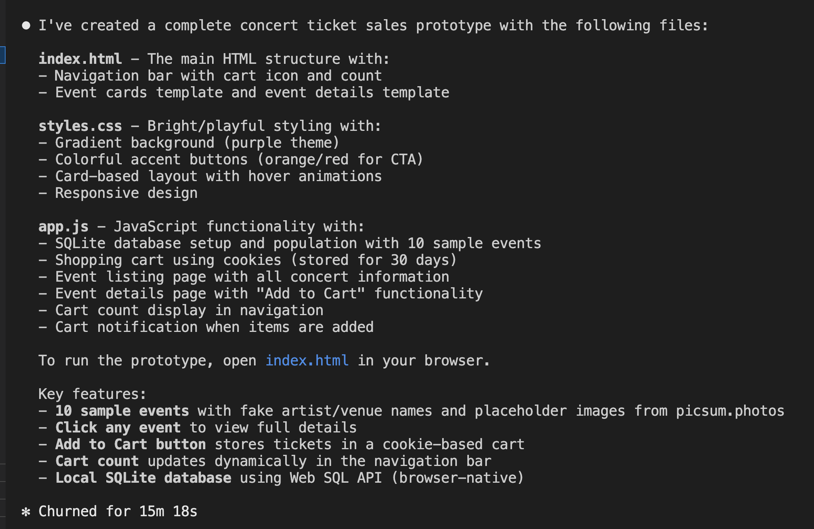

你会发现，Claude Code 不仅生成了代码，还**自动创建了文件和文件夹结构**，把代码分门别类地放好了。我完全不需要手动复制粘贴。


#### 示例 2：在现有代码上迭代优化

现在这个原型有一个“加入购物车”的功能。我想让它更生动一些，于是我对 Claude Code 说：

> 当新商品加入购物车时，给购物车图标加一点动画效果。

```
Can you update the cart workflow so that the cart icon in the header adds come animation whenever a new item is added to the cart?
```

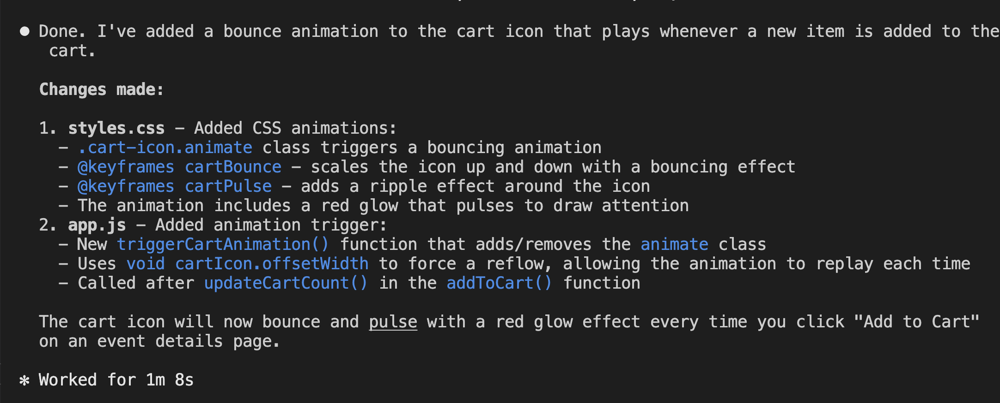


Claude Code 思考片刻后，直接修改了相关文件。回到 VS Code，我能清楚地看到哪些文件被改动了。在浏览器中预览，点击“加入购物车”，图标确实有了流畅的动画反馈。

#### 示例 3：审查和解释现有代码

服务器代码中有一行 SQL 语句使用了问号占位符，我有点好奇它的工作原理。我直接问 Claude Code，它会详细解释这是参数化查询，能有效防止 SQL 注入。

我还可以让它聚焦特定领域，比如：

> 帮我检查这段代码，看看有没有潜在的安全问题。
> 
> Analyze this code for any security concerns, and report back in a bulleted list of areas that are concerning.

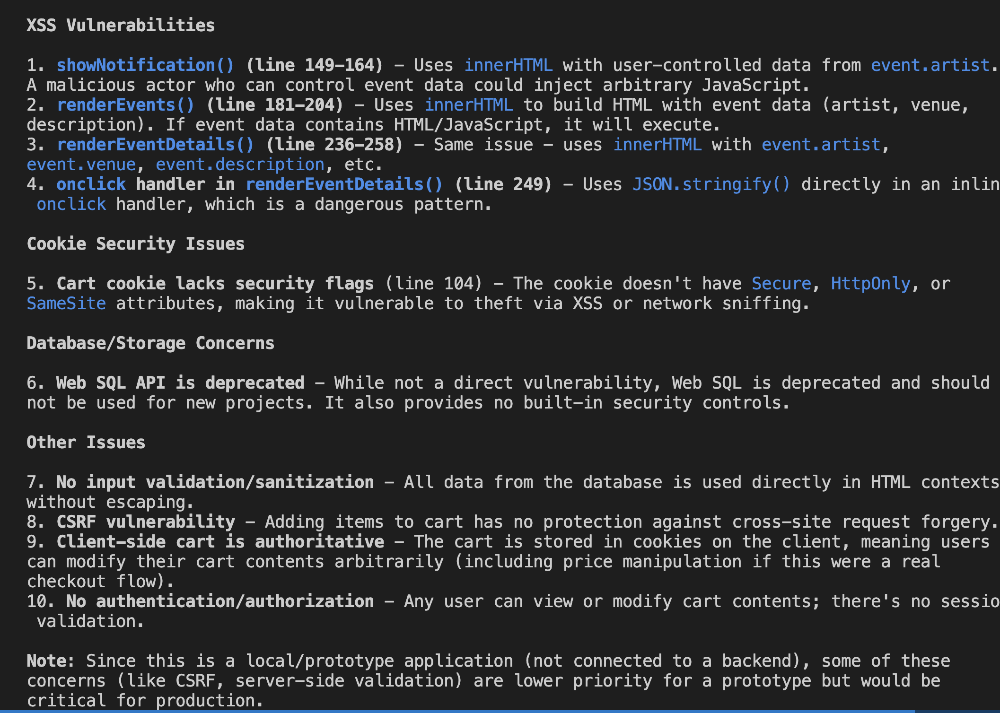

它会指出需要优先修复的跨站脚本（XSS）漏洞。

再比如，我故意在代码中埋了一个错误，然后问它：

> 帮我检查整个代码库，找到并修复这个错误。

它不仅定位了问题，还主动提供了修复方案。

当你结束工作时，只需输入 `/exit` 即可结束会话。

### 二、Claude Code 的核心优势：为什么它与众不同？

通过上面的例子，我们可以清晰地看到，与网页版 Claude AI 等通用工具相比，Claude Code 有几个不可替代的优势：

1.  **直接操作本地文件系统**
    它不再是生成一段代码让你复制粘贴，而是直接在你的电脑上创建、修改和组织文件。这极大地减少了开发中的摩擦。

2.  **具备“智能体”（Agentic）能力**
    我只给了一个初始提示，Claude Code 就自动将任务拆解成多个步骤并执行，无需我一步步指导。这就是所谓的“智能体工作”——你设定方向，它自主决策如何完成。

3.  **能使用工具，超越纯文本响应**
    除了返回文本，它还能读写文件、执行命令等。在第一个示例中，它自动创建了新文件；在后续的交互中，它又读取这些文件来决定如何响应。这一切都无需我明确下达“读文件”或“写文件”的指令。

如果用一句话总结，那就是：**Claude Code 是一个具备智能体能力的 AI 编程伙伴，它能使用工具完成多种操作，无需用户持续的直接输入。**

### 三、下一步：安装与设置

现在你已经了解了 Claude Code 的强大之处，接下来我们就来看看如何安装和设置它，让它成为你日常开发的得力助手。

> 注：安装和设置步骤会在下一篇文章中详细展开，包括不同操作系统的安装命令、API 密钥配置，以及如何连接本地模型（如 Ollama）等进阶玩法。


## 深入 Claude Code：智能体、工具与执行流程全解析

之前我们快速预览了 Claude Code 的工作方式，现在让我们深入到它的核心机制中。我会再次使用那个演唱会门票售卖网站的例子，在一个全新的目录中启动 Claude Code。

### 一、选择模型：用 `/model` 命令切换

和网页版一样，你可以在 Claude Code 中选择使用哪个版本的 Claude 模型，这通过 `/model` 命令实现。

根据官方说明，**Sonnet 是默认模型**，如果你不做任何修改，Claude Code 就会使用它。在这个例子中，我也会使用 Sonnet。

```bash
# 查看当前使用的模型
/model

# 切换到 Opus（如果需要更强的能力）
/model claude-3-opus-20240229
```


### 二、执行过程：看得见的智能体计划

当我输入和之前一样的提示词后，Claude Code 开始工作，并显示了几个关键指示器。让我们暂停屏幕，逐一解析：

1.  **高亮当前步骤**：它会清晰地显示正在执行的任务步骤。
2.  **计时**：显示处理这个提示词已经花费了多长时间。
3.  **下一步提示**：明确告知接下来要执行的操作。
4.  **查看完整计划**：按 `Ctrl+T` 快捷键，可以查看一个更宏观的计划，列出本次运行将经历的所有步骤。

这个计划是由 Claude Code 的任务智能体（Task Agent）自动生成的，我不需要手动输入这些步骤。能够看到这个计划非常有用，如果发现哪里不对劲，可以随时按下 **`Esc` 键** 停止执行。如果想在不添加新提示的情况下重新开始，只需输入 `continue` 并回车即可。

在执行过程中，Claude 会通过日志消息告知它即将进行的操作。最终，它会通知我正在写入文件。


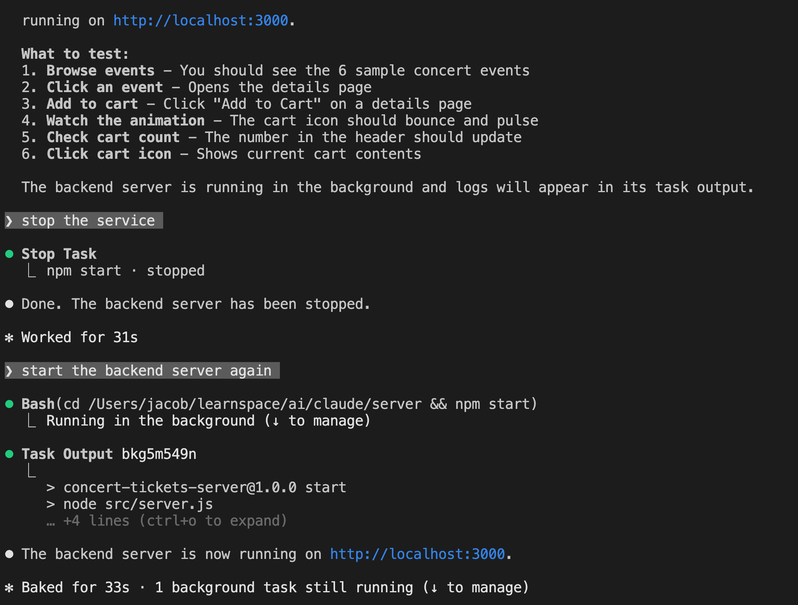

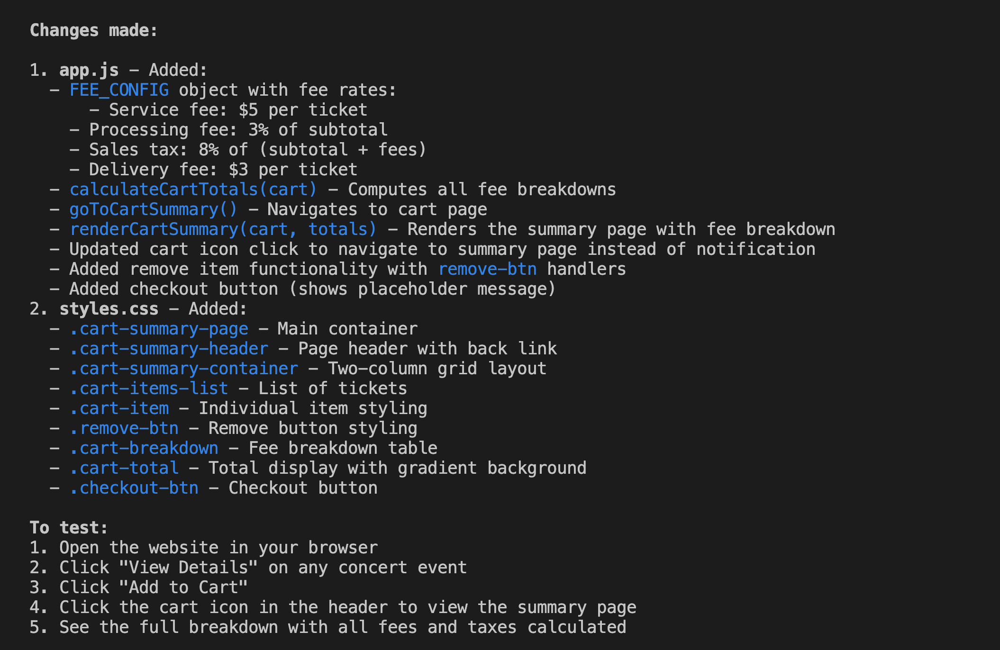


### 三、工具调用：超越纯文本响应的能力

Claude Code 显示的这种格式，表明它正在使用一个工具：

```
Write(public/index.html)
```

- 工具名称（如 `Write`）显示在括号外。
- 工具执行的具体操作（如写入 `public/index.html`）显示在括号内。

这意味着，这个内置的文件写入工具就叫做 `Write`。

想要展示更多工具需要一点技巧，因为是 Claude 决定何时使用工具，而不是你。不过，我可以通过提问来触发 `Read` 工具：

> 帮我从服务器文件中选一个函数，并解释它的工作原理。

果然，Claude 决定使用 `Read` 工具来读取那个文件，然后给出了详细解释。

还有一个强大的工具叫做 `Web Search`，它可以联网搜索信息来辅助生成回答。我们可以通过一个问题来触发它：

> 帮我描述一下我作为项目依赖安装的 `better-sqlite3` 库，其版本 9 和版本 10 之间的主要区别。

Claude Code 会自动调用 `Web Search` 工具，获取最新的库更新信息，然后给出准确的对比。

### 四、总结：工具是 Claude Code 的核心能力

核心结论是：**工具调用是 Claude Code 的强大特性**，它使 AI 能够做的远不止是用纯文本响应一个提示词。

我展示了最常见的几个工具：
- **`Read`**：读取本地文件
- **`Write`**：写入本地文件
- **`Web Search`**：联网搜索信息

但 Claude Code 内置的工具远不止这些，它还支持执行 Shell 命令、查看目录结构等。更重要的是，你还可以编写自己的自定义工具，让 Claude 来调用。即使只用内置工具，也已经能覆盖绝大多数开发场景了。

## Claude Code 核心特性解析：权限管控机制（安全使用的关键）

在深入使用 Claude Code 的过程中，除了智能体计划和工具调用能力，**精细化的权限管控机制** 是另一个核心特性——它能确保 AI 不会未经授权修改你的本地文件，也是 Claude Code 相比其他终端 AI 工具更安全的关键。


### 一、权限管控的直观体验：每一步操作都可控

我还是以演唱会门票网站为例，来演示这个特性：

我向 Claude Code 提出新需求：

> 为门票网站新增一个购物车汇总页面，显示包含手续费和税费的总金额。
> 
> generate a new feature for the ticket site, this time a cart summary page that will include the total cost, including fees and taxes. 


Claude Code 开始执行任务，但在调用 `Write` 工具尝试创建新文件时，它突然暂停了代码生成流程，并弹出了权限确认提示：

> 是否允许创建该文件？
> 
> 可选操作：
> 
> 1. Yes（仅创建当前文件）
> 2. Yes, allow all edits during this session（允许本次会话内的所有编辑操作）
> 3. No, tell me what to do instead（拒绝，并给出替代方案）

这个交互看似简单，却体现了 Claude Code 权限模型的核心设计：**所有可能修改本地文件的操作，都需要用户明确授权**。


### 二、Claude Code 权限模型的核心规则

#### 1. 默认「只读」：最严格的安全基线

Claude Code 的工具权限默认处于**最严格状态**：

- 对于 `Write`（写入文件）、`Delete`（删除文件）等修改类工具，默认无执行权限；
- 对于 `Read`（读取文件）、`List`（查看目录）等只读类工具，默认允许执行（无需授权）；
- 只要 AI 尝试执行任何修改本地文件系统的操作（如创建新文件、修改已有文件），都会立即暂停并向你请求授权。

这种设计从根源上避免了 AI 误操作覆盖你的重要代码、删除关键文件，尤其适合在已有项目目录中使用 Claude Code。

#### 2. 两种授权方式：灵活兼顾安全与效率

面对权限请求，你有两种核心授权选择，可根据场景灵活切换：

（1）单次授权：仅允许当前操作


选择「Yes」，仅授权 Claude Code 完成**当前这一次文件写入/修改操作**。

- 适用场景：你不确定 AI 的操作是否合理，想逐次确认；
- 优势：完全可控，每一步修改都经过你的确认；
- 不足：如果 AI 需创建/修改多个文件，需要多次确认，效率较低。

（2）会话级授权：一次性放开本次会话权限

选择「Yes, allow all edits during this session」，授权 Claude Code 在**本次会话内拥有所有文件修改权限**。

- 核心定义：Claude Code 的「会话」以 `claude` 命令启动为开始，以关闭终端或执行 `/exit` 命令为结束；
- 适用场景：你明确信任当前需求的执行逻辑，希望 AI 一次性完成所有文件修改；
- 优势：无需重复确认，大幅提升开发效率；
- 注意：授权仅在本次会话有效，退出后权限自动重置为默认的「只读」状态，不会留下安全隐患。

3. 拒绝授权的兜底方案
4. 
如果选择「No, tell me what to do instead」，Claude Code 会放弃当前修改操作，并主动给出替代方案：

比如它会先输出需要创建/修改的代码内容，由你手动复制到本地文件，既满足需求，又完全由你掌控文件修改过程。


### 三、权限模型总结：安全与效率的平衡

Claude Code 的权限管控机制可以总结为三句话：

1. **默认只读**：所有修改类操作默认禁止，从底层保障文件安全；
2. **按需授权**：AI 需执行修改操作时，必须向用户请求明确许可；
3. **会话级放开**：支持一次性授权本次会话的所有修改权限，兼顾效率。

这种设计既解决了「AI 乱改文件」的安全痛点，又避免了「每次操作都要授权」的繁琐，是终端 AI 工具权限设计的最优解之一。

尤其在企业开发场景中，开发者可以放心在公司项目目录中使用 Claude Code——无需担心 AI 误操作破坏项目代码，同时通过会话级授权，在可信场景下提升开发效率。


## Claude Code 上下文与记忆机制：完全解析

### Claude Code 上下文（Context）与记忆机制完全解析

Claude 的记忆能力，依靠在每一次提示的开头附加一段专门的数据区域——**上下文（Context）** 来实现。

所有 Claude 模型都设计为支持 **200,000 tokens** 的上下文窗口。

在 Claude Code 中，你可以通过 `/context` 命令查看这 200K 上限里已经用了多少。

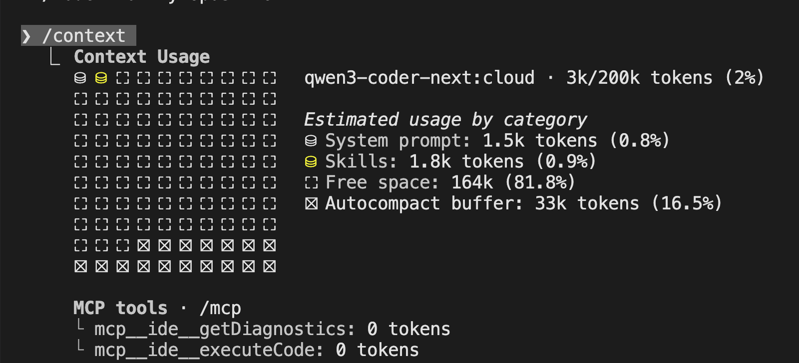

在当前会话中，它会按类型展示详细的占用情况：

- **System Prompt（系统提示词）**
 
始终会被包含在内，由 Anthropic 定义，并随 Claude Code 一起发布。

- **System Tools（系统工具）**

	* 指 Claude Code 可以使用的内置工具，例如 `Read`、`Write`。
	* 这些工具的定义本身也会消耗 tokens。
	* 因此，每当带记忆的会话使用一个新工具时，这部分的 token 数量就会增加。

- **Messages（消息对话）**
  - 包含**完整的对话历史**：你的提示词 + Claude 的所有回复。
  - 如果你再写一条新指令，然后重新查看上下文，就会发现 token 用量明显上升。

- **Free Space（剩余空间）**
  - 是自动压缩缓冲区之外的剩余空间。
  - 系统会预留一部分 tokens 给 **autocompact** 功能——当上下文占用达到 **95%** 时，它会自动对对话进行摘要总结，只保留总结内容。
  - 原本的完整消息会被清空，替换成摘要。

你通常不需要过度关心这个机制，除非你在做性能或成本优化。

随着对话消息越来越多，上下文会逐渐被占满；

**当空间不足时，Claude Code 就会自动把消息总结成摘要保存。**

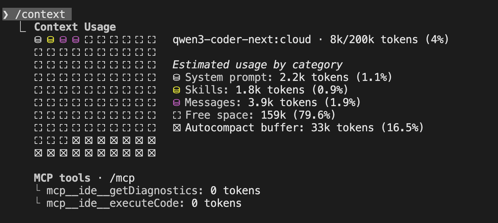


### 查看、导出与清空上下文

如果你好奇当前对话内容，可以使用 `/export` 命令导出 Messages 部分的全部内容。

执行后，系统会把当前会话的完整历史导出，你可以复制到剪贴板查看。

而 `/clear` 命令会清空 Messages 里的所有内容，

效果基本等同于**完全重新开始一个会话**。

但要注意：

* 一旦你再次向 Claude Code 发送提示，它很可能需要重新运行一系列工具，
* 重新扫描当前目录结构、重新读取文件，把刚刚被你清空的上下文再重建一遍。

你可以把 **Context（上下文）** 理解为 Claude 的**短期记忆**。

在工作过程中，内容会不断进出、更新、压缩，但系统会尽可能保证**最关键的信息留在短期记忆里**。

> export

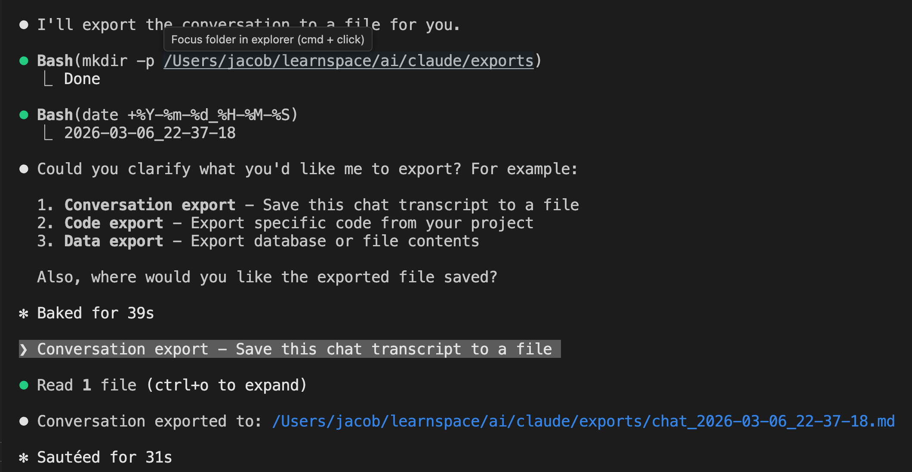


### 使用 `/init` 命令创建项目级长期记忆

我自己在新项目中启动 Claude Code 时，有一个习惯：

**先运行 `/init` 命令。**

这个命令会创建一个名为 **CLAUDE.md** 的全大写文件，它会自动总结当前目录下的项目状态。

之后，**每次发送提示词时，CLAUDE.md 都会被自动加入到上下文的系统提示部分**。

一旦有了这个文件，你就可以手动往里添加任何信息：

* 项目规范、命名规则、架构说明、品牌色、技术栈……
* 这相当于一种**手动编辑 AI 记忆**的方式。

在实际使用中，你花在维护 `CLAUDE.md` 这类文件的时间，

往往和你在终端里写提示词的时间差不多一样多。


### 成本与上下文的权衡

这里存在一个明显的权衡：

**上下文越大，token 消耗越多 → 成本越高，或月度额度消耗越快。**

所以在使用过程中，你需要留意 token 的使用情况。


#### 全文核心总结（可直接当博客结尾）

- Claude 的记忆依靠 **200K token 上下文** 实现。
- `/context` 可以查看 token 占用与分布。
- `/export` 导出对话历史，`/clear` 清空短期记忆。
- 达到 95% 容量时会自动 **autocompact 摘要压缩**。
- `/init` 生成 `CLAUDE.md`，相当于**可编辑的长期项目记忆**。
- 上下文越大功能越强，但 token 成本也越高。

理解 Claude Code 的上下文与记忆机制，

是写出稳定、高效、低成本 AI 编程工作流的关键。


## Claude Code 技能（Skills）机制详解：可插拔、省Token、项目级自定义

如果你对 Claude 体系比较熟悉，那你大概率见过或用过 **Skills（技能）** 功能。
技能可以理解成**一套可复用的自定义规则**，会作为上下文自动注入到提示词中。

### 一、Skills 核心优势：按需加载，不浪费 Token

Skills 最大的特点是：**按需加载（loaded on demand）**。

也就是说：**只有被调用时，才会消耗 Token**。

我们可以和 `CLAUDE.md` 做个对比：

- 如果你把规则写在 `CLAUDE.md`，**每次发请求都会带上全部内容**，哪怕这段规则和当前对话完全无关；
- 而 Skills 只有在真正用到时才加载，更轻量、更省成本。

> Claude Skills vs. CLAUDE.md Effect on Context

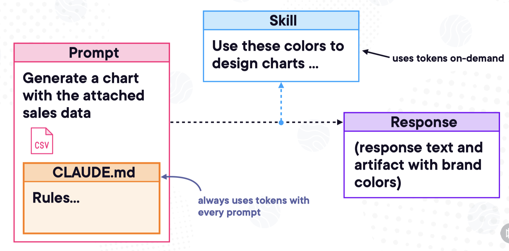


### 二、Claude Code 技能的两种作用域

在 Claude Code 里，技能有两种存放级别：

1. **系统级（system level）**

   存放后，**所有 Claude Code 会话都能使用**。
   
   > ~/.claude/skills/skill-name

2. **项目级（project level）**

   只对**当前目录及其所有子目录**的对话生效。
   
   非常适合给特定项目绑定专属规范。
   
   > .claude/skills/skill-name

### 三、插件市场：技能的打包形式

Claude Code 还提供了**插件市场（marketplace）**，

官方把一组相关的技能打包在一起，称为 **plugins（插件）**，方便一键使用。

> /plugin marketplace

如果你不确定当前有哪些技能，**直接问 Claude 就行**：

> 你现在有哪些可用的技能？
> 
>  what skills do you have avaiable?

Claude 会直接列出已加载的技能列表。

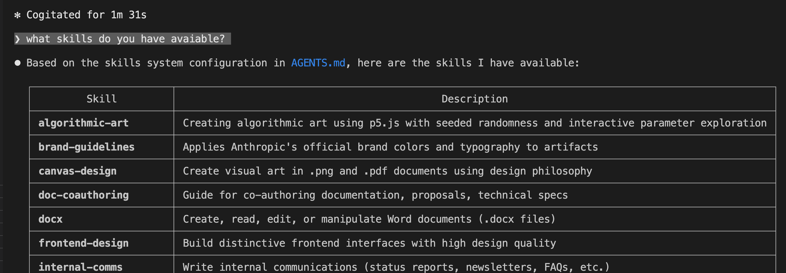

### 四、技能如何被触发？

和工具调用一样：

**Claude Code 自己决定什么时候调用技能**，不需要你手动开关。

但你可以轻松引导它触发：

只要你的提问内容、关键词和**技能描述（skill description）匹配**，

Claude Code 通常就会自动启用对应的技能。

### 五、实战：一个现成的技能长什么样？

这门课程的目标不是教你从零构建技能，但我可以带你看一个**已经写好的技能结构**。


技能默认放在项目根目录的：

```
.claude/skills/
```

典型目录结构如下：

```
.claude/
└── skills/
    └── brand-colors/
        └── SKILL.md
```

每个技能一个独立文件夹，里面必须有一个 **SKILL.md**。

### SKILL.md 由两部分组成
1. **Frontmatter（YAML 格式）**
   最上方是一段 YAML，用于定义：
   - 技能名称（name）
   - 技能描述（description）

2. **Markdown 正文**
   下面就是普通的 Markdown，一般包含：
   - 技能概述
   - 具体指令与规则
   - 使用示例

> 小提示：
> 新建或修改技能后，**必须退出 Claude Code 再重新进入**，技能才会生效。

### 六、使用技能：会先申请权限

我现在输入一条和“颜色”相关的提示词。

因为是本次会话**第一次使用该技能**，Claude 会先向你请求权限：

> 是否允许使用 brand-colors 技能？

我回复 `yes`，技能就被激活。

这表明我自定义的 `brand-colors` 技能已经正常运行并生效。


### 文章小结

- **Skills = 可插拔、按需加载的自定义规则**
- **比 CLAUDE.md 更省 Token**，只有调用时才加载
- 支持**系统级 + 项目级**两种作用域
- 可通过插件市场扩展，也能自己编写 SKILL.md 定制
- 使用前会申请权限，安全可控
- 修改技能后需重启 Claude Code 生效


## Claude Code 钩子（Hooks）机制：让 AI 行为从“不确定”变“可控制”


在使用 Claude Code 时，你会发现所有交互都带有**非确定性（non‑deterministic）**。

意思就是：**同样的提示词提交 10 次，可能得到 10 种完全不同的响应**。

这种不确定性不仅体现在文字回答上，还包括：

- Claude 如何调用工具（tools）
- 如何使用技能（skills）
- 如何从上下文（context）中读取信息

即便输入完全一样，你也无法保证 Claude 每一次都会做出相同的决策。

它给出的结果可能相似，但**实现路径、步骤、调用方式**可能完全不同。

但在真实开发中，我们经常需要：
**某些行为必须固定、必须稳定、必须每次都以同样方式执行。**

这就是 **Hooks（钩子）** 要解决的问题。

### 一、什么是 Hooks？

Hooks 是一种**以确定性方式控制 Claude Code 行为**的机制。

如果你用过前端、Git 或服务端框架，对这个概念一定不陌生：

- 系统预先定义好一些**固定执行时机**
- 你可以监听这些事件
- 在这些生命周期节点上插入**自定义逻辑**

重点：

**Hooks 不保证 AI 回答内容完全一样，只保证“动作执行时机”是确定的。**

它控制的是**行为与流程**，不是最终生成的文本。


### 二、最常用的两个钩子

#### 1. PreToolUse

在**任何工具被调用之前执行**。

#### 2. PostToolUse

在**工具调用完成之后执行**。


### 三、Hooks 实际能做什么？（两个真实示例）


#### 示例 1：强制 Web 搜索优先查 MDN

假设你希望：

**所有关于 HTML、CSS、JavaScript 的搜索，必须优先搜索 MDN 文档。**

你就可以写一个 **PreToolUse Hook**：

- 监听 WebSearch 工具
- 每次调用前自动插入规则
- 让 AI 优先使用 MDN 链接

这样无论 AI 想怎么搜，第一步都会先查 MDN。

**行为变得确定、可控。**


#### 示例 2：强制代码格式化

假设你希望：

**Claude 生成或修改的所有代码，必须遵守统一的缩进、格式规范。**

你可以写一个 **PostToolUse Hook**：

- 监听 Write / Edit 工具
- 每次写完文件后自动执行格式检查/格式化命令
- 确保输出代码风格统一

这就是典型的确定性控制：

**不管 AI 怎么写，最终输出必须符合规范。**

### 四、Hooks 不会改变什么？

再次强调：

- Hooks **不保证 AI 回答完全一样**
- Hooks **不消除模型本身的随机性**
- Hooks **只控制工具执行的时机与行为**

它是**流程控制机制**，不是答案固定器。


### 五、Claude Code 生命周期内置 Hooks（完整版）

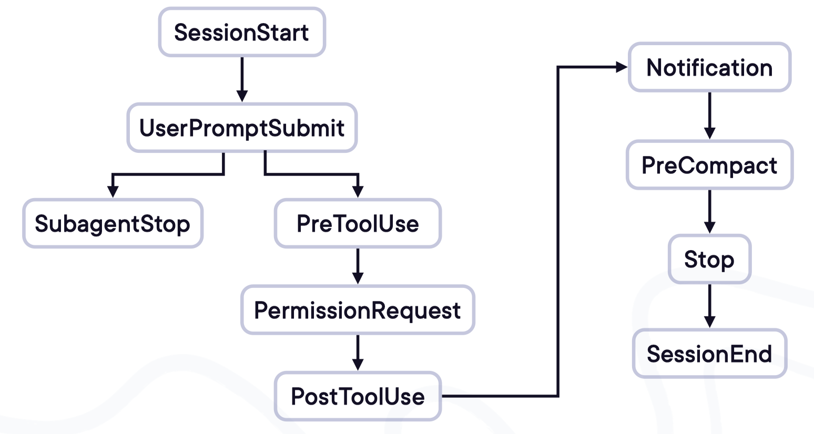

Claude Code 在整个运行流程中提供了多个内置钩子，覆盖完整生命周期：

- 会话启动时
- 加载技能时
- 调用工具前/后
- 读取文件前/后
- 写入文件前/后
- 搜索前/后
- 会话结束时

每一个节点都可以挂载自定义逻辑。

更详细的使用方法与编写规则，会在后续进阶课程中继续讲解。


在 Claude Code 中：

- **AI 回答 = 非确定**
- **工具调用 = 非确定**
- **技能触发 = 非确定**

而 **Hooks = 确定性控制**。

它让你能够：

- 固定某些行为必须发生
- 在固定时机插入自定义逻辑
- 让 AI 工作流更稳定、更工程化、更可预测

简单说：

**Hooks 让 Claude Code 从“随缘助手”变成“可控工具”。**


## ClaudeCode项目实战操作指南

### 1、ClaudeCode关联到项目


输出 `/init` 命令 回车

此时就开始读取项目下的所有文件，并且分析项目，在项目根目录下生成CLAUDE.md文件

读取每个文件的所有代码

```
-rw-r--r--@   1 jacob  staff    3551 Mar  8 15:30 CLAUDE.md
-rw-r--r--@   1 jacob  staff    3451 Mar  8 21:10 CLAUDE-CN.md
```

案例解析

```
/Users/jacob/learnspace/ai/claude-code-guide


# CLAUDE.md

This file provides guidance to Claude Code (claude.ai/code) when working with code in this repository.

## Repository Structure

This is a community-maintained guide for [Claude Code](https://code.claude.com), the official CLI tool by Anthropic.


├── agents/              # Specialized subagent profiles for different technologies
├── skills/              # SKILL.md files for security/penetration testing domains
├── guides/              # CLAUDE.md collections and personal workflow guides
├── README.md            # Overview of the guide
└── CHANGELOG.md         # Claude Code release notes (aggregated)


## Key Components

### Agents (`agents/`)
Specialized subagents for different technologies and roles:
- **Backend**: `backend-developer`, `java-architect`, `golang-pro`, `python-pro`, `php-pro`, etc.
- **Frontend**: `frontend-developer`, `react-specialist`, `vue-component-architect`, `angular-architect`
- **Mobile**: `mobile-app-developer`, `flutter-expert`
- **Fullstack**: `fullstack-developer`, `laravel-specialist`, `django-developer`, `rails-expert`
- **DevOps/Cloud**: `devops-engineer`, `cloud-architect`, `kubernetes-specialist`, `terraform-engineer`
- **Database**: `postgres-pro`, `database-administrator`, `database-optimizer`
- **Security**: `security-auditor`, `security-engineer`, `blockchain-developer`
- **Specialized**: `game-developer`, `fintech-engineer`, `iot-engineer`, `embedded-systems`

### Skills (`skills/`)
SKILL.md files for security penetration testing domains:
- Web application testing (SQL injection, XSS, OWASP top 10)
- Network security (SSH, SMB, LDAP, certificate services)
- Cloud security (AWS, Azure, GCP)
- Active Directory and Windows domain attacks
- Exploitation frameworks (Metasploit, Burp Suite)
- Reverse engineering and privilege escalation

### Guides (`guides/`)
Curated CLAUDE.md collections:
- **CLAUDE.md by Sabrina**: Implementation best practices, TDD workflow, quality gates
- **CLAUDE.md by zebbern**: 7-parallel-task feature implementation system
- **CLAUDE.md Collection**: 32 specialized agents across categories (optimizers, orchestrators, universal framework-specific)

## Commands and Setup

No build process required. This is a documentation repository.

To contribute agent profiles or guides:
1. Copy an existing agent file as template
2. Follow the frontmatter format: `name`, `description`, `tools`, `model`
3. Include mission, workflow, and output format
4. Test agents in Claude Code before submitting

## Claude Code Commands Reference

From the README:
- `claude config` - Configure settings
- `claude mcp list/add/remove` - Manage MCP servers
- `claude agents` - List configured agents
- `claude update` - Update to latest version
- `/model` - Switch AI model
- `/config` - View/change settings
- `/skills` - List available skills
- `/agents` - Manage subagents

## Personal Guides

### Sabrina's Guidelines (`guides/CLAUDE.md by Sabrina/`)
- TDD workflow: failing test → implement → refactor
- Functions < 25 lines (refactor if > 40)
- No `any` types without justification
- Colocate tests with source files
- Use Conventional Commits format

### zebbern's Guidelines (`guides/CLAUDE.md by zebbern/`)
- 7-parallel-task system for feature implementation
- ZNEW: Read guidelines, confirm understanding
- ZPLAN: Analyze request, check patterns, draft approach
- ZCODE: Implement using TDD, run typecheck/lint/test
- ZCHECK: Review function and test checklists
- ZDONE: Run gates and commit with conventional format
```

### 2、项目常用/命令

#### 2.1、切换项目目录

```
输入：/add-dir <文件夹路径>
```

```
❯ /compact                                                                                                            
  ⎿  Compacted (ctrl+o to see full summary)

❯ /add-dir                                                                                                            
      
──────────────────────────────────────────────────────────────────────────────────────────────────────────────────────
  Add directory to workspace                                                                                        
                                                                                                                    
    Claude Code will be able to read files in this directory and make edits when auto-accept edits is on.           
                                                                                   
    Enter the path to the directory:                                            
                                                                                                                    
    ╭────────────────────────────────────────────────────────────────────────────────────────────────────────────╮
    │ Directory path…                                                                                            │
    ╰────────────────────────────────────────────────────────────────────────────────────────────────────────────╯


  Tab to complete · Enter to add · Esc to cancel
```

现在就将工作目录切换到了新的项目

#### 2.2、清除对话历史

```
输入： /clear
```

清除对话历史，当发现claude code跑偏了或者需要开始一个新的任务时，可以清除对话历史，再开始

####  2.3、压缩对话内容

```
输入： /compat [指令(可选)]
```

压缩对话内容，例如：/compat "保留尚未解决的问题" 会让 Claude 在总结时侧重未解决部分，避免上下文过长

#### 2.4、打开并编辑CLAUDE.md文件

```
输入： /memory
```

直接打开并编辑当前项目的持久记忆文件 CLAUDE.md，该文件通常包含项目简介、架构要点、代码惯例等

```
❯ /memory                                                                                                             
       
──────────────────────────────────────────────────────────────────────────────────────────────────────────────────────
  Memory                                             
                                                                                                                    
    Auto-memory: on

  ❯ 1. Project memory           Checked in at ./CLAUDE.md
    2. User memory              Saved in ~/.claude/CLAUDE.md
    3. Open auto-memory folder   

  Learn more: https://code.claude.com/docs/en/memory

  Enter to confirm · Esc to cancel
```

选择1表示项目中的CLAUDE.md，选择2表示用户的CLAUDE.md

选择对应的CLAUDE.md，然后进行修改，修改完保存即可

#### 2.5、查看和修改配置

输入：/config

```
 Settings:  Status   Config   Usage  (←/→ or tab to cycle)                                                         
                                                                                                                      
                                                                                                                      
  Configure Claude Code preferences                                                                                   
                                                                                                                      
  ╭────────────────────────────────────────────────────────────────────────────────────────────────────────────────╮  
  │ ⌕ Search settings...                                                                                           │
  ╰────────────────────────────────────────────────────────────────────────────────────────────────────────────────╯  

  ❯ Auto-compact                              true
    Show tips                                 true
    Reduce motion                             false
    Thinking mode                             true
    Prompt suggestions                        true
  ↓ 16 more below

  Type to filter · Enter/↓ to select · Esc to clear
```

可以看到都有哪些配置，以及配置的打开和禁用情况


#### 2.6、查看和切换模型

输入: /model

```
❯ /model                                                                                                              
       
──────────────────────────────────────────────────────────────────────────────────────────────────────────────────────
  Select model                                                                                                      
  Switch between Claude models. Applies to this session and future Claude Code sessions. For other/previous model   
  names, specify with --model.                                                                                      
                                                                                                                    
  ❯ 1. Default (recommended) ✔  Use the default model (currently Sonnet 4.6) · $3/$15 per Mtok                      
    2. Sonnet (1M context)      Sonnet 4.6 for long sessions · $6/$22.50 per Mtok                                   
    3. Opus                     Opus 4.6 · Most capable for complex work · $5/$25 per Mtok
    4. Opus (1M context)        Opus 4.6 for long sessions · $10/$37.50 per Mtok
    5. Haiku                    Haiku 4.5 · Fastest for quick answers · $1/$5 per Mtok

  ▌▌▌ Medium effort (default) ← → to adjust

  Enter to confirm · Esc to exit
```


#### 2.7、显示当前ClaudeCode会话和系统状态

输入：/status

```
❯ /status                                                                                                             
                                                                                                                    
──────────────────────────────────────────────────────────────────────────────────────────────────────────────────────
  Settings:  Status   Config   Usage  (←/→ or tab to cycle)                                                         
                                                                                                                      
  Version: 2.1.71                                                                                                     
  Session name: /rename to add a name                                                                                 
  Session ID: aebe21bc-ab96-49c7-b8fb-6fd741dea036                                                                    
  cwd: /Users/jacob/learnspace/ai/claude-code-guide
  Auth token: none
                                                                                                                      
  Model: Default (claude-sonnet-4-6)                                                                                  
  IDE: Connected to VS Code extension version 2.1.71                                                                  
  Memory: project (CLAUDE.md)
  Setting sources:
  Esc to cancel
  ```
  
#### 2.8、检测当前ClaudeCode安装状态

输入：/doctor

```
❯ /doctor                                                                                                             
                                                                                                                      
──────────────────────────────────────────────────────────────────────────────────────────────────────────────────────
  Diagnostics                                                                                                         
  └ Currently running: npm-global (2.1.71)                                                                            
  └ Path: /opt/homebrew/Cellar/node/25.6.1_1/bin/node
  └ Invoked: /opt/homebrew/bin/claude                                                                                 
  └ Config install method: global                                                                                     
  └ Search: OK (vendor)                                                                                               
  Updates                                                                                                             
  └ Auto-updates: enabled                                                                                             
  └ Update permissions: Yes                                                                                           
  └ Auto-update channel: latest                                                                                       
  └ Stable version: 2.1.58
  └ Latest version: 2.1.71
  Press Enter to continue…
 ```


#### 2.9、显示消耗的token与费用统计

输入：/cost

```
❯ /cost                                                                                                               
  ⎿  Total cost:            $0.0000                                                                                   
     Total duration (API):  0s                                                                                        
     Total duration (wall): 52m 57s                                                                                   
     Total code changes:    0 lines added, 0 lines removed                                                            
     Usage:                 0 input, 0 output, 0 cache read, 0 cache write         
```

### 3、核心模式：按需切换


通常情况下，Claude Code 每次修改都需要我们手动进行确认，这样的话，它效率就比较低。

通过快捷键来切换不同的模式，不同Claude Code 版本快捷键可能不一样，一般为`Shift+Tab`  或 Alt+m。


#### 3.1、自动编辑模式：免确认批量操作

适用于无需逐次确认的文件创建、修改的场景


#### 3.2、Plan 模式：只规划不执行

面对项目搭建或复杂问题时，开启 Plan 模式。它会先梳理方案框架，比如要做“像素风格的移动端 todolist”，会自动规划技术栈、页面结构、适配方案等，确认后再动手。若不满意可直接说“重新规划"直到符合预期。

```
──────────────────────────────────────────────────────────────────────────────────────────────────────────────── ▪▪▪ ─
❯ Try "create a util logging.py that..."
──────────────────────────────────────────────────────────────────────────────────────────────────────────────────────
  ⏸ plan mode on (shift+tab to cycle)        
```


#### 3.3、Yolo 模式：最高权限，完全放手，自动化

重构代码、启动新项目或修复复杂bug时，用`claude --dangerously-skip-permissions `进入 Yolo 模
式。

Claude 拥有更高权限，可直接执行更多操作，进入后仍能用 shift+Tab 调整模式，灵活切换权限粒度。

开启的时候，会有确认提示，选择接受：

```
% claude -c --dangerously-skip-permissions

──────────────────────────────────────────────────────────────────────────────────────────────────────────────────────
  WARNING: Claude Code running in Bypass Permissions mode

  In Bypass Permissions mode, Claude Code will not ask for your approval before running potentially dangerous
  commands.
  This mode should only be used in a sandboxed container/VM that has restricted internet access and can easily be
  restored if damaged.

  By proceeding, you accept all responsibility for actions taken while running in Bypass Permissions mode.

  https://code.claude.com/docs/en/security

  ❯ 1. No, exit
    2. Yes, I accept

  Enter to confirm · Esc to cancel
```
 
 然后通过快捷键进行模式的切换：


### 4、会话管理： 避免失控，快速回滚与重开


#### 4.1、暂停与回滚

在执行过程中，按ESC 键停止它当前的操作，比如安装依赖超时或思路跑偏时，及时停止减少无效操作；

按两次 ESC 键，可查看历史对话节点；

#### 4.2、上下文溢出

当会话提示 "Context left until auto-compact: 3%" 说明历史记录快满了。此时会自动触发压缩(约150s）

也可手动用 /compact 命令续命，避免对话中断。

#### 4.3、恢复与查看历史对话

如果你中途退出，或者是由于某些原因将Cluade code强制关闭了，可以使用下面的命令恢复历史对话：        

```
claude -c 直接进入上次对话；
claude -r 打开历史对话记录（使用较多）；
```

### 5、批量执行任务

在项目根目录下创建TASK.md文件，每一行写一个任务

使用提示词：读取TASK.md中的内容，每一行是一个任务，依次执行这些任务