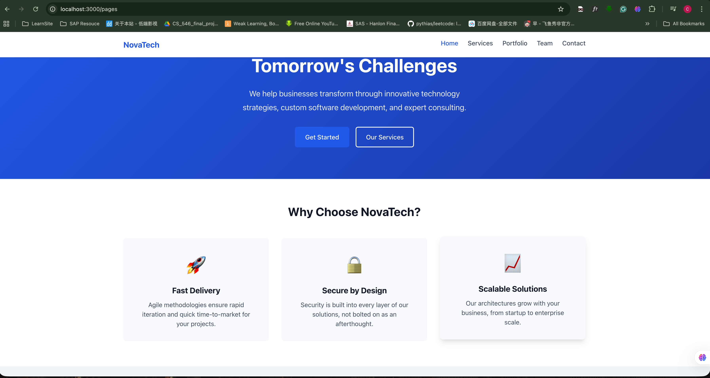
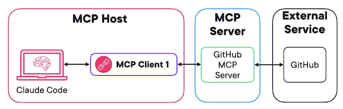
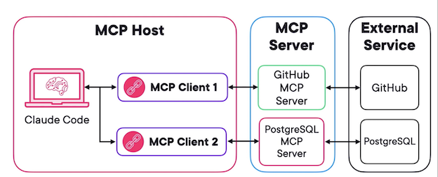
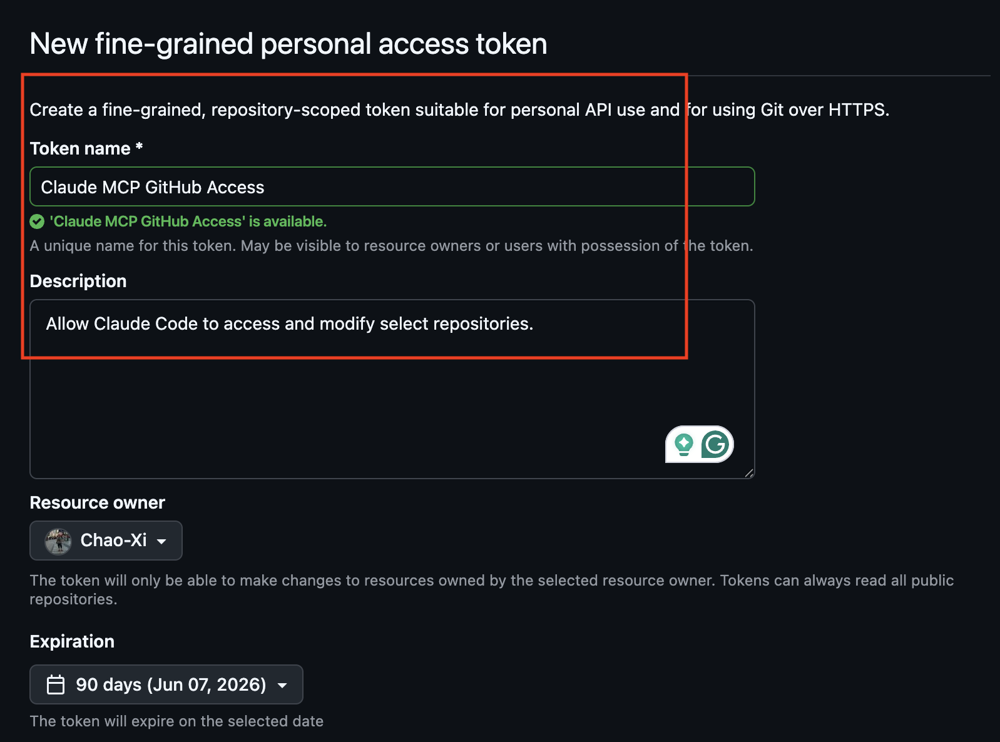
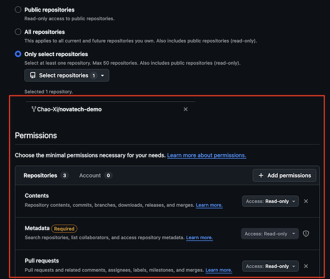
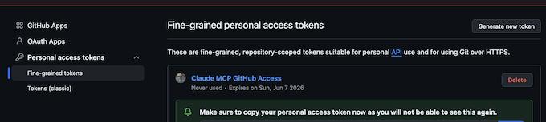
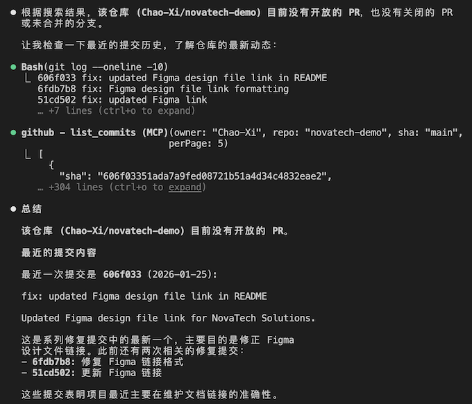

# 1 Claude Code连接外部工具：MCP协议实战指南

[https://github.com/nyisztor/novatech-demo](https://github.com/nyisztor/novatech-demo)


## 实战项目搭建：NovaTech 演示项目完整配置

在开始学习 MCP 与高级 Claude Code 技巧前，我们先统一配置**全程通用的演示项目**，后续所有章节都基于该项目展开，请务必完成。

### 一、项目介绍
本课程使用虚构技术咨询公司 **NovaTech Solutions** 作为演示项目：

- 极简官网：首页、服务、案例、团队、联系我们 共 5 个页面
- 技术栈：HTML + CSS + JavaScript
- 项目本身不复杂，主要作为**Claude Code 高级功能练习环境**
- 最终目标：完成外部工具集成、专属智能代理、自动化工作流

### 二、一键拉取项目

打开终端，克隆项目：
```bash
git clone https://github.com/nyisztor/novatech-demo.git
cd novatech-demo
```

### 三、安装依赖并启动

```bash
npm install
npm run dev
```
启动后在浏览器访问：

`http://localhost:3000/pages/index.html`




### 四、项目结构说明

- `src/`：网站源码（HTML、CSS、JS）
- `.claude/`：Claude Code 核心配置目录（**需开启显示隐藏文件**）
  - Mac：`Cmd + Shift + .`
- `scripts/`：Shell 脚本，用于后续并行开发
- `CLAUDE.md`：项目说明文档，帮助 Claude 快速理解代码库

### 五、验证环境是否正常

1. 在项目目录启动 Claude Code
2. 简单提问，例如：
   > 这个网站有哪些页面？
3. 如果 Claude 能正确识别 `src/pages` 下的 HTML 文件，说明配置成功。

```
❯ 这个网站有哪些页面？                                                                                 
                            
⏺ Searched for 1 pattern (ctrl+o to expand)                                                            
                                                                                                     
⏺ 这个网站有 5 个页面：                                                                                
                                                                                                     
  ┌──────┬──────────────────────────┬──────────────┐                                                   
  │ 页面 │           路径           │     说明     │                                                   
  ├──────┼──────────────────────────┼──────────────┤                                                   
  │ 首页 │ src/pages/index.html     │ 网站主页     │                                                   
  ├──────┼──────────────────────────┼──────────────┤                                                 
  │ 服务 │ src/pages/services.html  │ 服务介绍     │
  ├──────┼──────────────────────────┼──────────────┤
  │ 案例 │ src/pages/portfolio.html │ 项目案例展示 │
  ├──────┼──────────────────────────┼──────────────┤
  │ 团队 │ src/pages/team.html      │ 团队成员     │
  ├──────┼──────────────────────────┼──────────────┤
  │ 联系 │ src/pages/contact.html   │ 联系表单     │
  └──────┴──────────────────────────┴──────────────┘

  这些都是 HTML5 语义化页面，使用 CSS3 和 Vanilla JavaScript 构建，符合项目的技术栈规范。
```


## MCP：解锁Claude外部连接能力的核心协议

我们从Claude生态中最核心的能力之一讲起——**模型上下文协议（MCP，Model Context Protocol）**。

在实际开发中，一个功能往往需要同时参考Figma设计稿与GitHub工单。传统流程里，你必须手动下载文档、复制文本，再粘贴给Claude Code。不仅繁琐、打断工作流，而且信息是静态的：一旦设计更新，你手里的上下文立刻过时。

MCP就是为解决这个问题而生。它是Anthropic推出的**开放标准协议**，能让Claude这类AI助手以标准化方式，直接对接外部数据源与工具。

> Model Context Protocol (MCP)




### MCP 架构：客户端–服务端模式

MCP采用经典的C/S架构：

- **Claude Code** 作为MCP主机，负责统一调度外部工具。
- 每接入一个服务，就会创建一个**独立MCP客户端**，与对应的MCP服务端建立一对一专属连接。例如连接GitHub就新建GitHub客户端，连接PostgreSQL就新建数据库客户端，**连接相互隔离**。




客户端无需关心GitHub、数据库等复杂的原生API细节，只通过统一规范与服务端通信；由MCP服务端完成适配与翻译。这种解耦设计，让你可以自由增删、替换工具，无需重新训练模型，也不用修改Claude Code内部逻辑。

有了MCP，Claude不再局限于本地文件，还能直接查看PR、从Figma拉取最新设计需求，全程不用离开终端。

但使用中也要注意约束：**Token 限制**。随意拉取大量外部数据，会撑满上下文窗口，拖慢响应、增加成本。


## 实战配置：通过 MCP 让 Claude Code 无缝集成 GitHub

本篇带你手把手配置 **Claude Code × GitHub** 集成，无需离开终端，即可直接查看 PR、检索提交记录、读取仓库上下文。

### 一、先创建 GitHub 细粒度 Token

在使用 MCP 连接前，必须先创建个人访问令牌，用于权限控制：

1. 进入 GitHub → Settings → Developer settings → Personal access tokens
2. 选择 **Fine-grained tokens**（细粒度令牌，权限更安全）
3. 命名（如 `Claude MCP GitHub Access`），选择可访问的仓库
4. 分配最小只读权限：
   - Contents：Read-only
   - Pull requests：Read-only
5. 生成令牌并**立即复制**（仅显示一次）







### 二、安全存储令牌：环境变量

不要硬编码密钥，建议配置为环境变量：

- macOS（zsh）
  ```bash
  export GITHUB_TOKEN="你的token"
  source ~/.zshrc
  ```
  
- Linux（bash）

  ```bash
  export GITHUB_TOKEN="你的token"
  source ~/.bashrc
  ```
  
- Windows
  ```cmd
  setx GITHUB_TOKEN "你的token"
  ```
  
重启终端后生效，Claude Code 会自动读取。

### 三、一行命令添加 GitHub MCP 服务

使用 Claude CLI 注册 GitHub MCP 服务端：

```bash
claude mcp add --scope project github --env GITHUB_PERSONAL_ACCESS_TOKEN=${GITHUB_TOKEN} -- npx -y @modelcontextprotocol/server-github
```

```
% claude mcp add --scope project github --env GITHUB_PERSONAL_ACCESS_TOKEN=${GITHUB_TOKEN} -- npx -y @modelcontextprotocol/server-github
Added stdio MCP server github with command: npx -y @modelcontextprotocol/server-github to project config
File modified: /Users/jacob/learnspace/ai/claude-adv/.mcp.json
```

**`.mcp.json`**


```
{
  "mcpServers": {
    "github": {
      "type": "stdio",
      "command": "npx",
      "args": [
        "-y",
        "@modelcontextprotocol/server-github"
      ],
      "env": {
        "GITHUB_PERSONAL_ACCESS_TOKEN": "..."
      }
    }
  }
}
```

### 作用说明

- `--scope project`：作用于整个项目，可共享给团队
- `--env`：传入环境变量，不暴露密钥
- 项目根目录会生成 `.mcp.json`，可提交到 Git，团队共用配置

> 不推荐：直接在命令里写 Token，极易泄露密钥。

### 四、MCP 三种作用域（scope）

- `local`（默认）：仅当前项目、仅自己可见

Stores your project-specific user settings privately, accessible only within the current project directory

- `project`：项目级，可共享给全团队

Creates or updates a `.mcp.json `file in your directory, essential for team workflows

- `user`：用户级，本机所有项目都可用


Stores configuration globally across all projects, ideal for tools like GitHub


> Claude Code MCP configurations


### 五、Windows 常见问题

启动时报连接关闭错误，通常是 npx 解析问题：

```bash
claude mcp add ... -- cmd /c npx -y @anthropic-ai/github-mcp
```

### 六、手动配置与管理命令

- 直接编辑对应 scope 的 JSON 配置文件即可添加 MCP 服务
- 修改配置后**必须重启 Claude Code**

常用管理命令：
- `claude mcp list`：查看所有 MCP 服务
- `claude mcp remove`：删除服务
- `claude mcp get`：查看服务详情

```
% claude mcp list
Checking MCP server health...

github: npx -y @modelcontextprotocol/server-github - ✓ Connected


% claude mcp get github
github:
  Scope: Project config (shared via .mcp.json)
  Status: ✓ Connected
  Type: stdio
  Command: npx
  Args: -y @modelcontextprotocol/server-github
  Environment:
    GITHUB_PERSONAL_ACCESS_TOKEN=''
To remove this server, run: claude mcp remove "github" -s project
```

### 七、验证集成是否成功

1. 启动 Claude Code
2. 执行 `/mcp`，看到 GitHub 显示 connected 即成功

```
ollama launch claude --model qwen3-coder-next:cloud
```

3. 直接用自然语言查询：


   > 列出本仓库所有开放 PR，并总结最近一个的内容

Claude 会自动通过 MCP 拉取 GitHub 数据并给出结果，无需手动调用 API。

```
❯ 列出本仓库所有开放 PR，并总结最近一个的内容                                         
  ⎿  ⧉ Selected 15 lines from ../.mcp.json in Visual Studio Code

⏺ github - list_pull_requests (MCP)(owner: "novatech-demo", repo: "novatech-demo",
                                   state: "open")
  ⎿  Error: MCP error -32603: Not Found: Resource not found: Not Found

⏺ github - search_repositories (MCP)(query: "novatech-demo")
  ⎿  {
       "total_count": 14,
       "incomplete_results": false,
     … +196 lines (ctrl+o to expand)
```

