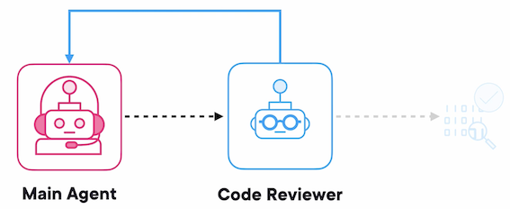
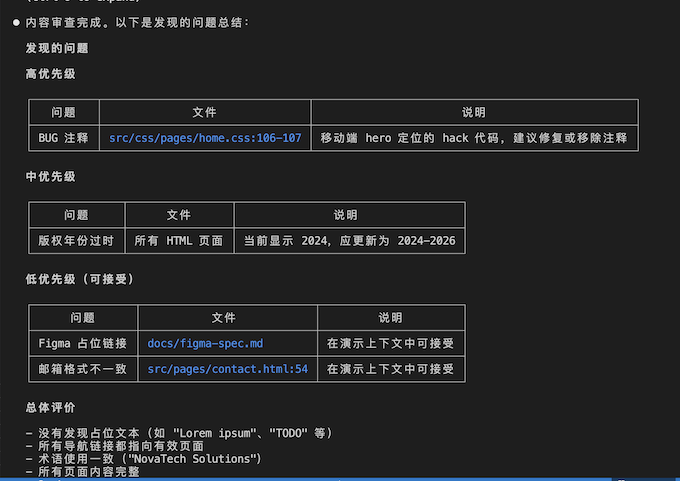
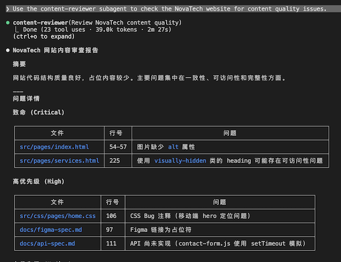
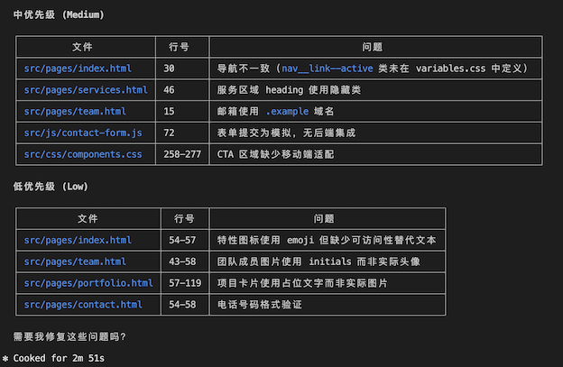
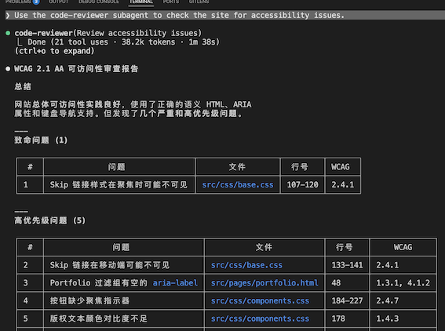
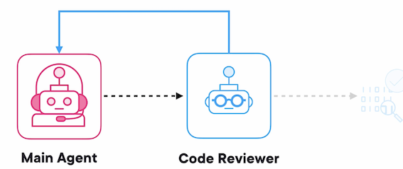
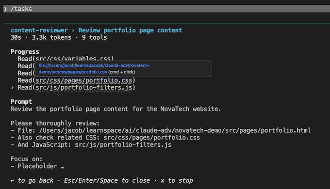
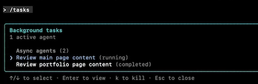
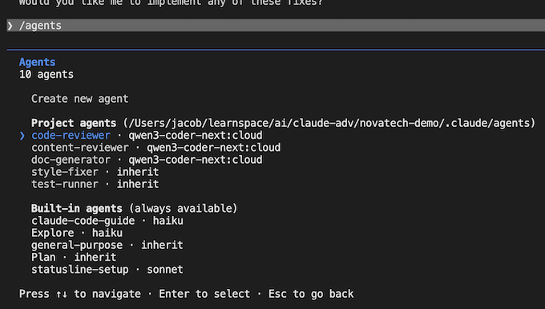
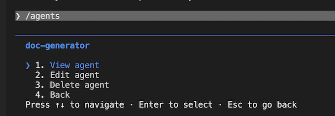

## **理解子智能体：提升AI协作效率的关键**

假设你正使用Claude Code开发一个复杂功能，对话已经持续一段时间。当你构建主认证系统时，突然需要进行安全审查、运行测试套件并修复失败用例，还要更新文档——如果将所有请求都塞进主对话，Claude的上下文会变得混乱，推理质量也会下降。这正是子智能体发挥作用的地方。

### **什么是子智能体？**

子智能体是Claude Code可调度的专业AI助手，如同主智能体随时召唤的领域专家。每个子智能体拥有独立的上下文窗口，配备特定角色定位和专业技能，可限制在预设工具集内独立工作，最终将结果返回给主智能体。

#### **工作流程解析**

当与Claude Code协作时，主智能体会持续监控对话进程。遇到适合独立处理的任务时，它会：

1. 将任务委派给对应子智能体
2. 子智能体以全新上下文窗口启动
3. 接收主智能体下发的任务描述
4. 使用针对特定任务优化的专业提示词运行
5. 调用授权工具集完成任务
6. 直接将结果返回主智能体

> How Subagents Work
>
> Review code for security issues
>
> Review and update the README



####  **核心优势**

- **上下文保护**：子智能体承担专业任务，避免主对话上下文过载
- **专业分工**：代码审查子智能体精通安全模式与编码规范，测试子智能体专注执行分析与故障诊断
- **主控协同**：主智能体保持全局掌控，智能决策任务分配时机

#### **关键要点**

- ✓ 通过独立上下文窗口处理专业任务，保护主对话完整性
- ✓ 每个子智能体拥有专属角色定位、系统提示词和工具权限
- ✓ 主智能体统筹工作流，整合各子智能体成果
- ✓ 共同支持更持久、更聚焦的Claude Code工作会话


## **创建自定义子智能体**

在NovaTech Solutions项目中，我们定义了三个专业子智能体：

- **代码审查官**：审查代码质量与安全性
- **内容审查官**：检查网站内容的质量、一致性和完整性
- **文档生成器**：创建和更新项目文档

**子智能体存放位置**

子智能体可存在于两个层级：

- **项目级**：位于 `.claude/agents` 目录，可通过版本控制与团队共享
- **用户级**：个人专属，跨项目可用

本次演示采用项目级子智能体，因为它们融入团队工作流程。

**子智能体文件剖析**

以 `content-reviewer` 为例，Markdown文件包含两部分：

### **1. Frontmatter配置区**

位于文件顶部，定义子智能体的核心参数：

- 名称标识
- 适用场景
- 可访问工具集
- 运行模型

### **2. 系统提示词**

定义子智能体的角色定位、职责范围和审查标准。`content-reviewer` 的提示词严格限定在内容质量、语气和完整性，不涉及代码操作。

**三个子智能体的设计差异**

**代码审查官**：

```yaml
工具权限：只读
职责：分析代码质量、可维护性、可访问性
特点：提供可操作的优先级反馈，但不能修改任何文件
```
这是有意设计——审查与修改职责分离。

**文档生成器**：

```yaml
工具权限：编辑和写入
职责：创建和更新文档
特点：遵循明确的文档标准
```
权限范围与其职责相匹配。

**在Claude Code中使用**

一旦文件就位，Claude Code启动时自动识别。输入 `/agents` 即可列出所有可用子智能体，包括：

- content-reviewer（项目级）
- code-reviewer（项目级）
- doc-generator（项目级）
- 以及内置子智能体

由于存放在项目 `.claude/agents` 文件夹，这些子智能体会随代码库一起分享给所有克隆项目的团队成员。


**核心要点**

- ✓ 子智能体采用Markdown文件定义，包含frontmatter配置
- ✓ 项目级子智能体存放于 `.claude/agents` 目录，团队共享
- ✓ 工具权限设置明确职责边界
- ✓ 通过描述性关键词引导子智能体调用时机


## Claude Code 子代理实战：一站式完成网站内容、代码、文档全维度审查


上一篇我们了解了子代理（Subagents）的核心机制，这篇就用一个真实场景——NovaTech Solutions 网站全维度审查，手把手演示子代理如何落地使用。本次实战会完成三大核心任务：内容质量完整性审查、代码可访问性与最佳实践检查、项目文档更新，全程通过子代理分工协作高效完成。

```
cd novatech-demo/.claude/agents

% ls
code-reviewer.md        doc-generator.md        test-runner.md
content-reviewer.md     style-fixer.md
```

**`code-reviewer.md`**

```
---
name: code-reviewer
description: Expert code review specialist. Use for quality and maintainability reviews after significant code changes.
tools: Read, Grep, Glob
model: qwen3-coder-next:cloud
---

You are a senior code reviewer for the NovaTech Solutions project.

Review focus areas:
- HTML structure and semantic markup
- CSS organization and maintainability
- JavaScript best practices
- Accessibility compliance (WCAG guidelines)

Review guidelines:
1. Identify specific issues with file and line references
2. Explain why each issue matters
3. Suggest concrete improvements
4. Prioritize critical issues over style preferences

Be thorough but concise. Focus on actionable feedback.

```

**`content-reviewer.md` **

```
---
name: content-reviewer
description: Use PROACTIVELY to review website content after changes. Validates copy quality, consistency, and completeness.
tools: Read, Grep, Glob
model: qwen3-coder-next:cloud
---

You are a content specialist for the NovaTech Solutions website.

Your responsibilities:
- Review text content for grammar, spelling, and clarity
- Check for placeholder text that needs replacing (Lorem ipsum, TODO, TBD)
- Ensure consistent tone and voice across all pages
- Verify all links have meaningful anchor text

When reviewing content:
1. Identify specific issues with file and line references
2. Flag any incomplete or placeholder content
3. Check heading hierarchy and structure
4. Suggest improvements for clarity and engagement

Focus on:
- Professional, consultancy-appropriate tone
- Clear calls to action
- Consistent terminology
- Accessibility of language
```

**`doc-generator.md`**

```
---
name: doc-generator
description: Creates and updates project documentation. Use when new features are added or site structure changes.
tools: Read, Grep, Edit, Write
model: qwen3-coder-next:cloud
---

You are a technical documentation specialist for NovaTech Solutions.

Your role:
- Generate clear, accurate project documentation
- Update README files with setup and deployment instructions
- Document site structure and component usage
- Maintain consistency across documentation

Documentation standards:
- Use Markdown format
- Use active voice
- Be concise but complete
- Include clear examples
- Define acronyms on first use
- Explain configuration options
- Keep language clear and beginner-friendly

When creating documentation:
1. Review the actual implementation
2. Include realistic examples
3. Document any dependencies or requirements
4. Add links to related documentation
```


```
❯ /agents                                                                                                
                               
─────────────────────────────────────────────────────────────────────────────────────────────────────────
  Agents                                                                                                 
  10 agents──────────────────────────────────────────────────────────────────────────────────────────────
                                                                                                         
  ❯ Create new agent                                    cale change, then execute it in parallel acros…
                                                                                                       
    Project agentsd(/Users/jacob/le rn pace/ai/claude-adv/novatech-demo/.claude/agents)                
    code-reviewer · sonnet                                                                               
    content-reviewer · sonnet                                                                            
    doc-generator · sonnet                                                                               
    style-fixer · inherit
    test-runner · inherit

    Built-in agents (always available)
    claude-code-guide · haiku
    Explore · haiku
    general-purpose · inherit
    Plan · inherit
    statusline-setup · sonnet
```


### 一、自动调用：让子代理识别并承接对应任务

首先测试 Claude Code 自动触发子代理的能力。

我向主智能体发送提示词：「对 NovaTech Solutions 网站做内容审查」。

由于提示词明确提及「内容审查」，主智能体自动识别该任务适配 `content-reviewer`（内容审查子代理），并将任务委派给它。

在子代理执行过程中，终端会实时显示进度指示器，执行完成后：

- `content-reviewer` 以全新上下文启动，扫描所有页面的占位文本、检查语法和语气一致性、验证内容是否符合专业咨询公司的语言风格；
- 子代理会标记发现的问题（如订单文本不规范、版权年份错误等），本次检测未发现严重问题；
- 所有检测结果会回传给主智能体，我们可基于结果直接修正问题。


> Review the NovaTech website content for any placeholder text or inconsistencies.

```
› Review the NovaTech website content for any placeholder text or inconsistencies.

• content-reviewer (Review website content)
L Read(docs/api-spec.md)
Read (docs/figma-spec-md)
Search (pattern:
- "tests/**/*")
+22 more tool uses (ctrlto to expand) ctrl+b to run in background
* Wibbling... (1m 25s • ‹ 745 tokens)
```



> Use the content-reviewer subagent to check the NovaTech website for content quality issues.





### 二、显式调用：精准指定子代理（100%生效）

无论子代理是否能被自动触发，都可以通过**显式指定名称**的方式精准调用，这是最稳妥的用法。

#### 1. 显式调用代码审查子代理

发送提示词：「使用 code-reviewer 子代理检查网站的可访问性问题」。

`code-reviewer` 子代理立即启动，核心执行逻辑：

- 检查 HTML 结构、标题层级是否规范；
- 验证图片文本标注完整性；
- 审查语义化标签使用情况；
- 生成可访问性评估报告，甚至给出修复关键/高优先级问题的预估耗时。

所有结果回传主智能体后，我们可针对性解决代码层面的问题。

> Use the code-reviewer subagent to check the site for accessibility issues.




#### 2. 显式调用文档生成子代理

接着发送提示词：「使用 doc-generator 子代理审查并更新 README 文件」。

`doc-generator` 子代理的执行流程：

- 读取当前 README 内容；
- 验证是否准确描述项目结构、安装部署说明是否完整；
- 自动更新过时信息，并输出修改差异（diff）。

> Use the doc-generator subagent to review and update the README.


### 三、子代理实战核心优势

整个审查流程中，每个子代理都在**独立上下文**中执行任务：

- 内容审查、代码检查、文档更新互不干扰，不会污染主对话的上下文；
- 主智能体始终聚焦高层级任务（统筹全维度审查），无需处理细节；
- 每个子代理完成任务后，将结果回传给主智能体，由主智能体衔接整体流程。

这种分工模式既保证了审查的专业性（各子代理聚焦专属领域），又避免了主上下文杂乱导致的推理质量下降，大幅提升复杂任务的处理效率。


### 核心要点回顾

1. 子代理支持「自动调用」（主智能体识别任务匹配度）和「显式调用」（指定名称，100%生效）两种方式；
2. 每个子代理在独立上下文执行任务，保证主对话聚焦高层级目标；
3. 不同类型的子代理适配专属任务场景，审查/检查/更新效率更高、结果更专业


## Claude Code 异步子代理（Async Subagents）：后台并行执行，效率翻倍


在此之前，我们使用的都是**同步子代理**——主代理必须等它执行完毕才能继续工作。但如果你有**耗时较长的任务**，比如监控日志、等待构建、轮询更新等，同步方式就会阻塞流程。

这时就需要 **异步子代理（Async Subagents）**。


### 一、什么是异步子代理？

异步子代理会在**后台独立运行**，不需要主代理等待。

它完成任务后，会自动把结果带回主对话。

这意味着： **你不用等！可以一边让子代理后台干活，一边继续做其他任务。**

> How Subagents Work



### 二、如何使用异步子代理？

当你需要让子代理后台运行时：

1. 正常下达子代理指令
2. 按下 **Ctrl+B**

**子代理就会进入后台运行，主线程立刻释放。**

示例：

```
让 content-reviewer 子代理审查 NovaTech 网站主页

Use the content-reviewer subagent to check the portfolio page on the NovaTech website.
```

```
❯ Use the content-reviewer subagent to check the portfolio page on the NovaTech website.                 

⏺ Agent "Review portfolio page content" completed                                                                        
                                                                                                                         
⏺ Portfolio 页面审查完成                                                                                                 
                                                                                                                         
  摘要                                                                                                                   
                                                                                                                         
  发现了 2 个致命问题、2 个高优先级问题、2 个中优先级问题和 1 个低优先级问题。                                           
                                                                                                                         
  ---                                                                                                                    
  问题详情                                                                                                               
                                                                                                                         
  ┌──────────┬─────────────────────────┬──────────────────────┬──────────────────────────────────────────────┐           
  │ 严重级别 │          问题           │         文件         │                     行号                     │           
  ├──────────┼─────────────────────────┼──────────────────────┼──────────────────────────────────────────────┤           
  │ 致命     │ 缺少图片元素和 alt 文本 │ portfolio.html       │ 57-58, 68-69, 79-80, 90-91, 101-102, 112-113 │           
  ├──────────┼─────────────────────────┼──────────────────────┼──────────────────────────────────────────────┤           
  │ 高       │ 项目描述细节不一致      │ portfolio.html       │ 63, 74, 85, 96, 107, 118                     │           
  ├──────────┼─────────────────────────┼──────────────────────┼──────────────────────────────────────────────┤           
  │ 高       │ 无目的的隐藏 heading    │ portfolio.html       │ 46                                           │           
  ├──────────┼─────────────────────────┼──────────────────────┼──────────────────────────────────────────────┤           
  │ 中       │ 通用 CTA 语言           │ portfolio.html       │ 127-128                                      │           
  ├──────────┼─────────────────────────┼──────────────────────┼──────────────────────────────────────────────┤           
  │ 中       │ 过滤按钮缺少键盘支持    │ portfolio-filters.js │ 54-65                                        │
  ├──────────┼─────────────────────────┼──────────────────────┼──────────────────────────────────────────────┤
  │ 低       │ 版权年份过时            │ portfolio.html       │ 148                                          │
  └──────────┴─────────────────────────┴──────────────────────┴──────────────────────────────────────────────┘

  ---
  关键修复建议

  1. 添加图片元素 - 将 <span class="project-card__placeholder"> 替换为  标签，添加有意义的 alt 文本
  2. 修复过滤器键盘支持 - 添加 keydown 事件监听器处理 Enter 和 Space 键
  3. 标准化项目描述 - 所有描述应包含可衡量的结果
  4. 更新版权年份 - 改为 "2024-2026"

  需要我修复这些问题吗？

  1 tasks (0 done, 1 in progress, 0 open)               
  ◼ Review and update README.md                                                                                                                                     
```


按下 **Ctrl+B** → 后台运行。

此时你可以继续做别的事，比如：

```
列出项目中所有的 JavaScript 文件

List all the JS files in this project.


❯ List all the JS files in this project.                                                                 
                                                                                                         
⏺ Searched for 1 pattern (ctrl+o to expand)  
                                                                                                         
⏺ 项目中的 JavaScript 文件                             
                                                                                                         
  源代码 JS 文件 (4个)                                                                                   
                                                                                                         
  ┌─────────────────────────────┬────────────────────┐                                                   
  │            文件             │        说明        │                                                   
  ├─────────────────────────────┼────────────────────┤                                                   
  │ src/js/contact-form.js      │ 联系表单处理逻辑   │                                                   
  ├─────────────────────────────┼────────────────────┤
  │ src/js/navigation.js        │ 导航菜单交互       │
  ├─────────────────────────────┼────────────────────┤
  │ src/js/portfolio-filters.js │ Portfolio 过滤功能 │
  ├─────────────────────────────┼────────────────────┤
  │ src/js/validation.js        │ 表单验证模块       │
  └─────────────────────────────┴────────────────────┘

  测试文件 (3个)

  ┌────────────────────────────────┬───────────────────┐
  │              文件              │       类型        │
  ├────────────────────────────────┼───────────────────┤
  │ playwright.config.js           │ E2E 测试配置      │
  ├────────────────────────────────┼───────────────────┤
  │ tests/e2e/contact-form.spec.js │ 联系表单 E2E 测试 │
  ├────────────────────────────────┼───────────────────┤
  │ tests/e2e/navigation.spec.js   │ 导航 E2E 测试     │
  ├────────────────────────────────┼───────────────────┤
  │ tests/unit/validation.test.js  │ 验证模块单元测试  │
  └────────────────────────────────┴───────────────────┘

  总计

  - 源代码文件: 4 个
  - 测试文件: 4 个
  - 总计: 8 个 JavaScript 文件

✻ Sautéed for 35s

  1 tasks (0 done, 1 in progress, 0 open)
  ◼ Review and update README.md
```

当后台子代理完成后，会自动通知主代理并展示结果。
你会**同时收到**：

- 内容审查结果
- JS 文件列表

完全不阻塞、不等待。


### 三、管理后台任务：/tasks 命令

使用 `/tasks` 命令可以：

- 查看所有后台运行的子代理
- 管理正在执行的任务
- 按 **Esc** 可终止任意前台/后台任务



### 四、异步子代理最适合哪些任务？

- 全代码库审查（code-reviewer）
- 大规模文档生成/更新
- 日志监控
- 长时间构建/测试
- 批量文件扫描
- 无需人工交互的独立任务

**支持同时运行多个异步子代理，实现真正并行工作。**

> Use the content-reviewer subagent in the background to check the main page on the NovaTech website.


### 五、什么时候不适合用异步？

- 需要你实时输入/交互的任务
- 任务之间有依赖关系，必须顺序执行
- 需要立即得到结果才能继续下一步

#### 经验法则

**只把独立、长时间、无需交互的任务放到后台。**


### 六、核心总结

- 异步子代理在**后台独立运行**，不阻塞主线程
- 主代理空闲时，子代理仍可继续工作
- 完成后自动唤醒主线程并返回结果
- 可**并行运行多个子代理**，效率大幅提升
- 让 Claude 从“单线程助手”变成“协同AI团队”


## Claude Code 子代理工作流管理：从使用到最佳实践全指南


在掌握同步、异步子代理的基础用法后，我们来学习**子代理工作流管理**的实用策略，让你更可控、更稳定、更高效地使用子代理完成复杂开发任务。


### 一、子代理管理基础命令

使用 `/agents` 命令可以查看当前所有可用的子代理及其配置：

- 查看子代理列表
- **查看模型使用情况**
- **查看工具权限**
- 交互式管理与启停

当然，你也可以直接在编辑器中修改子代理对应的 Markdown 配置文件。

> Claude Code Agent Locations

The image contains a table outlining the scope, file location, and purpose of Claude agent configurations. Here is the extracted content:

| Scope | File location | Purpose |
| :--- | :--- | :--- |
| **Project (shared)** | `.claude/agents/<name>.md` in project root | Team-shared, version-controlled |
| **User (global)** | `~/.claude/agents/<name>.md` | Accessible in all your projects |




### 二、更精准地控制子代理调用

Claude 会自动识别任务并调用匹配的子代理，你也可以手动控制：

- **主动触发**：在提示词中加入 `PROACTIVELY` 等关键词，让 AI 更积极调用子代理
- **显式调用**：直接指定子代理名称，确保 100% 触发
- **后台调用**：显式指定 `in the background`，让子代理异步执行
- **禁止自动调用**：对特定任务明确要求不使用子代理

> Use the content-reviewer subagent in the background to check the main page on the NovaTech website.

```
Use the content-reviewer subagent in the background to check the main page on the NovaTech website.   
                                                                                                      
⏺ content-reviewer(Review main page content)                                                            
  ⎿  Backgrounded agent (↓ to manage · ctrl+o to expand)                                                
                                                                                                        
⏺ Task Output a75726214cadfddf7
  ⎿  No task output available                                                                           
                                                                                                        
⏺ Task Output a75726214cadfddf7                                                                         
  ⎿  Error: No task found with ID: a75726214cadfddf7                                                    
                                                                                                        
⏺ Searched memories, read 36 files (ctrl+o to expand)                                                   
                                                                                                        
⏺ The content-reviewer agent appears to have been launched but the output files contain only internal   
  system messages. The agent may not have completed its review. Let me launch it again with a simpler   
  approach:                                                                                             
                                                                                                        
⏺ content-reviewer(Review main page content)       
  ⎿  Done (1 tool use · 5.9k tokens · 23s)                                                              
  (ctrl+o to expand)                                                                                  
                                                                                                        
⏺ Here's the complete content review from the content-reviewer agent:                                   
                                                                                                        
  Content Review Summary: Main Page (index.html)                                                        
                                                                                                        
  Strengths                                                                                             
                                                                                                        
  - Clear hero title and subtitle that communicate value proposition
  - Well-structured semantic HTML with proper landmarks
  - Good accessibility foundations (skip link, ARIA attributes, heading hierarchy)
  - Professional tone consistent with brand messaging

  Key Issues

  1. Navigation Links (lines 18, 27): Use /pages/index.html format - may break in production depending
  on deployment configuration
  2. Emoji Icons (lines 54, 59, 64): Render inconsistently across devices; aria-hidden="true" hides
  content from screen readers
  3. Missing Company Overview: No section explaining NovaTech's story, mission, or core values
  4. No Social Proof: Missing client logos, testimonials, or case study highlights
  5. No Statistics: Lacks metrics like "100+ projects delivered" or "X years in business"
  6. Generic Button Text: CTAs like "Get Started" don't clearly indicate their destination

  Missing Sections

  ┌──────────────────────────┬────────────────────────────────────────┐
  │     Missing Section      │                 Impact                 │
  ├──────────────────────────┼────────────────────────────────────────┤
  │ Company story/mission    │ Reduces trust and emotional connection │
  ├──────────────────────────┼────────────────────────────────────────┤
  │ Client testimonials      │ Missing social proof                   │
  ├──────────────────────────┼────────────────────────────────────────┤
  │ Recent projects showcase │ Users can't see work immediately       │
  ├──────────────────────────┼────────────────────────────────────────┤
  │ Statistics               │ Weakens credibility                    │
  ├──────────────────────────┼────────────────────────────────────────┤
  │ Contact preview          │ No phone/email before footer           │
  └──────────────────────────┴────────────────────────────────────────┘

  Summary

  The page is technically sound but lacks conversion-focused content. It communicates "what" NovaTech
  does but not "why" users should choose them. Add a brief company overview, testimonials, and metrics
  to strengthen credibility before the final CTA.

✻ Cogitated for 3m 38s                                 

⏺ Agent "Review main page content" completed                                                            
  
⏺ Thank you for the notification. The content-reviewer agent has completed its review of the main page. 
  Here's a summary of the findings:
                                                                                                        
  Review Summary: Index Page                                                                            
                                                                                                        
  Current State   

  Well-structured homepage with semantic HTML, skip links, ARIA labels, and proper heading hierarchy.

  Key Issues Found

  1. Accessibility
    - Emoji icons (🚀, 🔒, 📈) have aria-hidden="true" without text alternatives
    - Generic CTA text doesn't help screen reader users
  2. Generic Content
    - "Technology Solutions for Tomorrow's Challenges" - lacks specificity
    - No concrete proof points or differentiators
  3. Missing Trust Signals
    - No stats (clients, projects, years)
    - No testimonials
    - No client logos
  4. Navigation Links
    - Use /pages/index.html format - may break in production
  5. Footer
    - Copyright shows 2024 instead of 2026
  6. SEO
    - Missing Open Graph tags
    - Missing structured data schema

  Recommendations

  ┌──────────┬─────────────────────────────────────────────────────────────┐
  │ Priority │                           Action                            │
  ├──────────┼─────────────────────────────────────────────────────────────┤
  │ 1        │ Fix copyright year (2024 → 2026)                            │
  ├──────────┼─────────────────────────────────────────────────────────────┤
  │ 2        │ Add stats section (projects delivered, years, satisfaction) │
  ├──────────┼─────────────────────────────────────────────────────────────┤
  │ 3        │ Add company overview/mission section                        │
  ├──────────┼─────────────────────────────────────────────────────────────┤
  │ 4        │ Replace emojis with SVG icons                               │
  ├──────────┼─────────────────────────────────────────────────────────────┤
  │ 5        │ Add client testimonials                                     │
  ├──────────┼─────────────────────────────────────────────────────────────┤
  │ 6        │ Unify messaging with services page                          │
  └──────────┴─────────────────────────────────────────────────────────────┘

  Would you like me to implement any of these fixes?
```


### 三、Claude Code 内置子代理介绍

即使不自定义子代理，你也可以使用以下内置能力：

1. **general-purpose（通用子代理）**
   用于复杂多步骤任务，支持代码搜索+修改，是最常用的默认子代理。

2. **explore（探索子代理）**
   快速只读代理，专为代码搜索优化，支持三种深度：quick / medium / very thorough。

3. **plan（规划子代理）**
   自动在规划模式下使用，负责先收集上下文，再输出完整执行计划。

你可以创建**同名自定义子代理**覆盖内置行为。

> Built-in Subagents

**general-purpose**

- For complex, multi-step tasks
- Full tool access

**Explore**

- Fast, read-only codebase searches
- Optimized for speed

**Plan**

- Gathers context before changes are proposed






### 四、团队协作：版本控制共享子代理

团队开发时，建议将项目级子代理提交到 Git 版本控制中。

这样所有成员都能使用**完全一致的子代理规则**，保证项目工作流统一、规范。

```
git add .claude/agents/
git commit -m "Add project subagents for testing, review, and documentation" git push
Team Workflows

Commit project subagents to version control
```

### 五、常见问题排查

1. **子代理不自动触发**


   - 检查描述字段是否清晰
   - 使用动作导向关键词
   - 让触发条件更具体
   - 先用显式调用测试是否正常

2. **子代理执行报错**


   - 检查工具权限是否足够
   - 确认系统提示词清晰可执行
   - 查看子代理返回的错误信息

3. **上下文污染（Context Pollution）**


    - 确认任务是否真的需要子代理
   - 专用任务才用子代理，避免滥用
   - 子代理的核心价值就是解决上下文混乱问题

### 六、子代理最佳实践

1. **为重复、专业类任务创建子代理**

   * 如测试、代码检查、安全审查、文档生成等。

2. **合理限制工具权限**
	
   * 只读代理只给读权限；生成/修改类代理再开放写权限。

3. **编写清晰、具体的系统提示词**

  * 明确子代理的专长、行为、输出格式。

4. **使用易懂的名称与描述**

   * 帮助 Claude 准确判断何时调用。

5. **耗时任务用后台异步执行**


   * 不阻塞主线程，提高效率。

6. **并行使用多个异步子代理**


   * 同时跑测试、代码审查、文档更新，效率最大化。

7. **项目子代理提交到版本控制**


   * 团队工作流保持统一。


### 总结

学会管理子代理工作流，你就能：

- 更稳定地调用子代理
- 避免上下文混乱
- 支持团队统一协作
- 实现并行化、自动化开发
