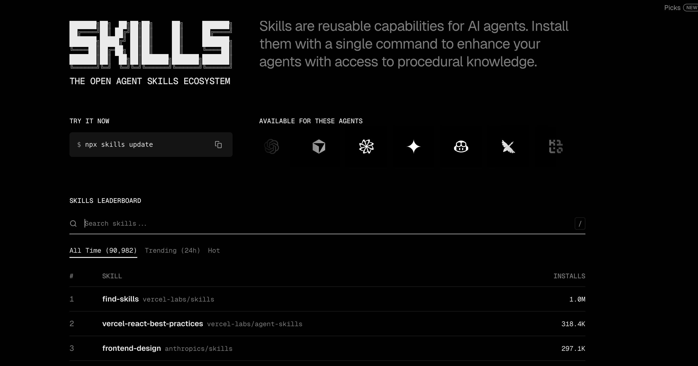
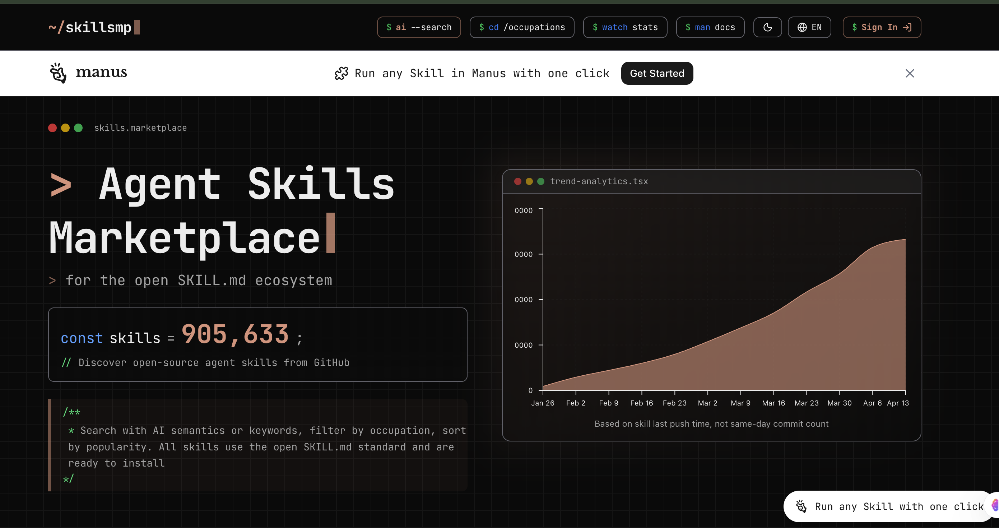
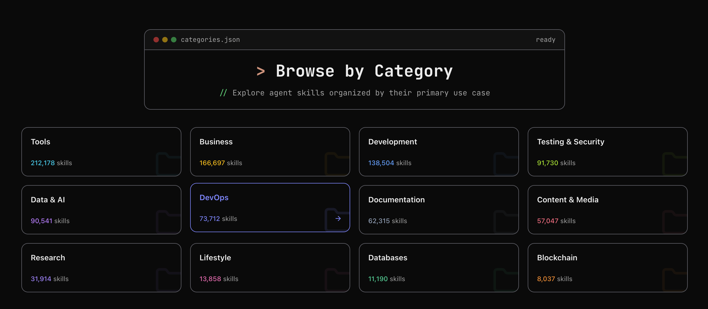

# 1 Intro to Agent Skills （skill \ skills.sh \ Skills MP \ find-skills 入门)


## 1 skill 入门 

**Agent Skills 是写进 Markdown 的「任务指南」，告诉助手该怎么做、用什么格式、遵循什么规范**

> 不用改模型或写代码，改几份文档就能让 AI 更懂你的项目

### 为什么需要 Skills？

Skills 能解决三件事：

- **稳定**：同一任务每次按同一套流程和格式，输出更可预期，不会因会话不同而画风突变。
- **可传承**：把经验写成技能，新人、新会话都能复用，技能文件可随项目提交，全组共享规范。
- **省时间**：复杂流程（PR 审查、数据库查询、报告生成等）写成技能后，助手按步骤执行，少费口舌，也减少漏步骤。

### Skills 是什么、长什么样？

本质上，一个 Skill 是以 SKILL.md 为核心的文件夹，内含指令（Markdown）与可选附录（脚本、参考文档等；可选子目录常用 scripts/、references/、assets/）。


跨助手通用，在 Cursor、Claude Code 等里结构一致。以 Cursor 为例，目录结构如下：

```
.cursor/skills/
└── my-skill/
    ├── SKILL.md          # 必需：技能名称、描述和主要步骤
    ├── scripts/          # 可选：可执行脚本
    ├── references/       # 可选：参考文档（如 REFERENCE.md）
    └── assets/           # 可选：模板、配置等静态资源
```


每个技能有两个必填信息（写在 SKILL.md 文件开头的 YAML 里）：

name：技能的唯一标识，用英文、小写、连字符，如 code-review、commit-message；在 Cursor 中需与所在文件夹名一致。

description：用第三人称写「做什么 + 什么时候用」，并带上对话里会提到的关键词（如 commit、code review、PDF），助手靠它决定是否选用该技能。

#### **技能怎么被触发？ 有两种方式**：

**隐式触发**：你正常提需求（如「帮我写条 commit」「review 这段代码」），助手会扫一遍已加载技能的 description，自动判断当前任务是否匹配某条技能，匹配上就按该技能的说明执行。description 里写清「什么时候用」并带关键词，隐式触发才容易生效。


**显式调用**：你也可以主动指定用某条技能。

在 Cursor 的 Agent 对话里输入 `/` 再搜技能名（如 `/commit-message`），或直接说「用 commit-message 技能写提交信息」。适合要强制走某套流程、或有多条技能可能被误匹配时使用。

技能放哪里？ 不同产品用各自配置目录。

Cursor：个人用 ~/.cursor/skills/，项目用 `.cursor/skills/` 或 `.agents/skills/`（勿用 ~/.cursor/skills-cursor/ 内置目录）。

Claude Code 用 `~/.claude/skills/` 与 `.claude/skills/`

### 能拿来做哪些事？

Skills 适合几乎所有「可重复」的工作：任务有相对固定的步骤、格式或规范即可写成技能，一次写好、多次调用。下面用 Cursor 举例，覆盖编程、文档、数据、流程等：


* **代码评审**：写 code-review 技能，约定团队的评审标准（安全、可读性、测试等）和反馈格式（必须改/建议改/可选），说「帮我 review 这段代码」时 Cursor 就按技能里的清单输出。
* **Commit 信息**：写 commit-message 技能，约定格式（如 Conventional Commits：feat:、fix:、docs: 等）并给示例，助手按当前改动生成风格统一的提交信息，历史更整洁，也便于做自动化。
* **文档/报表**：写好报告模板（摘要+发现+建议），助手按结构填空，输出格式一致，便于汇总汇报。
* **API 文档与接口说明**：把你们团队的接口描述规范（字段、示例、错误码等）写成技能，助手在写或补全 API 文档、README 时自动按同一套格式来。
* **单元测试与用例**：约定测试框架、命名和结构（如 Given-When-Then），写成技能后，让助手按规范生成或补充单测、测试用例，风格统一。
* **数据库与发布流程**：如查数据库 schema、按公司流程做发布或迁移，把「先查哪张表、再检查哪些配置」写成技能，在相关对话里助手会自动按步骤执行，减少遗漏。
* **数据清洗与分析**：固定好数据源约定、清洗步骤和输出格式（如 CSV/报表结构），需要做类似分析时让助手按技能执行，结果格式一致。
* **需求与用户故事**：把产品/团队的需求描述格式、用户故事模板写成技能，助手在协助写 PRD、拆 story 时按同一套结构输出，便于协作。


### 写好一个 Skill 的几条原则

#### **描述要具体**：

description 写清「做什么」和「什么时候用」，带上关键词（如 PDF、Excel、commit、code review）；**写得太泛（如「帮助处理文档」）不利于助手在众多技能里准确选中**。

#### **主文件别太长**：

核心步骤和模板放 SKILL.md，细节放 reference、examples，需要时再让助手读，方便日后维护。

#### **多用示例**：

格式类技能（commit、报告）给一两个输入输出示例，助手会模仿风格。例如在 Cursor 的 commit 技能里写：「改动：加了登录接口」→ feat(auth): add login endpoint，比只写「用 Conventional Commits」更管用。

#### 用语统一：

技能里术语一致（如只叫「API 端点」不混用「URL」「路由」），减少歧义，方便多人维护。


### 怎么开始？

第一步：选一个你或团队重复在做、且希望风格统一的事（如写 commit、做 code review、生成周报），从「小而具体」的任务开始，更容易成功

第二步：在项目根或用户目录建 .cursor/skills/（或 ~/.cursor/skills/），新建以技能名命名的子目录（如 commit-message），写 SKILL.md，填好 name、description 和简要步骤。有现成示例可先抄再改。其他助手目录名不同，技能写法一致。

第三步：在 Cursor 对话里触发任务——可以自然说需求（如「根据当前改动写一条 commit」）让助手隐式匹配技能，也可以显式说「用 commit-message 技能写一条提交信息」；看是否按技能执行，再根据效果补充示例或把细节拆到 reference 里，迭代几次就顺手了。


## 2 Agent Skills 去哪找？ skills.sh 入门

skills.sh 是开放 Agent Skills 生态目录，可以理解为「技能的 npm / 应用商店」：上面列出一批符合规范的 Agent Skills，支持按安装量、趋势浏览与搜索，并用一条命令装到本地。

[https://skills.sh/](https://skills.sh/)




```
$ npx skills add anthropics/skills

███████╗██╗  ██╗██╗██╗     ██╗     ███████╗
██╔════╝██║ ██╔╝██║██║     ██║     ██╔════╝
███████╗█████╔╝ ██║██║     ██║     ███████╗
╚════██║██╔═██╗ ██║██║     ██║     ╚════██║
███████║██║  ██╗██║███████╗███████╗███████║
╚══════╝╚═╝  ╚═╝╚═╝╚══════╝╚══════╝╚══════╝

┌   skills 
│
◇  Source: https://github.com/anthropics/skills.git
│
◇  Repository cloned
│
◇  Found 17 skills
│
◇  Select skills to install (space to toggle)
│  docx, pdf, pptx, xlsx, algorithmic-art, brand-guidelines, canvas-design, doc-coauthoring,
frontend-design, internal-comms, mcp-builder, skill-creator, slack-gif-creator, theme-factory,
web-artifacts-builder, webapp-testing
│
◇  45 agents
....

│  One-time prompt - you won't be asked again if you dismiss.
│
◇  Install the find-skills skill? It helps your agent discover and suggest skills.
│  Yes

│
◇  Installing find-skills skill...

┌   skills 
│
◇  Source: https://github.com/vercel-labs/skills.git
│
◇  Falling back to clone...
│
◇  Repository cloned
│
◇  Found 1 skill
│
●  Selected 1 skill: find-skills

│
◇  Installation Summary ────────────────────────────────────╮
│                                                           │
│  ~/.agents/skills/find-skills                             │
│    copy → Amp, Antigravity, Cline, Codex, Cursor +7 more  │
│                                                           │
├───────────────────────────────────────────────────────────╯
│
◇  Security Risk Assessments ─────────────────────────────────╮
│                                                             │
│               Gen               Socket            Snyk      │
│  find-skills  Safe              0 alerts          Med Risk  │
│                                                             │
│  Details: https://skills.sh/vercel-labs/skills              │
│                                                             │
├─────────────────────────────────────────────────────────────╯
│
◇  Installation complete

│
◇  Installed 1 skill ────────────────╮
│                                    │
│  ✓ find-skills (copied)            │
│    → ~/.agents/skills/find-skills  │
│    → ~/.agents/skills/find-skills  │
│    → ~/.agents/skills/find-skills  │
│    → ~/.agents/skills/find-skills  │
│    → ~/.agents/skills/find-skills  │
│    → ~/.agents/skills/find-skills  │
│    → ~/.agents/skills/find-skills  │
│    → ~/.agents/skills/find-skills  │
│    → ~/.agents/skills/find-skills  │
│    → ~/.agents/skills/find-skills  │
│    → ~/.agents/skills/find-skills  │
│    → ~/.agents/skills/find-skills  │
│                                    │
├────────────────────────────────────╯

│
└  Done!  Review skills before use; they run with full agent permissions.
```


* 以**下是根据您提供的信息整理而成的 Markdown 表格：**

| 分类（用途） | 说明 | 代表技能 / 仓库 |
| :--- | :--- | :--- |
| **前端 / React / UI** | 前端开发、React/Next 与设计规范 | vercel-react-best-practices, frontend-design, web-design-guidelines, vercel-composition-patterns, next-best-practices, tailwind-design-system, shadcn-ui, vue-best-practices |
| **云 / Azure** | Azure 与微软云相关 | microsoft/github-copilot-for-azure（azure-ai, azure-storage, azure-deploy 等 20+ 条） |
| **文档 / Office** | 文档与办公格式处理 | pdf, pptx, docx, xlsx（anthropics/skills） |
| **技能发现与元技能** | 找技能、写技能、模板 | find-skills, skill-creator, template-skill |
| **Agent 工作流 / 协作** | 规划、执行、Code Review、多 Agent | obra/superpowers（brainstorming, writing-plans, executing-plans, code-review, test-driven-development 等） |
| **营销 / SEO / 内容** | 营销、SEO、文案、转化 | coreyhaines31/marketingskills（seo-audit, copywriting, programmatic-seo, content-strategy 等） |
| **设计 / 视觉 / 品牌** | UI 设计、画布、主题、品牌 | canvas-design, algorithmic-art, theme-factory, brand-guidelines |
| **测试与质量** | 自动化测试、TDD、调试 | webapp-testing, test-driven-development, systematic-debugging |
| **移动 / Expo / React Native** | 移动端与跨平台 | vercel-react-native-skills, building-native-ui, expo/skills（building-native-ui, native-data-fetching 等） |
| **视频 / 媒体** | Remotion 等视频与媒体 | remotion-best-practices, remotion-render, remotion-video-production |
| **MCP / 工具 / 集成** | MCP 服务器、浏览器、工具 | mcp-builder, agent-browser, agent-tools, firecrawl |
| **数据库 / 后端 / Auth** | 数据库、认证、API | supabase-postgres-best-practices, better-auth-best-practices, nodejs-backend-patterns |
| **文档协作 / 沟通** | 协作文档、内部沟通 | doc-coauthoring, internal-comms |
| **通用模板 / 多场景** | 多用途技能模板集合 | supercent-io/skills-template（code-review, api-design, deployment 等 40+ 条） |

### 三、验证步骤（做完即可验证）


- 打开 skills.sh，在排行榜或通过搜索选一个技能（例如 anthropics/skills，find-skills 或某个 commit/文档类技能）。
- 在终端执行：npx skills add <owner/repo>（把 <owner/repo> 换成该技能页给出的仓库，如 anthropics/skills 或 vercel-labs/skills）。
- 打开 Cursor（或你使用的 Agent），新建一个 Agent 对话，用自然语言触发该技能（例如装的是 find-skills 可以说「帮我找做 PPT 的技能」；装的是 commit 类可以说「根据当前改动写一条 commit」）。
- 若助手按该技能的说明执行或给出预期结果，说明安装与触发成功。


## 3 Agent Skills 去哪找？Skills  MP 入门

如果你更习惯按领域浏览或用自然语言描述需求搜技能，可以试试 SkillsMP（https://skillsmp.com/）

本篇将讲述 SkillsMP 是什么、怎么发现技能、怎么装。SkillsMP 非官方，数据来自公开 GitHub，使用前建议自行审查来源与许可。

**SkillsMP 通过智能搜索、分类筛选和质量参考帮你更快找到所需**。

站内技能均采用开放的 SKILL.md 标准，兼容 Claude Code、OpenAI Codex CLI 等采用该格式的工具；无论做自动化开发、团队定制 AI 工具还是个人探索，都能按场景找到对应技能。


和 skills.sh 的差异：

- skills.sh：偏一键安装（npx skills add <owner/repo>）和排行榜（按安装量、趋势、热度）。
- SkillsMP：偏浏览与发现—— 按分类筛选，或用 AI 语义搜索 以自然语言找技能，而不只靠关键词




### 如何发现技能：分类浏览与 AI 语义搜索



[https://skillsmp.com/categories/devops](https://skillsmp.com/categories/devops)


| 大类 | 说明 / 子类举例 |
| :--- | :--- |
| Tools | 效率与集成、调试、系统管理、自动化工具、IDE 插件、CLI、域名与 DNS 等 |
| Development | 架构模式、CMS 与平台、前端 / 后端 / 全栈、游戏开发、脚本、移动端、包与分发等 |
| Business | 销售与市场、项目管理、财务与投资、健康与健身、地产与法律、支付、电商等 |
| Data & AI | LLM 与 AI、数据工程、机器学习、数据分析等 |
| Design | UI/UX、原型与设计系统等 |


### 安装方式

SkillsMP 上的条目多数来自 GitHub，安装方式一般是：


打开技能详情页，按页面说明操作；

常见做法：把对应仓库克隆或复制到本地的 skills 目录，例如：

Claude Code：`~/.claude/skills/` 或 `.claude/skills/`

具体以每个技能页的说明为准。部分 SkillsMP 技能页会提供与 skills.sh 相同的 `npx skills add <owner/repo>` 安装方式，也有不少只给「克隆或复制到目录」的说明，步骤因页而异；SkillsMP 聚合自大量公开仓库，能看到的技能数量与范围通常更广。若使用 Manus 等集成，SkillsMP 也支持一键运行。

### 验证步骤（做完即可验证）

1. 打开 skillsmp.com，在分类或搜索里选一个你需要的技能。
2. 点进技能页，按页面说明把该技能装到本地（如克隆到 ~/.cursor/skills/ 或项目对应目录）。
3. 打开 Cursor（或你使用的 Agent），新建 Agent 对话，用自然语言触发该技能（例如技能是「写 commit」，就说「根据当前改动写一条 commit」）。
4. 若助手按该技能的说明执行或给出预期结果，说明安装与触发成功。

```
npx skills add mukul975/Anthropic-Cybersecurity-Skills
```

```
◇  Select skills to install (space to toggle)
│  implementing-network-policies-for-kubernetes
│
◇  45 agents
◆  Which agents do you want to install to?
◆  Which agents do you want to install to?
◆  Which agents do you want to install to?
◇  Which agents do you want to install to?
│  Amp, Antigravity, Cline, Codex, Cursor, Deep Agents, Firebender, Gemini CLI, GitHub Copilot, Kimi Code CLI, OpenCode, Warp
│
◇  Installation scope
│  Project

│
◇  Installation Summary ───────────────────────────────────────────────────────────────╮
│                                                                                      │
│  ~/learnspace/ai/skills/.agents/skills/implementing-network-policies-for-kubernetes  │
│    copy → Amp, Antigravity, Cline, Codex, Cursor +7 more                             │
│                                                                                      │
├──────────────────────────────────────────────────────────────────────────────────────╯
│
◇  Security Risk Assessments ──────────────────────────────────────────────────────────╮
│                                                                                      │
│                                        Gen               Socket            Snyk      │
│  implementing-network-policies-for-k…  Safe              0 alerts          Low Risk  │
│                                                                                      │
│  Details: https://skills.sh/mukul975/Anthropic-Cybersecurity-Skills                  │
│                                                                                      │
├──────────────────────────────────────────────────────────────────────────────────────╯
│
◇  Proceed with installation?
│  Yes
│
◇  Installation complete

│
◇  Installed 1 skill ──────────────────────────────────────────────────────────────────────╮
│                                                                                          │
│  ✓ implementing-network-policies-for-kubernetes (copied)                                 │
│    → ~/learnspace/ai/skills/.agents/skills/implementing-network-policies-for-kubernetes  │
│    → ~/learnspace/ai/skills/.agents/skills/implementing-network-policies-for-kubernetes  │
│    → ~/learnspace/ai/skills/.agents/skills/implementing-network-policies-for-kubernetes  │
│    → ~/learnspace/ai/skills/.agents/skills/implementing-network-policies-for-kubernetes  │
│    → ~/learnspace/ai/skills/.agents/skills/implementing-network-policies-for-kubernetes  │
│    → ~/learnspace/ai/skills/.agents/skills/implementing-network-policies-for-kubernetes  │
│    → ~/learnspace/ai/skills/.agents/skills/implementing-network-policies-for-kubernetes  │
│    → ~/learnspace/ai/skills/.agents/skills/implementing-network-policies-for-kubernetes  │
│    → ~/learnspace/ai/skills/.agents/skills/implementing-network-policies-for-kubernetes  │
│    → ~/learnspace/ai/skills/.agents/skills/implementing-network-policies-for-kubernetes  │
│    → ~/learnspace/ai/skills/.agents/skills/implementing-network-policies-for-kubernetes  │
│    → ~/learnspace/ai/skills/.agents/skills/implementing-network-policies-for-kubernetes  │
│                                                                                          │
├──────────────────────────────────────────────────────────────────────────────────────────╯

│
└  Done!  Review skills before use; they run with full agent permissions
```


## 4 Agent Skills 去哪找：find-skills 入门

前面两篇讲了「打开网页（skills.sh 或 SkillsMP）→ 选技能 → 复制/执行安装」的方式。

有没有办法不离开对话，直接说「帮我找做 PPT 的技能」「有没有 React 最佳实践」就让助手帮你找并装？

可以，用 find-skills 就行。

### 一、find-skills 是什么？

find-skills 是一条「用来找其他技能」的技能，来自 vercel-labs/skills 仓库，在 skills.sh 排行榜上安装量长期位居前列。

它的作用是：在对话中帮用户**搜索、发现、筛选并安装**技能。你只需用自然语言描述需求，例如：


- 「帮我找做 PPT 的技能」
- 「有没有 React 最佳实践相关的技能？」
- 「适合 Cursor 的 code review 技能」


助手会按 find-skills 的指引，从技能目录（如 skills.sh 前列）里检索、推荐，并可按你的选择执行安装命令。

### 二、安装与触发

**如何装 find-skills？**


- 在终端执行：`npx skills add vercel-labs/skills`（`会安装该仓库中的技能，当前主要为 find-skills）
- 或打开 skills.sh，搜索「find-skills」，按页面说明安装。若只装这一条技能，可使用：`npx skills add vercel-labs/skills --skill find-skills`（具体以 skills.sh 页面为准）


`npx skills add vercel-labs/skills --skill find-skill`

**vercel-labs/skills 仓库里可能包含多条技能，find-skills 是其中专门用于「发现并安装技能」的那一条，装好整个仓库后，助手在对话里就能根据你的问题调用它。**


```
◇  Installation scope
│  Project
│
◇  Installation method
│  Symlink (Recommended)

│
◇  Installation Summary ────────────────────────────────────────╮
│                                                               │
│  ~/learnspace/ai/skills/.agents/skills/find-skills            │
│    universal: Amp, Antigravity, Cline, Codex, Cursor +7 more  │
│    symlink → Claude Code                                      │
│                                                               │
├───────────────────────────────────────────────────────────────╯
│
◇  Security Risk Assessments ─────────────────────────────────╮
│                                                             │
│               Gen               Socket            Snyk      │
│  find-skills  Safe              0 alerts          Med Risk  │
│                                                             │
│  Details: https://skills.sh/vercel-labs/skills              │
│                                                             │
├─────────────────────────────────────────────────────────────╯
│
◇  Proceed with installation?
│  Yes
│
◇  Installation complete

│
◇  Installed 1 skill ───────────────────────────────────────────╮
│                                                               │
│  ✓ ~/learnspace/ai/skills/.agents/skills/find-skills          │
│    universal: Amp, Antigravity, Cline, Codex, Cursor +7 more  │
│    symlinked: Claude Code                                     │
│                                                               │
├───────────────────────────────────────────────────────────────╯

│
└  Done!  Review skills before use; they run with full agent permissions.

```


选择 Project 时，技能会装到当前项目下的 `.agents/skills/find-skills` （或你环境对应的路径）；

选择 Symlink 可让同一份技能被多个 Agent（如 Cursor、Claude Code、Windsurf）共用。安装完成后即可在对话中用「帮我找做 PPT 的技能」等话术触发 find-skills。

### 和「先打开 skills.sh / SkillsMP 再手动装」的对比

```
.agents/skills

% tree find-skills 
find-skills
└── SKILL.md

1 directory, 1 file

```

## 5 Anthropic 官方 Skills 仓库与 PPT Skill 拆解

anthropics/skills 是 Anthropic 官方维护的 Agent Skills 示例与规范仓库，既有可直接用的技能，也有写技能时可对照的 spec（规范）和 template（模板）。


标准本身见 agentskills.io（https://agentskills.io/）。本篇先介绍仓库结构、怎么用，再以 pptx（PPT/演示文稿）技能为例拆解设计，并提炼可复用的原则。


### 1、anthropics/skills 仓库介绍

是什么？

- 仓库：github.com/anthropics/skills
- 规范：Agent Skills 的格式与约定见 agentskills.io。
- 内容：既有创意/设计类示例，也有技术类（如 Web 测试、MCP 生成）、企业流程（沟通、品牌）以及文档类技能（docx、pdf、pptx、xlsx）。文档类为 source-available（非开源），用于支撑 Claude 的文档能力，但可作为「复杂技能」的参考。

目录结构

- skills/ ：   各条技能的文件夹，每条一个子目录，内含 SKILL.md 及可选子文档、脚本
- spec/： Agent Skills 规范，写技能时对照 （指向 https://agentskills.io/specification）
- template/  技能模板，新建技能可从这里复制再改

安装方式（详见）：在终端执行 npx skills add anthropics/skills，按提示选择要安装的技能、目标 Agent（如 Cursor）、项目或全局、是否用符号链接等；CLI 会自动把技能放到当前环境支持的目录。


**Claude Code**

```
~/.claude/skills/
 或项目 .claude/skills/；
 
也可用插件：/plugin marketplace add anthropics/skills 后安装 document-skills / example-skills，或 /plugin install document-skills@anthropic-agent-skills
```

**文件组成**


- SKILL.md	 主入口：YAML、Quick Reference、分场景路由、Design Ideas、QA 要求、依赖
- editing.md	 基于已有模板编辑演示文稿的详细流程
- pptxgenjs.md	 从零用 pptxgenjs 创建演示的步骤与 API
- scripts/	 如 thumbnail、office（解包/打包、转 PDF 等）
- LICENSE.txt	 许可说明（该技能为 source-available

**YAML 与 description**

- name：pptx
- description：明确写清「任何涉及 .pptx 的场景」——作为输入、输出或两者；并列举触发词：deck、slides、presentation、.pptx 文件名等。这样用户一说「做一份 PPT」「改一下 deck」就容易被隐式匹配。
